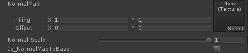
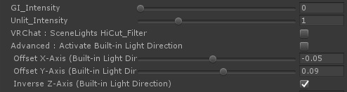

# UTS/UniversalToon プロパティ
***Read this document in [English](Props_en.md)***  

ここからは、UTS2各シェーダーに含まれるプロパティについて、上から順に機能ブロックごとに解説します。  
全てのUTS2シェーダーで、プロパティの名前が同じならば機能は同じです。  

---
## 1.「ステンシル、カリング、クリッピング」に関するプロパティ

| `プロパティ`  | 機能解説 |
|:-------------------|:-------------------|
| `Stencil No` | `StencilMask`　/　`StencilOut`各シェーダーで使用します。0～255の範囲で、ステンシルリファレンスナンバーを指定します（255には特別の意味がある場合がありますので、注意してください）。抜く側のマテリアルと抜かれる側のマテリアルで、数字を合わせます。 |
| `Cull　Mode` | ポリゴンのどちら側を描画しないか（カリング）を指定します。「`OFF`（両面描画）/ `FRONT`（正面カリング）/ `BACK`（背面カリング）」が選べます。通常は`Back`で指定します。`OFF`はノーマルマップやライティング表示がおかしくなる場合がありますので、注意してください。 |
| `ClippingMask` | `Clipping` / `TransClipping`各シェーダーで使用します。グレースケールのクリッピングマスクを指定します。白が「抜き」になります。何も指定しない場合、クリッピング機能は有効になりません。 |
| `IsBaseMapAlphaAsClippingMask` | `TransClipping`シェーダーのみのプロパティです。チェックすることで、`BaseMap`に含まれるAチャンネルをクリッピングマスクとして使用します。この場合、`ClippingMask`には指定する必要はありません。 |
| `Inverse_Clipping` | クリッピングマスクを反転します。 |
| `Clipping_Level` | クリッピングマスクの強さを指定します。 |
| `Tweak_transparency` | `TransClipping`シェーダーで使用します。クリッピングマスクのグレースケールレベルをα値として考慮することで、透過度を調整します。 |

---
## 2.「基本となる３色（基本色/１影色/２影色）の設定」に関するプロパティ

| `プロパティ`  | 機能解説 |
|:-------------------|:-------------------|
| `BaseMap` | 基本色（明色）テクスチャを指定します。 |
| `BaseColor` | `BaseMap`に乗算されるカラーです。テクスチャを指定せず、カラーのみの指定の場合、こちらを基本色（明色）設定として使います。 |
| `Is_LightColor_Base` | 基本色に対しライトカラーを有効にします。 **※ヒント：`SceneLights Hi-Cut_Filter`を使用する時には、必ずチェックします。** |
| `1st_ShadeMap` | １影色テクスチャを指定します。 |
| `Use BaseMap as 1stShade_Map` | ONにすると、`BaseMap`に指定されているテクスチャを`1st_ShadeMap`にも適用します。 |
| `1st_ShadeColor` | `1st_ShaderMap`に乗算されるカラーです。テクスチャを指定せず、カラーのみの指定の場合、こちらを１影色設定として使います。 |
| `Is_LightColor_1st_Shade` | １影色に対しライトカラーを有効にします。 **※ヒント：`SceneLights Hi-Cut_Filter`を使用する時には、必ずチェックします。** |
| `2nd_ShadeMap` | ２影色テクスチャを指定します。 |
| `Use 1stShade_Map as 2ndShade_Map` | ONにすると、`1st_ShadeMap`に指定されているテクスチャを`2nd_ShadeMap`にも適用します。同時に`Use BaseMap as 1stShade_Map`もONの場合は、`BaseMap`が`2nd_ShadeMap`にも適用されます。 |
| `2nd_ShadeColor` | `2nd_ShaderMap`に乗算されるカラーです。テクスチャを指定せず、カラーのみの指定の場合、こちらを２影色設定として使います。 |
| `Is_LightColor_2nd_Shade` | ２影色に対しライトカラーを有効にします。 **※ヒント：`SceneLights Hi-Cut_Filter`を使用する時には、必ずチェックします。** |

**※ヒント：各カラーに存在する、`Is_LightColor_カラー名`スイッチをオフにすると、ライトの強さに関わらず、「オフにされたカラーは、常にライトのIntensityが１、ライトカラーが白の状態で照らされている状態」になります。このスイッチは、なるべくディレクショナルライトが１灯しかない環境で使うほうがよいでしょう。**  

---
## 3.「ノーマルマップ」に関するプロパティ

| `プロパティ`  | 機能解説 |
|:-------------------|:-------------------|
| `NormalMap` | ノーマルマップを指定します。 |
| `Is_NormalMapToBase` | ノーマルマップをカラーに反映させる時にチェックします。チェックをしないとオブジェクトのジオメトリそのものの形状が反映されます。 |

---
## 4.「セルルックおよびイラストレーションルックを作るための基本設定（各カラーの塗り範囲と境界ぼかしの強度設定）」に関するプロパティ

## 4-1. DoubleShadeWithFeather系シェーダーの場合

UST2の標準シェーダーである、DoubleShadeWithFeather系シェーダーの共通プロパティです。  

| `プロパティ`  | 機能解説 |
|:-------------------|:-------------------|
| `Set_SystemShadowsToBase` | Unityのシャドウシステムを使う場合に指定します。ReceiveShadowを使いたい場合には、必ずチェックします。（同時にMesh Renderer側の`ReceiveShadow`もチェックされている必要があります。） |
| `Tweak_SystemShadowsLevel` | `Set_SystemShadowsToBase`がONの時に有効になる調整項目です。Unityのシステムシャドウのレベル調整をします。デフォルトは0で、±0.5の範囲で調整が可能です。`BaseColor_Step`/`1st_ShadeColor_Step`で塗り分けレベルを決定した後で、さらに微調整をしたい時や、セルフシャドウ等のReceiveShadowの出方を微調整したい時に使用します。 |
| `BaseColor_Step` | 基本色（明色）と影色領域の塗り分け段階を設定します。 |
| `Base/Shade_Feather` | 基本色（明色）と影色領域の境界をぼかします。 |
| `ShadeColor_Step` | 影色領域より１影色と２影色の塗り分け段階を設定します。２影色を使用しない場合には、ゼロにしてください。 |
| `1st/2nd_Shades_Feather` | １影色と２影色の境界をぼかします。 |
| `Step_Offset (ForwardAdd Only)`| リアルタイムポイントライトなど、主にForwardAddパス内で足されるライトのステップ（塗り分け段階）を微調整します。 Mobile/Light版には、このプロパティはありません。 |
| `PointLights HiCut_Filter (ForwardAdd Only)` | リアルタイムポイントライトなど、主にForwardAddパス内で足されるライトの基本色（明色）領域にかかる不要なハイライトをカットします。 特にぼかしのないセルルック時に、セルルック感を高めます。 Mobile/Light版には、このプロパティはありません。 |
| `Set_1st_ShadePosition` | ライティングに関係なく、１影色の位置を強制的に指定したい場合、ポジションマップを割り当てます。必ず影を落としたい部分を黒で指定します。 |
| `Set_2nd_ShadePosition` | ライティングに関係なく、２影色の位置を強制的に指定したい場合、ポジションマップを割り当てます。必ず影を落としたい部分を黒で指定します。(１影色のポジションマップにも影響を受けます） |

---
## 4-2. ShadingGradeMap系シェーダーの場合

高機能版UST2シェーダーである、ShadingGradeMap系シェーダーの共通プロパティです。  

| `プロパティ`  | 機能解説 |
|:-------------------|:-------------------|
| `Set_SystemShadowsToBase` | Unityのシャドウシステムを使う場合に指定します。ReceiveShadowを使いたい場合には、必ずチェックします。（同時にMesh Renderer側の`ReceiveShadow`もチェックされている必要があります。） |
| `Tweak_SystemShadowsLevel` | `Set_SystemShadowsToBase`がONの時に有効になる調整項目です。Unityのシステムシャドウのレベル調整をします。デフォルトは0で、±0.5の範囲で調整が可能です。`BaseColor_Step`/`1st_ShadeColor_Step`で塗り分けレベルを決定した後で、さらに微調整をしたい時や、セルフシャドウ等のReceiveShadowの出方を微調整したい時に使用します。 |
| `1st_ShadeColor_Step` | 基本色（明色）と１影色の塗り分け段階を設定します。`BaseColor_Step`と同じ機能です。 |
| `1st_ShadeColor_Feather` | 基本色(明色）と１影色の境界をぼかします。`Base/Shade_Feather`と同じ機能です。 |
| `2nd_ShadeColor_Step` | １影色と２影色の塗り分け段階を設定します。`ShadeColor_Step`と同じ機能です。 |
| `2nd_ShadeColor_Feather` | １影色と２影色の境界をぼかします。`1st/2nd_Shades_Feather`と同じ機能です。 |
| `Step_Offset (ForwardAdd Only)`| リアルタイムポイントライトなど、主にForwardAddパス内で足されるライトのステップ（塗り分け段階）を微調整します。 Mobile/Light版には、このプロパティはありません。 |
| `PointLights HiCut_Filter (ForwardAdd Only)` | リアルタイムポイントライトなど、主にForwardAddパス内で足されるライトの基本色（明色）領域にかかる不要なハイライトをカットします。 特にぼかしのないセルルック時に、セルルック感を高めます。 Mobile/Light版には、このプロパティはありません。 |
| `ShadingGradeMap` | Shading Grade Mapをグレースケールで指定します。 Shading Grade Mapに使用するテクスチャは、テクスチャインポートセッティングで、必ず `SRGB (Color Texture)` を `OFF` にするようにしてください。 |
| `Tweak_ShadingGradeMapLevel` | Shading Grade Mapのグレースケール値をレベル補正します。デフォルトは0で、±0.5の範囲で調整が可能です。 |
| `Blur Level of ShadingGradeMap` | Mip Map機能を利用して、Shading Grade Mapをぼかします。Mip Mapを有効にするためには、テクスチャインポートセッティングで、Advanced > `Generate Mip Maps` を `ON` にしてください。デフォルトは0（ぼかさない）です。 |

---
## 5.「ハイカラー（ハイライト、スペキュラ）」に関するプロパティ

| `プロパティ`  | 機能解説 |
|:-------------------|:-------------------|
| `HighColor` | ハイカラー指定するカラーを指定します。使用しない場合には`黒(0,0,0)`を設定してください。なおハイカラーは光源の方向に従って移動します。 |
| `HighColor_Tex` | ハイカラーとしてカラーテクスチャを指定します。テクスチャを利用することで、複雑なカラーを載せることが可能になります。上の`HighColor`プロパティと乗算されますので、テクスチャのカラーをそのまま出したい場合には、`HighColor`を`白(1,1,1)`に設定してください。必要がない場合、設定しなくても大丈夫です。 |
| `Is_LightColor_HighColor` | ハイカラーに対しライトカラーを有効にします。 |
| `Is_NormalMapToHighColor` | ノーマルマップをハイカラー領域に反映させる時にチェックします。チェックをしないとオブジェクトのジオメトリそのものの形状が反映されます。 |
| `HighColor_Power` | ハイカラーの範囲の大きさ（※スペキュラ的には「強さ」になります）を設定します。 |
| `Is_SpecularToHighColor` | ハイカラー領域をスペキュラ（グロッシイ光沢）として描画します。チェックを外すとハイカラー領域の境界を円形で描画します。 |
| `Is_BlendAddToHiColor` | ハイカラーの合成を加算（より明るくなります）にします。スペキュラは加算モードでしか使えません。 |
| `Is_UseTweakHighColorOnShadow` | `TweakHighColorOnShadow`スライダーを有効にします。 |
| `TweakHighColorOnShadow` | 影部分にかかるハイカラー領域の強さを調整します。 |
| `Set_HighColorMask` | UV座標に基づきハイカラーをマスクします。白で100%表示、黒でハイカラーを表示しません。必要がない場合、設定しなくても大丈夫です。 |
| `Tweak_HighColorMaskLevel` | ハイカラーマスクのレベル補正をします。デフォルト値は0です。 |

---
## 6.「リムライト」に関するプロパティ

| `プロパティ`  | 機能解説 |
|:-------------------|:-------------------|
| `RimLight` | リムライトを有効にします。 |
| `RimLightColor` | リムライトのカラーを指定します。 |
| `Is_LightColor_RimLight` | リムライトに対しライトカラーを有効にします。 |
| `Is_NormalMapToRimLight` | ノーマルマップをリムライトに反映させる時にチェックします。チェックをしないとオブジェクトのジオメトリそのものの形状が反映されます。 |
| `RimLight_Power` | リムライトの強さを指定します。 |
| `RimLight_InsideMask` | リムライトの内側マスクの強度を指定します。 |
| `RimLight_FeatherOff` | リムライトのぼかしをカットします。 |
| `LightDirection_MaskOn` | 光源方向にのみリムライトを発生します。 |
| `Tweak_LightDirection_MaskLevel` | 光源方向リムマスクのレベル調整をします。 |
| `Add_Antipodean_RimLight` | 光源方向に対し反対方向の位置にリムライト（APリムライト）を発生させます。 |
| `Ap_RimLightColor` | APリムライトのカラーを指定します。 |
| `Is_LightColor_Ap_RimLight` | APリムカラーに対しライトカラーを有効にします。 |
| `Ap_RimLight_Power` | APリムライトの強さを指定します。 |
| `Ap_RimLight_FeatherOff` | APリムライトのぼかしをカットします。 |
| `Set_RimLightMask` | UV座標に基づきリムライトをマスクします。白で100%表示、黒でリムライトを表示しません。必要がない場合、設定しなくても大丈夫です。 |
| `Tweak_RimLightMaskLevel` | リムライトマスクのレベル補正をします。デフォルト値は0です。 |

---
## 7.「MatCap」に関するプロパティ

| `プロパティ`  | 機能解説 |
|:-------------------|:-------------------|
| `MatCap` | MatCapを有効にします。 |
| `MatCap_Sampler` | MatCapとして使用するテクスチャを設定します。 |
| `Blur Level of MatCap_Sampler` | Mip Map機能を利用して、MatCap_Samplerをぼかします。Mip Mapを有効にするためには、テクスチャインポートセッティングで、Advanced > `Generate Mip Maps` を `ON` にしてください。デフォルトは0（ぼかさない）です。 |
| `MatCapColor` | `MatCap_Sampler`に乗算されるカラーです。`MatCap_Sampler`側にグレースケール画像を設定した場合、`MatCapColor`でMatCapにカラーを乗せることができます。 |
| `Is_LightColor_MatCap` | MatCapに対しライトカラーを有効にします。 |
| `Is_BlendAddToMatCap` | チェックするとMatCapのブレンドが**加算モード**になります（結果は明るくなります）。チェックしない場合には**乗算モード**で合成されます（結果は暗くなります）。 |
| `Tweak_MatCapUV` | `MatCap_Sampler`のUVを中央から円形に拡縮することで、MatCapの領域調整ができます。 |
| `Rotate_MatCapUV` | `MatCap_Sampler`のUVを中央を軸に回転します。 |
| `Activate CameraRolling_Stabillizer` | ONにすることで、カメラのローリング（奥行き方向を軸とした回転のこと）に対してMatCapが回転してしまうのを抑止します。 |
| `Is_NormalMapForMatCap` | MatCapにMatCap専用ノーマルマップを割り当てます。MatCapをスペキュラ的に使っている場合には、スペキュラマスクとして使用できます。 |
| `NormalMapForMatCap` | MatCap専用ノーマルマップを設定します。 |
| `Rotate_NormalMapForMatCapUV` | MatCap専用ノーマルマップのUVを中央を軸に回転します。 |
| `Is_UseTweakMatCapOnShadow` | `Tweak MatCapOnShadow`スライダーを有効にします。 |
| `Tweak MatCapOnShadow` | 影部分にかかるMatCap領域の強さを調整します。 |
| `Set_MatcapMask` |MatCapにグレースケールのマスクを設定することで、MatCapの出方を調整します。MatcapMaskは、MatCapが投影されるメッシュのUV座標基準で配置されます。黒でマスク、白で抜きになります。 |
| `Tweak_MatcapMaskLevel` | MatcapMaskの強さを調整します。値が1の時、マスクのあるなしに関わらずMatCapを100％表示します。値が-1の時には、MatCapは一切表示されず、MatCapがオフの状態と同じになります。デフォルト値は0です。 |
| `Inverse_MatcapMaskLevel` | ONにすることで、MatcapMaskを反転します。 |
| `Orthographic Projection for MatCap` | シーン内で使用するカメラのプロジェクションが、**Orthographic（平行投影）の時、ON**にします。**パースカメラの時には、OFFにする**ことでカメラ歪み補正が働きます。 **※Tips：このチェックをONにすると、パースカメラ時の挙動がUTS2 v.2.0.4版と同じになります。つまりカメラ歪み補正がなくなります。** |

---
## 8.「AngelRing（天使の輪）」に関するプロパティ

| `プロパティ`  | 機能解説 |
|:-------------------|:-------------------|
| `AngelRing` | 「天使の輪」機能を有効にします。 |
| `AngelRing_Sampler` | 「天使の輪」テクスチャを指定します。 |
| `AngelRing_Color` | 「天使の輪」に乗算するカラーを指定します。 |
| `AR_OffsetU` | 「天使の輪」表示を水平方向に微調整します。 |
| `AR_OffsetV` | 「天使の輪」表示を垂直方向に微調整します。 |
| `Is_LightColor_AR` | 「天使の輪」に対しライトカラーを有効にします。 |
| `ARSampler_AlphaOn` | チェックすることで、「天使の輪」テクスチャに含まれるαチャンネルをクリッピングマスクとして利用できます。 |

---
## 9.「エミッシブ」に関するプロパティ

| `プロパティ`  | 機能解説 |
|:-------------------|:-------------------|
| `EMISSIVE MODE` | `ANIMATION`にすることで、`Emissive`で指定したテクスチャのRGBチャンネル部分を、様々な方法でアニメーションします。**αチャンネルはマスクですので、アニメーションの対象にはなりません。** |
| `Emissive_Tex` | エミッシブ用のテクスチャを設定します。グレースケールでテクスチャを作成し、`Emissive_Color`で光らせることもできます。他のパーツと重ねて光って欲しくない部分などは、黒（RGB:0,0,0）にしておきます。 |
| `Emissive_Color` | `Emissive_Tex`の各ピクセルカラーに乗算されるカラーです。多くの場合、 **[HDRカラー](https://docs.unity3d.com/ja/current/Manual/HDRColorPicker.html)** を設定します。 |
| `Emissivテクスチャのαチャンネル` | v.2.0.7より、αチャンネルがエミッシブテクスチャのマスクとして使えるようになりました。UVベースで、αチャンネルを白（RGB = (1,1,1)）に設定した位置にエミッシブを表示します。黒（RGB=(0,0,0)）でエミッシブが表示されなくなります。 αチャンネルを有効にするためには、Targa形式などαチャンネルが持てる画像形式の場合は、各テクスチャのImport Settingsで、`Alpha Source`を`Input Texture Alpha`にしてください。PNG形式の場合は画像仕様上、直接αチャンネルを持てないので、Photoshop上でαチャンネルを選択範囲として読み込んだ後で、「レイヤーマスク＞選択範囲外をマスク」で指定し、PNG形式で保存します。続いてUnityに読み込み、Import Settingsで、`Alpha Source`を`Input Texture Alpha`に、`Alpha Is Transparency`を`ON`にしてください。 |
| `Base_Speed` | アニメーションの基本となる更新スピードを指定します。値1の時、1秒で更新することになります。値2を指定すると、値1の時の2倍のスピードになりますので、 0.5秒で更新することになります。 |
| `Scroll_EmissiveU` | アニメーションの更新にあたり、EmissiveテクスチャをU方向（X軸方向）にどれだけスクロールさせるかを指定します。-1～1範囲で指定し、デフォルトは0です。スクロールアニメーションは、最終的には、`Base Speed (Time)`×`Scroll U Direction`×`Scroll V Direction`の結果として決まります。 |
| `Scroll_EmissiveV` | アニメーションの更新にあたり、EmissiveテクスチャをV方向（Y軸方向）にどれだけスクロールさせるかを指定します。-1～1範囲で指定し、デフォルトは0です。 |
| `Rotate_EmissiveUV` | アニメーションの更新にあたり、EmissiveテクスチャをUV座標の中央（UV=(0.5,0.5)）を軸にどれだけ回転させるかを指定します。Base Speed=1の時、値1で右まわり方向に1回転します。スクロールと組み合わせた場合、スクロール後に回転することになります。 |
| `Is_PingPong_Base` | `ON`にすることで、アニメーションの進行方向をPingPong（行ったり来たり）にします。 |
| `Activate ColorShift` | `ON`にすることで、Emissiveテクスチャに掛け合わせるカラーを、`Destination Color`との間で変化させます。**この機能を利用する時には、Emissiveテクスチャでの指定はグレースケールとし、掛け合わせるカラー側でカラー設計をしたほうがよいでしょう。** |
| `ColorShift` | カラーシフトをする際の、変化先となるカラーです。HDRで指定できます。 |
| `ColorShift_Speed` | カラーシフトをする際の、基準となるスピードを設定します。値が1の時、1サイクルの変化はおおよそ6秒程度を目安としてください。 |
| `Activate ViewShift` | `ON`にすることで、オブジェクトを見るカメラのビュー角に対してカラーをシフトさせます。オブジェクトのサーフェイスに対し真っ正面から見た場合は、通常状態のEmissiveカラーが表示され、ビュー角が徐々に傾いていくにつれてシフト先のカラーに変化します。 |
| `ViewShift` | ビューシフトする際の、変化先となるカラーです。HDRで指定します。 |
| `Is_ViewCoord_Scroll` | スクロールに使用する座標系を指定します。`OFF`の場合、Emissive_TexのUV座標を基準にスクロールをします。`ON`の場合、MatCapと同様のビュー座標を基準にスクロールをします。ビュー座標系でのスクロールは、テクスチャのUV座標を考慮しないで済むのでとても便利ですが、キューブのようなフラットな面を持つオブジェクトでは、うまく表示できない場合がほとんどです。一方、キャラクターなどの曲面が多いオブジェクトでは、ビュー座標系は大変便利に使えます。 |

---
## 10.「アウトライン」に関するプロパティ

| `プロパティ`  | 機能解説 |
|:-------------------|:-------------------|
| `OUTLINE MODE` | アウトライン用反転オブジェクトの生成方式を指定します。`NML`（法線反転方式） / `POS`（ポジションスケーリング方式）から選択できます。多くの場合、法線反転方式が使われますが、ハードエッジだけで構成されているキューブのようなメッシュの場合、ポジションスケーリング方式のほうがアウトラインが途切れにくくなります。比較的単純な形状はオブジェクトスケーリング方式で、キャラクターなどの複雑な形状のものは法線反転方式を使うといいでしょう。 |
| `Outline_Width` | アウトラインの幅を設定します。 **※注意：この値は、Unityへのモデルインポート時のスケールに依存します** ので、取り込みスケールが１でない時には注意してください。 |
| `Farthest_Distance` | カメラとオブジェクトの距離でアウトラインの幅が変化する、最遠距離を指定します。この距離でアウトラインがゼロになります。 |
| `Nearest_Distance` | カメラとオブジェクトの距離でアウトラインの幅が変化する、最近距離を指定します。この距離でアウトラインが`Outline_Width`等で設定した最大の幅になります。 |
| `Outline_Sampler` | アウトラインの幅に入り抜きを入れたい場合や特定のパーツにのみアウトラインを乗せたくない場合などにアウトラインサンプラー（テクスチャ）で指定します。白で最大幅、黒で最小幅になります。必要がない場合、設定しなくても大丈夫です。 |
| `Outline_Color` | アウトラインのカラーを指定します。 |
| `Is_BlendBaseColor` | オブジェクトの基本カラーにアウトラインのカラーを馴染ませたい場合に、チェックします。 |
| `Is_LightColor_Outline` | アウトラインに対しライトカラーを有効にします。アウトラインに対するライトカラーの寄与は次のとおりです。「OFF」の時、アウトラインカラーに設定したカラーがそのまま表示されます。「Activeの時でシーン中にリアルタイムディレクショナルライトが１灯ある」時、リアルタイムディレクショナルライトのカラーと明るさにアウトラインカラーが反応します。「Activeの時でシーン中にリアルタイムディレクショナルライトがない」時、Environment LightingのSourceの内、Colorの色と明るさにアウトラインカラーが反応します。**この時、Skyboxを使用していてもColorの値が参照されることに注意してください。またリアルタイムのポイントライトやColor以外の環境光には、反応しませんので合わせてご注意ください。**  |
| `Is_OutlineTex` | アウトライン用反転オブジェクトにテクスチャを貼りたい場合、ONにします。 |
| `OutlineTex` | アウトラインに特別なテクスチャを割り当てたい時に使用します。テクスチャを工夫することで、アウトラインに模様を入れたりすることができる他、フロントカリングされる反転オブジェクトに貼られるテクスチャだと考えると、一風変わった表現ができるかもしれません。 |
| `Offset_Camera_Z` | アウトラインをカメラの奥行き方向（Ｚ方向）にオフセットします。スパイク形状の髪型などの場合、プラスの値を入れることでスパイク部分にはアウトラインがかかりにくくなります。通常は０を入れておいてください。 |
| `Is_BakedNormal` | ONにすると、`BakedNormal for Outline`を有効にします。 |
| `BakedNormal for Outline` | 事前に他のモデルから頂点法線を焼き付けたノーマルマップを、法線反転方式アウトラインの設定時に追加として読み込みます。詳しい説明は下を参照してください。 |

---
## 11.「ライトプローブ」の利用、およびシェーダービルトインライトやVRChatに便利な機能に関するプロパティ

| `プロパティ`  | 機能解説 |
|:-------------------|:-------------------|
| `GI_Intensity` | `GI_Intensity` を０以上に設定することで、UnityのLightingウィンドウ内で管理されているGIシステム、特に[ライトプローブ](https://docs.unity3d.com/ja/current/Manual/LightProbes.html)に対応します。 `GI_Intensity` が１の時、シーン内のGIの強度が100％となります。 **v.2.0.6で機能強化をしましたので、ライトプローブを含むGIを利用したい場合には、まず１を設定した後（Standard Shaderとほぼ同様の明るさになります）で、必要に応じて調整してください。** |
| `Unlit_Intensity` | シーン内に有効なリアルタイムディレクショナルライトが１灯もない時に、[Environment LightingのSource設定](https://docs.unity3d.com/ja/current/Manual/GlobalIllumination.html)を元にシーンの明るさとカラーを求め、それを`Unlit_Intensity`の値でブーストして光源として使用します（本機能を **「アンビエントブレンディング」** と呼んでいます）。デフォルトは１（アンビエントカラーをそのまま受ける）で、０にすると完全に消灯します。本機能は環境カラーにマテリアルカラーを馴染ませたい時に使いますが、 **より暗めに馴染ませたい場合は 0.5～1 程度** に設定し、 **より明るくカラーを出したい場合は 1.5～2 程度** に設定するとよいでしょう。（v.2.0.6より、最大値が4になりました。） |
| `VRChat : SceneLights Hi-Cut_Filter` | シーン内に極端に明るさ（Intensity）が高い、複数のリアルタイムディレクショナルライトやリアルタイムポイントライトがある場合に、白飛びを抑えます。ONにすることで、各々のライトのカラーと減衰特性を保ちつつ、マテリアルカラーが白飛びするような高いインテンシティだけをカットします。デフォルトは`OFF`です。本機能を使用する時には、`Is_LightColor_Base` などの`Is_LightColor_`系のチェックが`ON`になっていることを確認してください。 **VRChatユーザーは`ON`にすることをお薦めします。** ※ヒント：この機能を使っても白飛びが発生する場合、ポストエフェクト側のブルームなどの設定をチェックしてみてください。（特にブルームのスレッショルドの値が１以下だと白飛びしやすくなります。） |
| `Advanced : Activate Buil-in Light Direction` | 上級者向け機能として、Buil-in Light Directionベクトル（シェーダー内に組み込まれているバーチャルライトの方向ベクトル）を有効にします。本機能が有効な時、ライトの明るさとカラーは、シーン内の有効なリアルタイムディレクショナルライトの値を使用します。もしそのようなライトがない場合は、アンビエントブレンディングの値を使用します。 |
| ` Offset X-Axis (Buil-in Light Direction)` | Buil-in Light Directionベクトルによって生成される、バーチャルライトを左右に動かします。 |
| ` Offset Y-Axis (Buil-in Light Direction)` | Buil-in Light Directionベクトルによって生成される、バーチャルライトを上下に動かします。 |
| ` Inverse Z-Axis (Buil-in Light Direction)` | Buil-in Light Directionベクトルによって生成される、バーチャルライトの向きを前後で切り替えます。 |

---
## 12.「テッセレーション」に関するプロパティ

| `プロパティ`  | 機能解説 |
|:-------------------|:-------------------|
| `DX11 Tess : Edge Length` | カメラとの距離に基づいて、よりテッセレーションを分割します。同じ距離では、値が小さいほうが細分化されます。デフォルトは 5 です。 |
| `DX11 Tess : Phong Strengh` | テッセレーションによって細分化された分割面の引っ張り強度を変化させます。デフォルトは 0.5 です。 |
| `DX11 Tess : Extrusion Amount` | テッセレーションの結果として発生する、膨張分を全体としてスケーリングします。デフォルトは 0 です。 |

