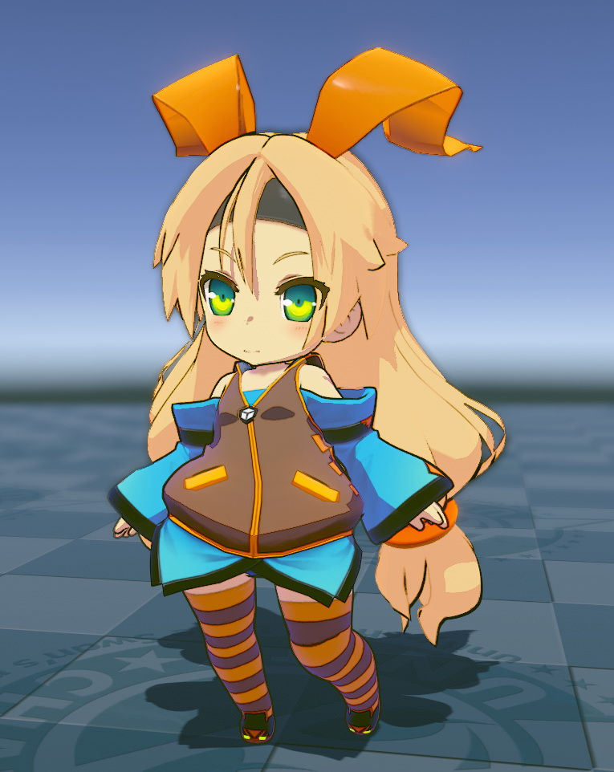
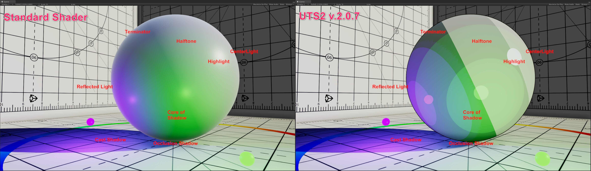
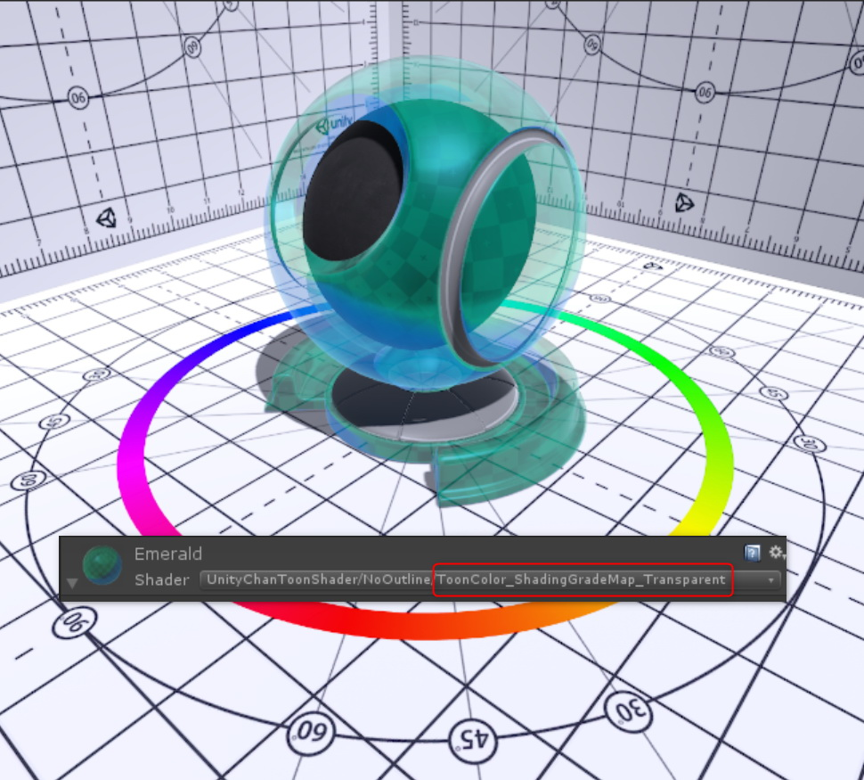
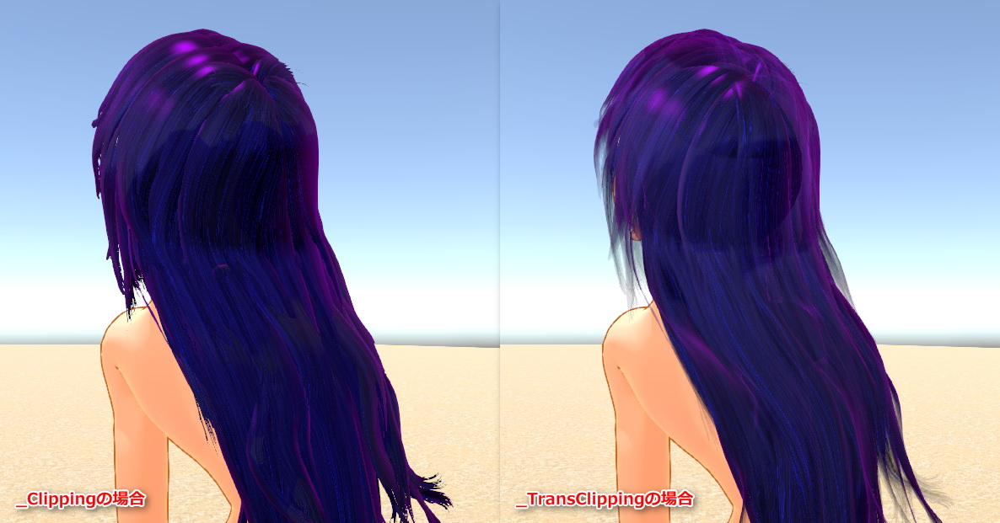
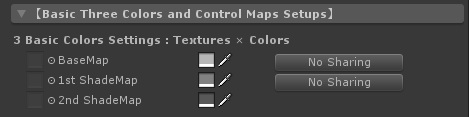
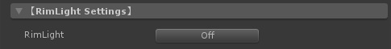
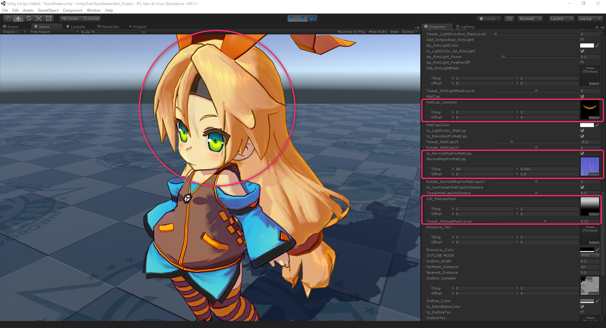
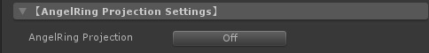
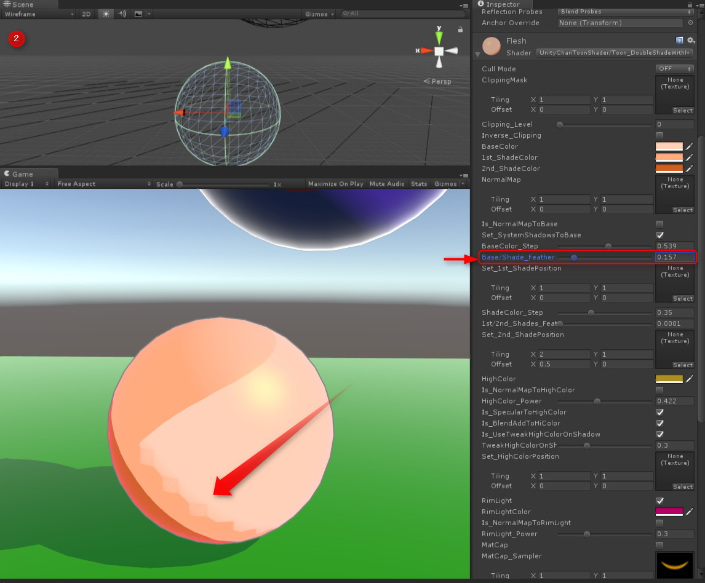

# Unity-Chan Toon Shader 2.0 v.2.0.7 Manual
### 2019/06/10 Nobuyuki Kobayashi (Unity Technologies Japan)
***Read this document in other languages: [日本語版](https://github.com/unity3d-jp/UnityChanToonShaderVer2_Project/blob/master/Manual/UTS2_Manual_ja.md)***  

# Index
- [【Important】 Note on upgrading to version 2.0.7 directly](https://github.com/unity3d-jp/UnityChanToonShaderVer2_Project/blob/master/Manual/UTS2_Manual_en.md#important-note-on-upgrading-to-version-207-directly)
- [Introduction to Unity-Chan Toon Shader 2.](https://github.com/unity3d-jp/UnityChanToonShaderVer2_Project/blob/master/Manual/UTS2_Manual_en.md#introduction-to-unity-chan-toon-shader-2)
  - [【Development Environment】](https://github.com/unity3d-jp/UnityChanToonShaderVer2_Project/blob/master/Manual/UTS2_Manual_en.md#development-environment)
  - [【Target Environment】](https://github.com/unity3d-jp/UnityChanToonShaderVer2_Project/blob/master/Manual/UTS2_Manual_en.md#target-environment)
  - [【Download the project】](https://github.com/unity3d-jp/UnityChanToonShaderVer2_Project/blob/master/Manual/UTS2_Manual_en.md#download-the-project)
  - [【Installation】](https://github.com/unity3d-jp/UnityChanToonShaderVer2_Project/blob/master/Manual/UTS2_Manual_en.md#installation)
  - [【Basic UTS2 Settings】](https://github.com/unity3d-jp/UnityChanToonShaderVer2_Project/blob/master/Manual/UTS2_Manual_en.md#basic-uts2-settings)
- [Using the Different Shaders in UTS2](https://github.com/unity3d-jp/UnityChanToonShaderVer2_Project/blob/master/Manual/UTS2_Manual_en.md#using-the-different-shaders-in-uts2)
  - [The Shaders in the UnityChanToonShader Root Folder](https://github.com/unity3d-jp/UnityChanToonShaderVer2_Project/blob/master/Manual/UTS2_Manual_en.md#the-shaders-in-the-unitychantoonshader-root-folder)
  - [The Shaders in the UnityChanToonShader/NoOutline Folder](https://github.com/unity3d-jp/UnityChanToonShaderVer2_Project/blob/master/Manual/UTS2_Manual_en.md#the-shaders-in-the-unitychantoonshadernooutline-folder)
    - [Transparent shaders for transparency materials](https://github.com/unity3d-jp/UnityChanToonShaderVer2_Project/blob/master/Manual/UTS2_Manual_en.md#transparent-shaders-for-transparency-materials)
  - [The Shaders in the UnityChanToonShader/AngelRing Folder](https://github.com/unity3d-jp/UnityChanToonShaderVer2_Project/blob/master/Manual/UTS2_Manual_en.md#the-shaders-in-the-unitychantoonshaderangelring-folder)
  - [The Shaders in the UnityChanToonShader/Mobile Folder](https://github.com/unity3d-jp/UnityChanToonShaderVer2_Project/blob/master/Manual/UTS2_Manual_en.md#the-shaders-in-the-unitychantoonshadermobile-folder)
  - [The Shaders in the UnityChanToonShader/Tessellation Folder](https://github.com/unity3d-jp/UnityChanToonShaderVer2_Project/blob/master/Manual/UTS2_Manual_en.md#the-shaders-in-the-unitychantoonshadertessellation-folder)
  - [The shaders in the UnityChanToonShader/Helper Folder](https://github.com/unity3d-jp/UnityChanToonShaderVer2_Project/blob/master/Manual/UTS2_Manual_en.md#the-shaders-in-the-unitychantoonshaderhelper-folder)
- [Sample Scenes](https://github.com/unity3d-jp/UnityChanToonShaderVer2_Project/blob/master/Manual/UTS2_Manual_en.md#sample-scenes)
- [Initial Project Settings](https://github.com/unity3d-jp/UnityChanToonShaderVer2_Project/blob/master/Manual/UTS2_Manual_en.md#initial-project-settings)
- [UTS2 Setting Menu：UTS2 Custom Inspector](https://github.com/unity3d-jp/UnityChanToonShaderVer2_Project/blob/master/Manual/UTS2_Manual_en.md#uts2-setting-menuuts2-custom-inspector)
  - [1.“Basic Shader Settings” Menu for UTS2](https://github.com/unity3d-jp/UnityChanToonShaderVer2_Project/blob/master/Manual/UTS2_Manual_en.md#1-basic-shader-settings-menu-for-uts2)
    - [Useful functions for VRChat users](https://github.com/unity3d-jp/UnityChanToonShaderVer2_Project/blob/master/Manual/UTS2_Manual_en.md#useful-functions-for-vrchat-users)
      - [“When setting up materials on UTS2”](https://github.com/unity3d-jp/UnityChanToonShaderVer2_Project/blob/master/Manual/UTS2_Manual_en.md#when-setting-up-materials-on-uts2)
        - [If you want to brighten the appearance of characters in dark worlds](https://github.com/unity3d-jp/UnityChanToonShaderVer2_Project/blob/master/Manual/UTS2_Manual_en.md#-if-you-want-to-brighten-the-appearance-of-characters-in-dark-worlds)
      - [“When publishing avatars set in UTS2”](https://github.com/unity3d-jp/UnityChanToonShaderVer2_Project/blob/master/Manual/UTS2_Manual_en.md#when-publishing-avatars-set-in-uts2)
  - [2.“Basic Three Colors and Control Maps Setups” Menu](https://github.com/unity3d-jp/UnityChanToonShaderVer2_Project/blob/master/Manual/UTS2_Manual_en.md#2-basic-three-colors-and-control-maps-setups-menu)
    - [ “NormalMap Settings” Submenu](https://github.com/unity3d-jp/UnityChanToonShaderVer2_Project/blob/master/Manual/UTS2_Manual_en.md#normalmap-settings-submenu)
    - [“Shadow Control Maps” Submenu](https://github.com/unity3d-jp/UnityChanToonShaderVer2_Project/blob/master/Manual/UTS2_Manual_en.md#shadow-control-maps-submenu)
      - [Position Maps for DoubleShadeWithFeather Shaders](https://github.com/unity3d-jp/UnityChanToonShaderVer2_Project/blob/master/Manual/UTS2_Manual_en.md#doubleshadewithfeather-shaders)
      - [Shading Grade Map for ShadingGradeMap Shaders](https://github.com/unity3d-jp/UnityChanToonShaderVer2_Project/blob/master/Manual/UTS2_Manual_en.md#shadinggrademap-shaders)
  - [3.“Basic Lookdevs : Shading Step and Feather Settings” Menu](https://github.com/unity3d-jp/UnityChanToonShaderVer2_Project/blob/master/Manual/UTS2_Manual_en.md#3-basic-lookdevs--shading-step-and-feather-settings-menu)
    - [【The Basics of Using the Step/Feather Sliders】](https://github.com/unity3d-jp/UnityChanToonShaderVer2_Project/blob/master/Manual/UTS2_Manual_en.md#the-basics-of-using-the-stepfeather-sliders)
      - [DoubleShadeWithFeather Shaders](https://github.com/unity3d-jp/UnityChanToonShaderVer2_Project/blob/master/Manual/UTS2_Manual_en.md#doubleshadewithfeather-shaders-1)
      - [ShadingGradeMap Shaders](https://github.com/unity3d-jp/UnityChanToonShaderVer2_Project/blob/master/Manual/UTS2_Manual_en.md#shadinggrademap-shaders-1)
    - [“System Shadows : Self Shadows Receiving” Items](https://github.com/unity3d-jp/UnityChanToonShaderVer2_Project/blob/master/Manual/UTS2_Manual_en.md#system-shadows--self-shadows-receiving-items)
    - [“Additional Settings” Submenu](https://github.com/unity3d-jp/UnityChanToonShaderVer2_Project/blob/master/Manual/UTS2_Manual_en.md#additional-settings-submenu)
    - [【Adjusting the different colors of point lights ：Step Offset、PointLights Hi-Cut Filter】](https://github.com/unity3d-jp/UnityChanToonShaderVer2_Project/blob/master/Manual/UTS2_Manual_en.md#adjusting-the-different-colors-of-point-lights-step-offsetpointlights-hi-cut-filter)
  - [4.“HighColor Settings” Menu](https://github.com/unity3d-jp/UnityChanToonShaderVer2_Project/blob/master/Manual/UTS2_Manual_en.md#4-highcolor-settings-menu)
  - [5.“RimLight Settings” Menu](https://github.com/unity3d-jp/UnityChanToonShaderVer2_Project/blob/master/Manual/UTS2_Manual_en.md#5-rimlight-settings-menu)
  - [6.“MatCap : Texture Projection Settings” Menu](https://github.com/unity3d-jp/UnityChanToonShaderVer2_Project/blob/master/Manual/UTS2_Manual_en.md#6-matcap--texture-projection-settings-menu)
  - [7.“AngelRing Projection Settings” Menu](https://github.com/unity3d-jp/UnityChanToonShaderVer2_Project/blob/master/Manual/UTS2_Manual_en.md#7-angelring-projection-settings-menu)
    - [Making materials for Angel Ring.](https://github.com/unity3d-jp/UnityChanToonShaderVer2_Project/blob/master/Manual/UTS2_Manual_en.md#making-materials-for-angel-ring)
  - [8.“Emissive : Self-luminescene Setings” Menu](https://github.com/unity3d-jp/UnityChanToonShaderVer2_Project/blob/master/Manual/UTS2_Manual_en.md#8-emissive--self-luminescene-setings-menu)
    - [How to create a texture with alpha channel](https://github.com/unity3d-jp/UnityChanToonShaderVer2_Project/blob/master/Manual/UTS2_Manual_en.md#how-to-create-a-texture-with-alpha-channel)
    - [Tips for setting Destination Color](https://github.com/unity3d-jp/UnityChanToonShaderVer2_Project/blob/master/Manual/UTS2_Manual_en.md#tips-for-setting-destination-color)
  - [9.“Outline Settings” Menu](https://github.com/unity3d-jp/UnityChanToonShaderVer2_Project/blob/master/Manual/UTS2_Manual_en.md#9-outline-settings-menu)
    - [“Advanced Outline Settings” Submenu](https://github.com/unity3d-jp/UnityChanToonShaderVer2_Project/blob/master/Manual/UTS2_Manual_en.md#advanced-outline-settings-submenu)
    - [Adjusting the strength of outlines：Outline Sampler](https://github.com/unity3d-jp/UnityChanToonShaderVer2_Project/blob/master/Manual/UTS2_Manual_en.md#adjusting-the-strength-of-outlinesoutline-sampler)
    - [Supplementing the inverted outlines of objects：UTS_EdgeDetection](https://github.com/unity3d-jp/UnityChanToonShaderVer2_Project/blob/master/Manual/UTS2_Manual_en.md#supplementing-the-inverted-outlines-of-objectsuts_edgedetection)
    - [Tracing baked vertices normals ：Baked Normal for Outline](https://github.com/unity3d-jp/UnityChanToonShaderVer2_Project/blob/master/Manual/UTS2_Manual_en.md#tracing-baked-vertices-normals-baked-normal-for-outline)
    - [Moving the outline away from the camera：Offset Outline with Camera Z-axis](https://github.com/unity3d-jp/UnityChanToonShaderVer2_Project/blob/master/Manual/UTS2_Manual_en.md#moving-the-outline-away-from-the-cameraoffset-outline-with-camera-z-axis)
  - [10.“DX11 Phong Tessellation Settings” Menu](https://github.com/unity3d-jp/UnityChanToonShaderVer2_Project/blob/master/Manual/UTS2_Manual_en.md#10-dx11-phong-tessellation-settings-menu)
  - [11.“LightColor Contribution to Materials” Menu](https://github.com/unity3d-jp/UnityChanToonShaderVer2_Project/blob/master/Manual/UTS2_Manual_en.md#11-lightcolor-contribution-to-materials-menu)
  - [12.“Environmental Lighting Contributions Setups” Menu](https://github.com/unity3d-jp/UnityChanToonShaderVer2_Project/blob/master/Manual/UTS2_Manual_en.md#12-environmental-lighting-contributions-setups-menu)
    - [Decide the light probe’s brightness ：GI Intensity](https://github.com/unity3d-jp/UnityChanToonShaderVer2_Project/blob/master/Manual/UTS2_Manual_en.md#decide-the-light-probes-brightness-gi-intensity)
    - [Adjusting the ambient blending：Unlit Intensity](https://github.com/unity3d-jp/UnityChanToonShaderVer2_Project/blob/master/Manual/UTS2_Manual_en.md#adjusting-the-ambient-blendingunlit-intensity)
    - [Preventing overexposure when there are multiple bright lights in a scene ：SceneLights Hi-Cut Filter](https://github.com/unity3d-jp/UnityChanToonShaderVer2_Project/blob/master/Manual/UTS2_Manual_en.md#preventing-overexposure-when-there-are-multiple-bright-lights-in-a-scene-scenelights-hi-cut-filter)
    - [Adding Built-in Light Direction as an advanced feature](https://github.com/unity3d-jp/UnityChanToonShaderVer2_Project/blob/master/Manual/UTS2_Manual_en.md#adding-built-in-light-direction-as-an-advanced-feature)
- [Using it for visuals（pre-render）](https://github.com/unity3d-jp/UnityChanToonShaderVer2_Project/blob/master/Manual/UTS2_Manual_en.md#using-it-for-visualspre-render)
- [About Licensing](https://github.com/unity3d-jp/UnityChanToonShaderVer2_Project/blob/master/Manual/UTS2_Manual_en.md#about-licensing)
- [Additional Note](https://github.com/unity3d-jp/UnityChanToonShaderVer2_Project/blob/master/Manual/UTS2_Manual_en.md#additional-note)
  - [１．Tips: Minimizing the artifacts that appear at the edge of each color when using system shadow.](https://github.com/unity3d-jp/UnityChanToonShaderVer2_Project/blob/master/Manual/UTS2_Manual_en.md#%EF%BC%91tips-minimizing-the-artifacts-that-appear-at-the-edge-of-each-color-when-using-system-shadow)
    - [【１：Changing the linear color space】](https://github.com/unity3d-jp/UnityChanToonShaderVer2_Project/blob/master/Manual/UTS2_Manual_en.md#%EF%BC%91changing-the-linear-color-space)
    - [【２：Increase mesh density】](https://github.com/unity3d-jp/UnityChanToonShaderVer2_Project/blob/master/Manual/UTS2_Manual_en.md#%EF%BC%92increase-mesh-density)
    - [【３：Make artifacts disappear by adjusting BaseColor_Step/System Shadows Level 】](https://github.com/unity3d-jp/UnityChanToonShaderVer2_Project/blob/master/Manual/UTS2_Manual_en.md#%EF%BC%93make-artifacts-disappear-by-adjusting-basecolor_stepsystem-shadows-level-)
    - [【４：Increasing the bias of the directional light】](https://github.com/unity3d-jp/UnityChanToonShaderVer2_Project/blob/master/Manual/UTS2_Manual_en.md#%EF%BC%94increasing-the-bias-of-the-directional-light)
  - [２．Tips: Minimizing light slips when using multiple real-time point lights](https://github.com/unity3d-jp/UnityChanToonShaderVer2_Project/blob/master/Manual/UTS2_Manual_en.md#%EF%BC%92tips-minimizing-light-slips-when-using-multiple-real-time-point-lights)
  - [３．Solution to trouble cases sent to user support](https://github.com/unity3d-jp/UnityChanToonShaderVer2_Project/blob/master/Manual/UTS2_Manual_en.md#%EF%BC%93solution-to-trouble-cases-sent-to-user-support)
    - [3-1.Shadows appear in unexpected places](https://github.com/unity3d-jp/UnityChanToonShaderVer2_Project/blob/master/Manual/UTS2_Manual_en.md#3-1-shadows-appear-in-unexpected-places)
    - [3-2.I uploaded the avatar to the VRChat server, and when I saw it on the HMD, the parallax between the left and right is off.](https://github.com/unity3d-jp/UnityChanToonShaderVer2_Project/blob/master/Manual/UTS2_Manual_en.md#3-2-i-uploaded-the-avatar-to-the-vrchat-server-and-when-i-saw-it-on-the-hmd-the-parallax-between-the-left-and-right-is-off)
    - [3-3.Bloome may glow badly on VRChat](https://github.com/unity3d-jp/UnityChanToonShaderVer2_Project/blob/master/Manual/UTS2_Manual_en.md#3-3-bloome-may-glow-badly-on-vrchat)
- [All properties list](https://github.com/unity3d-jp/UnityChanToonShaderVer2_Project/blob/master/Manual/UTS2_Props_en.md)
---
## [Important] Note on upgrading to version 2.0.7 directly
* In v.2.0.5 or later, you can overwrite and update only the shader.  
* When updating from v.2.0.4.3p1 or earlier, update the materials by selecting each material again from within the project window after overwriting and updating the shader. BaseMap is restored as it was.  
* When updating from v.2.0.4.3p1 or earlier, the sensitivity of the slider of HiColor_Power may be affected. Please adjust according to the following.  
1. If Is_SpecularToHighColor = OFF / Is_BlendAddToHiColor = 0FF, adjust the HiColor_Power value lower than before.  
2. If you use Is_SpecularToHighColor = ON, there is no need to modify it.  
* Latest updates and version history can be found here **[README.md](https://github.com/unity3d-jp/UnityChanToonShaderVer2_Project/blob/master/README.md)**.  
---

# Introduction to Unity-Chan Toon Shader 2.  
Unity-Chan Toon Shader (UTS) is a toon shader for images and video that is designed to meet the needs of creators working on cel-shaded 3DCG animations.  

This Toon shader is configured to easily produce all shadows essential to character design, such as those that accentuate the form of various parts of a character model, without having to worry about the position and intensity of light sources. Shadow color settings can also be used  to make it easy for the person responsible for color design to create shadows.  

One of this shader’s particularly powerful features is the ability to adjust shadows using sliders within the shader itself, eliminating the need for multiple light sources.  

Performance was greatly enhanced in Unity-Chan Toon Shader Ver. 2.0; the same rendering capabilities as Ver. 1.0 were retained while also allowing for an even more sophisticated look.  

In addition to the 3 basic layers of **Base Color**, **1st Shade Color**, and **2nd Shade Color**, colors and textures can also accept a wide variety of customization options, such as **High Color**, **Rim Light**, **MatCap** (sphere mapping), and **Emissive** (light emission).  

The level of gradation between colors can also be adjusted in Unity in real-time.  

This shader also has 2 options for creating fixed shadows necessary to the design: the **Position Map**, which assigns a set casting point to each shadow, and the **Shading Grade Map**, which can adjust shadow intensity based on the lighting.  
There are several other convenient tools for things like **how visible eyes and eyebrows are through bangs**, which can further emphasize an anime-style look.  
In short, Unity-Chan Toon Shader 2.0 (UTS2) makes a wide variety of character designs possible, from cel-shaded to light novel illustration styles.  
Of course, it also supports Unity’s system shadow feature.  

Adding post effects allows UTS2 to use non-photorealistic rendering (NPR) to create any picture-like element that can be made with a standard shader that supports physics-based rendering (PBR).  

Several techniques have been implemented to beautifully display characters in a variety of lighting environments, thanks to recent feedback from VRChat users.  

See for yourself by coloring your best character model with Unity-Chan Toon Shader 2.0 (UTS2).  

You may be surprised to see your character looking better than ever before.  

This manual focuses on the newest version of Unity-Chan Toon Shader Ver. 2.0: **UTS2 v.2.0.7**.  

## 【Development Environment】
Unity-Chan Toon Shader Ver. 2.0 is developed based on Unity 5.6.3p1, and verification of compatibility with the latest versions of Unity 2018.x is ongoing.  
(However, as version 5.6.3p1 is in the legacy pipeline, it is not currently compatible with SRP).  

## 【Target Environment】
Unity 5.6.x or later is required. This shader is confirmed to be compatible with Unity 2017.4 15f1 LTS. Unity 2018.1.0f2 and later versions can also be used.  
This package is developed in Unity 5.6.3p1.  

This package uses a forward rendering environment. Using a linear color space is recommended.  
(A gamma color space can also be used, but this tends to strengthen shadow gradiation. For more details, see [Linear or Gamma Workflow](https://docs.unity3d.com/ja/current/Manual/LinearRendering-LinearOrGammaWorkflow.html). )  

## 【Download the project】
### [UnityChanToonShaderVer2_Project (Zip)](https://github.com/unity3d-jp/UnityChanToonShaderVer2_Project/archive/master.zip)  

## 【Installation】
1. Extract the project included with Unity-Chan Toon Shader 2.0  and search directly under the folder for the `UTS2_ShaderOnly_(version name).unitypackage` file.  

   The image below uses version `v2.0.6_Release`.  

2. Install Unity-Chan Toon Shader 2.0 and open a Unity project.  

3. Open the Assets folder in the Unity Project window.  

4. Drag and drop `UTS2_ShaderOnly_v(version name).unitypackage` from the OS’ Explorer or Finder window into the the Assets folder in the Unity Project window.  

5. When the Import Unity Package window opens, import all files.  

6. This will create a Toon folder, where Unity-Chan Toon Shader 2.0 is installed, under Assets.  

7. Create a new material, and if a section called UnityChanToonShader appears in the Shader drop down menu, installation has completed successfully.  

## 【Basic UTS2 Settings】

Consult the following movie for an example of creating a skin-toned material on a shader ball.  

For those completely new to UTS2, practicing “making a picture with Step and Feathering using only the Base Color and 1st Shade Color” is recommended, rather than immediately attempting to use all the available features.  
It is important to first become familiar with the basics of UTS2, then gradually add rim lights and a 2nd Shade Color if necessary.  
Feel free to use the following video for reference while practicing.  

↑ Tutorial of setting up UTS2 v.2.0.6 to Unity-chan  

↑ UTS2: SD Unity-chan Materials Setup (UTS2 v. 2.0.5)  

# Using the Different Shaders in UTS2

Opening the shader class (UnityChanToonShader) installed by Unity-Chan Toon Shader 2.0 (UTS2) shows that it contains a variety of shader files.  
At this point, most users would simply close this; instead take a closer look at the various name blocks in the menu. These name blocks (`Toon`, `DoubleShadeWithFeather`, `Clipping`, `StencilMask`, etc.) are actually one of the most basic features of UTS2. This structure ensures that shaders that have the same name block as one shown in the menu will have the same features.  
Now, let's take a look at each name block and their features.  

## ●The Shaders in the UnityChanToonShader Root Folder

UTS2 shaders fall into two main categories.  
* `DoubleShadeWithFeather` : The standard shader for UTS2. Allows for 2 shade colors (Double Shade Colors) and  gradation between colors (Feathering).  
* `ShadingGradeMap`: A more advanced UTS2 shader. In addition to the DoubleShadeWithFeather features, this shader can also hold a special map called a ShadingGradeMap.  

Both types have the same basic features, so the same look can be achieved with either type by matching the color (`_Step`) and gradation (`_Feather`) values.  
Choosing which shader to use is a matter of personal taste, but generally `DoubleShadeWithFeather` is more suited to cel styles that need sharp, well defined colors, while `ShadingGradeMap` may be better for illustrated styles where the colors are more blurred together.  

Additionally, having `Toon` at the beginning of the shader name means that the shader **can create outlines using the object inversion formula**.  
Outlines in UTS2 have a lot of customization options: the strength of outlines made with dedicated textures, the level of blending with the Base Color, camera base offset, and more.  

Shader names also have name blocks such as `Clipping` at the end. These indicate the following kinds of features.  

* `Clipping`: Shader contains a clipping mask, a kind of  “texture omitter” capable of things like cut outs, dissolves, etc.  
* `TransClipping`: Also indicates a clipping mask, but takes the mask’s αTransparency into account when omitting a texture. This allows for better omission, but creates a greater load than `Clipping`.  
* `StencilMask`: Uses the stencil buffer to designate how visible certain parts are through others. For example, for an anime style character it may be desirable to always have the eyebrows visible instead of covered by the character’s bangs. This shader must always be used with a `StencilOut` type shader.  
* `StencilOut` : Used together with `StencilMask` type shaders. In the above example, this shader would be set on the “bangs” part to make them transparent so that the “eyebrows” parts are visible.  

## ●The Shaders in the UnityChanToonShader/NoOutline Folder

The shaders in the `NoOutline` folder have `ToonColor` at the front of their names, but here this indicates that the shader **does not have the outline feature**.  

Parts without the outline function will have one less drawing pass, so these shaders are ideal for designs that do not require outlines or when using high accuracy toon line shaders like [PSOFT Pencil+ 4 Line for Unity](https://www.psoft.co.jp/jp/product/pencil/unity/).  

### ・Transparent shaders for transparency materials

Some of the `NoOutline` shaders have the `Transparent` name block at the end of their names.  
These are **special transparency shaders**. They are useful for parts meant to have a “blush” look, or for glass and glass-like objects.  

↑Sample setting for Blush material.  

↑ How To Set Custom Render Queue into UTS2 materials  

I show you how to set custom render cues for each material using UTS2 v. 2.0.7.  
Custom render cue adjustments are essential, especially if you want to accurately display transparent materials. The sample scene used in this movie is included in the UTS2 sample project, so you can move it and check it by hand.  

## ●The Shaders in the UnityChanToonShader/AngelRing Folder

The `AngelRing` folder contains shaders with an “angel ring” feature.  
The “angel ring” is a highlight effect, as demonstrated in the image below. They have a fixed position from the camera’s perspective.  

Only UTS2’s hi-spec `ShadingGradeMap` shaders and their variant `ShadingGradeMap_TransClipping` shaders have this “angel ring” feature.  
These shaders are primarily used in “hair” parts, which puts them in a similar category to `StencilOut` shaders, which are omitted by stencils.  

## ●The Shaders in the UnityChanToonShader/Mobile Folder

Lightweight versions of shaders, intended for Mobile and VR content,  that generally won’t change the look of objects can be found in the  `Mobile` folder.  
The following features are restricted in order to make these shaders lighter for mobile platforms.  

* **Only one real-time directional light** may be used (**multiple lights and real-time point lights are also unsupported**).  

* Point lights are supported by using baked point lights and [light probes](https://docs.unity3d.com/ja/current/Manual/LightProbes-MovingObjects.html). This may require certain adjustments to `GI_Intensity`.  

Mobile shader properties are compatible with normal `Toon_DoubleShadeWithFeather` shaders and  `Toon_ShadingGradeMap` shaders, so if the above features are acceptable, mobile shaders can be substituted for their standard versions in order to improve rendering performance.  

The `Mobile/AngelRing` folder contains mobile shaders that support the “angel ring” feature.  
The basic features of each shader are identical to their standard version counterparts.  

## ●The Shaders in the UnityChanToonShader/Tessellation Folder

UTS2 shaders that support DirectX 11 [Phong Tessellation](https://docs.unity3d.com/ja/current/Manual/SL-SurfaceShaderTessellation.html) can be found in the `Tessellation` folder.  
Phong Tessellation corrects the position of subdivided surfaces so that they will be more closely aligned with the mesh’s normal vectors. It’s an effective method for smoothing low-poly meshes.  
UTS2 can only use Phong Tessellation with DirectX 11 in a Windows environment.  

The `Tessellation/Light` folder contains lightweight versions of the Tessellation shaders with the same restrictions as the `Mobile` shaders.  
The rest of the folders also contain versions of the previously described shaders, with added support for Phong Tessellation.  

Adding Phong Tessellation noticeably improves the quality of outlines and other small details such as the lips.  
These shaders are primarily intended for pre-rendered content, however they also have applications in high-end VR character content with requirements such as having characters get very close to the user.  

## ●The shaders in the UnityChanToonShader/Helper Folder

The `Helper` folder contains shaders that are only used to show the outline object.  
The outline object can be applied to a character as a multi-material.  

Add outlines by going to the mesh’s `Skinned Mesh Renderer` > `Materials` and increasing `Size` by 1, then register the desired outline material.  

**Warning: The outline will be added on top of the other materials, which will increase the PC burden. Keep this in mind when using these shaders.**.  

# Sample Scenes

The following sample scenes can be found by opening a project and opening the \Assets\Sample Scenes folder.  

* BoxProjection.unity        ：Lighting a dark room using Box Projection.  
* ToonShader.unity            ：Settings for an illustration-style shader.  
* ToonShader_CelLook.unity    ：Settings for a cel-style shader.  
* ToonShader_Emissive.unity    ：Settings for a shader with an emissive .  
* ToonShader_Firefly.unity    ：Multiple real-time point lights.  
* Baked Normal\Cube_HardEdge.unity：Baked Normal reference.  
* Sample\Sample.unity        ：Introduction to the basic UTS2 shaders.  
* ShaderBall\ShaderBall.unity：UTS2 settings on an example shader ball.  
* PointLightTest\PointLightTest.unity：Sample of  cel-style content with point lights.  
* SSAO Test\SSAO.unity        ：Test for SSAO in PPS.  
* NormalMap\NormalMap.unity    ：Tricks for using the normal map with UTS2.  
* LightAndShadows\LightAndShadows.unity：Comparison between the standard shader and UTS2.  
* AngelRing\AngelRing.unity：`Angel ring` and `ShadingGradeMap` sample.  
* MatCapMask\MatCapMask.unity：MatcapMask sample.  
* EmissiveAnimation\EmisssiveAnimation.unity：EmissiveAnimation sample.  
* Mirror\MirrorTest.unity: Sample scene checking for a mirror object  

Each scene is intended as a reference for the relevant shader and lighting settings.  
They should come in handy as an example when creating your own scenes.  

# Initial Project Settings

In File>Build Settings>Player Settings...  

* Rendering Path⇒`Forward`.  
* Color Space⇒`Linear`.  

is recommended.  

# UTS2 Setting Menu：UTS2 Custom Inspector

From here, you will know the function of the user interface **UTS 2 custom inspector** which sets each function of UTS2.

UTS2 Custom Inspector can switch to the conventional property list type inspector by clicking the `Show All Properties` button.

Function description of the property list type is [here](https://github.com/unity3d-jp/UnityChanToonShaderVer2_Project/blob/master/Manual/UTS2_Props_en.md).  
You can restore the UI style of Inspector with the `Change CustomUI` button.  

---
## 1. “Basic Shader Settings” Menu for UTS2

In this menu, in addition to performing the basic setting of UTS2, you can specify reference number of stencil buffer, set culling method, and specify what kind of mask is set for each clipping shader.  

**※ Hint: The culling formula applies to every shader, but stencil and clipping settings only apply to shaders which use those settings.**  

Items in the menu are automatically expanded to the following maximum format according to the type (function) of the shader.  

| `Item` | Function | Property |
|:-------------------|:-------------------|:-------------------|
| `日本語マニュアル` | Using the browser jumps to the UTS2 Japanese official manual. |  |
| `English Manual` | Using the browser jumps to the UTS2 English official manual. |  |
| `Culling Mode` | Designates which side of a polygon will not be drawn (culling). Available options are: `Culling Off` (both sides drawn) / `Culling Front` (front side culling) / `Culling Back` (back side culling). `Back` is selected by default. In some cases, selecting `Culling Off` can cause the normal map and lighting to display strangely. | _CullMode |
| `Stencil No` | Used by  `StencilMask`　/　`StencilOut` shaders. Designates a stencil reference number between 0 - 255 (note that in some cases 255 carries a special significance). Matches the number for the cutting material and the material to be cut. | _StencilNo |
| `Clipping Mask` | Used by `Clipping` / `TransClipping` shaders. Designates the grayscale clipping mask. White indicates “none”. If no settings are chosen, the clipping feature will be inactive. | _ClippingMask |
| `Inverse Clipping Mask` | Inverts the clipping mask. | _Inverse_Clipping |
| `Clipping Level` | Designates the strength of the clipping mask. | _Clipping_Level |
| `Transparency Level` | Used by `TransClipping` shaders. Adjusts the transparency level by treating the clipping mask grayscale level as an α value. | _Tweak_transparency |
| `Use BaseMap αas Clipping Mask` | A property only found in `TransClipping` shaders. Checking this property will use the A channel, including the `BaseMap`, as a clipping mask. Designating a `ClippingMask` is not required. | _IsBaseMapAlphaAsClippingMask |
| Option Menu | The list of Optional features is below. |  |
| `Current UI Type` | The current selection of user interface is displayed on the button. By pressing the button, you can switch UTS2's GUI to `Beginner` mode. In `Beginner` mode, you can control basic UTS2 functions only. Toggle back to `Pro / Full Controll` mode. |  |
| `VRChat Recommendation` | Set up convenient settings for enjoying VRChat all at once. When setting up for VRChat, recommend you to start from this button first. |  |
| `Remove Unused Keywords/Properties from Material` | Just before building your project or publishing It to VRChat system, execute this command to remove unnecessary shader keywords and unused property values from UTS2 materials. These values will naturally accumulate while your working on Unity. By removing these unnecessary values from each material before publishing, it is possible to avoid giving unnecessary load to the system. After executing this command, be sure to save the project by executing `File`>` Save Project` just in case (because all materials are saved at this time). |  |

`TransClipping` shaders have the same general features as `Clipping` shaders, but can also use the clipping mask grayscale level as an α value.  
These shaders are often used to cut the ends of long, straight hair using a mask which references the alpha, or for things like strands of hair that stick up out of the top of a character’s head.  
Adjust the transparency level using the `Tweak_transparency` slider.  

---
### Useful functions for VRChat users
UTS2 is a general purpose toon shader that can be used in various projects in Unity. If you enjoy UTS2 on VRChat, you can use the following convenient functions to enjoy the stable features of VRChat in various environments while taking advantage of UTS2's advanced features.  

In the picture above, the button in the red box corresponds to it. There are two timings to use these buttons.  

#### “When setting up materials on UTS2”
When you set up each material in UTS2, please execute the `VRChat Recommendation` button in the Basic Shader Settings> Option Menu.  
By executing this command, UTS2 will become familiar with various VRChat lighting environments.  
If you upload your avatar on VRChat and it feels different from what you intended, you should try this command first.  

##### ● If you want to brighten the appearance of characters in dark worlds
After executing the `VRChat Recommendation` button, you may want to adjust the appearance of the character in a dark world, which has only point lights, more brightly.  
In that case, you can raise the brightness in dark world by adjusting the `Unlit Intensity` slider in the 'Environmental Lighting Contributions Setups' menu.  

**※Hint: Unlit Intensity is a function that boosts the brightness of the material in dark places while taking into consideration the brightness of the environment, so it can not be extremely bright in a world where the original environment lightings are set to be dark.**  

However, in a dark world, the post effect's bloom is often set to strong as well.  
In such a world, if the value of **Unlit Intensity is set to over 1 (default value), it is also susceptible to bloom**, so be careful with it.  

#### “When publishing avatars set in UTS2”
Before releasing the avatars with each material set in UTS2 to VRChat, please execute the `Remove Unused Keywords / Properties from Material` button in Basic Shader Settings> Option Menu.  
By executing this command, you can organize and delete unused property settings and shader keywords that accumulate in each material file while working in Unity.  
For example, from the material to which Standard Shader was initially assigned, even if you change the shader to that of UTS2, these unused values ​​will accumulate. These unused values ​​are what Unity holds in mind for the next time you switch shaders back to Standard Shader, but publish avatars and models with completed materials and applied them When you do, it becomes unnecessary.  
If these unused values remain in each material, it is possible to put unnecessary load on the system, so it is recommended to organize them at the time of publishing avatars.  
This command should also be used when building your own project.  

When the command is executed, for UTS2 material, the remaining shader keywords are optimized to one of `_EMISSIVE_SIMPLE` / ` _EMISSIVE_ANIMATION` and one of `_OUTLINE_NML` / ` _OUTLINE_POS`. These are needed during shader compilation, so leave them as is.  

---
## 2. “Basic Three Colors and Control Maps Setups” Menu

This Menu defines the basic colors used by UTS2: the Base Color, 1st Shade Color, and 2nd Shade Color.  
These colors are arranged **in order from the light source’s direction, Base Color⇒ 1st Shade Color ⇒ 2nd Shade Color**.  
Each color is determined by multiplying each pixel in the texture by each color, then multiplying by the light color.  

**※ Hint: The Shade Colors do not have to be darker than the Base Color, and there’s nothing wrong with making the 2nd Shade Color lighter than the 1st Shade Color. In fact, doing so can give the impression of reflecting light from the environment.**.  

**※ Hint: The design of the content determines whether the 2nd Shade Color is used or not. If it is not used, there is also no need to designate one.**.  

From the submenu, you can also set the sharing setting of texture for basic three colors, normal map, shadow control maps.  

| `Item` | Function | Property |
|:-------------------|:-------------------|:-------------------|
| `BaseMap` | Designates the Base Color texture and the color which is multiplied by the `BaseMap`. If there is no designated texture, this color will be set as the Base Color. By pressing the right button, you can apply the texture specified in `BaseMap` to` 1st ShadeMap`. | _MainTex, _BaseColor, _Use_BaseAs1st |
| `1st_ShadeMap` | Designates the 1st Shade Color texture and the color which is multiplied by the `1st_ShaderMap`. If there is no designated texture, this color will be used as the 1st Shade Color. By pressing the right button, the texture specified in `1st ShadeMap` will also be applied to` 2nd ShadeMap`. If `1st Shade Map` also shares` BaseMap` at the same time, `BaseMap` also applies to` 2nd_ShadeMap`. | _1st_ShadeMap, _1st_ShadeColor, _Use_1stAs2nd |
| `2nd_ShadeMap` | Designates the 2nd Shade Color texture and the color which is multiplied by the `2nd_ShaderMap`. If there is no designated texture, this color will be used as the 2nd Shade Color. | _2nd_ShadeMap, _2nd_ShadeColor |

---

### “NormalMap Settings” Submenu
This block is where Normal Map settings are performed.  

**The Normal Map is generally used in UTS2 for Shade Color gradation.**.  
Using the Normal Map along with standard shading allows for more complex gradation effects. In the above image, **the left side reflects the normal map in color, the right does not reflect it**.  

Besides, the normal map is used to adjust **skin texture** by using it together with the scale. Also, by preparing a normal map for MatCap, it is used to express **hair texture**.  

By using normal maps, you can enjoy various expressions.  

| `Item` | Function | Property |
|:-------------------|:-------------------|:-------------------|
| `NormalMap`          | Designates the Normal Map. The right slider is the scale that changes the strength of the normal map. | _NormalMap, _BumpScale |
| NormalMap Effectiveness | Select whether to reflect the normal map on each color. If the button is **Off**, that color does not reflect the normal map but is evaluated by the geometry of the object itself. |  |
| `3 Basic Colors` | Set **Active** when you want the normal map to be reflected in the colors. | _Is_NormalMapToBase |
| `HighColor` | Set **Active** when you want the normal map to influence the high color. | _Is_NormalMapToHighColor |
| `RimLight` | Set **Active** when you want the normal map to influence the RimLight. | _Is_NormalMapToRimLight |

**※ Hint:** The Normal Map can also be used for pseudo-solid effects like bumps. However, the Normal Map will not actually make the surface of the object’s geometry bumpy and instead will cause the lighting to give the appearance of bumps. Therefore it is necessary to **set the Base Color/1st Shade Color/2nd Shade color step so that it is easier for the light to bring out this effect**. [In the example above](https://twitter.com/nyaa_toraneko/status/1051359237631164417), the Base Color step is set to 0.8, the Shade Color step is set to 0.5, and a slightly darker Hi-Color is used to emphasize the object as solid.  

---
### “Shadow Control Maps” Submenu
Specify the position map and shading grade map to adjust the shadow fall condition.  
Depending on the shader you use, the items in the sub menu will change.  

### ●DoubleShadeWithFeather Shaders

| `Item` | Function | Property |
|:-------------------|:-------------------|:-------------------|
| `1st Shade Position Map` | Uses a Position Map to force the 1st Shade Color’s position, independent of the lighting. Indicates areas that must have a shadow in black. | _Set_1st_ShadePosition |
| `2nd Shade Position Map` | Uses a Position Map to force the 2nd Shade Color’s position, independent of the lighting. Indicate areas that must have a shadow in black (also affects the 1st Shade Color’s Position Map). | _Set_2nd_ShadePosition |

### 【What is the Position Map?】

The Position Map designates shadows that you want to cast regardless of the lighting.  

It can be added to a material in addition to the lighting, for times when you want a particular shadow to show in each scene or when there are directorial reasons to add shadows.  

**※ Hint: It might be easier to draw those shadows directly using a 3D painter like Substance Painter, etc.**  

### 【How the 1st and 2nd Shade Color Position Maps Interact】

In order to **display the 2nd Shade Color** independent of lighting, make sure to **fill in the places where the 1st and 2nd Shade Color Position Maps will overlap**.  

This way, even if shadows from other lighting fall on the 2nd Shade Color area, it will continue to show.  

On the other hand, **for areas where the 2nd Shade Color doesn’t show** (areas designated by the 2nd Shade Color Position Map, but not the 1st Shade Color Position Map), the 2nd Shade Color will only show when covered by shadows created by the lighting.  

---

### ●ShadingGradeMap Shaders

| `Item` | Function | Property |
|:-------------------|:-------------------|:-------------------|
| `ShadingGradeMap` | Designates the Shading Grade Map as grayscale. Be sure to set `SRGB (Color Texture)` to `OFF` in the texture import settings for Shading Grade Map.| _ShadingGradeMap |
| `ShadingGradeMap Level` | Level correction of the gray scale value of Shading Grade Map. The default is 0, and it can be adjusted in a range of ±0.5. | _Tweak_ShadingGradeMapLevel |
| `Blur Level of ShadingGradeMap` | Blur the Shading Grade Map using the Mip Map function. To enable Mip Map, set Advanced> `Generate Mip Maps` to` ON` in the texture import settings. The default is 0 (no blur). | _BlurLevelSGM |

### 【What is the Shading Grade Map?】
`Toon_DoubleShadeWithFeather.shader` is the basic shader in UTS2, and that shader is based on the shading grade map, which is a shading gray scale map. The `Toon_ShadingGradeMap` shader is further expanded to use the UV points to control shadows.  

Adding the `Shading Grade Map` to the normal toon shader allows the 1st and/or 2nd Shade Colors to be controlled at the UV point level.  
This map’s fine level of control makes effects like “hiding the wrinkles in clothes **when the light hits them**” possible.  
The black portions of an image are handled by the 2nd Shade Color of the `Shading Grade Map`, and the way shadows fall changes based the gray portions, which depend on the density of the black portions.  
The denser the gray, the more easily shadows fall, so shadows can also fall between two gray areas.  

Applying **a shading map like the Ambient Occlusion map** to the shading grade map makes it easier for shadows to fall depending on the lighting. This is useful for things like creating shadows that follow hair bangs or the concave parts of clothing.  

---
## 3. “Basic Lookdevs : Shading Step and Feather Settings” Menu

This block is where the Base Color/1st Shade Color/2nd Shade Color Step and the Feathering Intensity are set. In addition to the real-time directional light settings, these are the most important settings in UTS2. **These settings will determine the basic look of your content**. This menu is where basic items for making Cel and Illustration Styles are gathered.  
These settings can be checked repeatedly in real-time in Unity.  
There is no need to render and confirm the effects of every single property change, making it easier to deliberately design and assemble content.  
Adjust the Step and Feather parameters to create totally different looks, without changing the direction of the light source.  

### 【The Basics of Using the Step/Feather Sliders】

This covers the basics of using the **Step slider, which controls the color levels**, and the **Feather slider, which controls the gradation at the boundaries between colors**.  

---
### ●DoubleShadeWithFeather Shaders

There are common items among DoubleShadeWithFeather shaders, the standard shaders in UST2.  
These shaders can have 2 **Position Maps**, a special feature that allows the 1st and 2nd Shade Colors to be fixed to a model regardless of lighting.  

| `Item` | Function | Property |
|:-------------------|:-------------------|:-------------------|
| `BaseColor Step` | Sets the boundary between the Base Color and the Shade Colors. | _BaseColor_Step |
| `Base/Shade Feather` | Feathers the boundary between the Base Color and the Shade Colors. | _BaseShade_Feather |
| `ShadeColor Step` | Sets the boundary between the 1st and 2nd Shade Colors. Set this to 0 if no 2nd Shade Color is used. | _ShadeColor_Step |
| `1st/2nd_Shades Feather` | Feathers the boundary between the 1st and 2nd Shade Colors.  | _1st2nd_Shades_Feather |

---
### ●ShadingGradeMap Shaders

These items are common among UTS2’s high spec ShadingGradeMap shaders.  
Shaders with a **Shading Grade Map** can control the sharpness and intensity of shadows in relation to the lighting.  
These maps allow you to set shadows of any shape and in any place you like, regardless of geometry or vectors.  
Compared to Point Maps, in addition to placing shadows, Shading Grade Maps can also adjust how shadows look depending on the way the light hits them.  

| `Item` | Function | Property |
|:-------------------|:-------------------|:-------------------|
| `1st ShadeColor Step` | Sets the step between the Base color and 1st Shade Color, the same as the `BaseColor_Step` property. | _1st_ShadeColor_Step |
| `1st ShadeColor Feather` | Feathers the boundary between the Base Color and the 1st Shade Color, the same as the `Base/Shade_Feather` property. | _1st_ShadeColor_Feather |
| `2nd ShadeColor Step` | Sets the step between the 1st and 2nd Shade Colors, the same as the `ShadeColor_Step` property. | _2nd_ShadeColor_Step |
| `2nd ShadeColor Feather` | Feathers the boundary between the 1st and 2nd Shade Colors, the same as the `1st/2nd_Shades_Feather` properties. | _2nd_ShadeColor_Feather |

---
### “System Shadows : Self Shadows Receiving” Items

These are adjustment items to make Unity's shadow system and toon shading familiar.  
In the case of the toon shade, the shadow provided by the system is necessary to express the character 's self - shadow (falling shadow to himself).  
Use this when you want to make further fine adjustments after deciding the coloring level with the “Basic Lookdevs: Shading Step and Feather Settings” submenu items and want to fine-tune the way ReceiveShadow exits, such as self shadow.  

| `Item` | Function | Property |
|:-------------------|:-------------------|:-------------------|
| `Receive System Shadows` | When using Unity shadow system, set it to **Active**. This option must be sure to **Active** to use ReceiveShadow. (`ReceiveShadow` must also be selected under Mesh Renderer) | _Set_SystemShadowsToBase |
| `System Shadows Level` | It controls Unity’s system shadow levels. The default is 0, and the levels can be adjusted to ±0.5. | _Tweak_SystemShadowsLevel |

**↑ When using the system shadow with Unity and adjusting the Step slider, noise may appear in the area with shadow color. These noises are troublesome in Cel-look style, so I show you how to improve them using the `System Shadows Level` slider and` Tessellation`.**  

There are other ways to eliminate noise, so please also refer to [Additionl Notes](https://github.com/unity3d-jp/UnityChanToonShaderVer2_Project/blob/master/Manual/UTS2_Manual_en.md#%EF%BC%91tips-minimizing-the-artifacts-that-appear-at-the-edge-of-each-color-when-using-system-shadow) in this manual.  

---
### “Additional Settings” Submenu

These are adjustment items mainly for the real-time point light group processed in the ForwardAdd path.  
This submenu is not available in the Mobile/Light version.  

| `Item` | Function | Property |
|:-------------------|:-------------------|:-------------------|
| `Step Offset for PointLights` | Fine tunes light steps (boundaries) added in the ForwardAdd pass, such as real-time point lights. | _StepOffset |
| `PointLights Hi-CutFilter` | Cuts unnecessary highlights from the Base Color area of lights added during the ForwardAdd pass, such as real-time point lights. This is particularly useful for cel-shaded styles, where there is little to no feathering. | _Is_Filter_HiCutPointLightColor |

---
### 【Adjusting the different colors of point lights ：Step Offset、PointLights Hi-Cut Filter】

In UTS2 v.2.0.5 we have improved the reaction of  Real-time Point Light in cel-styles that doesn’t use  feathering.  As a result, we can create a cel-shaded look with just point lighting.  
This is done by adjusting the Step slider of the Base Color /1st Shade Color, 1st Shade Color / 2nd Shade Color. With point lighting, the changes in shadows are more obvious when moving, compared to directional lighting.  
To make it less obvious, use “Step_Offset” to make finer adjustments.  

By using “Step Offset”, you can adjust the Realtime light steps (the level of gradation) like point lighting that will be added to the ForwardAdd path.  
The adjustments on “BaseColor_Step” will determine the main light’s gradation but you can also use it to adjust the point lighting settings.  
By using “Step Offset” at the same time, you can adjust the finer details of point lighting. In particular, this is useful when expressing highlights for machine-related art.  

The brightness of the lighting depends on how close an object is, so the highlight might be too bright in some cases, especially for the base color (bright color).  
When this happens, you can turn on “PointLights Hi-Cut Filter” to make the highlights dimmer, and make it blend in more with the cel-look.  
If you want the highlights to be brighter, turn off “PointLights Hi-Cut Filter”.  

---
## 4. “HighColor Settings” Menu

**High Color** is also known as **Highlights or Speculum Lighting**.  
It is used to reflect the main directional light. When the light moves the reflection also moves accordingly. In UTS2, you can adjust the high color rendering.  

| `Item` | Function | Property |
|:-------------------|:-------------------|:-------------------|
| `HighColor` | Specifies the high color. If you are not using it, set it to Black (0,0,0). High color moves according to the direction of light. You can specify texture as well as color specification. By using texture, you can use complex colors. It will be multiplied to the (right) color palette, so if you only want the texture’s color, set the color pallet to white (1,1,1). If you do not need it, you do not have to touch the settings. | _HighColor, _HighColor_Tex |
| `HighColor Power` | Adjust the high color’s range (In specular lighting terms, this will be the “power”) | _HighColor_Power |
| `Specular Mode` | In case of `Active`, render the high color range as speculum lighting (gloss). If turned off it the boundaries of the high color range will be drawn as circles. | _Is_SpecularToHighColor |
| `Color Blend Mode` | In case of `Additive`, add the High Color to the base color(It becomes brighter). Specular can only be used with the Add mode. In case of `Multiply`, multiply the High color with the base color(It becomes darker). | _Is_BlendAddToHiColor |
| `ShadowMask on HighColor` | In case of `Active`, mask the high color area on the shadow area. | _Is_UseTweakHighColorOnShadow |
| `HighColor Power on Shadow` | Adjusts the power of the high color range in shadows. | _TweakHighColorOnShadow |
| HighColor Mask | Hicolor Mask settings below. |  |
| `HighColor Mask` | It masks the high color based on the UV coordinates. 100% with white, and black does not show it at all. If you do not need it, you do not need to adjust it. | _Set_HighColorMask |
| `HighColor Mask Level` | It adjust the mask level of the high color. The default is 0. | _Tweak_HighColorMaskLevel |

**※Tip: If you want to enable high color of real-time point lights, set `PointLights Hi-Cut Filter` to` Off`.**

By using HighColorMask, you can dim light (on skin etc.) that reflects too much depending on the angle.  
This is useful when highlighting skin color on the cheeks and chest.  

You can also use HighColorMask as a specular lighting map for reflective surfaces. So it can also be use for metallic textures as well.  
As seen in Akatsuki Yuki’s (@AkatsukiWorks) work, by using HighColorMask and RimLightMask, you can create art that looks like an illustration but also render the texture of each material.  

---
## 5. “RimLight Settings” Menu

In realistic styles, **RimLight**  is a technique in which light is set to shine on the rims of the object.  
In non-photorealistic styles that includes Toon Shader, highlights are also placed on the edges of objects to make it more visible, and it is also called RimLight.  
You can use these RimLight options in UTS2.  

| `Item` | Function | Property |
|:-------------------|:-------------------|:-------------------|
| `RimLight` | In case of `Active`, the ‘RimLight’ on. | _RimLight |
| RimLight Settings | RimLight settings below. |  |
| `RimLight Color` | Specifies the RimLight’s color. | _RimLightColor |
| `RimLight Power` | Adjusts the RimLight’s power. | _RimLight_Power |
| `RimLight Inside Mask` | Adjusts the power of the inside masking of the RimLight. | _RimLight_InsideMask |
| `RimLight FeatherOff` | In case of `Active`, cuts the RimLight’s blurring. | _RimLight_FeatherOff |
| `LightDirection Mask` | In case of `Active`, only shows RimLight in the light’s direction. | _LightDirection_MaskOn |
| `LightDirection MaskLevel` | Adjusts the rim mask level in the light’s direction. | _Tweak_LightDirection_MaskLevel |
| `Antipodean(Ap)_RimLight` | In case of `Active`, shows RimLight (AP RimLight) in the opposite direction of the light’s direction. | _Add_Antipodean_RimLight |
| Ap_RimLight Settings | Ap_RimLight settings below. |  |
| `Ap_RimLight Color` | Specifies the AP RimLight’s color. | _Ap_RimLightColor |
| `Ap_RimLight Power` | Specifies the power of the AP Rim Light. | _Ap_RimLight_Power |
| `Ap_RimLight FeatherOff` | In case of `Active`, cuts the AP Rim Light’s blurring. | _Ap_RimLight_FeatherOff |
| RimLight Mask | RimLight Mask settings below. |  |
| `RimLight Mask` | Masks the RimLight according to the UV coordinates. Set to 100% for white, and the rim light does not show when set to black. If you do not need it, you do not have to adjust it. | _Set_RimLightMask |
| `RimLight Mask Level` | Adjusts the RimLight mask’s level. The default is 0. | _Tweak_RimLightMaskLevel |

The RimLight is generally shown around the objects edges from the camera’s perspective. In UTS2, you can adjust where the rim light is shown in relation to where the main light is. (‘LightDirection Mask’)

You can also set RimLight in the opposite direction of the light source. You can also render “light reflection” with ‘Add Antipodean_RimLight’.

Specify the RimLight’s color of the light direction as Black (0,0,0) if you only want the rim light to be shown on the opposite direction of the light source and cut the rim light in the direction of the light source.  

RimLight can also be too bright like HighColor depending on the camera’s angles.  

In UTS2, you can adjust RimLight’s mask to make it dimmer.  

In the image above, the RimLight’s color in the light source’s direction and the light reflection’s direction is changed. The rim light is also masked around the underarms to prevent unnecessary highlights.  

By masking the RimLight, you can also emphasize the metallic textures in comparison to other materials, or adjust the incidental light on clothes to create wrinkles on velvet.  

---
## 6. “MatCap : Texture Projection Settings” Menu

MatCap is a camera based sphere map that you can paste on to objects.
It is used for ZBrush texture rendering.  

When you google image search for Matcap, you can find a lot of examples. It was used to create metallic reflections before physics-based shaders were common.  
You can use Matcap to create all kinds of textures in addition to metallic textures.  
In UTS2, you can enjoy MatCap with Adding mode, as well as Multiplication mode.

**※ HINT: UTS2 v.2.0.5 and later, [appropriate adjustments will be made to distortions caused by the camera](https://twitter.com/kanihira/status/1061448868221480960). So the Matcap will not be distorted even when the object is on at the edge of the camera’s perspective.**.  

| `Item` | Function | Property |
|:-------------------|:-------------------|:-------------------|
| `MatCap` | In case of `Active`, turns MatCap on. | _MatCap |
| MatCap Settings | MatCap settings below. |  |
| `MatCap Sampler` | Set which texture to use for MatCap. Color that will be multiplied to MatCap_Sampler. If you set a grayscale image on MatCap_Sampler, you can add color to the MatCap with MatCapColor. | _MatCap_Sampler, _MatCapColor |
| `Blur Level of MatCap Sampler` | Blur MatCap_Sampler using the Mip Map function. To enable Mip Map, set Advanced> `Generate Mip Maps` to` ON` in the texture import settings. The default is 0 (no blur). | _BlurLevelMatcap |
| `Color Blend Mode` | In case of `Additive`, the MatCap blend will be set to Adding Mode. (It makes it brighter.) In case of `Multiply`, it will be blend with Multiplication Mode (It makes it darker.) | _Is_BlendAddToMatCap |
| `Scale MatCapUV` | You can adjust the MatCap’s range by adjusting the UV of the MatCap Sampler from the center to a circle by scalling. | _Tweak_MatCapUV |
| `Rotate MatCapUV` | Rotates the MatCap Sampler’s UV based on the center. | _Rotate_MatCapUV |
| `CameraRolling_Stabillizer` | In case of `Active`, it prevents MatCap from rotating for camera rolling (Rotation with the depth direction as the axis). This function is useful when you want to fix MatCap against the rolling of the camera. | _CameraRolling_Stabilizer |
| `NormalMap for MatCap` | In case of `Active`, gives a normal map specifically for MatCap. If you are using MatCap as speculum lighting, you can use this to mask it. | _Is_NormalMapForMatCap |
| NormalMap for MatCap as SpecularMask | NormalMap for MatCap settings below. |  |
| `NormalMap` | Set normal map for the MatCap. The slider on the right is the scale. | _NormalMapForMatCap, _BumpScaleMatcap |
| `Rotate NormalMapUV` | Rotates the UV of the MatCap’s normal map based on the center. | _Rotate_NormalMapForMatCapUV |
| `MatCap on Shadow` | In case of `Active`, masks the MatCap area that is shadowed. | _Is_UseTweakMatCapOnShadow |
| `MatCap Power on Shadow` | Adjusts the power of the Matcap’s range in shadows. | _TweakMatCapOnShadow |
| `MatCap Projection Camera` | Specify the projection of the camera to use in the game view. **Camera distortion correction works when the perspective camera (`Perspective`)**. | _Is_Ortho |
| MatCap Mask | MatCap Mask settings below. |  |
| `Matcap Mask` | By setting a grayscale mask for MatCap, you can adjust how MatCap is shown. The MatcapMask is placed based on the UV coordinates of the mesh that the MatCap will be projected on. Mask with black and unmask with white. | _Set_MatcapMask |
| `Matcap Mask Level` | Adjusts the power of the MatcapMask. When the value is 1, MatCap is displayed 100% irrespective of whether or not there is a mask. When the value is -1, MatCap will not be displayed at all and MatCap will be the same as in the off state. The default value is 0. | _Tweak_MatcapMaskLevel |
| `Inverse MatcapMask` | In case of `Active`, the MatcapMask is inverted. | _Inverse_MatcapMask |

In the example above, Matcap is used as a similar environment map.  
By using MatCap, you can create light reflections of smooth surfaces while keeping the illustration style.

In the example above, MatCap, NormalMap for MatCap and MatcapMask is used to express the light reflections on hair.  

* MatCap_Sampler :  Used for the light circles that is multiplied.  
* NormalMapForMatCap : If only MatCap is used, it will be rendered as is, but by repeatedly using NormalMapForMatCap, the crescent-shaped light reflections are created. This is known as Speculum Masking. The normal map used here is not used for bumpy textures.  
* MatcapMask : Adjusts the range where MatCap is shown. By setting the gradation mask vertically, and adjusting the Matcap Mask Level slider, you can easily control the range of the MatCap shown.  

You can also express light cookies like this with MatcapMask.  

---
## 7. “AngelRing Projection Settings” Menu

Angel Ring is a highlight that is always shown in a fixed place from the camera’s perspective. It is used on highlights for hair. Shaders that have the Angel Ring function can be found in the AngelRing folder.  

Angel Ring is influenced by the UV2 of the mesh that it will be projected on. So you have to set the UV2 of the DCC tools like Maya, 3ds Max, Blender, etc. beforehand.  

| `Item` | Function | Property |
|:-------------------|:-------------------|:-------------------|
| `AngelRing` | In case of `Active`, turns Angel Ring on. | _AngelRing |
| AngelRing Sampler Settings | AngelRing Sampler settings below. |  |
| `AngelRing` | Specifies the texture and color of the Angel Ring. The color that will be multiplied to the Angel Ring. | _AngelRing_Sampler, _AngelRing_Color |
| `Offset U` | Adjusts the Angel Ring’s shape in the horizontal direction. | _AR_OffsetU |
| `Offset V` | Adjusts the Angel Ring’s shape in the vertical direction. | _AR_OffsetV |
| `Use α channel as Clipping Mask` | In case of `Active`, you can use the α channel that is included in the Angel Ring’s texture as a clipping mask. | _ARSampler_AlphaOn |

### ●Making materials for Angel Ring.

First, set a second UV that will be applied to the Angel Ring function of the hair’s mesh.  

The UV for AngelRing is separate from the UV for the hair’s texture and is created orthographically from the character’s front.  

**The steps from here, including creating UV2, are done with DCC tools like Maya, 3ds Max, Blender etc.**.  

By using the AngelWing’s UV as a guide, draw the texture of the highlights. The highlight’s color will be added to the original color.  
Register the created texture as AngelRing_Sampler.  
You can draw the highlight with white and add color in AngelRing_Color too.  

In case of `Active` with `Use α channel as Clipping Mask`, you can use the α channel that is included in the AngelRing’s texture as a clipping mask, as shown below.  
You can set the color of the AngelRing directly instead of adding it.  

---
## 8. “Emissive : Self-luminescene Setings” Menu

**Emissive** means that objects emit light.  
By defining the **HDR color** for ‘Emissive’, you can create parts that are brighter than the other colors.  

**By using it with post-effects that are attached to the camera, like [Bloom](https://docs.unity3d.com/ja/current/Manual/PostProcessing-Bloom.html) in [Post Processing Stack](https://docs.unity3d.com/ja/current/Manual/PostProcessing-Stack.html) you can make parts emit light effectively.**  

| `Item` | Function | Property |
|:-------------------|:-------------------|:-------------------|
| `Emissive` | Specifies the texture for Emissive. You can also create a texture with grayscale and make it emit light with Color. Color that will be multiplied to each pixel color in texture. In most cases, set [**HDR Color**](https://docs.unity3d.com/ja/current/Manual/HDRColorPicker.html) **If you do not want it to emit light on top of other parts, set it to Black (RGB: 0,0,0)** | _Emissive_Tex.rgb, _Emissive_Color |
| `The αchannel of Emissive Texure` | As of v. 2.0.7, the alpha channel can be used as a mask for emissive textures. Emissive is displayed at the position where the alpha channel is set to white (RGB = (1, 1, 1)) on UV basis. When black (RGB = (0, 0, 0)), the emissive disappears. | _Emissive_Tex.a |
| `Emissive Animation` | By making it `Active`, you can animate the RGB channel part of the texture specified by` Emissive` in various ways. **Alpha channel is a mask, so it can not be animated.** | EMISSIVE MODE = ANIMATION |
| `Base Speed (Time)` | Specifies the base update speed of the animation. If the value is 1, it will be updated in 1 second. Specifying a value of 2 results in twice the speed of a value of 1, so it will be updated in 0.5 seconds. | _Base_Speed |
| `UV Coord Scroll`, `View Coord Scroll` | Specifies the coordinate system to use for scrolling. In the case of `UV Coord Scroll`, scrolling is performed based on the UV coordinates of Emissive_Tex. In the case of `View Coord Scroll`, it scrolls based on the same view coordinates as MatCap. Scrolling in the view coordinate system is very useful because it does not take into account the UV coordinates of the texture, but it is often the case that objects with flat faces like cubes can not be displayed well. On the other hand, the view coordinate system can be used very conveniently for objects with many surfaces such as characters. | _Is_ViewCoord_Scroll |
| `Scroll U direction` | Specifies how much the Emissive texture is to be scrolled in the U direction (direction of the X axis) when updating the animation. Specify in the range -1 to 1 and the default is 0. Scroll animation is ultimately determined as the result of `Base Speed (Time)` x `Scroll U Direction` x` Scroll V Direction`. | _Scroll_EmissiveU |
| `Scroll V direction` | Specifies how much the Emissive texture is to be scrolled in the V direction (direction of the Y axis) to update the animation. Specify in the range -1 to 1 and the default is 0. | _Scroll_EmissiveV |
| `Rotate around UV center` | Specifies how much the Emissive texture should be rotated around the center of the UV coordinates (UV = (0.5, 0.5)) as an animation update. When Base Speed = 1, turns 1 clockwise with a value of 1. When combined with scrolling, it will rotate after scrolling. | _Rotate_EmissiveUV |
| `PingPong Move for Base` | By setting it to `Active`, you can set PingPong (back and forth) in the direction of the animation. | _Is_PingPong_Base |
| `ColorShift with Time` | By setting it to `Active`, the color multiplied to the Emissive texture changes by linear interpolation (Lerp) toward` Destination Color`. **When using this function, it is better to set the Emissive texture to grayscale and design the each colors on the color side to be multiplied.** | _Is_ColorShift |
| `Destination Color` | This is the target color for color shifting. It can be specified in HDR. | _ColorShift |
| `ColorShift Speed (Time)` | Set the standard speed for color shift. When the value is 1, change of one cycle should be approximately 6 seconds as a guide. | _ColorShift_Speed |
| `ViewShift of Color` | `Active` shifts the color relative to the camera's viewing angle to view the object. When viewed from the front of the surface of the object, the normal Emissive color is displayed, and the color changes to the shifted color as the view angle gradually inclines. | _Is_ViewShift |
| `ViewShift Color` | This is the color to change to when shifting views. Specify in HDR. | _ViewShift |

This is an example from @einz_zwei, in which emissive parts are used very effectively.  
By combining color maps and emissive maps, details are added according to the light’s brightness.  

---
### ●How to create a texture with alpha channel

Texture with alpha channel is created with DCC tools such as Photoshop.  
You can use it as an alpha channel by adding a new channel from the channel tab and pasting a grayscale image on the created channel. If you use an image format that has an alpha channel such as Targa format, you can save as it is.  

To enable the alpha channel on Unity, set `Alpha Source` to` Input Texture Alpha` in the Import Settings of each texture.  

**In the case of PNG format** can not have an alpha channel directly in the image specification, so after loading an alpha channel as a selection range in Photoshop, specify “Layer mask> Mask outside selection range”, PNG Save in format.  

Then import it into Unity, and in Import Settings, set `Alpha Source` to` Input Texture Alpha` and `Alpha Is Transparency` to` ON`.  

---
### ●Tips for setting Destination Color

When using the color shift function, set `Destination Color` as the target, but if the original color and the target color have the same hue, unexpected colors may be mixed into the frame. For example, if you shift from the color shown on the left side of the arrow to one of the two colors on the right that looks similar, the first color on the right of the arrow shifts color within the same hue range. The second color is a mixture of bluish frames.  

This is because the color that mixes blueish frames has a B channel that has a higher value when compared to the RGB of the original color.  

In this way, when shifting colors with different luminance within the same hue to the target in this way, **by aligning the direction of change of each RGB**, it is possible to prevent unexpected colors from entering the frame.  

↑Example of color shift within the same hue. The target color RGB values are all smaller than the original color.  

↑Example where frames outside the hue are mixed. The B value of the target color is higher than the original color, and the change in G value is extremely large.  

---
## 9. “Outline Settings” Menu

We are using the **inverted outline method for material-based objects** for the outline functions.  
This method, to put it simply, spawns the inverted surface normal slightly bigger than the original object with a shader.  
The object spawned for the object’s outline is drawn with front culling, so when it is overwritten by the original object, the parts that do not fit becomes the outline.  
This method is light and easy to adjust, and it had been used for outlines in games for a long time.  
Please be aware that **actual lines are not drawn around the objects**.  

**Reference: You can draw lines around the objects too, but that is mostly used as a post-process (post-effects) outline.**.  
The type of outline used in post-process affects the speed and quality. In games, the inverted-object method and light post-process methods are used to make adjustments.  

| `Item` | Function | Property |
|:-------------------|:-------------------|:-------------------|
| `Outline Mode` | Specifies how the inverted-outline object will be spawned.  You can choose between `Normal Direction`（normal inverted method） / `Position Scalling`（position scaling method). In most cases, `Normal Direction` is used but if it is a mesh that is only made of hard edges (such as cubes), `Position Scalling` will prevent the outline from being disconnected. It will be good to use `Position Scalling` for simple shapes and use `Normal Direction` for characters and things that have complicated outlines. | _OUTLINE |
| `Outline Width` | Specifies the width of the outline. **NOTICE: This value relies on the scale when the model was imported to Unity** which means that you have to be careful if the scale is not 1. | _Outline_Width |
| `Outline Color` | Specifies the color of the outline. | _Outline_Color |
| `BlendBaseColor to Outline` | Turn "Active" this when you want to blend the color of the outline with the object’s base color. | _Is_BlendBaseColor |
| `Outline Sampler` | When you want to see the “start” and “end” of your outlines, or when you only want to outline certain parts, use the outline sampler (texture). The thickest width with white and the least thickest with white. | _Outline_Sampler |
| `Offset Outline with Camera Z-axis` | Offsets the outlines in direction Z. The outline will be less visible for the spikey parts in spikey hair if you input a positive value. For most cases, just set this to 0. | _Offset_Z |

---
### “Advanced Outline Settings” Submenu

Items in this submenu can further enhance the outline function.  

| `Item` | Function | Property |
|:-------------------|:-------------------|:-------------------|
| `Farthest Distance to vanish` | The width of the outline will change depending on the distance between the camera and the object. Specifies the farthest distance. The farthest distance will be when the outline becomes 0. | _Farthest_Distance |
| `Nearest Distance to draw with Outline Width` | The width of the outline will change depending on the distance between the camera and the object. Specifies the closest distance. The closest distance will be when the ‘Outline_Width” is the width that was set as the maximum. | _Nearest_Distance |
| `Use Outline Texture` | Turn `Active` this, when you want to paste texture to the inverted-outline object. | _Is_OutlineTex |
| `Outline Texture` | Use this when you want the outline to have special textures. By changing the textures, you can give the outlines patterns, or make the outline unique by changing the texture of the inverted object which will be front-face culled. | _OutlineTex |
| `Use Baked Normal for Outline` | By turning `Active` this, you can turn on `Baked Normal for Outline`. | _Is_BakedNormal |
| `Baked NormalMap for Outline` | Reads normal maps that have the vertices normal from other models baked into it as “added” when setting the inverted outlines. For more, look [below](https://github.com/unity3d-jp/UnityChanToonShaderVer2_Project/blob/master/Manual/UTS2_Manual_en.md#tracing-baked-vertices-normals-baked-normal-for-outline). | _BakedNormal |

---
### ●Adjusting the strength of outlines：**Outline Sampler**

Black means “no lines” and white means that the width is at 100%.  

**Tips：Tips: When you are using Outline Sampler for multiple characters, by unifying the UV position of each character’s parts, you can adjust the the start and end of outlines easier. **

---
### ●Supplementing the inverted outlines of objects：**UTS_EdgeDetection**

The inverted object outline that is used in UTS2 is a technique that has been used for a long time but it is still used in games that is real-time sensitive.  
On the other hand, machine power is considerably better today so it is also used with material-based outlines and post-process effects outlines that are attached to the camera.  

UTS2 also has a post-effect called  **UTS_EdgeDetection** that is used with the inverted object outline.  
By attaching UTS_EdgeDetection to the main camera, UTS2’s inverted object outline looks better.  

UTS_EdgeDetection is provided at UTS2’s project route, **UTS_EdgeDetection.unitypackage**.  
You can install this package by drag and dropping it to Unity.  
`ToonShader_CelLook.unity` is the sample scene so please check the UTS_EdgeDetection component that is attached to the scene’s main camera.  

### ●UTS_EdgeDetection.unitypackage  

This is a post-effect edge extraction filter.  
In addition to the three filters that were made by modifying Unity’s [standard assets](https://docs.unity3d.com/ja/540/Manual/script-EdgeDetectEffectNormals.html), **Sobel Color Filter** has been added.  
By using Sobel Color Filter, you can emphasize toon line edges effectively and reproduce the effects of color tresses of cel drawings.  

---
### ●Tracing baked vertices normals ：**Baked Normal for Outline**

You can now read normal maps that have vertices normals baked on to them additionally when setting the inverted outlines. By using this you can give hard-edged objects soft-edged outlines according to the baked normal maps.  

When using baked normal maps, set UTS2’s outline setting properties to.  

1. Outline Mode as **"Normal Direction"**
2. Use Baked Normal for Outline as **"Active"**
3. Apply the map that you want to use to  Baked Normal for Outline

Normal maps that can be used as Baked Normal for Outline are as follows.  

1. Does not overlap with the UV of the object that it will be applied to. This means that it is **essential that UV expansion and all normals maps will not overlap**.
2. Normal maps are based on OpenGL, as Unity is.  
3. The texture settings of normal maps are as follows:

・Set Texture Type to  **"Default"** . **Note: Do not set this to “Normal Map”**  
・Make sure that sRGB (Color Texture) is turned **"OFF"**.  

For more please check the assets in the Baked Normal folder of the sample project.  

**Note: This kind of vertex normal adjusting is done by the vertex shader, so it will depend on the  number of vertices that it will be applied to.** This means that it does not correct the vertex normals like pixel shader, so please be careful.  

---
### ●Moving the outline away from the camera：**Offset Outline with Camera Z-axis**

By inputting a value in `Offset Outline with Camera Z-axis` , you can offset the outline in Z direction.  
You can use this when your model has spikey hair to adjust the outlines of the spikes.  
In normal situations, please set this to 0.  

---
## 10. “DX11 Phong Tessellation Settings” Menu
You can only use Tessellation on UTS2 with **Windows/DX11**.  

| `Item` | Function | Property |
|:-------------------|:-------------------|:-------------------|
| `Edge Length` | Divides the tessellation according to the camera’s distance. The smaller the value, the smaller the tiles become. The default is 5. | _TessEdgeLength |
| `Phong Strengh` | Adjusts the pulling strength of the surfaces divided by tessellation. The default is 0.5. | _TessPhongStrength |
| `Extrusion Amount` | Scale the expanded parts due to tessellation. The default is 0. | _TessExtrusionAmount |

We used Nora’s https://github.com/Stereoarts/UnityChanToonShaderVer2_Tess  as reference for the code that deals with this.  
Tessellation is not available on every platform and also requires a good PC environment, so please take this into account.  
It can be used with Windows10/DX11 machines that have powerful GPUs for visuals and VR.  
The Light version is a version that is lightened by only having one directional light.  

---
## 11. “LightColor Contribution to Materials” Menu

This menu collects switches that can individually turn ON/OFF “the influence of color of real time light”(LightColor Contribution) in the scene for each color.  
In the case of `Active`, the effect of the color of the real time light on each color is effective, and in the case of `Off`, the setting color of each color when the intensity = 1 is displayed as it is.  

From this menu you can centrally manage the presence / absence of light color contribution to each color.  
While actually using the character lights used in the scene, you can see in real-time how the effect on each color will change with / without light contribution. It is a good idea to use it to finish the look-dev.  

| `Item` | Function | Property |
|:-------------------|:-------------------|:-------------------|
| `Base Color` | Applies the light color to the Base Color. | _Is_LightColor_Base |
| `1st ShadeColor` | Applies the light color to the 1st Shade Color. | _Is_LightColor_1st_Shade |
| `2nd ShadeColor` | Applies the light color to the 2nd Shade Color. | _Is_LightColor_2nd_Shade |
| `HighColor` | Applies the light color to the High Color. | _Is_LightColor_HighColor |
| `RimLight` | Applies the light color to the RimLight Color. | _Is_LightColor_RimLight |
| `Ap_RimLight` | Applies the light color to the Ap_RimLight Color. | _Is_LightColor_Ap_RimLight |
| `MatCap` | Applies the light color to the MatCap Color. | _Is_LightColor_MatCap |
| `AngelRing`  | Applies the light color to the AngelRing Color. | _Is_LightColor_AR |
| `Outline`  | Applies the light color to the Outline Color. The contribution of the light color to the outline is: When "OFF", the color set for the outline color is displayed as it is. When "Active with 1 realtime directional light in the scene", the outline color responds to the color and brightness of the realtime directional light. When "There is no real-time directional light in the scene at the time of Active", the outline color responds to the color and brightness of Color in the Source of Environment Lighting. **At this time, please note that the value of Color is referenced even if you are using Skybox. In addition, please be careful as it does not react to ambient light other than real-time point light and color.** | _Is_LightColor_Outline |

**※ Hint: Turning off any color switch will cause that color’s Light Intensity to be set to 1 with a light color of white, regardless of the strength of other lights in the environment.**  

---
## 12. “Environmental Lighting Contributions Setups” Menu

In this menu, adjust the response of the UTS 2 to “the ambient light setting”(Environment Lighting including Skybox, Gradient and Color) and the light probe in the scene, and adjust the brightness of the shader built-in light that starts up in an environment where there is no real-time directional light Items are included.  
It is also possible to control ON/OFF of the white jump prevention function like **SceneLights Hi-Cut Filter**, which is **a useful function for VRChat users**, from this menu.  

| `Item` | Function | Property |
|:-------------------|:-------------------|:-------------------|
| `GI Intensity` | By setting `GI Intensity` to 0 or higher, it will deal with the GI system within Unity’s Lighting window, especially [Light Probe](https://docs.unity3d.com/ja/current/Manual/LightProbes.html).  When `GI Intensity` is 1, the GI intensity will be 100%. **This function is improved with v.2.0.6, if you want to use GI including light probes, first set 1 (almost the same brightness as Standard Shader). and then adjust as necessary**. | _GI_Intensity |
| `Unlit Intensity` | When there is no real-time directional light in the scene, the scene’s brightness and color will be determined by [Environment Lighting’s Source Settings](<https://docs.unity3d.com/ja/current/Manual/GlobalIllumination.html>), boost it by `Unlit Intensity` and use it as a light source (This is called **Ambient Blending**). The default is 1 and 0 is to turn it off completely. This is used when you want to have the environment color blend with the material color, **but if you want it to be a darker blend, set it to 0.5～1 and if you want it to be a lighter blend, set it to 1.5～2.** (From v.2.0.6, the maximum value has become 4.) | _Unlit_Intensity |
| `SceneLights Hi-Cut Filter` | This will minimize overexposure when the light intensity is too high, or when there are multiple real-time directional lights, or multiple real-time point lights. By turning this one you can maintain the light colors and its attenuations while only cutting the intensity of the material color to avoid overexposure. The default is `OFF`. When using this function, please make sure that the basic 3 colors are `Active` in “LightColor Contribution to Materials” menu. **We recommend VRChat users to turn this on**. Hint: If overexposure still occurs even when this is turned on, please check the post-effect bloom settings. (In particular, when Bloom’s threshold value is under 1, it is easier to happen.) | _Is_Filter_LightColor |
| `Built-in Light Direction` | For experienced users, you can activate the Built-in Light Direction’s vector (the vector of the virtual lights in the shader). When this is activated, the intensity and color of the light will follow the real-time directional light’s values within the scene. If there aren’t lights like that, the values for ambient blending will be used. | _Is_BLD |
| Built-in Light Direction Settings | Built-in Light Direction Settings below. |  |
| `Offset X-Axis Direction` | Moves the virtual lights left and right that are spawned by the built-in light direction vector left and right . | _Offset_X_Axis_BLD |
| `Offset Y-Axis Direction` | Moves the virtual lights that are spawned by the built-in light direction vector up and down. | _Offset_Y_Axis_BLD |
| `Inverse Z-Axis Direction` | Moves the virtual lights that are spawned by the built-in light direction vector back and forwards. | _Inverse_Z_Axis_BLD |

---

### ●Decide the light probe’s brightness ：GI Intensity

**↑ Left：GI Intensity = 0、Right：GI Intensity = 1. When the value of GI Intensity goes up, the light probe’s color will be added to the material color.**  

**↑ This is an example of a baked point light and a light probe that is positioned on a stage. There is no problem for baked lights overlapping in each range. Line light probes from the top to bottom of Unity-chan.**  

By setting  ’GI Intensity’ to 0 and above, it will be compatible with GI systems like light probes.  
Light probes that are baked in a scene with other baked lights will be added to the material color as a complementary color. When is at 1, the color that is baked into light probes is added 100%. When it is set to 0, it is the color of the material color.  

**↑ GI Intensity = 0**.  

**↑ GI Intensity = 1**.  

---

### ●Adjusting the ambient blending：Unlit Intensity  

The ambient light settings are now reflected in the light colors. The minimum intensity of the directional light is the setting of the scene`s ambient light.  
In VRChat, the brightness of ambient light can be adjusted with the Unlit_Intensity slider.  
Unlit_Intensity boosts the brightness of the ambient light.  
The default is 1.  

If there is no directional light in the scene, the default light that is included in the shader is used, and the direction is always according to where the camera is.  
As a result,lighting is always good where the camera is pointed at.  
This light will function when the ambient light is blended.  

This is a video that explains the Unlit_Intensity function and ambient blending.  

---
### ●Preventing overexposure when there are multiple bright lights in a scene ：SceneLights Hi-Cut Filter  

**SceneLights Hi-Cut Filter**is a very useful function for VRChat users.  
This is a video that explains it in detail.  
It also explains in brief how to set the tone mapper with PPS.  

---
### ●Adding Built-in Light Direction as an advanced feature  

As an advanced feature for experienced users, you can now set the light direction vector that is built into the shader. Materials that have Built-in Light Direction activated can have their own light direction vector for shading purposes which is independent of the mesh object’s coordinates. This means that it will have the same effect as having an exclusive fixed light.  
The drop shadow of this part will be used for the directional light in the scene so you can also change how shading and drop shadows look. To set the light color of Built-in Light Direction, use the main directional light settings of the scene.  

Please watch this video about how to use Built-in Light Direction.  

---

# Using it for visuals（pre-render）

If you are using it pre-render, disable Anti_Aliasing in Image Effects and minimize things that were output with 4K frame capture to the suitable size. It will look better.  (This is practically super sampling)

**Frame Capture** is provided here:

https://github.com/unity3d-jp/FrameCapture.  

You can use what you have output from frame capture in NUKE and AfterEffects.  
You can also use **Alembic Importer/Exporter**  for videos.  

https://github.com/unity3d-jp/AlembicImporter.  

# About Licensing  

Unity-chan Toon Shader Ver.2.0 is provided as **UCL2.0（Unity-chan License2.0）.**  
For more details on Unity-chan’s license, see here.  

http://unity-chan.com/contents/guideline/.  

**HINT:** This is a frequently asked question, but you can redistribute your own 3D models (for both commercial use and non-commercial use) that includes the shader file (.shader) and the included file (.cginc) of UTS2 that is distributed by UCL2.0. You can do this regardless of the 3D model or content (including adult content).  
For the convenience of users, we would like to ask you to state things such as “UTS2 v.2.0.5 was used” to make it easier for later versions but other than that, you are not required to state anything.  
We would also like to ask you not to remove the header that states the  UCL2.0 license in each file.  

**※If you decide to use it for your work** : When  you have finished your model or content that used UTS2, we would love to hear from you!!! Please tweet at  [Unity Technologies Japan](https://twitter.com/unity_japan) ! We look forward to hearing from you and seeing your amazing work!  

# Additional Note.  

Tips on using UTS2  

## １．Tips: Minimizing the artifacts that appear at the edge of each color when using system shadow.  

Here is how to minimize the artifacts that appear at the edges of Unity’s system shadow and custom lighting as shown above.  

### 【１：Changing the linear color space】

If the current color space is set to gamma color space, change it to **linear color space** .  
The gradation of artifacts is less harsh with linear color space.  

### 【２：Increase mesh density】

If the lighting, shader parameters are all the same, increase **mesh density**.  
By doing this, most of the artifacts will disappear.  

### 【３：Make artifacts disappear by adjusting BaseColor_Step/System Shadows Level 】

At the shadow’s edges in Image 1, the shadows made by Unity’s system shadow and custom lighting are almost identical.  
This means that even if you turned `Receive System Shadows` off at this point, the edges of the shadow will not change its place.  

When it looks like Image 1, artifacts appear if you move the `Base/Shade Feather` slider to the right. (Image 2.  

This is because **the custom lighting’s shadow is within Unity’s system shadow**.  

When this happens, **move the `BaseColor Step`slider to the right to increase custom lighting’s shadow**.  

By doing this, the artifacts will disappear and the edges will become blurry as well.  

By using the `System Shadows Level` slider, you can also adjust the system shadow’s level and make the artifacts disappear.  
**※We recommend that you first try from here.**  

### 【４：Increasing the bias of the directional light】

You can also increase the bias of the directional light that works as a key light that is directed at the ball.  
By doing this you can change the position of the system shadow.  
However, if you increase it too much, the shadow itself might be too far away from the object, so please be careful.  

---
## ２．Tips: Minimizing light slips when using multiple real-time point lights  

If there is somewhere that more than four real-time point light ranges overlap, the light that is on the model that has adapted to UTS2 might flip.  
This is because the maximum number of real-time point lights is four for forward rendering in Unity. UTS2 also follows this.  
This video explains how to unflip the lights. You can also use this for standard shaders.  

---
## ３．Solution to trouble cases sent to user support  

Here, we will pick up and introduce problems that may be difficult to solve just by looking at the manual.  
Please refer to us.  

---
### 3-1. Shadows appear in unexpected places  

The black shadow at the position of the arrow in the figure corresponds to it.  
In this example, the pipe with the unexpected shadow has **UV not expanded**. Similarly, even if **UV is crushed**, such unexpected shadows may appear.  
In such a case, open the model again with the DCC tool and unfold the UVs, and the display will be as normal as the right pipe.  
This is rare when you use Maya for the DCC tool, but if you use Blender or import data from an application such as CAD, you should be careful.  

---
### 3-2. I uploaded the avatar to the VRChat server, and when I saw it on the HMD, the parallax between the left and right is off.  

※Screen shot provided：@NonameReUnder  

Occasionally, when uploading avatars to the VRChat server and looking at the HMD, you may receive reports that the left and right parallaxes have shifted.  

Although the detailed cause is unknown here, it is considered that the shader uploaded to the VRChat server is broken for some reason.  

If this symptom occurs, try one of the following procedures.  

1. Create a new project that contains an avatar and upload it again to VRChat.  

2. From the project, delete the Toon folder in Assets that contains UTS2. Then reinstall UTS2 and upload it to VRChat again.  

After performing items 1 or 2, if you try to upload again to the VRChat server, it has been reported that it works.  
It seems that the congestion of the VRChat server is probably related, so if something goes wrong, you may want to change the time and try uploading several times.  

---
### 3-3. Bloome may glow badly on VRChat  

※Screen shot provided：@nD_ntny  

In rare cases, the Bloom effect included in the Post-Processing Stack (PPS) used in VRChat will be severely lit.  
※ According to @nD_ntny, **this bug does not occur with UTS2 or Standard Shader**.  

This seems to be a defect on the PPS side, but the phenomenon occurs when there are particles with a scale of 0 in the screen or parts with concentrated UVs in the screen. Depending on the angle of the camera, UVs can also occur at the moment when the plane is horizontal with respect to the camera. You should be careful with the scale as it is particularly prone to particle generation.  

Although this error seems to be based on a divide by zero error, it seems that the PPS in VRChat does not take any measures, and the symptom still appears.  
For more information, please check the following:  

* [Bloom White-out](https://github.com/Unity-Technologies/PostProcessing/issues/356)
* [[V2] Temporal AA creates NaNs (or infinities?) when handling alpha blended particle shader](https://github.com/Unity-Technologies/PostProcessing/issues/340)

---
