# UTS/UniversalToon Ver.2.2.3 Manual
***Read this document in [日本語版](index_ja.md)***  

[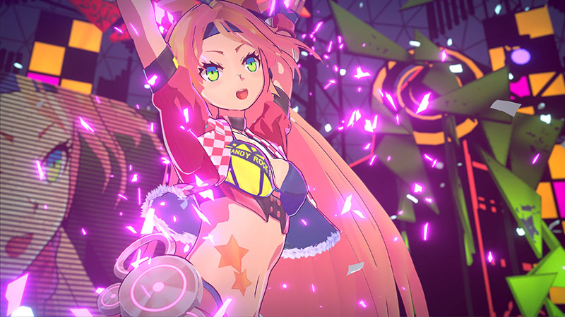](https://www.youtube.com/watch?v=p4azFua4rJo)

# What is UTS/UniversalToon?  
UTS2(Unity-Chan Toon Shader 2.0) is a toon shader for images and video that is designed to meet the needs of creators working on cel-shaded 3DCG animations. Unlike other pre-render toon shaders, **all features can be adjusted in real time on Unity, which is the greatest feature of UTS2**..  

**UTS/UniversalToon** is the UTS2 shader for Universal Render pipeline for Unity.  
**UTS/UniversalToon** has all the feature of UTS2 v.2.0.7.5, and been implemented as an uber shader.  
For more information about **Universal Render Pipeline**, please refer to [here](https://docs.unity3d.com/Packages/com.unity.render-pipelines.universal@9.0/manual/index.html).  

# Introduction to UTS/UniversalToon.  

**UTS/UniversalToon** is a toon shader for images and video that is designed to meet the needs of creators working on cel-shaded 3DCG animations. 

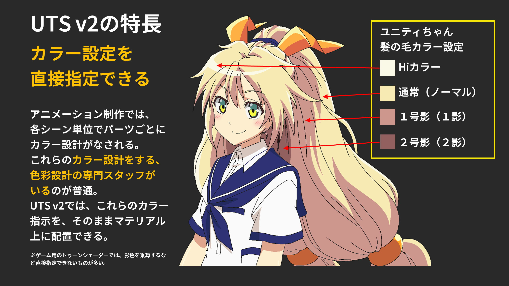

This Toon shader is configured to easily produce all shadows essential to character design, such as those that accentuate the form of various parts of a character model, without having to worry about the position and intensity of light sources. Shadow color settings can also be used  to make it easy for the person responsible for color design to create shadows.  

One of this shader’s particularly powerful features is the ability to adjust shadows using sliders within the shader itself, eliminating the need for multiple light sources.  

In addition to the 3 basic layers of **Base Color**, **1st Shade Color**, and **2nd Shade Color**, colors and textures can also accept a wide variety of customization options, such as **High Color**, **Rim Light**, **MatCap** (sphere mapping), and **Emissive** (light emission).  

The level of gradation between colors can also be adjusted in Unity in real-time.  

This shader also has 2 options for creating fixed shadows necessary to the design: the **Position Map**, which assigns a set casting point to each shadow, and the **Shading Grade Map**, which can adjust shadow intensity based on the lighting.  
There are several other convenient tools for things like **how visible eyes and eyebrows are through bangs**, which can further emphasize an anime-style look.  

In short, UTS/UniversalToon makes a wide variety of character designs possible, from cel-shaded to light novel illustration styles.  
Of course, it also supports Unity’s system shadow feature.  

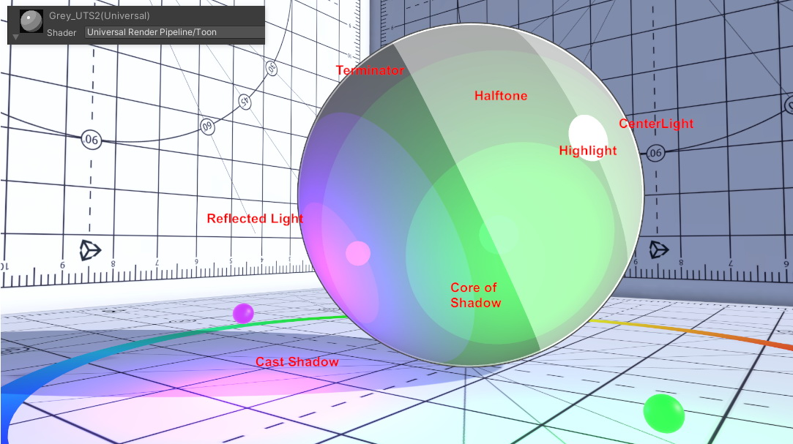

In addition, UTS/UniversalToon allows for non-photorealistic rendering (NPR) to create any picture-like element that can be made with Universal Render Pipline/Lit shader that supports physical-based rendering (PBR).  

Several techniques have been implemented to beautifully display characters in a variety of lighting environments, thanks to recent feedback from VRChat users.  

See for yourself by coloring your best character model with UTS/UniversalToon.  
You may be surprised to see your character looking better than ever before.  

This manual focuses on the latest version of UTS/UniversalToon: **UTS/UniversalToon v.2.2.2**.  

## 【Start using UTS/UniversalToon】
You can start using UTS/UniversalToon by assigning the **Toon** shader in the **Universal Render Pipeline** group to a new material in the **Shaders** menu of the Material Inspector. Here are the steps to take.  

1. Open the "+" menu in the Project window and select "Material" to create a new material.  

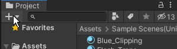

2. Select the new material that you have created. Looking at the Inspector, it currently has the "Universal Render Pipeline/Lit" shader assigned to it.  

3. Open the "Shaders" menu in the Inspector, select "Universal Render Pipeline" from the Shaders window, and then select "Toon".  

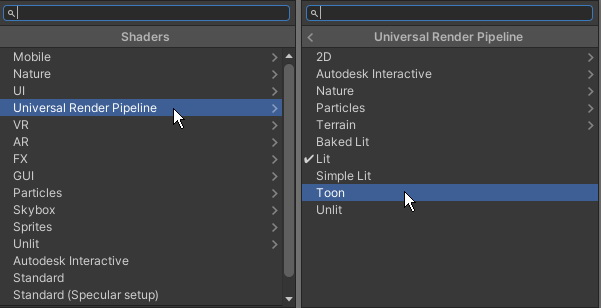

4. The material shaders are changed. Make sure that "Universal Render Pipeline/Toon" is assigned by the Inspector. By default, the most basic UTS2 shader, the "Double Shade With Feather" workflow, is assigned.  

## 【UTS/UniversalToon as an Uber Shader】
The legacy pipeline version of UTS2 was divided into multiple shaders by function.  

UTS2/UinversalToon has been redesigned as an integrated shader (Uber shader), allowing you to do all the work in one Universal Render Piplene/Toon shader.  

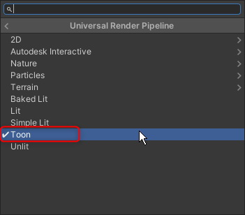

All functions are able to be used by selecting what you need from the Material Inspector.  

### ● Switch Workflow mode
Original UTS2 has two workflow modes, the "DoubleShadeWithFeather" shader and its more advanced version, the "ShadingGradeMap" shader. In UTS/UniversalToon, you can switch between these two shaders by selecting "Workflow Mode", which is almost at the top of the Material Inspector.  

The default is "DoubleShadeWithFeather" and the difference between the two workflows will be explained later.  

### ● To use special features such as the "stencil function"

Special functions such as stencils, various cutouts, and transparent functions, which previously required switching the UTS2 shader itself according to the combination of each function, are now all grouped together in the "Basic Shader Settings" menu as operation modes.  
Users can freely combine the functions they want by activating each operating mode.  

Each operating mode will be explained later.  

### ● Compatibility with the UTS2 materials for legacy pipeline
The UTS2 materials for Lecgacy pipeline are compatible with the UTS/UniversalToon materials in terms of material property settings.  
Therefore, if you copy the UTS2 materials into the Universal Render Pipeline environment and switch the shader to "Universal Render Pipeline/Toon", the values of the workflow mode, texture name, blur stage, etc., will be reflected as they are.  

For the special functions such as "Stencil" and "Cutoff" that were switched according to the shader file in the legacy pipeline, follow the above steps to activate each operating mode from the "Basic Shader Settings" menu.  

<small>↑ Under the environment of Universal Render Pipeline, the UTS2 material for the legacy pipeline is not correctly rendered as like in the left figure, but when the shader is switched to "Universal Render Pipeline/Toon", it comes to be correctlly displayed.</small>
  

## 【Sellection of Workflow Mode】

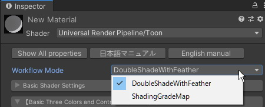

UTS/UniversalToon has two main workflow modes.  
* `DoubleShadeWithFeather` : The standard workflow mode for UTS/UniversalToon. Allows for 2 shade colors (Double Shade Colors) and  gradation between colors (Feathering).  
* `ShadingGradeMap`: A more advanced workflow mode. In addition to the DoubleShadeWithFeather features, this shader can also hold a special map called a ShadingGradeMap.  

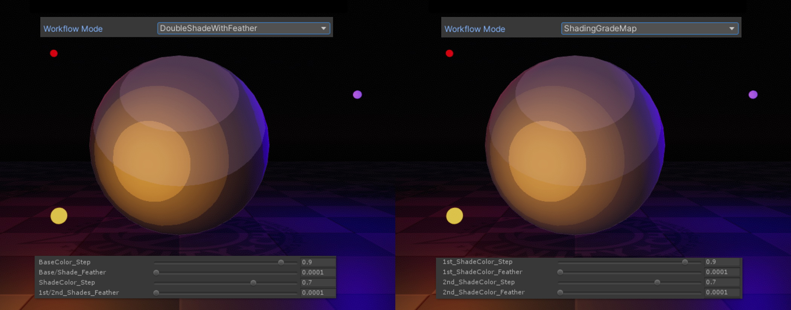

Both types have the same basic features, so the same look can be achieved with either type by matching the color (`_Step`) and gradation (`_Feather`) values.  
Choosing which workflow to use is a matter of personal taste, but generally `DoubleShadeWithFeather` is more suited to cel styles that need sharp, well defined colors, while `ShadingGradeMap` may be better for illustrated styles where the colors are more blurred together.  

You can switch between the two workflow modes at any time from the "Workflow Mode" menu near the top of the Material Inspector.  

## 【How to activate the each Special Feature Mode】

For the legacy UTS2, the shader-specific special features that were distinguished by suffix names such as `Transparent`, `StencilMask`, `StencilOut`, `Clipping`, or `TransClipping`, you can enable them from the settings of each special feature mode in the "Basic Shader Settings" for UTS/UniversalToon.  

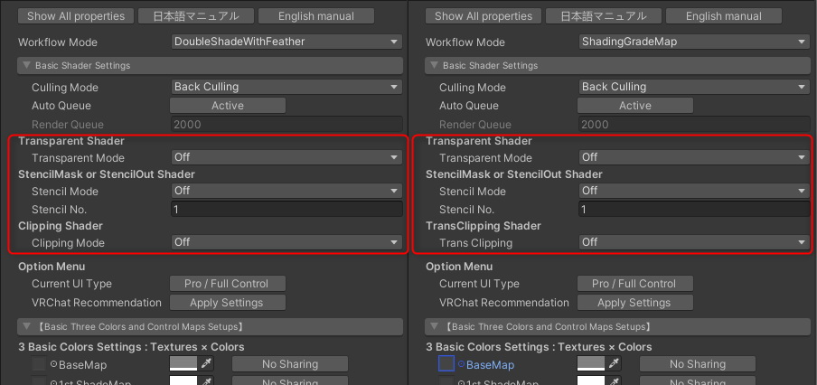

There are three special features that can be added to the basic shader from each special feature mode.  
1. Transparent Shader : Add transparent or translucent function to the basic shader.  
2. StencilMask or StencilOut Shader : Add stencil function to the basic shader.  
3. Clipping Shader or TransClipping Shader : Add clipping function to the basic shader.  

<small>【**Note**】If you are using the Material Inspector in the `All Properties` view, please click the `Change CustomUI` button to return to the UTS2 Custom Inspector view after changing all modes. Returning to the UTS2 Custom Inspector view, the required shader keywords are set and each operating mode is enabled.</small>  

---
### Transparent Shader

By setting `Transparent Mode` to `On`, it becomes a shader for transparent/translucent materials. At this time, the TransClipping function is always enabled.  

If `Auto Queue` is set to `Active`, the best Render Queue will be set.  
If you are stacking multiple translucent materials and the rendering order doesn't look correct, you should set the `Auto Queue` to `Off` to set a custom render queue. Set the value to `Render Queue` as appropriate to achieve correct drawing.  
If you want to learn more about the values you set for the Render Queue, refer to the item "[Rendering Order - Queue tag](https://docs.unity3d.com/Manual/SL-SubShaderTags.html)" from Unity manual.  

---
### StencilMask or StencilOut Shader

Set the `Stencil Mode` to add the stencil function. By using the stencil function, you can create an expression such as "eyebrows that penetrate the bangs", which is often used in anime and illustration expressions.  

1. `Off` : Turns off the stencil function.  
2. `StencilOut` : Assign the material to use as the transparent part. It must be paired with some `StencilMask` materials. In the below example, this is the material used for the "Bangs" part, so the "Eyebrows" part looks transparent.  
3. `StencilMask` : Assign the material to use as the part that is drawing through the surface in front. It must be paired with a `StencilOut` material. In the below example, you can assign it to the material for the "Eyebrows" part. It will always show through the "bangs" part.  

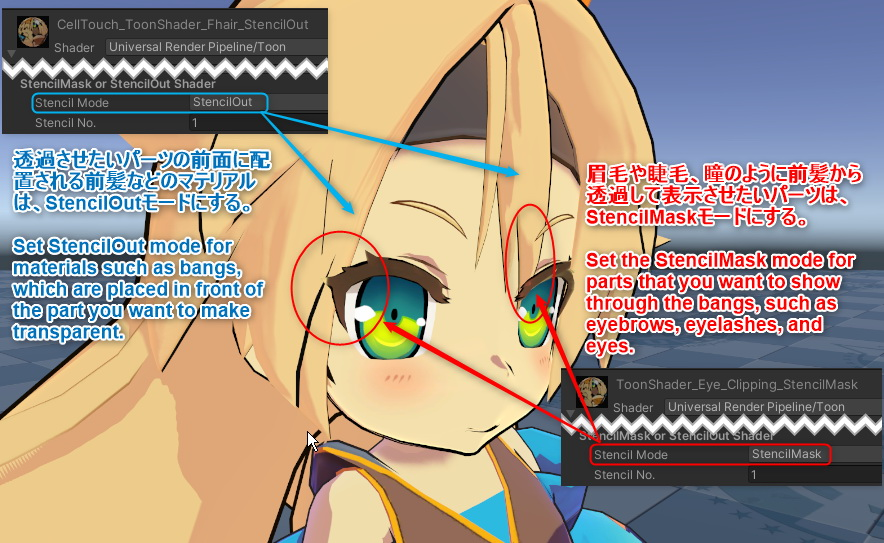

---
### Clipping Shader or TransClipping Shader
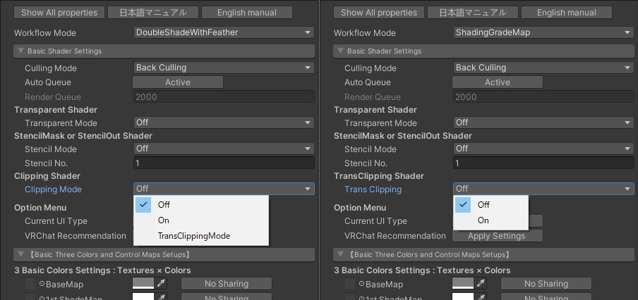

The basic shader function can have a clipping mask by activating each function from `Clipping Mode` or `Trans Clipping`. Clipping masks allow you to "cut out textures" (called as "cutouts" or "dissolves").  

#### ● Clipping Mode (in case of "DoubleShadeWithFeather")
1. `Off` : Turn off the clipping function.
2. `On`: Activate the clipping function.  
3. `TransClippingMode`: Set the clipping function to a higher performance trans clipping. This mode allows you to "cut out textures" by taking into account the alpha transparency of the mask. The load is higher than the normal clipping function, even though it allows for cleaner clipping.  

#### ● Trans Clipping (in the case of "ShadingGradeMap")
1. `Off` : Turn off the trans clipping function.  
2.`On` : Activate the trans clipping function. With the Trans clipping function, you can "cut out texture" by taking into account the alpha transparency of the mask.  

---
### 【Note】How to call other special function shaders
<small>Other special function shaders from the UTS2 for legacy pipeline can be called by following the steps below.  
Most of them are integrated into the basic shader functionality.</small>  

#### ● NoOutline shaders
<small>Set the `Outline` button to `Off` in the Material Inspector's `Outline Settings'. </small>  

#### ● AngelRing shaders
<small>You can call the function by following the steps below.</small>  
<small>1. Set `Workflow Mode` to `ShadingGradeMap` from the Material Inspector.</small>  
<small>2. Set `AngelRing Projection` to `Active` in the "AngelRing Projection Settings" of the Material Inspector.</small>  

#### ● Mobile shaders
<small>In the Universal Render Pipeline, the Forward Add pass has been changed and merged with the standard render pass.  
In UTS/UniversalToon, Mobile shaders have been abolished accordingly</small>.  

#### ● Tessellation shaders
<small>The universal render pipeline does not support DX11 Tesellation, so it has been deprecated</small>.  

#### ● Helper shaders
<small>It was deprecated in UTS/UniversalToon</small>.  

---
# Sample Scenes
The following sample scenes can be found by opening the sample project and opening the `\Assets\Sample Scenes(Universal)` folder.  

* ToonShader.unity            ：Settings for an illustration-style shader.  
* ToonShader_CelLook.unity    ：Settings for a cel-style shader.  
* ToonShader_Emissive.unity    ：Settings for a shader with an emissive .  
* ToonShader_Firefly.unity    ：Multiple real-time point lights.  
* AngelRing\AngelRing.unity：`Angel ring` and `ShadingGradeMap` sample.  
* Baked Normal\Cube_HardEdge.unity：Baked Normal reference.  
* BoxProjection\BoxProjection.unity        ：Lighting a dark room using Box Projection.  
* EmissiveAnimation\EmisssiveAnimation.unity：EmissiveAnimation sample.  
* LightAndShadows\LightAndShadows.unity：Comparison between the PBR shader and UTS2.  
* MatCapMask\MatCapMask.unity：MatcapMask sample.  
* Mirror\MirrorTest.unity: Sample scene checking for a mirror object  
* NormalMap\NormalMap.unity    ：Tricks for using the normal map with UTS2.  
* PointLightTest\PointLightTest.unity：Sample of  cel-style content with point lights.  
* Sample\Sample.unity        ：Introduction to the basic UTS2 shaders.  
* ShaderBall\ShaderBall.unity：UTS2 settings on an example shader ball.  

Each scene is intended as a reference for the relevant shader and lighting settings.  
They should come in handy as an example when creating your own scenes.  

# UTS/UniversalToon Setting Menu：UTS2 Custom Inspector

From here, you will know the function of the user interface **UTS 2 custom inspector** which sets each function of UTS/UniversalToon.

"UTS2 Custom Inspector"(left below) can switch to the conventional "property list type inspector"(right below)  by clicking the `Show All Properties` button.

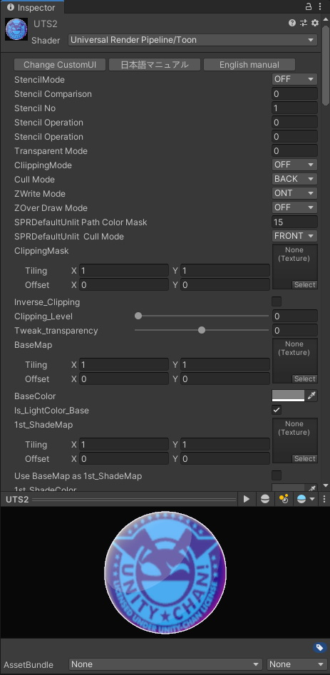

Function description of the property list type is [here](Props_en.md).  
You can restore the UI style of Inspector with the `Change CustomUI` button.  
Some of the settings in the Inspector of property list type are validated by going back to the UTS2 Custom Inspector. Therefore, it is strongly recommended that you **usually use the UTS2 Custom Inspector**.  

---
## 1. “Basic Shader Settings” Menu

In this menu, you will make basic settings for UTS/UniversalToon.  
In addition to selecting the two basic workflow modes, you can add a variety of special functions to the basic shaders by turning on and off various function modes.  

| `Item` | Function | Property |
|:-------------------|:-------------------|:-------------------|
| `日本語マニュアル` | Using the browser jumps to the UTS2 Japanese official manual. |  |
| `English Manual` | Using the browser jumps to the UTS2 English official manual. |  |
| `Workflow Mode` | Choose your prefer workflow mode from either `DoubleShadeWithFeather` or `ShadingGradeMap`. |  |
| `Culling Mode` | Designates which side of a polygon will not be drawn (culling). Available options are: `Culling Off` (both sides drawn) / `Culling Front` (front side culling) / `Culling Back` (back side culling). `Back` is selected by default. In some cases, selecting `Culling Off` can cause the normal map and lighting to display strangely. | _CullMode |
| `Auto Queue` | When `Active`, the render queue is set appropriately according to the function of the shader. When `Off`, you can set a custom render queue by entering a value in the `Render Queue` box below. |  |
| `Render Queue` | Set the value of the custom render queue. |  |
| `Transparent Mode` | Turn the transparent/translucency function `On` / `Off`. If you set the transparent mode to `On`, the clipping will automatically switch to `TransClippingMode`. |  |
| `Stencil Mode` | Set the stencil function. The stencil function is disabled by `Off`. Switching to `StencilOut` or `StencilMask` activates the respective stencil function. |  |
| `Stencil No` | Used by  `StencilMask`　/　`StencilOut` modes. Designates a stencil reference number between 0 - 255 (note that in some cases 255 carries a special significance). Matches the number for the cutting material and the material to be cut. | _StencilNo |
| `Clipping Mode` | Set the clipping function when the workflow mode is `DoubleShadeWithFeather`. `Off` disables the clipping function and `On` enables the clipping function. When set to `TransClippingMode`, the alpha channel of the mask is taken into account in the clipping. |  |
| `Trans Clipping` | When workflow mode is `ShadingGradeMap`, set the transclipping function to take into account the alpha channel of the mask. `Off` disables the clipping function and `On` enables the clipping function. |  |
| `Clipping Mask` | Used by `Clipping` / `TransClipping` modes. Designates the grayscale clipping mask. White indicates “none”. If no settings are chosen, the clipping feature will be inactive. | _ClippingMask |
| `Inverse Clipping Mask` | Inverts the clipping mask. | _Inverse_Clipping |
| `Clipping Level` | Designates the strength of the clipping mask. | _Clipping_Level |
| `Transparency Level` | Used by `TransClipping` shaders. Adjusts the transparency level by treating the clipping mask grayscale level as an α value. | _Tweak_transparency |
| `Use BaseMap αas Clipping Mask` | A property only found in `TransClipping` shaders. Checking this property will use the A channel, including the `BaseMap`, as a clipping mask. Designating a `ClippingMask` is not required. | _IsBaseMapAlphaAsClippingMask |
| Option Menu | The list of Optional features is below. |  |
| `Current UI Type` | The current selection of user interface is displayed on the button. By pressing the button, you can switch UTS2's GUI to `Beginner` mode. In `Beginner` mode, you can control basic UTS2 functions only. Toggle back to `Pro / Full Controll` mode. |  |
| `VRChat Recommendation` | Set up convenient settings for enjoying VRChat, where various lighting environments are mixed together, all at once. When setting up for VRChat, recommend you to start from this button first. |  |

---
### 【Note】Useful functions for VRChat users

<small>【**Caution**】As of May 2020, [VRChat](https://www.vrchat.com/) is not adopting the universal render pipeline. For the present (until the universal render pipeline were adopted in the future), please use [UTS2 for legacy pipeline](https://github.com/unity3d-jp/UnityChanToonShaderVer2_Project).</small>  

UTS/UniversalToon is a general purpose toon shader that can be used in various projects in Unity.  
If you enjoy UTS/UniversalToon on VRChat, you can use the following convenient functions to enjoy the stable features of VRChat in various environments while taking advantage of UTS/UniversalToon's advanced features.  

#### ● When setting up materials on UTS/UniversalToon
When you set up each material in UTS/UniversalToon, please execute the `VRChat Recommendation` button in the Basic Shader Settings> Option Menu.  
By executing this command, UTS/UniversalToon will become familiar with various VRChat lighting environments.  
If you upload your avatar on VRChat and it feels different from what you intended, you should try this command first.  

#### ● If you want to brighten the appearance of characters in dark worlds
After executing the `VRChat Recommendation` button, you may want to adjust the appearance of the character in a dark world, which has only point lights, more brightly.  
In that case, you can raise the brightness in dark world by adjusting the `Unlit Intensity` slider in the "Environmental Lighting Contributions Setups" menu.  

<small>【**Hint**】：`Unlit Intensity` is a function that boosts the brightness of the material in dark places while taking into consideration the brightness of the environment, so it can not be extremely bright in a world where the original environment lightings are set to be dark.  

However, in a dark world, the post effect's bloom is often set to strong as well. In such a world, if the value of **Unlit Intensity is set to over 1 (default value), it is also susceptible to bloom**, so be careful with it.</small>  

---
## 2. “Basic Three Colors and Control Maps Setups” Menu

This Menu defines the basic colors used by UTS/UniversalToon: the Base Color, 1st Shade Color, and 2nd Shade Color.  
These colors are arranged **in order from the light source’s direction, Base Color⇒ 1st Shade Color ⇒ 2nd Shade Color**.  
Each color is determined by multiplying each pixel in the texture by each color, then multiplying by the light color.  

**※ Hint: The Shade Colors do not have to be darker than the Base Color, and there’s nothing wrong with making the 2nd Shade Color lighter than the 1st Shade Color. In fact, doing so can give the impression of reflecting light from the environment.**.  

**※ Hint: The design of the content determines whether the 2nd Shade Color is used or not. If it is not used, there is also no need to designate one.**.  

From the submenu, you can also set the sharing setting of texture for basic three colors, normal map, shadow control maps.  

| `Item` | Function | Property |
|:-------------------|:-------------------|:-------------------|
| `BaseMap` | Designates the Base Color texture and the color which is multiplied by the `BaseMap`. If there is no designated texture, this color will be set as the Base Color. By pressing the right button, you can apply the texture specified in `BaseMap` to` 1st ShadeMap`. | _MainTex, _BaseColor, _Use_BaseAs1st |
| `1st_ShadeMap` | Designates the 1st Shade Color texture and the color which is multiplied by the `1st_ShaderMap`. If there is no designated texture, this color will be used as the 1st Shade Color. By pressing the right button, the texture specified in `1st ShadeMap` will also be applied to` 2nd ShadeMap`. If `1st Shade Map` also shares` BaseMap` at the same time, `BaseMap` also applies to` 2nd_ShadeMap`. | _1st_ShadeMap, _1st_ShadeColor, _Use_1stAs2nd |
| `2nd_ShadeMap` | Designates the 2nd Shade Color texture and the color which is multiplied by the `2nd_ShaderMap`. If there is no designated texture, this color will be used as the 2nd Shade Color. | _2nd_ShadeMap, _2nd_ShadeColor |

---

### “NormalMap Settings” Submenu
This block is where Normal Map settings are performed.  

**The Normal Map is generally used in UTS/UniversalToon for Shade Color gradation.**.  
Using the Normal Map along with standard shading allows for more complex gradation effects. In the above image, **the left side reflects the normal map in color, the right does not reflect it**.  

Besides, the normal map is used to adjust **skin texture** by using it together with the scale. Also, by preparing a normal map for MatCap, it is used to express **hair texture**.  

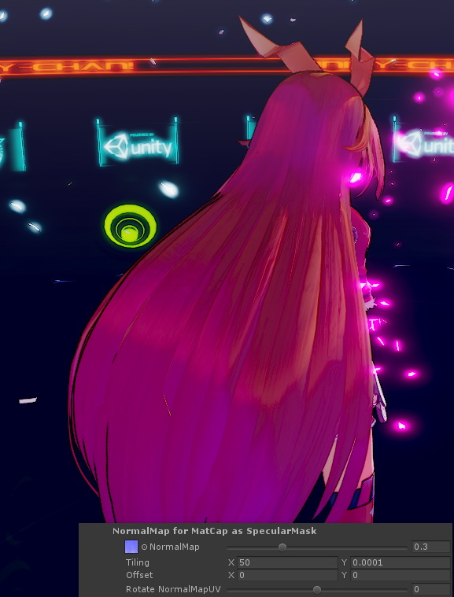

By using normal maps, you can enjoy various expressions.  

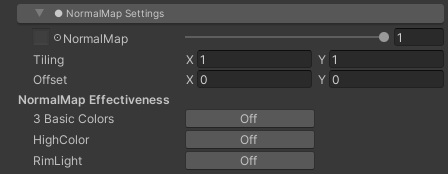

| `Item` | Function | Property |
|:-------------------|:-------------------|:-------------------|
| `NormalMap`          | Designates the Normal Map. The right slider is the scale that changes the strength of the normal map. | _NormalMap, _BumpScale |
| NormalMap Effectiveness | Select whether to reflect the normal map on each color. If the button is **Off**, that color does not reflect the normal map but is evaluated by the geometry of the object itself. |  |
| `3 Basic Colors` | Set **Active** when you want the normal map to be reflected in the colors. | _Is_NormalMapToBase |
| `HighColor` | Set **Active** when you want the normal map to influence the high color. | _Is_NormalMapToHighColor |
| `RimLight` | Set **Active** when you want the normal map to influence the RimLight. | _Is_NormalMapToRimLight |

**※ Hint:** The Normal Map can also be used for pseudo-solid effects like bumps. However, the Normal Map will not actually make the surface of the object’s geometry bumpy and instead will cause the lighting to give the appearance of bumps. Therefore it is necessary to **set the Base Color/1st Shade Color/2nd Shade color step so that it is easier for the light to bring out this effect**. [In the example above](https://twitter.com/nyaa_toraneko/status/1051359237631164417), the Base Color step is set to 0.8, the Shade Color step is set to 0.5, and a slightly darker Hi-Color is used to emphasize the object as solid.  

---
### “Shadow Control Maps” Submenu
Specify the position map and shading grade map to adjust the shadow fall condition.  
Depending on the workflow you use, the items in the sub menu will change.  

### ● DoubleShadeWithFeather Workflow

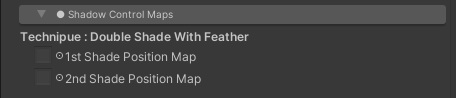

| `Item` | Function | Property |
|:-------------------|:-------------------|:-------------------|
| `1st Shade Position Map` | Uses a Position Map to force the 1st Shade Color’s position, independent of the lighting. Indicates areas that must have a shadow in black. | _Set_1st_ShadePosition |
| `2nd Shade Position Map` | Uses a Position Map to force the 2nd Shade Color’s position, independent of the lighting. Indicate areas that must have a shadow in black (also affects the 1st Shade Color’s Position Map). | _Set_2nd_ShadePosition |

#### 【What is the Position Map?】

The Position Map designates shadows that you want to cast regardless of the lighting.  

It can be added to a material in addition to the lighting, for times when you want a particular shadow to show in each scene or when there are directorial reasons to add shadows.  

**※ Hint: It might be easier to draw those shadows directly using a 3D painter like Substance Painter, etc.**  

#### ● How the 1st and 2nd Shade Color Position Maps Interact
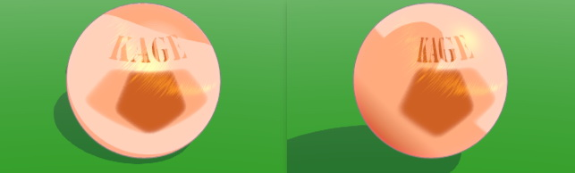

In order to **display the 2nd Shade Color** independent of lighting, make sure to **fill in the places where the 1st and 2nd Shade Color Position Maps will overlap**.  

This way, even if shadows from other lighting fall on the 2nd Shade Color area, it will continue to show.  

On the other hand, **for areas where the 2nd Shade Color doesn’t show** (areas designated by the 2nd Shade Color Position Map, but not the 1st Shade Color Position Map), the 2nd Shade Color will only show when covered by shadows created by the lighting.  

---
### ● ShadingGradeMap workflow

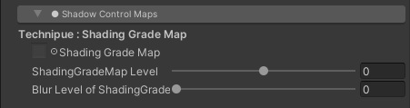

| `Item` | Function | Property |
|:-------------------|:-------------------|:-------------------|
| `ShadingGradeMap` | Designates the Shading Grade Map as grayscale. Be sure to set `SRGB (Color Texture)` to `OFF` in the texture import settings for Shading Grade Map.| _ShadingGradeMap |
| `ShadingGradeMap Level` | Level correction of the gray scale value of Shading Grade Map. The default is 0, and it can be adjusted in a range of ±0.5. | _Tweak_ShadingGradeMapLevel |
| `Blur Level of ShadingGradeMap` | Blur the Shading Grade Map using the Mip Map function. To enable Mip Map, set Advanced> `Generate Mip Maps` to` ON` in the texture import settings. The default is 0 (no blur). | _BlurLevelSGM |

#### 【What is the Shading Grade Map?】
`DoubleShadeWithFeather` is the basic workflow in UTS/UniversalToon, and `ShadingGradeMap` workflow is the expansion of this basic workflow using the shading grade map, which is a grayscale map to control shadows with the UV coordinate.  

Adding the `Shading Grade Map` to the basic toon shader allows the 1st and/or 2nd Shade Colors to be controlled at the UV point level.  
This map’s fine level of control makes effects like “hiding the wrinkles in clothes **when the light hits them**” possible.  
The black portions of an image are handled by the 2nd Shade Color of the `Shading Grade Map`, and the way shadows fall changes based the gray portions, which depend on the density of the black portions.  
The denser the gray, the more easily shadows fall, so shadows can also fall between two gray areas.  

Applying **a shading map like the Ambient Occlusion map** to the shading grade map makes it easier for shadows to fall depending on the lighting. This is useful for things like creating shadows that follow hair bangs or the concave parts of clothing.  

---
## 3. “Basic Lookdevs : Shading Step and Feather Settings” Menu

This block is where the Base Color/1st Shade Color/2nd Shade Color **Step** and the **Feathering** Intensity are set. In addition to the real-time directional light settings, these are the most important settings in UTS2. **These settings will determine the basic look of your content**. This menu is where basic items for making Cel and Illustration Styles are gathered.  
These settings can be checked repeatedly in real-time in Unity.  
There is no need to render and confirm the effects of every single property change, making it easier to deliberately design and assemble content.  
Adjust the Step and Feather parameters to create totally different looks, without changing the direction of the light source.  

### 【The Basics of Using the Step/Feather Sliders】

<small>↑ This covers the basics of using the Step slider, which controls the color levels, and the Feather slider, which controls the gradation at the boundaries between colors.</small>  

---
### ● DoubleShadeWithFeather Workflow

There are items of DoubleShadeWithFeather, the standard workflow in UST2/UniversalToon.  
This workflow can have 2 **Position Maps**, a special feature that allows the 1st and 2nd Shade Colors to be fixed to a model regardless of lighting.  

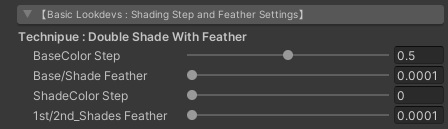

| `Item` | Function | Property |
|:-------------------|:-------------------|:-------------------|
| `BaseColor Step` | Sets the boundary between the Base Color and the Shade Colors. | _BaseColor_Step |
| `Base/Shade Feather` | Feathers the boundary between the Base Color and the Shade Colors. | _BaseShade_Feather |
| `ShadeColor Step` | Sets the boundary between the 1st and 2nd Shade Colors. Set this to 0 if no 2nd Shade Color is used. | _ShadeColor_Step |
| `1st/2nd_Shades Feather` | Feathers the boundary between the 1st and 2nd Shade Colors.  | _1st2nd_Shades_Feather |

---
### ● ShadingGradeMap Workflow

These items are UTS2’s high spec ShadingGradeMap workflow.  
This workflow with a **Shading Grade Map** can control the sharpness and intensity of shadows in relation to the lighting.  
This map allows you to set shadows of any shape and in any place you like, regardless of geometry or vectors.  
Compared to Position Maps, in addition to placing shadows, Shading Grade Maps can also adjust how shadows look depending on the way the light hits them.  

| `Item` | Function | Property |
|:-------------------|:-------------------|:-------------------|
| `1st ShadeColor Step` | Sets the step between the Base color and 1st Shade Color, the same as the `BaseColor_Step` property. | _1st_ShadeColor_Step |
| `1st ShadeColor Feather` | Feathers the boundary between the Base Color and the 1st Shade Color, the same as the `Base/Shade_Feather` property. | _1st_ShadeColor_Feather |
| `2nd ShadeColor Step` | Sets the step between the 1st and 2nd Shade Colors, the same as the `ShadeColor_Step` property. | _2nd_ShadeColor_Step |
| `2nd ShadeColor Feather` | Feathers the boundary between the 1st and 2nd Shade Colors, the same as the `1st/2nd_Shades_Feather` properties. | _2nd_ShadeColor_Feather |

---
### “System Shadows : Self Shadows Receiving” Items

These are adjustment items to make Unity's shadow system and toon shading familiar.  
In the case of the toon shade, the shadow provided by the system is necessary to express the character 's self - shadow (falling shadow to himself).  
Use this when you want to make further fine adjustments after deciding the coloring level with the “Basic Lookdevs: Shading Step and Feather Settings” submenu items and want to fine-tune the way ReceiveShadow exits, such as self shadow.  

| `Item` | Function | Property |
|:-------------------|:-------------------|:-------------------|
| `Receive System Shadows` | When using Unity shadow system, set it to **Active**. This option must be sure to **Active** to use ReceiveShadow. (`ReceiveShadow` must also be selected under Mesh Renderer) | _Set_SystemShadowsToBase |
| `System Shadows Level` | It controls Unity’s system shadow levels. The default is 0, and the levels can be adjusted to ±0.5. | _Tweak_SystemShadowsLevel |
| `Raytraced Hard Shadow`| Enable the **Realtime raytraced Hard Shadow(RTHS) feature** for advanced users. Under the condition that DXR(DirectX Raytracing) is working properly and `ShadowRaytracer` component is attached to the main camera, the button turned in `Active` applies hard shadows with the Realtime raytracing feature as a shadow map. ||

【NOTE】For more information about the RTHS feature and `ShadowRaytracer` component, see [here](https://github.com/unity3d-jp/RaytracedHardShadow/blob/dev/Documentation~/README_EN.md).  

<small>↑ When using the system shadow with Unity and adjusting the Step slider, noise may appear in the area with shadow color. These noises are troublesome in Cel-look style, so I show you how to improve them using the `System Shadows Level` slider and` Tessellation` (※Tessellation support is only available for legacy UTS2).</small>  

---
### “Additional Settings” Submenu

These are adjustment items mainly for the real-time point light group.  

| `Item` | Function | Property |
|:-------------------|:-------------------|:-------------------|
| `Step Offset for PointLights` | Fine tunes light steps (boundaries) of real-time point lights. | _StepOffset |
| `PointLights Hi-CutFilter` | Cuts unnecessary highlights from the Base Color area of real-time point lights. This is particularly useful for cel-shaded styles, where there is little to no feathering. | _Is_Filter_HiCutPointLightColor |

---
### ● Adjusting the different colors of point lights ：Step Offset、PointLights Hi-Cut Filter

With UTS/UniversalToon, you can create a cel-shaded look with just point lighting.  
This is done by adjusting the Step slider of the Base Color /1st Shade Color, 1st Shade Color / 2nd Shade Color. With point lighting, the changes in shadows are more obvious when moving, compared to directional lighting.  
To make it less obvious, use “Step_Offset” to make finer adjustments.  

By using “Step Offset”, you can adjust the Realtime light steps (the level of gradation) like point lighting.  
The adjustments on “BaseColor_Step” will determine the main light’s gradation but you can also use it to adjust the point lighting settings.  
By using “Step Offset” at the same time, you can adjust the finer details of point lighting. In particular, this is useful when expressing highlights for machine-related art.  

The brightness of the lighting depends on how close an object is, so the highlight might be too bright in some cases, especially for the base color (bright color).  
When this happens, you can turn on “PointLights Hi-Cut Filter” to make the highlights dimmer, and make it blend in more with the cel-look.  
If you want the highlights to be brighter, turn off “PointLights Hi-Cut Filter”.  

---
## 4. “HighColor Settings” Menu

**High Color** is also known as **Highlights or Speculum Lighting**.  
It is used to reflect the main directional light. When the light moves the reflection also moves accordingly. In UTS/UniversalToon, you can adjust the high color rendering.  

| `Item` | Function | Property |
|:-------------------|:-------------------|:-------------------|
| `HighColor` | Specifies the high color. If you are not using it, set it to Black (0,0,0). High color moves according to the direction of light. You can specify texture as well as color specification. By using texture, you can use complex colors. It will be multiplied to the (right) color palette, so if you only want the texture’s color, set the color pallet to white (1,1,1). If you do not need it, you do not have to touch the settings. | _HighColor, _HighColor_Tex |
| `HighColor Power` | Adjust the high color’s range (In specular lighting terms, this will be the “power”) | _HighColor_Power |
| `Specular Mode` | In case of `Active`, render the high color range as speculum lighting (gloss). If turned off it the boundaries of the high color range will be drawn as circles. | _Is_SpecularToHighColor |
| `Color Blend Mode` | In case of `Additive`, add the High Color to the base color(It becomes brighter). Specular can only be used with the Add mode. In case of `Multiply`, multiply the High color with the base color(It becomes darker). | _Is_BlendAddToHiColor |
| `ShadowMask on HighColor` | In case of `Active`, mask the high color area on the shadow area. | _Is_UseTweakHighColorOnShadow |
| `HighColor Power on Shadow` | Adjusts the power of the high color range in shadows. | _TweakHighColorOnShadow |
| HighColor Mask | Hicolor Mask settings below. |  |
| `HighColor Mask` | It masks the high color based on the UV coordinates. 100% with white, and black does not show it at all. If you do not need it, you do not need to adjust it. | _Set_HighColorMask |
| `HighColor Mask Level` | It adjust the mask level of the high color. The default is 0. | _Tweak_HighColorMaskLevel |

**※Tip: If you want to enable high color of real-time point lights, set `PointLights Hi-Cut Filter` to` Off`.**

By using HighColorMask, you can dim light (on skin etc.) that reflects too much depending on the angle.  
This is useful when highlighting skin color on the cheeks and chest.  

You can also use HighColorMask as a specular lighting map for reflective surfaces. So it can also be use for metallic textures as well.  
As seen in Akatsuki Yuki’s (@AkatsukiWorks) work, by using HighColorMask and RimLightMask, you can create art that looks like an illustration but also render the texture of each material.  

---
## 5. “RimLight Settings” Menu

In realistic styles, **RimLight**  is a technique in which light is set to shine on the rims of the object.  
In non-photorealistic styles that includes Toon Shader, highlights are also placed on the edges of objects to make it more visible, and it is also called RimLight.  
You can use these RimLight options in UTS/UniversalToon.  

| `Item` | Function | Property |
|:-------------------|:-------------------|:-------------------|
| `RimLight` | In case of `Active`, the ‘RimLight’ on. | _RimLight |
| RimLight Settings | RimLight settings below. |  |
| `RimLight Color` | Specifies the RimLight’s color. | _RimLightColor |
| `RimLight Power` | Adjusts the RimLight’s power. | _RimLight_Power |
| `RimLight Inside Mask` | Adjusts the power of the inside masking of the RimLight. | _RimLight_InsideMask |
| `RimLight FeatherOff` | In case of `Active`, cuts the RimLight’s blurring. | _RimLight_FeatherOff |
| `LightDirection Mask` | In case of `Active`, only shows RimLight in the light’s direction. | _LightDirection_MaskOn |
| `LightDirection MaskLevel` | Adjusts the rim mask level in the light’s direction. | _Tweak_LightDirection_MaskLevel |
| `Antipodean(Ap)_RimLight` | In case of `Active`, shows RimLight (AP RimLight) in the opposite direction of the light’s direction. | _Add_Antipodean_RimLight |
| Ap_RimLight Settings | Ap_RimLight settings below. |  |
| `Ap_RimLight Color` | Specifies the AP RimLight’s color. | _Ap_RimLightColor |
| `Ap_RimLight Power` | Specifies the power of the AP Rim Light. | _Ap_RimLight_Power |
| `Ap_RimLight FeatherOff` | In case of `Active`, cuts the AP Rim Light’s blurring. | _Ap_RimLight_FeatherOff |
| RimLight Mask | RimLight Mask settings below. |  |
| `RimLight Mask` | Masks the RimLight according to the UV coordinates. Set to 100% for white, and the rim light does not show when set to black. If you do not need it, you do not have to adjust it. | _Set_RimLightMask |
| `RimLight Mask Level` | Adjusts the RimLight mask’s level. The default is 0. | _Tweak_RimLightMaskLevel |

The RimLight is generally shown around the objects edges from the camera’s perspective. In UTS2, you can adjust where the rim light is shown in relation to where the main light is. (‘LightDirection Mask’)

You can also set RimLight in the opposite direction of the light source. You can also render “light reflection” with ‘Add Antipodean_RimLight’.

Specify the RimLight’s color of the light direction as Black (0,0,0) if you only want the rim light to be shown on the opposite direction of the light source and cut the rim light in the direction of the light source.  

RimLight can also be too bright like HighColor depending on the camera’s angles.  

In UTS2, you can adjust RimLight’s mask to make it dimmer.  

In the image above, the RimLight’s color in the light source’s direction and the light reflection’s direction is changed. The rim light is also masked around the underarms to prevent unnecessary highlights.  

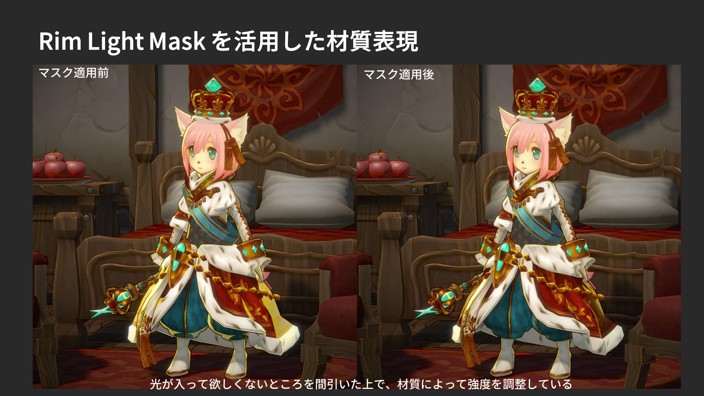
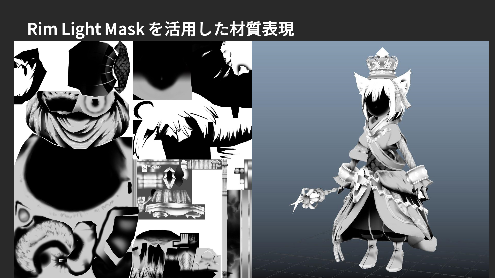

By masking the RimLight, you can also emphasize the metallic textures in comparison to other materials, or adjust the incidental light on clothes to create wrinkles on velvet.  

---
## 6. “MatCap : Texture Projection Settings” Menu

**[MatCap](http://wiki.polycount.com/wiki/Matcap)** is a camera based sphere map that you can paste on to objects.
It is used for ZBrush texture rendering.  

When you google image search for Matcap, you can find a lot of examples. It was used to create metallic reflections before physics-based shaders were common.  
You can use Matcap to create all kinds of textures in addition to metallic textures.  
In UTS/UniversalToon, you can enjoy MatCap with Adding mode, as well as Multiplication mode.  

<small>**※ HINT: In UTS/UniversalToon, appropriate adjustments will be made to distortions caused by the camera. So the Matcap will not be distorted even when the object is on at the edge of the camera’s perspective. This setting is adjusted with the `MatCap Projection Camera`.**</small>  

| `Item` | Function | Property |
|:-------------------|:-------------------|:-------------------|
| `MatCap` | In case of `Active`, turns MatCap on. | _MatCap |
| MatCap Settings | MatCap settings below. |  |
| `MatCap Sampler` | Set which texture to use for MatCap. Color that will be multiplied to MatCap_Sampler. If you set a grayscale image on MatCap_Sampler, you can add color to the MatCap with MatCapColor. | _MatCap_Sampler, _MatCapColor |
| `Blur Level of MatCap Sampler` | Blur MatCap_Sampler using the Mip Map function. To enable Mip Map, set Advanced> `Generate Mip Maps` to` ON` in the texture import settings. The default is 0 (no blur). | _BlurLevelMatcap |
| `Color Blend Mode` | In case of `Additive`, the MatCap blend will be set to Adding Mode. (It makes it brighter.) In case of `Multiply`, it will be blend with Multiplication Mode (It makes it darker.) | _Is_BlendAddToMatCap |
| `Scale MatCapUV` | You can adjust the MatCap’s range by adjusting the UV of the MatCap Sampler from the center to a circle by scalling. | _Tweak_MatCapUV |
| `Rotate MatCapUV` | Rotates the MatCap Sampler’s UV based on the center. | _Rotate_MatCapUV |
| `CameraRolling_Stabillizer` | In case of `Active`, it prevents MatCap from rotating for camera rolling (Rotation with the depth direction as the axis). This function is useful when you want to fix MatCap against the rolling of the camera. | _CameraRolling_Stabilizer |
| `NormalMap for MatCap` | In case of `Active`, gives a normal map specifically for MatCap. If you are using MatCap as speculum lighting, you can use this to mask it. | _Is_NormalMapForMatCap |
| NormalMap for MatCap as SpecularMask | NormalMap for MatCap settings below. |  |
| `NormalMap` | Set normal map for the MatCap. The slider on the right is the scale. | _NormalMapForMatCap, _BumpScaleMatcap |
| `Rotate NormalMapUV` | Rotates the UV of the MatCap’s normal map based on the center. | _Rotate_NormalMapForMatCapUV |
| `MatCap on Shadow` | In case of `Active`, masks the MatCap area that is shadowed. | _Is_UseTweakMatCapOnShadow |
| `MatCap Power on Shadow` | Adjusts the power of the Matcap’s range in shadows. | _TweakMatCapOnShadow |
| `MatCap Projection Camera` | Specify the projection of the camera to use in the game view. **Camera distortion correction works when the perspective camera (`Perspective`)**. | _Is_Ortho |
| MatCap Mask | MatCap Mask settings below. |  |
| `Matcap Mask` | By setting a grayscale mask for MatCap, you can adjust how MatCap is shown. The MatcapMask is placed based on the UV coordinates of the mesh that the MatCap will be projected on. Mask with black and unmask with white. | _Set_MatcapMask |
| `Matcap Mask Level` | Adjusts the power of the MatcapMask. When the value is 1, MatCap is displayed 100% irrespective of whether or not there is a mask. When the value is -1, MatCap will not be displayed at all and MatCap will be the same as in the off state. The default value is 0. | _Tweak_MatcapMaskLevel |
| `Inverse MatcapMask` | In case of `Active`, the MatcapMask is inverted. | _Inverse_MatcapMask |

In the example above, Matcap is used as **a similar environment map**.  
By using MatCap, you can create **light reflections of smooth surfaces** while keeping the illustration style.

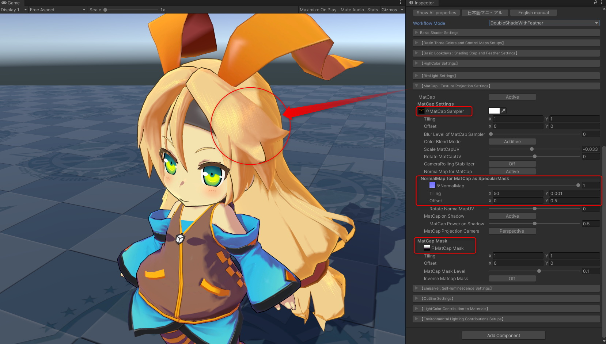

In the example above, `MatCap`, `NormalMap for MatCap` and `MatcapMask` is used to express **a silky hair gloss**.  

* MatCap Sampler :  Used for the light circles that is multiplied.  
* NormalMap for MatCap : If only MatCap is used, it will be rendered as is, but by repeatedly using NormalMapForMatCap, the crescent-shaped light reflections are created. This is known as **Speculum Masking**. The normal map used here is not used for bumpy textures.  
* MatCap Mask : Adjusts the range where MatCap is shown. By setting the gradation mask vertically, and adjusting the Matcap Mask Level slider, you can easily control the range of the MatCap shown.  

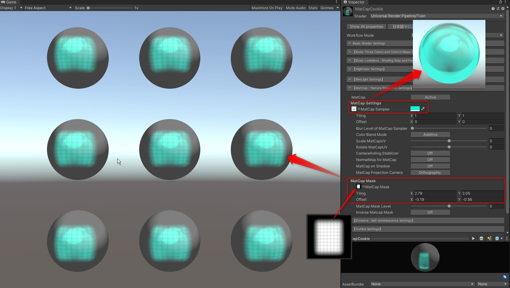

You can also express light cookies like this with MatCap Mask.  

---
## 7. “AngelRing Projection Settings” Menu

Angel Ring is a highlight that is always shown in a fixed place from the camera’s perspective. It is used on highlights for hair. Angel Ring feature is available in the `ShadingGradeMap` workflow.  

Angel Ring reffers to the UV2 of the mesh that it will be projected on. So you have to set the UV2 with the DCC tools like Maya, 3ds Max, Blender, etc. beforehand.  

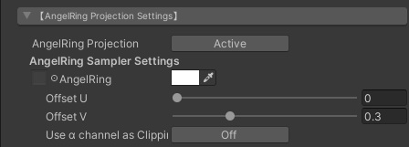

| `Item` | Function | Property |
|:-------------------|:-------------------|:-------------------|
| `AngelRing Projection` | In case of `Active`, turns Angel Ring on. | _AngelRing |
| AngelRing Sampler Settings | AngelRing Sampler settings below. |  |
| `AngelRing` | Specifies the texture and color of the Angel Ring. The color that will be multiplied to the Angel Ring. | _AngelRing_Sampler, _AngelRing_Color |
| `Offset U` | Adjusts the Angel Ring’s shape in the horizontal direction. | _AR_OffsetU |
| `Offset V` | Adjusts the Angel Ring’s shape in the vertical direction. | _AR_OffsetV |
| `Use α channel as Clipping Mask` | In case of `Active`, you can use the α channel that is included in the Angel Ring’s texture as a clipping mask. | _ARSampler_AlphaOn |

### ● Making materials for Angel Ring.

First, set a second UV that will be applied to the Angel Ring function of the hair’s mesh.  

The UV for AngelRing is separate from the UV for the hair’s texture and is created orthographically from the character’s front.  

**The steps from here, including creating UV2, are done with DCC tools like Maya, 3ds Max, Blender etc.**.  

By using the AngelWing’s UV as a guide, draw the texture of the highlights. The highlight’s color will be added to the original color.  
Register the created texture as AngelRing_Sampler.  
You can draw the highlight with white and add color in AngelRing_Color too.  

In case of `Active` with `Use α channel as Clipping Mask`, you can use the α channel that is included in the AngelRing’s texture as a clipping mask, as shown below.  
You can set the color of the AngelRing directly instead of adding it.  

---
## 8. “Emissive : Self-luminescene Setings” Menu

**Emissive** means that objects emit light.  
By defining the **HDR color** for ‘Emissive’, you can create parts that are brighter than the other colors.  

**By using it with post-effects that are attached to the camera, like [Bloom](https://docs.unity3d.com/Packages/com.unity.render-pipelines.universal@9.0/manual/post-processing-bloom.html) in [Post-Processing in UniversalRP](https://docs.unity3d.com/Packages/com.unity.render-pipelines.universal@9.0/manual/integration-with-post-processing.html) you can make parts emit light effectively.**  

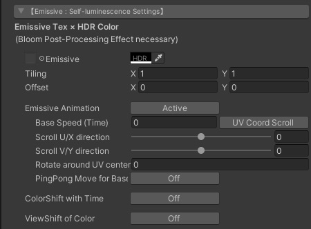

| `Item` | Function | Property |
|:-------------------|:-------------------|:-------------------|
| `Emissive` | Specifies the texture for Emissive. You can also create a texture with grayscale and make it emit light with Color. Color that will be multiplied to each pixel color in texture. In most cases, set [**HDR Color**](https://docs.unity3d.com/Manual/HDRColorPicker.html) **If you do not want it to emit light on top of other parts, set it to Black (RGB: 0,0,0)** | _Emissive_Tex.rgb, _Emissive_Color |
| `The αchannel of Emissive Texure` | As of v. 2.0.7, the alpha channel can be used as a mask for emissive textures. Emissive is displayed at the position where the alpha channel is set to white (RGB = (1, 1, 1)) on UV basis. When black (RGB = (0, 0, 0)), the emissive disappears. | _Emissive_Tex.a |
| `Emissive Animation` | By making it `Active`, you can animate the RGB channel part of the texture specified by` Emissive` in various ways. **Alpha channel is a mask, so it can not be animated.** | EMISSIVE MODE = ANIMATION |
| `Base Speed (Time)` | Specifies the base update speed of the animation. If the value is 1, it will be updated in 1 second. Specifying a value of 2 results in twice the speed of a value of 1, so it will be updated in 0.5 seconds. | _Base_Speed |
| `UV Coord Scroll`, `View Coord Scroll` | Specifies the coordinate system to use for scrolling. In the case of `UV Coord Scroll`, scrolling is performed based on the UV coordinates of Emissive_Tex. In the case of `View Coord Scroll`, it scrolls based on the same view coordinates as MatCap. Scrolling in the view coordinate system is very useful because it does not take into account the UV coordinates of the texture, but it is often the case that objects with flat faces like cubes can not be displayed well. On the other hand, the view coordinate system can be used very conveniently for objects with many surfaces such as characters. | _Is_ViewCoord_Scroll |
| `Scroll U direction` | Specifies how much the Emissive texture is to be scrolled in the U direction (direction of the X axis) when updating the animation. Specify in the range -1 to 1 and the default is 0. Scroll animation is ultimately determined as the result of `Base Speed (Time)` x `Scroll U Direction` x` Scroll V Direction`. | _Scroll_EmissiveU |
| `Scroll V direction` | Specifies how much the Emissive texture is to be scrolled in the V direction (direction of the Y axis) to update the animation. Specify in the range -1 to 1 and the default is 0. | _Scroll_EmissiveV |
| `Rotate around UV center` | Specifies how much the Emissive texture should be rotated around the center of the UV coordinates (UV = (0.5, 0.5)) as an animation update. When Base Speed = 1, turns 1 clockwise with a value of 1. When combined with scrolling, it will rotate after scrolling. | _Rotate_EmissiveUV |
| `PingPong Move for Base` | By setting it to `Active`, you can set PingPong (back and forth) in the direction of the animation. | _Is_PingPong_Base |
| `ColorShift with Time` | By setting it to `Active`, the color multiplied to the Emissive texture changes by linear interpolation (Lerp) toward` Destination Color`. **When using this function, it is better to set the Emissive texture to grayscale and design the each colors on the color side to be multiplied.** | _Is_ColorShift |
| `Destination Color` | This is the target color for color shifting. It can be specified in HDR. | _ColorShift |
| `ColorShift Speed (Time)` | Set the standard speed for color shift. When the value is 1, change of one cycle should be approximately 6 seconds as a guide. | _ColorShift_Speed |
| `ViewShift of Color` | `Active` shifts the color relative to the camera's viewing angle to view the object. When viewed from the front of the surface of the object, the normal Emissive color is displayed, and the color changes to the shifted color as the view angle gradually inclines. | _Is_ViewShift |
| `ViewShift Color` | This is the color to change to when shifting views. Specify in HDR. | _ViewShift |

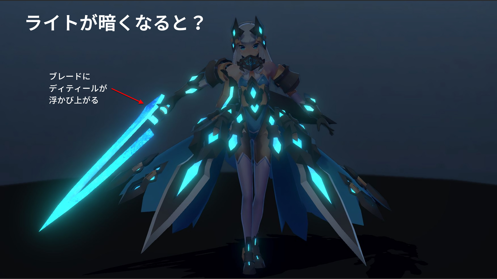

This is an example from @einz_zwei, in which emissive parts are used very effectively.  
By combining color maps and emissive maps, details are added according to the light’s brightness.  

---
### ● How to create a texture with alpha channel

Texture with alpha channel is created with DCC tools such as Photoshop.  
You can use it as an alpha channel by adding a new channel from the channel tab and pasting a grayscale image on the created channel. If you use an image format that has an alpha channel such as Targa format, you can save as it is.  

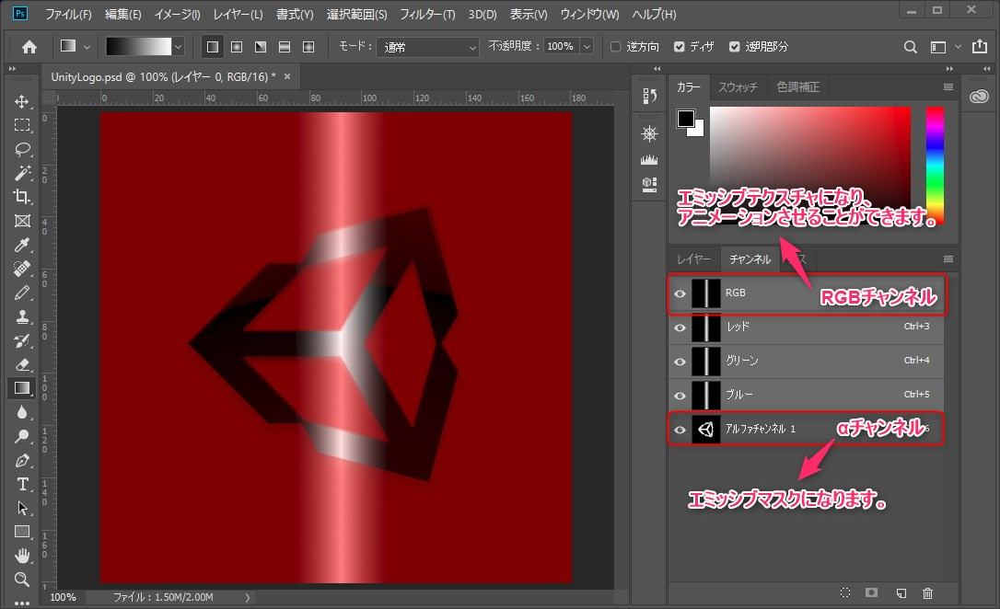

To enable the alpha channel on Unity, set `Alpha Source` to` Input Texture Alpha` in the Import Settings of each texture.  

**In the case of PNG format** can not have an alpha channel directly in the image specification, so after loading an alpha channel as a selection range in Photoshop, specify “Layer mask> Mask outside selection range”, PNG Save in format.  

Then import it into Unity, and in Import Settings, set `Alpha Source` to` Input Texture Alpha` and `Alpha Is Transparency` to` ON`.  

---
### ● Tips for setting Destination Color

When using the color shift function, set `Destination Color` as the target, but if the original color and the target color have the same hue, unexpected colors may be mixed into the frame. For example, if you shift from the color shown on the left side of the arrow to one of the two colors on the right that looks similar, the first color on the right of the arrow shifts color within the same hue range. The second color is a mixture of bluish frames.  

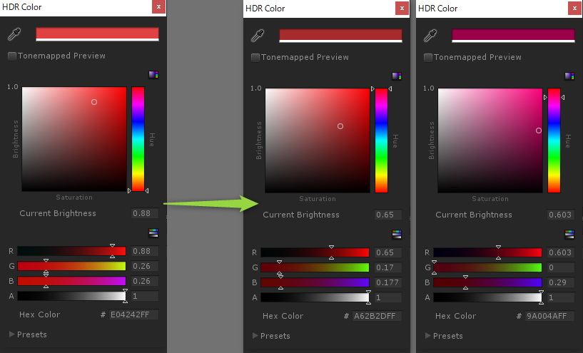

This is because the color that mixes blueish frames has a B channel that has a higher value when compared to the RGB of the original color.  

In this way, when shifting colors with different luminance within the same hue to the target in this way, **by aligning the direction of change of each RGB**, it is possible to prevent unexpected colors from entering the frame.  

↑Example of color shift within the same hue. The target color RGB values are all smaller than the original color.  

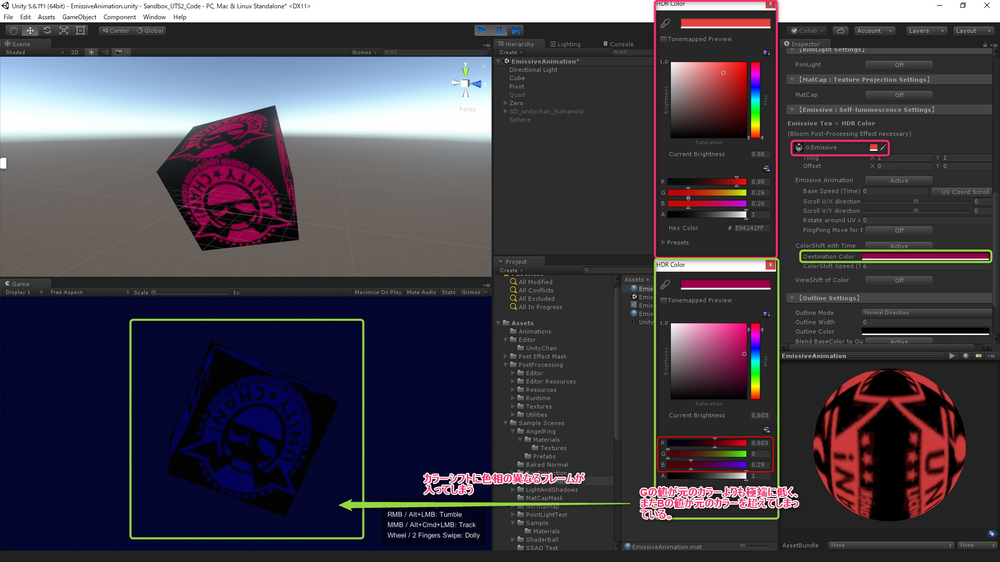

↑Example where frames outside the hue are mixed. The B value of the target color is higher than the original color, and the change in G value is extremely large.  

---
## 9. “Outline Settings” Menu

You can set up various outline-related settings. This menu is enabled when the `Transparent Mode` is `Off`. When the `Transparent Mode` is `On`, it will not be displayed (in this case, the outline function is also `Off`).  

<small>【**Note**】UTS/UniversalToon can display outlines when `Transparent Mode` is set to `Off` and `TransClipping Mode` is enabled. At this time, pre-depth processing is not performed in the translucent part, so the display may be different from `Transparent Mode`. This difference is a specification of UTS/UniversalToon.</small>  

We are using the **inverted outline method for material-based objects** for the outline functions.  
This method, to put it simply, spawns the inverted surface normal slightly bigger than the original object with a shader.  
The object spawned for the object’s outline is drawn with front culling, so when it is overwritten by the original object, the parts that do not fit becomes the outline.  
This method is light and easy to adjust, and it had been used for outlines in games for a long time.  
Please be aware that **actual lines are not drawn around the objects**.  

**Reference: You can draw lines around the objects too, but that is mostly used as a post-process (post-effects) outline.**.  
The type of outline used in post-process affects the speed and quality. In games, the inverted-object method and light post-process methods are used to make adjustments.  

| `Item` | Function | Property |
|:-------------------|:-------------------|:-------------------|
| `Outline` | Activate the outline function when `Active` is selected. If it is `Off`, it is disabled. |  |
| `Outline Mode` | Specifies how the inverted-outline object will be spawned.  You can choose between `Normal Direction`（normal inverted method） / `Position Scalling`（position scaling method). In most cases, `Normal Direction` is used but if it is a mesh that is only made of hard edges (such as cubes), `Position Scalling` will prevent the outline from being disconnected. It will be good to use `Position Scalling` for simple shapes and use `Normal Direction` for characters and things that have complicated outlines. | _OUTLINE |
| `Outline Width` | Specifies the width of the outline. **NOTICE: This value relies on the scale when the model was imported to Unity** which means that you have to be careful if the scale is not 1. | _Outline_Width |
| `Outline Color` | Specifies the color of the outline. | _Outline_Color |
| `BlendBaseColor to Outline` | Turn "Active" this when you want to blend the color of the outline with the object’s base color. | _Is_BlendBaseColor |
| `Outline Sampler` | When you want to see the “start” and “end” of your outlines, or when you only want to outline certain parts, use the outline sampler (texture). The thickest width with white and the least thickest with white. | _Outline_Sampler |
| `Offset Outline with Camera Z-axis` | Offsets the outlines in direction Z. The outline will be less visible for the spikey parts in spikey hair if you input a positive value. For most cases, just set this to 0. | _Offset_Z |

---
### “Advanced Outline Settings” Submenu

Items in this submenu can further enhance the outline function.  

| `Item` | Function | Property |
|:-------------------|:-------------------|:-------------------|
| `Farthest Distance to vanish` | The width of the outline will change depending on the distance between the camera and the object. Specifies the farthest distance. The farthest distance will be when the outline becomes 0. | _Farthest_Distance |
| `Nearest Distance to draw with Outline Width` | The width of the outline will change depending on the distance between the camera and the object. Specifies the closest distance. The closest distance will be when the ‘Outline_Width” is the width that was set as the maximum. | _Nearest_Distance |
| `Use Outline Texture` | Turn `Active` this, when you want to paste texture to the inverted-outline object. | _Is_OutlineTex |
| `Outline Texture` | Use this when you want the outline to have special textures. By changing the textures, you can give the outlines patterns, or make the outline unique by changing the texture of the inverted object which will be front-face culled. | _OutlineTex |
| `Use Baked Normal for Outline` | By turning `Active` this, you can turn on `Baked Normal for Outline`. | _Is_BakedNormal |
| `Baked NormalMap for Outline` | Reads normal maps that have the vertices normal from other models baked into it as “added” when setting the inverted outlines. For more, look [below](index.md#tracing-baked-vertices-normals-baked-normal-for-outline). | _BakedNormal |

---
### ● Adjusting the strength of outlines：**Outline Sampler**
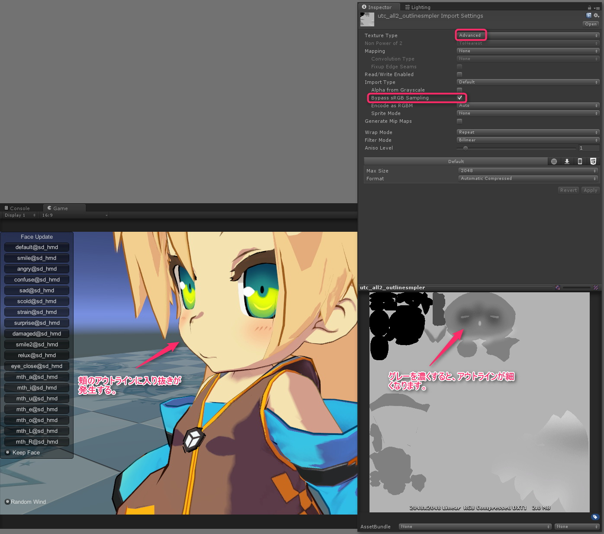

Black means “no lines” and white means that the width is at 100%.  

**Tips：Tips: When you are using Outline Sampler for multiple characters, by unifying the UV position of each character’s parts, you can adjust the the start and end of outlines easier. **

---
### ● Tracing baked vertices normals ：**Baked Normal for Outline**

You can now read normal maps that have vertices normals baked on to them additionally when setting the inverted outlines. By using this you can give hard-edged objects soft-edged outlines according to the baked normal maps.  

When using baked normal maps, set UTS2’s outline setting properties to.  

1. Outline Mode as **"Normal Direction"**
2. Use Baked Normal for Outline as **"Active"**
3. Apply the map that you want to use to  Baked Normal for Outline

Normal maps that can be used as Baked Normal for Outline are as follows.  

1. Does not overlap with the UV of the object that it will be applied to. This means that it is **essential that UV expansion and all normals maps will not overlap**.
2. Normal maps are based on OpenGL, as Unity is.  
3. The texture settings of normal maps are as follows:

・Set Texture Type to  **"Default"** . **Note: Do not set this to “Normal Map”**  
・Make sure that sRGB (Color Texture) is turned **"OFF"**.  

For more please check the assets in the Baked Normal folder of the sample project.  

**Note: This kind of vertex normal adjusting is done by the vertex shader, so it will depend on the  number of vertices that it will be applied to.** This means that it does not correct the vertex normals like pixel shader, so please be careful.  

---
### ● Moving the outline away from the camera：**Offset Outline with Camera Z-axis**

By inputting a value in `Offset Outline with Camera Z-axis` , you can offset the outline in Z direction.  
You can use this when your model has spikey hair to adjust the outlines of the spikes.  
In normal situations, please set this to 0.  

---
## 10. “LightColor Contribution to Materials” Menu

This menu collects switches that can individually turn ON/OFF “the influence of color of real time light”(LightColor Contribution) in the scene for each color.  
In the case of `Active`, the effect of the color of the real time light on each color is effective, and in the case of `Off`, the setting color of each color when the intensity = 1 is displayed as it is.  

From this menu you can centrally manage the presence / absence of light color contribution to each color.  
While actually using the character lights used in the scene, you can see in real-time how the effect on each color will change with / without light contribution. It is a good idea to use it to finish the look-dev.  

| `Item` | Function | Property |
|:-------------------|:-------------------|:-------------------|
| `Base Color` | Applies the light color to the Base Color. | _Is_LightColor_Base |
| `1st ShadeColor` | Applies the light color to the 1st Shade Color. | _Is_LightColor_1st_Shade |
| `2nd ShadeColor` | Applies the light color to the 2nd Shade Color. | _Is_LightColor_2nd_Shade |
| `HighColor` | Applies the light color to the High Color. | _Is_LightColor_HighColor |
| `RimLight` | Applies the light color to the RimLight Color. | _Is_LightColor_RimLight |
| `Ap_RimLight` | Applies the light color to the Ap_RimLight Color. | _Is_LightColor_Ap_RimLight |
| `MatCap` | Applies the light color to the MatCap Color. | _Is_LightColor_MatCap |
| `AngelRing`  | Applies the light color to the AngelRing Color. | _Is_LightColor_AR |
| `Outline`  | Applies the light color to the Outline Color. The contribution of the light color to the outline is: When "OFF", the color set for the outline color is displayed as it is. When "Active with 1 realtime directional light in the scene", the outline color responds to the color and brightness of the realtime directional light. When "There is no real-time directional light in the scene at the time of Active", the outline color responds to the color and brightness of Color in the Source of Environment Lighting. **At this time, please note that the value of Color is referenced even if you are using Skybox. In addition, please be careful as it does not react to ambient light other than real-time point light and color.** | _Is_LightColor_Outline |

**※ Hint: Turning off any color switch will cause that color’s Light Intensity to be set to 1 with a light color of white, regardless of the strength of other lights in the environment.**  

---
## 11. “Environmental Lighting Contributions Setups” Menu

In this menu, adjust the response of the UTS 2 to “the ambient light setting”(Environment Lighting including Skybox, Gradient and Color) and the light probe in the scene, and adjust the brightness of the shader built-in light that starts up in an environment where there is no real-time directional light Items are included.  
It is also possible to control ON/OFF of the white jump prevention function like **SceneLights Hi-Cut Filter**, which is **a useful function for VRChat users**, from this menu.  

| `Item` | Function | Property |
|:-------------------|:-------------------|:-------------------|
| `GI Intensity` | By setting `GI Intensity` to 0 or higher, it will deal with the GI system within Unity’s Lighting window, especially [Light Probe](https://docs.unity3d.com/Manual/LightProbes.html).  When `GI Intensity` is 1, the GI intensity will be 100%. | _GI_Intensity |
| `Unlit Intensity` | When there is no real-time directional light in the scene, the scene’s brightness and color will be determined by [Environment Lighting’s Source Settings](https://docs.unity3d.com/Manual/lighting-window.html), boost it by `Unlit Intensity` and use it as a light source (This is called **Ambient Blending**). The default is 1 and 0 is to turn it off completely. This is used when you want to have the environment color blend with the material color, **but if you want it to be a darker blend, set it to 0.5～1 and if you want it to be a lighter blend, set it to 1.5～2.** | _Unlit_Intensity |
| `SceneLights Hi-Cut Filter` | This will minimize overexposure when the light intensity is too high, or when there are multiple real-time directional lights, or multiple real-time point lights. By turning this one you can maintain the light colors and its attenuations while only cutting the intensity of the material color to avoid overexposure. The default is `OFF`. When using this function, please make sure that the basic 3 colors are `Active` in “LightColor Contribution to Materials” menu. **We recommend VRChat users to turn this on**. Hint: If overexposure still occurs even when this is turned on, please check the post-effect bloom settings. (In particular, when Bloom’s threshold value is under 1, it is easier to happen.) | _Is_Filter_LightColor |
| `Built-in Light Direction` | For experienced users, you can activate the Built-in Light Direction’s vector (the vector of the virtual lights in the shader). When this is activated, the intensity and color of the light will follow the real-time directional light’s values within the scene. If there aren’t lights like that, the values for ambient blending will be used. | _Is_BLD |
| Built-in Light Direction Settings | Built-in Light Direction Settings below. |  |
| `Offset X-Axis Direction` | Moves the virtual lights left and right that are spawned by the built-in light direction vector left and right . | _Offset_X_Axis_BLD |
| `Offset Y-Axis Direction` | Moves the virtual lights that are spawned by the built-in light direction vector up and down. | _Offset_Y_Axis_BLD |
| `Inverse Z-Axis Direction` | Moves the virtual lights that are spawned by the built-in light direction vector back and forwards. | _Inverse_Z_Axis_BLD |

---

### ● Decide the light probe’s brightness ：GI Intensity

<small>**↑ Left：GI Intensity = 0、Right：GI Intensity = 1. When the value of GI Intensity goes up, the light probe’s color will be added to the material color.**</small>  

<small>**↑ This is an example of a baked point light and a light probe that is positioned on a stage. There is no problem for baked lights overlapping in each range. Line light probes from the top to bottom of Unity-chan.**</small>  

By setting  ’GI Intensity’ to 0 and above, it will be compatible with GI systems like light probes.  
Light probes that are baked in a scene with other baked lights will be added to the material color as a complementary color. When is at 1, the color that is baked into light probes is added 100%. When it is set to 0, it is the color of the material color.  

<small>**↑ GI Intensity = 0**.</small>  

<small>**↑ GI Intensity = 1**.</small>  

---

### ● Adjusting the ambient blending：Unlit Intensity  

The ambient light settings are now reflected in the light colors. The minimum intensity of the directional light is the setting of the scene`s ambient light.  
In VRChat, the brightness of ambient light can be adjusted with the Unlit_Intensity slider.  
Unlit_Intensity boosts the brightness of the ambient light.  
The default is 1.  

If there is no directional light in the scene, the default light that is included in the shader is used, and the direction is always according to where the camera is.  
As a result,lighting is always good where the camera is pointed at.  
This light will function when the ambient light is blended.  

This is a video that explains the Unlit_Intensity function and ambient blending.  

---
### ● Preventing overexposure when there are multiple bright lights in a scene ：SceneLights Hi-Cut Filter  

**SceneLights Hi-Cut Filter**is a very useful function for VRChat users.  
This is a video that explains it in detail.  
It also explains in brief how to set the tone mapper with PPS.  

---
### ● Built-in Light Direction as an advanced feature  

As an advanced feature for experienced users, you can now set the light direction vector that is built into the shader.  
Materials that have Built-in Light Direction activated can have their own light direction vector for shading purposes which is independent of the mesh object’s coordinates. This means that it will have the same effect as having an exclusive fixed light.  
The drop shadow of this part will be used for the directional light in the scene so you can also change how shading and drop shadows look. To set the light color of Built-in Light Direction, use the main directional light settings of the scene.  

Please watch this video about how to use Built-in Light Direction.  

