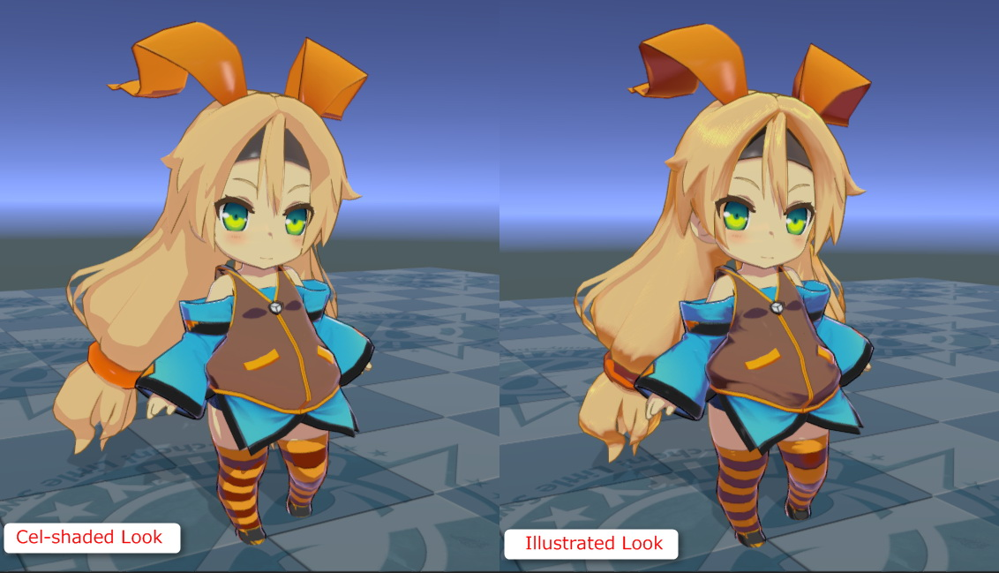
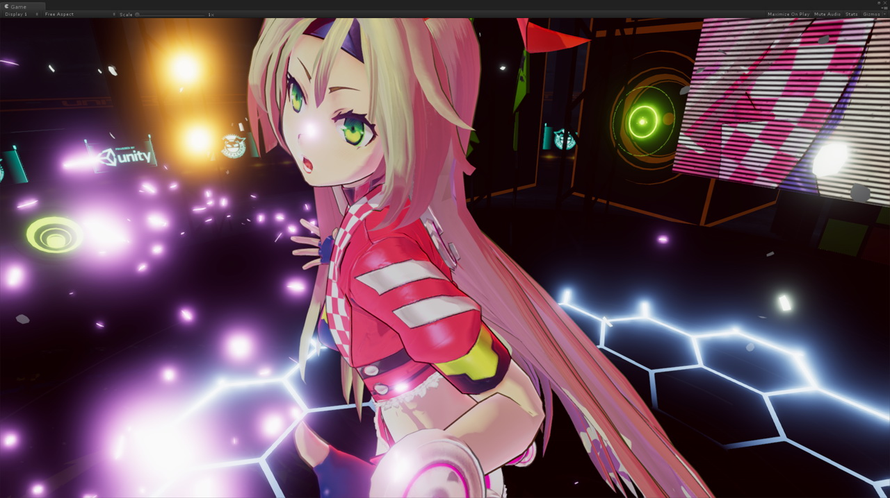
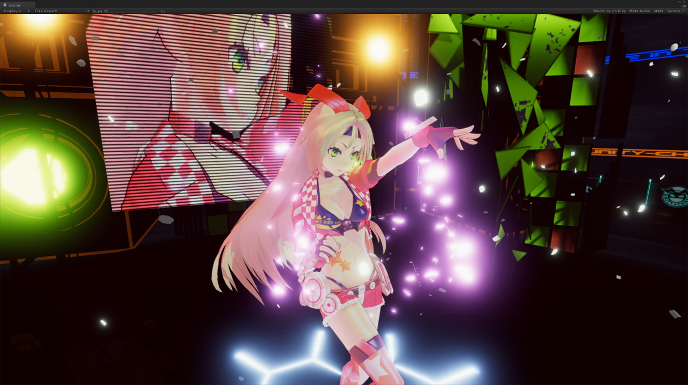
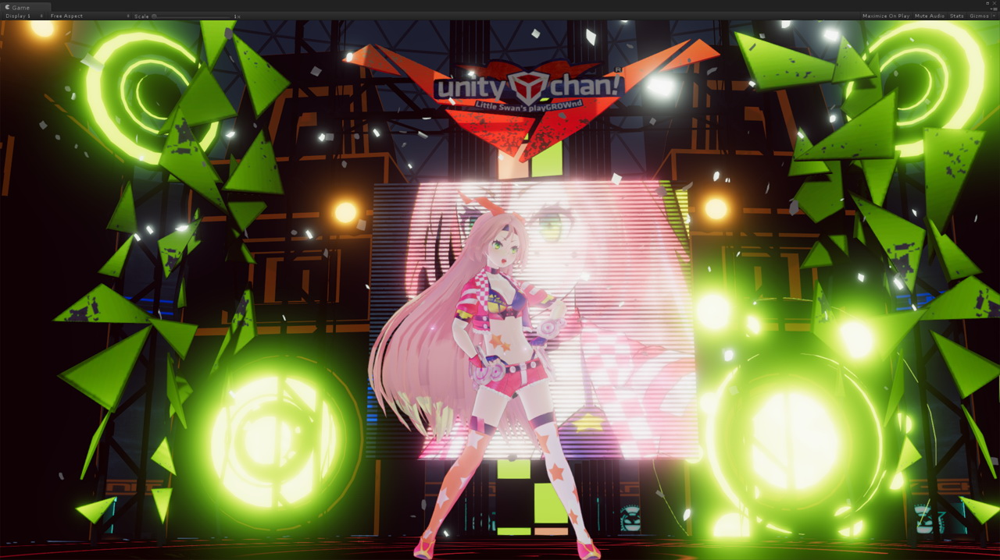
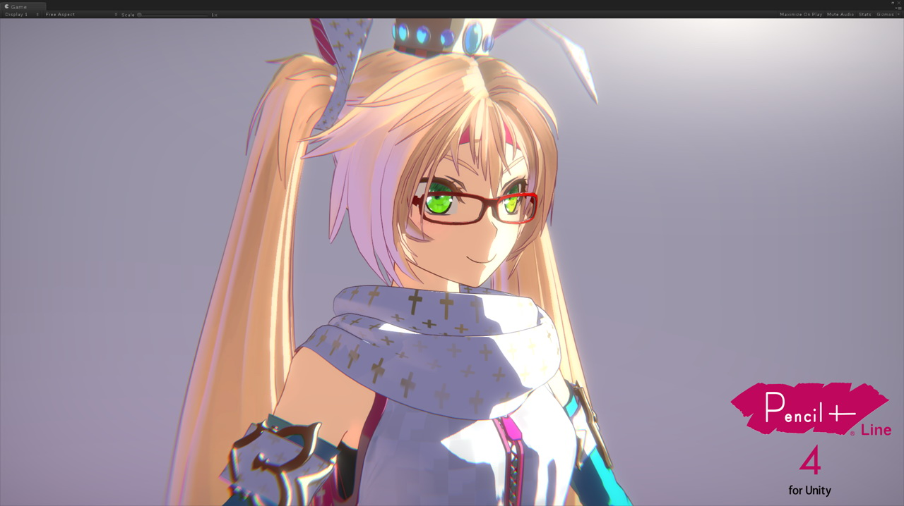
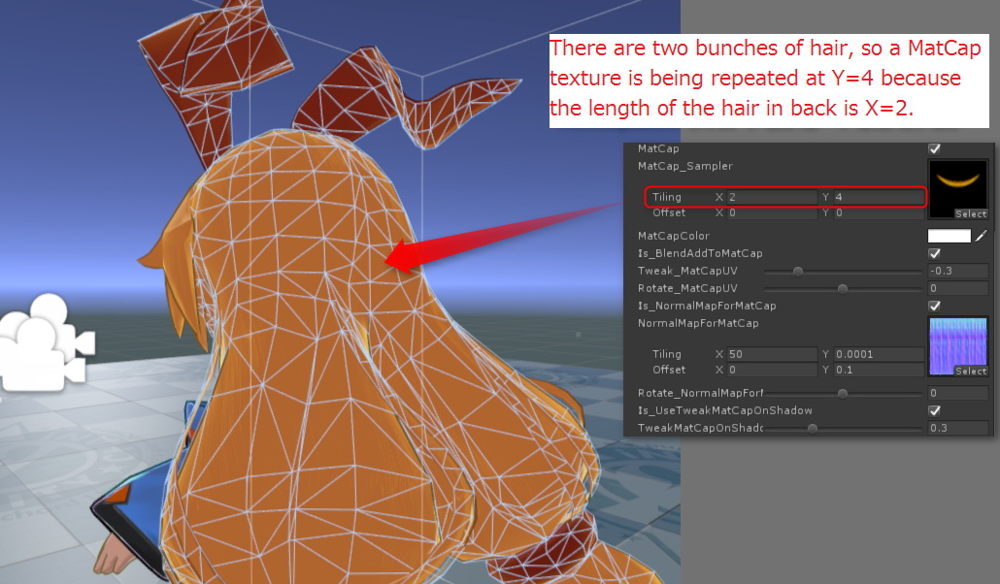
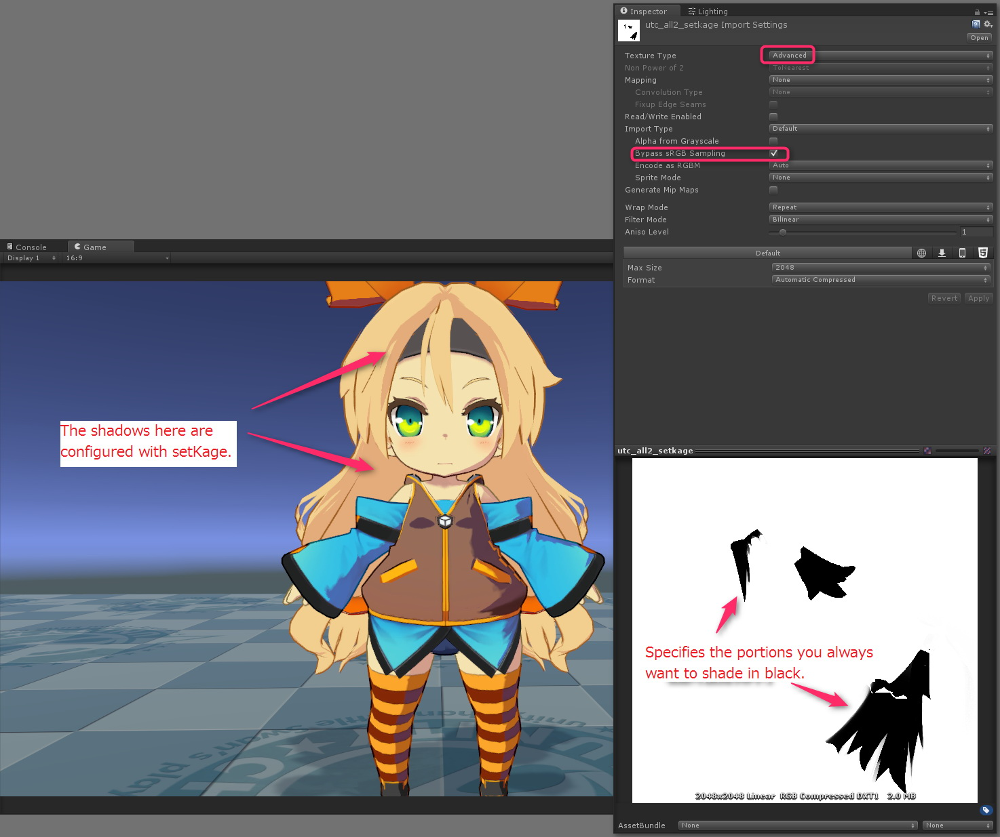
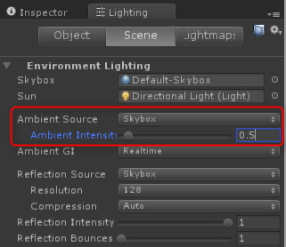
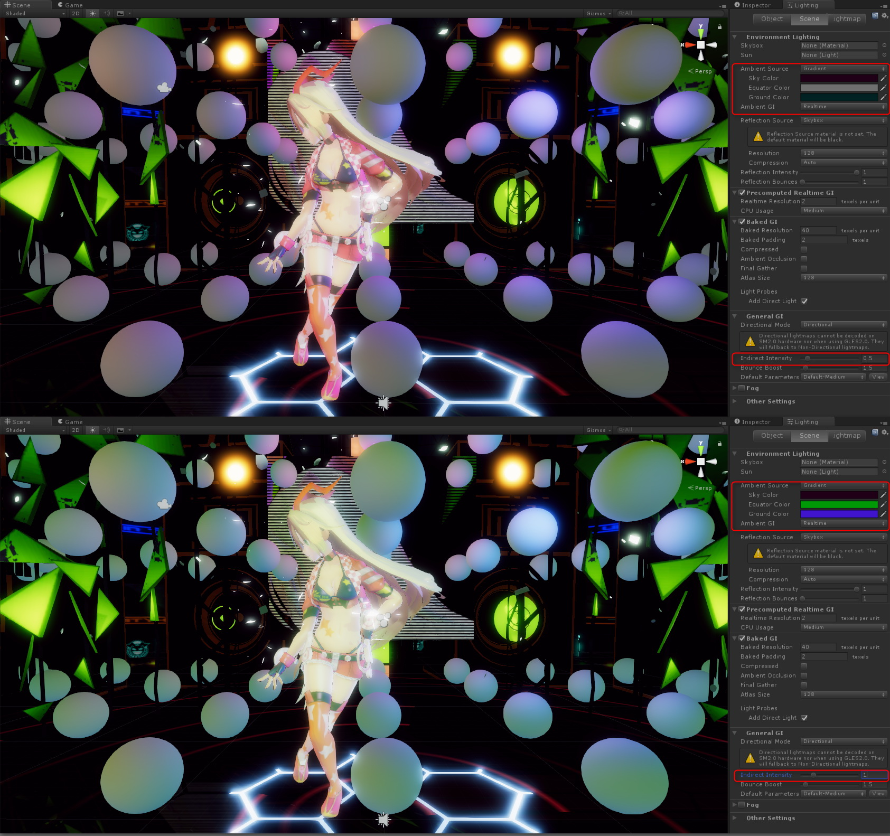
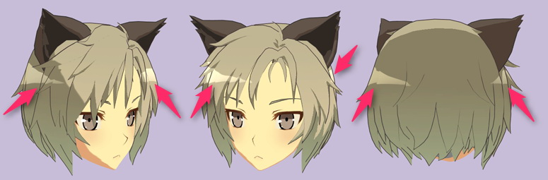

# Unity-Chan Toon Shader Ver. 2.0 Manual

### Nobuyuki Kobayashi (Unity Technologies Japan), June 25, 2017

# 【What is the Unity-Chan Toon Shader?】
Unity-Chan Toon Shader is a toon shader for images and video that is designed to meet your needs when creating cel-shaded 3DCG animations.  
We configured it so you can easily produce all essential shadows, such as shadows that accentuate the form of every part of a character model, without having to worry about the position and intensity of light sources in character design. You can also use shadow color settings to make it easy for the person responsible for color design to create shadows. All of this is thanks to the fact that the Toon Shader is designed for creating cel-shaded 3DCG animations.  

We have greatly enhanced performance in Unity-Chan Toon Shader Ver. 2.0.  
It still has the same rendering capabilities as Ver. 1.0, but you can now create an even more sophisticated look.  

---
## 【Development Environment】
Unity-Chan Toon Shader was developed with Unity 5.6.3p1 and confirmed that it can be available for the latest Unity 2018.x. (With legacy pipeline only, SRP is not currently supported.)  

---
## 【Target Environment】
Require Unity 5.6.x or lator. It can be available for Unity 2018.1.0f2 or lator.  
This unitypackage is created with Unity 5.6.3 p1.  

We recommend using the toon shader with Forward Rendering, and Linear color space.  
(You can also use it with Gamma color space, but the gradient change of shadows tends to be more intense. Please read [Linear or gamma workflow](https://docs.unity3d.com/2018.2/Documentation/Manual/LinearRendering-LinearOrGammaWorkflow.html)  more precisely.)  

---
## 【Shader Characteristics】
### Unity-Chan Toon Shader allows you to do the following.  
* Adjust the thickness of outlines with textures 
* Specify areas you always want to be shadows with textures 
* Adjust the blur where the normal color and shadow color meet 
* Change the distribution area of the shadow color without changing the light position

### We have also added support for the resources below in Unity-Chan Toon Shader Ver. 2.0.  

* Support for Unity's system shadow added. You can use Receive Shadows and Cast Shadows.  
* You can have as many light colors as possible in Forward Rendering. Support added for realtime point lights, in addition to directional lights, which were mainly used to set the look.  
* Now you can designate common colors (bright colors)/1st shade/2nd shade +high color,and gradate the border between common color (bright color)/1st shade, and between 1st shade/2nd shade.  
Each of those items can have a position map that can assign a fixed position independent from the lighting.  
* You can adjust the width of the outline based on its distance from the camera.
* You can now use the specular mask for MatCap by attaching a normal map special to MatCap.
* Added an adjustment function for MatCap.
* You can now use material segmenting through the clipping mask.
* You can now process the transparency of the parts of a model specified by the stencil mask.
* The "Toon_ShadingGradeMap.shader" groupe is added as the extended standard toon shader.
* Support for Unity GI System Added (Light Probe, Ambient Source, etc.).
* Support added for outline offset.
* Added an AngelRing feature.
* Can control whether the light color affects each color individually.
* Added the Tweak_SystemShadowsLevel slidor.  
You can adjust the level on Unity's system shadow side using this slider.
* Added the new properties,RimLight_InsideMask and RimLight_FeatherOff. Can control to rim light more better.  
* Officially responded to Nintendo Switch, PlayStation 4 platforms.
* LightDirection_MaskOn, Add_Antipodean_RimLight and others, the function of rim light has been further strengthened.
* Added ARSampler_AlphaOn to AngelRing features.
* Attached the lightweight version for mobile platforms.
* Change the blend method of GI lighting to Blend(Screen).
* The high color mask (Set_HighColorMask) and the rim light mask (Set_RimLightMask) are implemented now.

---
## 【Sample Scene】
When you open this project, there are the following sample scenes.  

* BoxProjection.unity: For lighting settings to dark room using Box Projection  
* ToonShader.unity: Illustration-like shader settings  
* ToonShader_CelLook.unity: Cellook Shader settings  
* ToonShader_Emissive.unity: Shader settings using Emissive  
* ToonShader_Firefly.unity: built-in light and multiple real-time point lights  
* Baked Normal / Cube_HardEdge.unity: Reference of Baked Normal  
* Sample / Sample.unity: Introduction of basic shaders of UTS2  
* ShaderBall / ShaderBall.unity: Set UTS2 using shader ball  
* PointLightTest / PointLightTest.unity: Sample of CelLook style using point lights  
* SSAO Test / SSAO.unity: For testing SSAO in PPS  

Each and every scenes are for reference of shader and lighting settings.  
They will be useful for reference of the look and scene you want to make!  

---
## 【Initial Project Settings】

From: File>Build Settings>Player Settings  
Select “Rendering Path⇒`Forward`”  
And “Color Space⇒`Linear`” (recommended)  

---
## 【Description of Toon Shader Properties】

---
| `Property name`  | Function |
|:-------------------|:-------------------|
| `Stencil No` | Use in the `_StencilMask`/`_StencilOut` shader. Specifies the stencil reference number. |
| `CullMode` | Specifies culling. `OFF` (double-sided drawing)/`FRONT` (front-face culling)/`BACK` (back-face culling) |
| `ClippingMask` | Use in the `_Clipping` shader. Specifies the clipping mask. Removes white. |
| `IsBaseMapAlphaAsClippingMask` | This property is only available in the `_TransClipping` shader. You can use the alpha channel included in the `BaseMap` as a clipping mask by selecting this property. If you do that, you do not need to specify anything in the `ClippingMask`. |
| `Clipping Level` | Specifies clipping mask strength. |
| `Inverse_Clipping` | Inverts the clipping mask. |
| `Tweak_transparency` | Use in the `_TransClipping` shader. Considers the grayscale of the clipping mask to be alpha, and adjusts transparency. |
| `BaseMap` | Specifies base color (light color) textures. |
| `BaseColor` | Color multiplied by `BaseMap`. Use as the configuration for the base color (light color) when only specifying the color, not the texture. |
| `Is_LightColor_Base` | Activates the light color against the base color. |
| `1st_ShadeMap` | Specifies 1st shade color texture. |
| `1st_ShadeColor` | Color multiplied by `1st_ShadeMap`. Use as the configuration for 1st shade color when only specifying the color, not the texture. |
| `Is_LightColor_1st_Shade` | Activates the light color against 1st. shade color. |
| `2nd_ShadeMap` | Specifies 2nd shade color texture. |
| `2nd_ShadeColor` | Color multiplied by `2nd_ShadeMap`. Use as the configuration for 2nd shade color when only specifying the color, not the texture. |
| `Is_LightColor_2nd_Shade` | Activates the light color against 2nd shade color. |
| `NormalMap` | Specifies the normal map. |
| `Is_NormalMapToBase` | Select when you want to reflect a normal map in colors. Reflects the geometric form of an object as is when deselected. |
| `Set_SystemShadowsToBase` | Specifies when Unity's system shadow is in use. Always select when you want to use Receive Shadows. (You also have to have `Receive Shadows` selected in Mesh Renderer at the same time.) |
| `Tweak_SystemShadowsLevel` | An adjustment tool that is enabled when `Set_SystemShadowsToBase` is set to ON. It adjusts Unity's system shadow level. The default is 0, and you can adjust it in increments of 0.5. Use it when you want to further adjust colors after deciding on the different color levels with `BaseColor_Step`/`1st_ShadeColor_Step`, or when you want to fine tune self shadow and other ReceiveShadow effects. |
| `BaseColor_Step` | Sets the tonal level of the base color (light color) and shade color. |
| `Base/Shade_Feather` | Interpolates the border between the base color (light color) and shade color. |
| `Set_1st_ShadePosition` | Distributes the position map independent from the lighting when you want to forcefully specify the position of 1st shade. Specifies portions you always want to shade in black. |
| `ShadeColor_Step` | Sets the tonal level of 1st shade and 2nd shade per the shade color area. Please set 2nd shade to zero if you are not using it. |
| `1st/2nd_Shades_Feather` | Gradates the border between 1st shade and 2nd shade. |
| `Set_2nd_ShadePosition` | Distributes the position map independent from the lighting when you want to forcefully specify the position of 2nd shade. Specifies portions you always want to shade in black. (This also affects the position map of 1st shade.) |
| `HighColor` | Specifies the color that specifies high color. Please set to `black(0,0,0)` if you are not using it. Note that it moves per the direction of the light source. |
| `Is_LightColor_HighColor` | Activates the light color against the high color. |
| `Is_NormalMapToHighColor` | Select when you want to reflect a normal map in the high color area. Reflects the geometric form of an object as is when deselected. |
| `HighColor_Power` | Sets the size/intensity of the high color area. |
| `Is_SpecularToHighColor` | Draws the high color area as specular (glossy). Draws the border of the high color region in a circle if deselected. |
| `Is_BlendAddToHiColor` | Further synthesizes high color. |
| `Is_UseTweakHighColorOnShadow` | Activates TweakHighColorOnShadow slider. |
| `TweakHighColorOnShadow` | Adjusts the intensity of the high color in shadows. |
| `Set_HighColorMask` | Mask the high color area according to the UV coordinate. White makes set the high color area as 100%, and Black makes set it as 0%. You do not have to configure this if you do not need it. |
| `Tweak_HighColorMaskLevel` | Adjusts the level of the High Color Mask. The default value is zero. |
| `RimLight` | Activates rim light. |
| `RimLightColor` | Specifies the rim light color. |
| `Is_LightColor_RimColor` | Activates the light color against the rim color. |
| `Is_NormalMapToRimLight` | Select when you want to reflect a normal map in rim light. Reflects the geometric form of an object as is when deselected. |
| `RimLight_Power` | Specifies the power of the rim light. |
| `RimLight_InsideMask` | Sepcifies the power of the inside mask against rim light. |
| `RimLight_FeatherOff` | Cuts the feather of rim light. |
| `LightDirection_MaskOn` | Genelates rim light only in the light direction. |
| `Tweak_LightDirection_MaskLevel` | Adjusts the level of the rim mask in the light direction. |
| `Add_Antipodean_RimLight` | Add rim light(AP-rim light) in the antipodean zone from the light direction.  |
| `Ap_RimLightColor` | Specifies the AP-rim light color. |
| `Is_LightColor_Ap_RimLight` | Activates the light color against the AP-rim color. |
| `Ap_RimLight_Power` | Specifies the power of the AP-rim light. |
| `Ap_RimLight_FeatherOff` | Cuts the feather of AP-rim light. |
| `Set_RimLightMask` | Mask the rim light area according to the UV coordinate. White makes set the rim light area as 100%, and Black makes set it as 0%. You do not have to configure this if you do not need it. |
| `Tweak_RimLightMaskLevel` | Adjusts the level of the Rim Light Mask. The default value is zero. |
| `MatCap` | Activates MatCap. |
| `MatCap_Sampler` | Sets textures to be used as MatCap. |
| `MatCapColor` | Color multiplied by `MatCap_Sampler`. Can place color in MatCap with MatCapColor if you configured the grayscale image in `MatCap_Sampler`. |
| `Is_LightColor_MatCap` | Activates the light color against MatCap. |
| `Is_BlendAddToMatCap` | Turns the MatCap blend into an added mode when selected. MatCap blend is synthesized in a multiplied mode when deselected. |
| `Tweak_MatCapUV` | Can adjust the MatCap area by expanding and shrinking the `MatCap_Sampler` UV to a circle from its center. |
| `Rotate_MatCapUV` | Rotates the `MatCap_Sampler` UV from a central axis. |
| `Is_NormalMapForMatCap` | Distributes the normal map dedicated to MatCap in MatCap. |
| `NormalMapForMatCap` | Sets the normal map dedicated to MatCap. |
| `Rotate_NormalMapForMatCapUV` | Rotates the UV of the normal map dedicated to MatCap from a central axis. |
| `Is_UseTweakMatCapOnShadow` | Activates Tweak MatCapShadow slider. |
| `Tweak MatCapOnShadow` | Adjusts the strength of the MatCap area in shadows. |
| `Outline_Width` | Sets the width of the outline. |
| `Farthest_Distance` | Specifies the farthest distance when the width of the outline changes with the distance between the camera and the object. The outline value becomes zero with this distance. |
| `Nearest_Distance` | Specifies the nearest distance when the width of the outline changes with the distance between the camera and the object. The outline value becomes the maximum width set in `Outline_Width` with this distance. |
| `Outline_Sampler` | Specifies where you want to change the thickness of the outline width, or the specific parts of the model where you do not want to place an outline with an outline sampler (texture). White is the thickest width, and black is the thinnest width. You do not have to configure this if you do not need it. |
| `Outline_Color` | Specifies the outline color. |
| `Is_BlendBaseColor` | Select when you want to blend the outline color in the base color of the object. |
| `Offset_Camera_Z` | Offset the outline in the direction of the Z axis of the camera. If you have shapes similar to spikey hair, you can make the outline of the spikes less noticeable by putting a positive value in this field. Place a 0 in the field to return to the default setting. |
| `GI_Intensity` | Select when you want to use Unity's Global Illumination (GI) system, which is controlled in the Lighting Window, by setting the `GI_Intensity` shader property above 0.  The intensity of GI is 100% when `GI_Intensity` is set to 1. |

---
## 【Strengthening the function of rim light】

The light direction mask was added to Rim Light. By using the mask, it is now possible to individually specify the color of the rim light in the direction of the light source and vice versa.  
If you also want to cut the rim light in the light direction and want to generate rim light only in the antipodean (opposite) direction to the light direction, please set the color of the rim light in the light direction to `Black (0, 0, 0)`.  

## 【Making Material Transparent with a Stencil】

---
## 【Distributing Multiple Materials Made with a Clipping Mask 】

Set the necessary value for the size of the Materials in the Skinned Mesh Renderer, and set that value to each Element when distributing multiple materials in the `_Clipping` Shader.  

---
## 【_TransClipping Shader】

Most of the functions in the `_TransClipping` Shader are the same as in the `_Clipping` Shader, but it typically considers the grayscale of the clipping mask to be alpha.  
Use when thinning out the tip of a tuft of thin, rectangular hair that is considered to be alpha in the mask, and for animating frizz, etc.  
You can adjust transparency in the `Tweak_Transparency` Slider.  

---
## 【Tips for Pasting Textures for MatCap】

---
## 【Textures Used in Outline Sampler】

Black means there is no line. White means the line width is at 100%.  
Generates varying thickness (thick or thin) in an outline by setting the appropriate Outline Sampler.  
You can generally control the thickness in the Outline Sampler by standardizing the UV of the parts of each character.  

---
## 【Position Map that Specifies Where You Want to Cast Shadows】

You can specify where you want to cast shadows independently from lighting with the position map.  
You can add shadows in addition to lighting whenever you want to add a special shadow to an individual scene, or place additional shadows in a scene.  
**※Tip: It might be better to create the shadow position yourself using a 3D painter like Substance Painter.  

---
## 【Mutual Actions in 1st Shade and 2nd Shade Position Maps】

Stack and specify the 1st shade and 2nd shade position maps when you want to constantly display 2nd shade independent from the lighting and shadow conditions.  
2nd Shade is also constantly displayed inside of shadows in the 2nd shade area.  
In bright areas, meanwhile, 2nd shade is only displayed on the inside of a shadow (this is specified on the 2nd shade position map, but is an area outside of the 1st shade position map).  

---
## 【Another Shader Group : Toon_ShadingGradeMap.shader】

The standard toon shader for Unity-Chan Toon Shader Ver. 2.0 is called `Toon_DoubleShadeWithFeather.shader`. But there is also an extended shader called `Toon_ShadingGradeMap` that allows you to control where to place even more shadows with UV coordinate units if you use the `Shading Grade Map`, which was made using the features of the standard shader.  

You can control how easy it is to place 1st shade or 2nd shade with UV units by adding the `Shading Grade Map` (an incline map for adding shading) to the regular toon shader.  
Using this map allows you to adjust how easy it is to cast partial shadows, so you can create animations where shadows show on wrinkles in clothes and disappear when illuminated.  
In the example image, 2nd shade is the black part on the `Shading Grade Map`. How the shadow is cast changes based on how dark the gray parts of the map are.  
A shadow also appears between the border of two different gray areas, because it is easier to cast a shadow with a really dark gray.  

It will be easier to cast shadow using lighting if you make the `Shading Grade map` from a reverse clipping map, such as an Ambient Occlusion map.  
This is useful for shadows that follow the shape of bangs, and for the concave parts of the wrinkles in clothes.  

Be aware that there is no position map option for 1st shade or 2nd shade in this shader.  
We have also added the following properties. (Properties with the same name are the same as in the standard toon shader.)  

---
| `Property Name` | Function !
|:-------------------|:-------------------|
| `ShadingGradeMap` | Specifies the Shading Grade Map with gray scale. |
| `Is_1st_ShadeColorOnly` | Select if you only want to use 1st shade color. |
| `1st_ShadeColor_Step` | Sets the tonal level of the base color (light color) and 1st shade color. |
| `1st_ShadeColor_Feather` | Interpolates the border between the base color (light color) and 1st shade color. |
| `2nd_ShadeColor_Step` | Sets the tonal level of 1st and 2nd shade colors. |
| `2nd_ShadeColor_Feather`| Gradates the border between 1st and 2nd shade colors. |

---
## 【GI System Support】
You can use Unity's Global Illumination (GI) system, which is controlled in the Lighting Window, by setting the `GI_Intensity` shader property above 0.  
GI intensity is 100% when `GI_Intensity` is set to 1.  
GI Blend (as Screen mode) to toon color as an environment light.  
You can use a baked Light Probe, and the `Skybox`, `Gradient`, and `Color` options in the `Ambient Source` property in Unity's Lighting Window with GI as the light source.  

Please use **one of the settings** below, **if you do not wish to show the toon color with GI**.  

* Set `GI_Intensity` to `0`.
* Set `Ambient Intensity` in Unity's Lighting Window to `0`.
* Set the `Color` option in `Ambient Source` in Unity's Lighting Window to `black (RGB = 0/0/0)`.

---
## 【About Offset_Camera_Z】

Offset the outline in the direction of the Z axis of the camera by placing a positive value in the `Offset_Camera_Z` field.  
Use this to adjust the appearance of outlines when you have shapes similar to spikey hair, like in the image below.  
Place a 0 in the field to return to the default setting.  

---
## 【AngelRing Feature】

There are multiple shaders in `UnityChanToonShader/AngelRing` or `UnityChanToonShader/NoOutline/AngelRing` that support the AngelRing feature.  

AngelRing is a highlight renderer. It produces the effect seen in the image below. The highlights always appear in a fixed position from the view of the camera.  

You will need two UVs for the Angel Ring highlight, in addition to the hair mesh you will apply and the UV for normal textures, in order to use this feature.  

The UV for AngelRing, in contrast with a conventional hair texture UV, creates the effect with a planar projection on the entirety of the hair the AngelRing is applied to from the front side of the character.  

**※These tasks including creating UV 2 are done with DCC tools such as Maya, 3ds Max, Blender.**  

Draw the texture for the highlighted parts with the AngelRing UV as a guide. Synthesize the color of the highlighted parts by adding to the original color values.  
Register the texture you created to `AngelRing_Sampler`.  
You can also draw the highlights in white, then add color to them later with `AngelRing_Color`.  

---
### The properties for the AngelRing feature are below.  

---
| `Property name` | Function |
|:-------------------|:-------------------|
| `AngelRing` | Activates AngelRing feature. |
| `AngelRing_Sampler` | Specifies the AngelRing texture. |
| `AngelRing_Color` | Specifies the color multiplied to the AngelRing. |
| `AR_OffsetU` | Finely adjusts the AngelRing display in the lengthwise direction. |
| `AR_OffsetV` | Finely adjusts the Angel Ring display in the widthwise direction. |
| `Is_LightColor_AR` | Activates the light color against the AngelRing. |
| `ARSampler_AlphaOn` |  You can use the alpha channel included in the AngelRing texture as a clipping mask by selecting this property.  |

If you check `ARSampler_AlphaOn`, you can use the alpha channel of "Angel's Ring" texture as clipping mask, as shown below.  
You can specify directly the color of "Angel's Ring" instead of adding.  

---
## 【Check Box that Activates Light Color for Each Color】

`Is_LightColor_Base` and other `Is_LightColor_***ColorName***` check box options with a color's name attached to the end are options that change whether the light color of the directional light, which is the main light, affects each color.  
Changing whether the light color affects any of the other colors makes it possible for you to create more complicated lighting.  
The example below only shows a red light color affecting the color of the shadow.  
If you open the door on the same side as the camera, the red light that pours through from the door illuminates Unity-chan.  

---
## 【Light Linking】
When creating a cel-shaded look, you will sometimes finely adjust the lighting (light linking) of each part of a model in a scene by using a directional light differently for each part.  

You can change the light in each part by preparing the necessary number of layers when light linking in Unity.  
You will find an example of light linking below.  

In this example, the Directional Light_MainLight is only illuminated in the mesh belonging to the MainLight layer.  
Please use light linking carefully, because certain settings can make Receive Shadow and other properties ineffective.  
Also note that you do not need to use link lighting for games.
This particular setting is primarily intended for video.  

---
## 【Using Video (Pre-Render)】
You have a better chance of making a beautiful video (native supersampling) when using pre-render by disabling the Antialiasing Image Effect and compressing the size used in FrameCapturer for items with a 4K output (native supersampling).  

You can download **FrameCapturer** using the following link.  
https://github.com/unity3d-jp/FrameCapturer  
You can use FrameCapturer output results in NUKE and AfterEffects.  

It is also a good idea to use **Alembic Importer/Exporter** for videos.  
https://github.com/unity3d-jp/AlembicImporter  

---
## 【Using on mobile platforms】

For mobile platforms, added a lighter-weight version that almost does not change the look.  
In the mobile version, it is limited to the following specifications.  

* Limited to using of only one directional light (**you cannot use real time point lights in this version**).  

Thanks to property compatible with the standard version toon shader, rendering performance improves when switching from the standard version when the above functions are sufficient.  

---
## 【License】
Unity-Chan Toon Shader 2.0 is provided under the **Unity-Chan License 2.0** terms.  
Please refer to the following link for information regarding the Unity-Chan License.  
http://unity-chan.com/contents/guideline_en/  

---
# Unity-Chan Toon Shader Ver. 2.0 Supplementary Manual
## Reducing Artifacts Generated at the Border between Unity's System Shadow and Custom Lighting

How to Reduce Artifacts Generated at the Border between Unity's System Shadow and Custom Lighting above.  

### 【1: Change to Linear color space】

**Change to Linear color space** if you are in Gamma color space.  
It is usually easier to change the gradation of artifacts in Linear color space.  

### 【2: Increase Mesh Partitioning】

**Mesh partitioning will increase** if all parameters for lighting and shaders are the same.  
Increasing mesh partitioning will cause many artifacts to disappear.  

### 【3: Remove Artifacts by Adjusting BaseColor_Step/Tweak_SystemShadowsLevel 】

The shadow at the border in Fig. 1 was made by the threshold of Unity's system shadow and custom lighting, but it is virtually the same.  
You can tell because the border position of the shadow does not move when you make the shadow this way, even if you disable `Set_SystemShadowsToBase`.  

As you can see in Fig. 1, you generate artifacts (Fig. 2) by moving the `Base/Shade_Feather` slider to the right when you have a shadow.  
These artifacts are generated **because the custom lighting shadow threshold is cutting into Unity's system shadow**.

When this happens, you can **increase the shadow areas the custom lighting creates** by also **moving the `BaseColor_Step` slider to the right**, like in Fig. 3.  
This helps reduce artifacts to an acceptable amount, and creates border gradation.  

You can also reduce artifacts by **adjusting the level on the system shadow side using the `Tweak_SystemShadowsLevel` slider**, too.  
**※We recommend you to try from here first.**  

### 【4: Increase Directional Light Bias】

Finally, you can reduce artifacts by **increasing the bias of a directional light** that illuminates a ball as key light.  
This is because the system shadow position changes when increasing bias.  
But, be careful, because if you increase bias too much, the position where the shadow is generated could be quite far from the object itself.  

