# ユニティちゃんトゥーンシェーダー 2.0 v.2.0.9 マニュアル
### 2022/05/23 Nobuyuki Kobayashi (Unity Technologies Japan)
***Read this document in other languages: [English](./UTS2_Manual_en.md)***  

## 2022/06/14：2.0.9 Release：新規機能追加    
* リリース環境を、Unity 2019.4.31f1に変更。Unity 2020.3.x LTS、Unity 2021.3.x LTS、Unity 2022.1.1f1での動作確認。  
* シングルパスインスタンシング レンダリング(ステレオインスタンシングとも呼ばれます)に対応。サポートするプラットフォームは、[Unity マニュアル](https://docs.unity3d.com/ja/2019.4/Manual/SinglePassInstancing.html)を参照してください。  
* 本リリースより、おまけのUTS2イメージエフェクトUnityPackageはサポート外として削除しました。  
* リアルタイムディレクショナルライトがない環境での、拡張アウトラインオブジェクトの環境ライティングへの馴染ませ具合を向上しました。  

# もくじ
<!-- - [【重要】旧バージョンから、直接v.2.0.9へバージョンアップをする場合の注意](./UTS2_Manual_ja.md#%E9%87%8D%E8%A6%81%E6%97%A7%E3%83%90%E3%83%BC%E3%82%B8%E3%83%A7%E3%83%B3%E3%81%8B%E3%82%89%E7%9B%B4%E6%8E%A5v207%E3%81%B8%E3%83%90%E3%83%BC%E3%82%B8%E3%83%A7%E3%83%B3%E3%82%A2%E3%83%83%E3%83%97%E3%82%92%E3%81%99%E3%82%8B%E5%A0%B4%E5%90%88%E3%81%AE%E6%B3%A8%E6%84%8F) -->
- [ユニティちゃんトゥーンシェーダー 2.0 の紹介](./UTS2_Manual_ja.md#%E3%83%A6%E3%83%8B%E3%83%86%E3%82%A3%E3%81%A1%E3%82%83%E3%82%93%E3%83%88%E3%82%A5%E3%83%BC%E3%83%B3%E3%82%B7%E3%82%A7%E3%83%BC%E3%83%80%E3%83%BC-20-%E3%81%AE%E7%B4%B9%E4%BB%8B)
  - [【開発環境】](./UTS2_Manual_ja.md#%E9%96%8B%E7%99%BA%E7%92%B0%E5%A2%83)
  - [【ターゲット環境】](./UTS2_Manual_ja.md#%E3%82%BF%E3%83%BC%E3%82%B2%E3%83%83%E3%83%88%E7%92%B0%E5%A2%83)
  - [【プロジェクト全体のダウンロード】](./UTS2_Manual_ja.md#%E3%83%97%E3%83%AD%E3%82%B8%E3%82%A7%E3%82%AF%E3%83%88%E5%85%A8%E4%BD%93%E3%81%AE%E3%83%80%E3%82%A6%E3%83%B3%E3%83%AD%E3%83%BC%E3%83%89)
  - [【インストールの仕方】](./UTS2_Manual_ja.md#%E3%82%A4%E3%83%B3%E3%82%B9%E3%83%88%E3%83%BC%E3%83%AB%E3%81%AE%E4%BB%95%E6%96%B9)
  - [【UTS2の基本的な設定の仕方】](./UTS2_Manual_ja.md#uts2%E3%81%AE%E5%9F%BA%E6%9C%AC%E7%9A%84%E3%81%AA%E8%A8%AD%E5%AE%9A%E3%81%AE%E4%BB%95%E6%96%B9)
- [UTS2各シェーダーの使い分け](./UTS2_Manual_ja.md#uts2%E5%90%84%E3%82%B7%E3%82%A7%E3%83%BC%E3%83%80%E3%83%BC%E3%81%AE%E4%BD%BF%E3%81%84%E5%88%86%E3%81%91)
  - [UnityChanToonShaderルートフォルダ内のシェーダー](./UTS2_Manual_ja.md#unitychantoonshader%E3%83%AB%E3%83%BC%E3%83%88%E3%83%95%E3%82%A9%E3%83%AB%E3%83%80%E5%86%85%E3%81%AE%E3%82%B7%E3%82%A7%E3%83%BC%E3%83%80%E3%83%BC)
  - [UnityChanToonShader/NoOutlineフォルダ内のシェーダー](./UTS2_Manual_ja.md#unitychantoonshadernooutline%E3%83%95%E3%82%A9%E3%83%AB%E3%83%80%E5%86%85%E3%81%AE%E3%82%B7%E3%82%A7%E3%83%BC%E3%83%80%E3%83%BC)
    - [半透明マテリアル向けのTransparentシェーダー](./UTS2_Manual_ja.md#%E5%8D%8A%E9%80%8F%E6%98%8E%E3%83%9E%E3%83%86%E3%83%AA%E3%82%A2%E3%83%AB%E5%90%91%E3%81%91%E3%81%AEtransparent%E3%82%B7%E3%82%A7%E3%83%BC%E3%83%80%E3%83%BC)
  - [UnityChanToonShader/AngelRingフォルダ内のシェーダー](./UTS2_Manual_ja.md#unitychantoonshaderangelring%E3%83%95%E3%82%A9%E3%83%AB%E3%83%80%E5%86%85%E3%81%AE%E3%82%B7%E3%82%A7%E3%83%BC%E3%83%80%E3%83%BC)
  - [UnityChanToonShader/Mobileフォルダ内のシェーダー](./UTS2_Manual_ja.md#unitychantoonshadermobile%E3%83%95%E3%82%A9%E3%83%AB%E3%83%80%E5%86%85%E3%81%AE%E3%82%B7%E3%82%A7%E3%83%BC%E3%83%80%E3%83%BC)
  - [UnityChanToonShader/Tessellationフォルダ内のシェーダー](./UTS2_Manual_ja.md#unitychantoonshadertessellation%E3%83%95%E3%82%A9%E3%83%AB%E3%83%80%E5%86%85%E3%81%AE%E3%82%B7%E3%82%A7%E3%83%BC%E3%83%80%E3%83%BC)
  - [UnityChanToonShader/Helperフォルダ内のシェーダー](./UTS2_Manual_ja.md#unitychantoonshaderhelper%E3%83%95%E3%82%A9%E3%83%AB%E3%83%80%E5%86%85%E3%81%AE%E3%82%B7%E3%82%A7%E3%83%BC%E3%83%80%E3%83%BC)
- [サンプルシーン](./UTS2_Manual_ja.md#%E3%82%B5%E3%83%B3%E3%83%97%E3%83%AB%E3%82%B7%E3%83%BC%E3%83%B3)
- [プロジェクトの初期設定](./UTS2_Manual_ja.md#%E3%83%97%E3%83%AD%E3%82%B8%E3%82%A7%E3%82%AF%E3%83%88%E3%81%AE%E5%88%9D%E6%9C%9F%E8%A8%AD%E5%AE%9A)
- [UTS2 設定メニュー：UTS2カスタムインスペクター](./UTS2_Manual_ja.md#uts2-%E8%A8%AD%E5%AE%9A%E3%83%A1%E3%83%8B%E3%83%A5%E3%83%BCuts2%E3%82%AB%E3%82%B9%E3%82%BF%E3%83%A0%E3%82%A4%E3%83%B3%E3%82%B9%E3%83%9A%E3%82%AF%E3%82%BF%E3%83%BC)
  - [1. UTS2の基本設定をおこなう「Basic Shader Settings」メニュー](./UTS2_Manual_ja.md#1-uts2%E3%81%AE%E5%9F%BA%E6%9C%AC%E8%A8%AD%E5%AE%9A%E3%82%92%E3%81%8A%E3%81%93%E3%81%AA%E3%81%86basic-shader-settings%E3%83%A1%E3%83%8B%E3%83%A5%E3%83%BC)
    - [VRChatユーザー向けの便利機能について](./UTS2_Manual_ja.md#vrchat%E3%83%A6%E3%83%BC%E3%82%B6%E3%83%BC%E5%90%91%E3%81%91%E3%81%AE%E4%BE%BF%E5%88%A9%E6%A9%9F%E8%83%BD%E3%81%AB%E3%81%A4%E3%81%84%E3%81%A6)
      - [『UTS2でマテリアル設定をはじめる時』](./UTS2_Manual_ja.md#uts2%E3%81%A7%E3%83%9E%E3%83%86%E3%83%AA%E3%82%A2%E3%83%AB%E8%A8%AD%E5%AE%9A%E3%82%92%E3%81%AF%E3%81%98%E3%82%81%E3%82%8B%E6%99%82)
        - [暗いワールドでのキャラの見え方を明るくしたい場合](./UTS2_Manual_ja.md#-%E6%9A%97%E3%81%84%E3%83%AF%E3%83%BC%E3%83%AB%E3%83%89%E3%81%A7%E3%81%AE%E3%82%AD%E3%83%A3%E3%83%A9%E3%81%AE%E8%A6%8B%E3%81%88%E6%96%B9%E3%82%92%E6%98%8E%E3%82%8B%E3%81%8F%E3%81%97%E3%81%9F%E3%81%84%E5%A0%B4%E5%90%88)
      - [『UTS2で設定したアバターをパブリッシュする時』](./UTS2_Manual_ja.md#uts2%E3%81%A7%E8%A8%AD%E5%AE%9A%E3%81%97%E3%81%9F%E3%82%A2%E3%83%90%E3%82%BF%E3%83%BC%E3%82%92%E3%83%91%E3%83%96%E3%83%AA%E3%83%83%E3%82%B7%E3%83%A5%E3%81%99%E3%82%8B%E6%99%82)
  - [2.「Basic Three Colors and Control Maps Setups」メニュー](./UTS2_Manual_ja.md#2-basic-three-colors-and-control-maps-setups%E3%83%A1%E3%83%8B%E3%83%A5%E3%83%BC)
    - [「NormalMap Settings」サブメニュー](./UTS2_Manual_ja.md#normalmap-settings%E3%82%B5%E3%83%96%E3%83%A1%E3%83%8B%E3%83%A5%E3%83%BC)
    - [「Shadow Control Maps」サブメニュー](./UTS2_Manual_ja.md#shadow-control-maps%E3%82%B5%E3%83%96%E3%83%A1%E3%83%8B%E3%83%A5%E3%83%BC)
      - [ポジションマップ（DoubleShadeWithFeather系シェーダー）](./UTS2_Manual_ja.md#doubleshadewithfeather%E7%B3%BB%E3%82%B7%E3%82%A7%E3%83%BC%E3%83%80%E3%83%BC%E3%81%AE%E5%A0%B4%E5%90%88)
      - [シェーディンググレードマップ（ShadingGradeMap系シェーダー）](./UTS2_Manual_ja.md#shadinggrademap%E7%B3%BB%E3%82%B7%E3%82%A7%E3%83%BC%E3%83%80%E3%83%BC%E3%81%AE%E5%A0%B4%E5%90%88)
  - [3.「Basic Lookdevs : Shading Step and Feather Settings」メニュー](./UTS2_Manual_ja.md#3basic-lookdevs--shading-step-and-feather-settings%E3%83%A1%E3%83%8B%E3%83%A5%E3%83%BC)
    - [【Step/Feather各スライダーの基本的な使い方】](./UTS2_Manual_ja.md#stepfeather%E5%90%84%E3%82%B9%E3%83%A9%E3%82%A4%E3%83%80%E3%83%BC%E3%81%AE%E5%9F%BA%E6%9C%AC%E7%9A%84%E3%81%AA%E4%BD%BF%E3%81%84%E6%96%B9)
      - [DoubleShadeWithFeather系シェーダーの場合](./UTS2_Manual_ja.md#doubleshadewithfeather%E7%B3%BB%E3%82%B7%E3%82%A7%E3%83%BC%E3%83%80%E3%83%BC%E3%81%AE%E5%A0%B4%E5%90%88-1)
      - [ShadingGradeMap系シェーダーの場合](./UTS2_Manual_ja.md#shadinggrademap%E7%B3%BB%E3%82%B7%E3%82%A7%E3%83%BC%E3%83%80%E3%83%BC%E3%81%AE%E5%A0%B4%E5%90%88-1)
    - [「System Shadows : Self Shadows Receiving」アイテム](./UTS2_Manual_ja.md#system-shadows--self-shadows-receiving%E3%82%A2%E3%82%A4%E3%83%86%E3%83%A0)
    - [「Additional Settings」サブメニュー](./UTS2_Manual_ja.md#additional-settings%E3%82%B5%E3%83%96%E3%83%A1%E3%83%8B%E3%83%A5%E3%83%BC)
      - [【ポイントライトによるカラー塗り分けを微調整する：Step Offset、PointLights Hi-Cut Filter】](./UTS2_Manual_ja.md#%E3%83%9D%E3%82%A4%E3%83%B3%E3%83%88%E3%83%A9%E3%82%A4%E3%83%88%E3%81%AB%E3%82%88%E3%82%8B%E3%82%AB%E3%83%A9%E3%83%BC%E5%A1%97%E3%82%8A%E5%88%86%E3%81%91%E3%82%92%E5%BE%AE%E8%AA%BF%E6%95%B4%E3%81%99%E3%82%8Bstep-offsetpointlights-hi-cut-filter)
  - [4.「HighColor Settings」メニュー](./UTS2_Manual_ja.md#4highcolor-settings%E3%83%A1%E3%83%8B%E3%83%A5%E3%83%BC)
  - [5.「RimLight Settings」メニュー](./UTS2_Manual_ja.md#5rimlight-settings%E3%83%A1%E3%83%8B%E3%83%A5%E3%83%BC)
  - [6.「MatCap : Texture Projection Settings」メニュー](./UTS2_Manual_ja.md#6matcap--texture-projection-settings%E3%83%A1%E3%83%8B%E3%83%A5%E3%83%BC)
  - [7.「AngelRing Projection Settings」メニュー](./UTS2_Manual_ja.md#7angelring-projection-settings%E3%83%A1%E3%83%8B%E3%83%A5%E3%83%BC)
    - [「天使の輪」用素材の作成](./UTS2_Manual_ja.md#%E5%A4%A9%E4%BD%BF%E3%81%AE%E8%BC%AA%E7%94%A8%E7%B4%A0%E6%9D%90%E3%81%AE%E4%BD%9C%E6%88%90)
  - [8.「Emissive : Self-luminescene Setings」メニュー](./UTS2_Manual_ja.md#8emissive--self-luminescene-setings%E3%83%A1%E3%83%8B%E3%83%A5%E3%83%BC)
    - [αチャンネル付きテクスチャを作成するには](./UTS2_Manual_ja.md#%CE%B1%E3%83%81%E3%83%A3%E3%83%B3%E3%83%8D%E3%83%AB%E4%BB%98%E3%81%8D%E3%83%86%E3%82%AF%E3%82%B9%E3%83%81%E3%83%A3%E3%82%92%E4%BD%9C%E6%88%90%E3%81%99%E3%82%8B%E3%81%AB%E3%81%AF)
    - [Destination Color設定の際のTips](./UTS2_Manual_ja.md#destination-color%E8%A8%AD%E5%AE%9A%E3%81%AE%E9%9A%9B%E3%81%AEtips)
  - [9.「Outline Settings」メニュー](./UTS2_Manual_ja.md#9outline-settings%E3%83%A1%E3%83%8B%E3%83%A5%E3%83%BC)
    - [「Advanced Outline Settings」サブメニュー](./UTS2_Manual_ja.md#advanced-outline-settings%E3%82%B5%E3%83%96%E3%83%A1%E3%83%8B%E3%83%A5%E3%83%BC)
    - [アウトラインの強弱を調整する：Outline Sampler](./UTS2_Manual_ja.md#%E3%82%A2%E3%82%A6%E3%83%88%E3%83%A9%E3%82%A4%E3%83%B3%E3%81%AE%E5%BC%B7%E5%BC%B1%E3%82%92%E8%AA%BF%E6%95%B4%E3%81%99%E3%82%8Boutline-sampler)
    <!-- - [オブジェクト反転方式アウトラインを補う：UTS_EdgeDetection](./UTS2_Manual_ja.md#%E3%82%AA%E3%83%96%E3%82%B8%E3%82%A7%E3%82%AF%E3%83%88%E5%8F%8D%E8%BB%A2%E6%96%B9%E5%BC%8F%E3%82%A2%E3%82%A6%E3%83%88%E3%83%A9%E3%82%A4%E3%83%B3%E3%82%92%E8%A3%9C%E3%81%86uts_edgedetection) -->
    - [ベイクした頂点法線を転写する：Baked Normal for Outline](./UTS2_Manual_ja.md#%E3%83%99%E3%82%A4%E3%82%AF%E3%81%97%E3%81%9F%E9%A0%82%E7%82%B9%E6%B3%95%E7%B7%9A%E3%82%92%E8%BB%A2%E5%86%99%E3%81%99%E3%82%8Bbaked-normal-for-outline)
    - [アウトラインをカメラの奥に移動する：Offset Outline with Camera Z-axis](./UTS2_Manual_ja.md#%E3%82%A2%E3%82%A6%E3%83%88%E3%83%A9%E3%82%A4%E3%83%B3%E3%82%92%E3%82%AB%E3%83%A1%E3%83%A9%E3%81%AE%E5%A5%A5%E3%81%AB%E7%A7%BB%E5%8B%95%E3%81%99%E3%82%8Boffset-outline-with-camera-z-axis)
  - [10.「DX11 Phong Tessellation Settings」メニュー](./UTS2_Manual_ja.md#10dx11-phong-tessellation-settings%E3%83%A1%E3%83%8B%E3%83%A5%E3%83%BC)
  - [11.「LightColor Contribution to Materials」メニュー](./UTS2_Manual_ja.md#11lightcolor-contribution-to-materials%E3%83%A1%E3%83%8B%E3%83%A5%E3%83%BC)
  - [12.「Environmental Lighting Contributions Setups」メニュー](./UTS2_Manual_ja.md#12environmental-lighting-contributions-setups%E3%83%A1%E3%83%8B%E3%83%A5%E3%83%BC)
    - [ライトプローブの明るさを決定する：GI Intensity](./UTS2_Manual_ja.md#%E3%83%A9%E3%82%A4%E3%83%88%E3%83%97%E3%83%AD%E3%83%BC%E3%83%96%E3%81%AE%E6%98%8E%E3%82%8B%E3%81%95%E3%82%92%E6%B1%BA%E5%AE%9A%E3%81%99%E3%82%8Bgi-intensity)
    - [アンビエントブレンディングを調整する：Unlit Intensity](./UTS2_Manual_ja.md#%E3%82%A2%E3%83%B3%E3%83%93%E3%82%A8%E3%83%B3%E3%83%88%E3%83%96%E3%83%AC%E3%83%B3%E3%83%87%E3%82%A3%E3%83%B3%E3%82%B0%E3%82%92%E8%AA%BF%E6%95%B4%E3%81%99%E3%82%8Bunlit-intensity)
    - [極めて明るいライトが複数存在するシーンでの白飛びを抑える：SceneLights Hi-Cut Filter](./UTS2_Manual_ja.md#%E6%A5%B5%E3%82%81%E3%81%A6%E6%98%8E%E3%82%8B%E3%81%84%E3%83%A9%E3%82%A4%E3%83%88%E3%81%8C%E8%A4%87%E6%95%B0%E5%AD%98%E5%9C%A8%E3%81%99%E3%82%8B%E3%82%B7%E3%83%BC%E3%83%B3%E3%81%A7%E3%81%AE%E7%99%BD%E9%A3%9B%E3%81%B3%E3%82%92%E6%8A%91%E3%81%88%E3%82%8Bscenelights-hi-cut-filter)
    - [アドバンス機能として、Built-in Light Directionを追加](./UTS2_Manual_ja.md#%E3%82%A2%E3%83%89%E3%83%90%E3%83%B3%E3%82%B9%E6%A9%9F%E8%83%BD%E3%81%A8%E3%81%97%E3%81%A6built-in-light-direction%E3%82%92%E8%BF%BD%E5%8A%A0)
<!-- - [映像（プリレンダー）での使用](./UTS2_Manual_ja.md#%E6%98%A0%E5%83%8F%E3%83%97%E3%83%AA%E3%83%AC%E3%83%B3%E3%83%80%E3%83%BC%E3%81%A7%E3%81%AE%E4%BD%BF%E7%94%A8) -->
- [ライセンスについて](./UTS2_Manual_ja.md#%E3%83%A9%E3%82%A4%E3%82%BB%E3%83%B3%E3%82%B9%E3%81%AB%E3%81%A4%E3%81%84%E3%81%A6)
- [おまけ](./UTS2_Manual_ja.md#%E3%81%8A%E3%81%BE%E3%81%91)
  - [１．Tips:システムシャドウ使用時に、各色の境界に生じるアーティファクトの軽減法](./UTS2_Manual_ja.md#%EF%BC%91tips%E3%82%B7%E3%82%B9%E3%83%86%E3%83%A0%E3%82%B7%E3%83%A3%E3%83%89%E3%82%A6%E4%BD%BF%E7%94%A8%E6%99%82%E3%81%AB%E5%90%84%E8%89%B2%E3%81%AE%E5%A2%83%E7%95%8C%E3%81%AB%E7%94%9F%E3%81%98%E3%82%8B%E3%82%A2%E3%83%BC%E3%83%86%E3%82%A3%E3%83%95%E3%82%A1%E3%82%AF%E3%83%88%E3%81%AE%E8%BB%BD%E6%B8%9B%E6%B3%95)
    - [【１：リニアカラースペースに変更する】](./UTS2_Manual_ja.md#%EF%BC%91%E3%83%AA%E3%83%8B%E3%82%A2%E3%82%AB%E3%83%A9%E3%83%BC%E3%82%B9%E3%83%9A%E3%83%BC%E3%82%B9%E3%81%AB%E5%A4%89%E6%9B%B4%E3%81%99%E3%82%8B)
    - [【２：メッシュの分割度をあげる】](./UTS2_Manual_ja.md#%EF%BC%92%E3%83%A1%E3%83%83%E3%82%B7%E3%83%A5%E3%81%AE%E5%88%86%E5%89%B2%E5%BA%A6%E3%82%92%E3%81%82%E3%81%92%E3%82%8B)
    - [【３：BaseColor Step/System Shadows Level の調整でアーティファクトを消す】](./UTS2_Manual_ja.md#%EF%BC%93basecolor-stepsystem-shadows-level-%E3%81%AE%E8%AA%BF%E6%95%B4%E3%81%A7%E3%82%A2%E3%83%BC%E3%83%86%E3%82%A3%E3%83%95%E3%82%A1%E3%82%AF%E3%83%88%E3%82%92%E6%B6%88%E3%81%99)
    - [【４：ディレクショナルライトのバイアスを上げてやる】](./UTS2_Manual_ja.md#%EF%BC%94%E3%83%87%E3%82%A3%E3%83%AC%E3%82%AF%E3%82%B7%E3%83%A7%E3%83%8A%E3%83%AB%E3%83%A9%E3%82%A4%E3%83%88%E3%81%AE%E3%83%90%E3%82%A4%E3%82%A2%E3%82%B9%E3%82%92%E4%B8%8A%E3%81%92%E3%81%A6%E3%82%84%E3%82%8B)
  - [２．Tips:リアルタイムポイントライトを複数使う時のライトフリップの軽減法](./UTS2_Manual_ja.md#%EF%BC%92tips%E3%83%AA%E3%82%A2%E3%83%AB%E3%82%BF%E3%82%A4%E3%83%A0%E3%83%9D%E3%82%A4%E3%83%B3%E3%83%88%E3%83%A9%E3%82%A4%E3%83%88%E3%82%92%E8%A4%87%E6%95%B0%E4%BD%BF%E3%81%86%E6%99%82%E3%81%AE%E3%83%A9%E3%82%A4%E3%83%88%E3%83%95%E3%83%AA%E3%83%83%E3%83%97%E3%81%AE%E8%BB%BD%E6%B8%9B%E6%B3%95)
  - [３．ユーザーサポートに寄せられたトラブル事例の解決法](./UTS2_Manual_ja.md#%EF%BC%93%E3%83%A6%E3%83%BC%E3%82%B6%E3%83%BC%E3%82%B5%E3%83%9D%E3%83%BC%E3%83%88%E3%81%AB%E5%AF%84%E3%81%9B%E3%82%89%E3%82%8C%E3%81%9F%E3%83%88%E3%83%A9%E3%83%96%E3%83%AB%E4%BA%8B%E4%BE%8B%E3%81%AE%E8%A7%A3%E6%B1%BA%E6%B3%95)
    - [3-1.予期していない場所に影が出る](./UTS2_Manual_ja.md#%EF%BC%93%E3%83%A6%E3%83%BC%E3%82%B6%E3%83%BC%E3%82%B5%E3%83%9D%E3%83%BC%E3%83%88%E3%81%AB%E5%AF%84%E3%81%9B%E3%82%89%E3%82%8C%E3%81%9F%E3%83%88%E3%83%A9%E3%83%96%E3%83%AB%E4%BA%8B%E4%BE%8B%E3%81%AE%E8%A7%A3%E6%B1%BA%E6%B3%95)
    - [3-2.VRChatサーバーにアバターをアップロードして、HMDで見たところ、左右の視差がずれている](./UTS2_Manual_ja.md#3-2-vrchat%E3%82%B5%E3%83%BC%E3%83%90%E3%83%BC%E3%81%AB%E3%82%A2%E3%83%90%E3%82%BF%E3%83%BC%E3%82%92%E3%82%A2%E3%83%83%E3%83%97%E3%83%AD%E3%83%BC%E3%83%89%E3%81%97%E3%81%A6hmd%E3%81%A7%E8%A6%8B%E3%81%9F%E3%81%A8%E3%81%93%E3%82%8D%E5%B7%A6%E5%8F%B3%E3%81%AE%E8%A6%96%E5%B7%AE%E3%81%8C%E3%81%9A%E3%82%8C%E3%81%A6%E3%81%84%E3%82%8B)
    - [3-3.VRChat上で、ブルームが酷く光ることがある](./UTS2_Manual_ja.md#3-3-vrchat%E4%B8%8A%E3%81%A7%E3%83%96%E3%83%AB%E3%83%BC%E3%83%A0%E3%81%8C%E9%85%B7%E3%81%8F%E5%85%89%E3%82%8B%E3%81%93%E3%81%A8%E3%81%8C%E3%81%82%E3%82%8B)
- [全プロパティリスト](./UTS2_Props_ja.md)
---
## 【重要】旧バージョンから、直接v.2.0.9へバージョンアップをする場合の注意
* v.2.0.5以降は、そのままシェーダーのみ上書きアップデートをして大丈夫です。  
* v.2.0.4.3p1以前からアップデートをする場合、シェーダーを上書きアップデートした後で、各マテリアルをプロジェクトウィンドウ内から再度選択することで、マテリアルを更新してください。BaseMapが元通りに修復されます。  
* v.2.0.4.3p1以前からアップデートをする場合、HiColor_Powerのスライダの感度調整をした影響が出る場合があります。以下に従って調整をしてください。  
1. Is_SpecularToHighColor=OFF/Is_BlendAddToHiColor=0FFの場合には、HiColor_Powerの値を今までよりも低めに調整してください。  
2. Is_SpecularToHighColor=ONで利用している場合には、特に修正する必要はありません。  
* 最新事項や履歴情報は、 **[README_ja.md](../README_ja.md)** でご確認ください。  
---

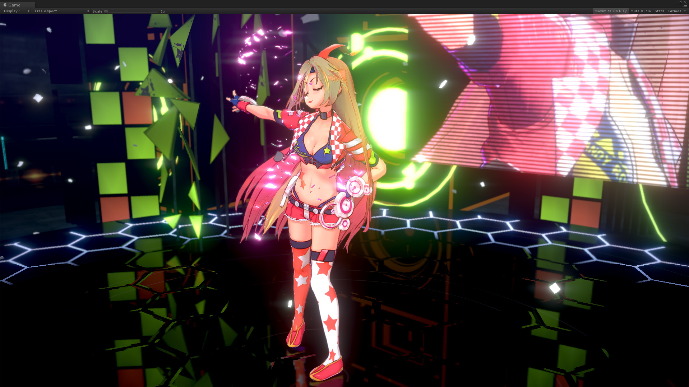

# ユニティちゃんトゥーンシェーダー 2.0 の紹介
ユニティちゃんトゥーンシェーダー（UTS）は、セルルック3DCGアニメーションの制作現場での要望に応えるような形で設計された、映像志向のトゥーンシェーダーです。  

セルルック3DCGアニメーションの制作現場向けの設計になっていますので、いわゆる「影」は色設計担当者が作成しやすいような「影色設定」を使う方式であり、かつ各パーツの形状（フォルム）を強調する「影」や、キャラクターのデザイン上、光源の位置や強さとは関係なく、必ず必要となる「影」が出しやすいように設計されています。  
特にこれら「影」の調整機能は強力で、多数のライトを使わなくてもシェーダー内のスライダーだけで調整することが可能です。  

ユニティちゃんトゥーンシェーダー 2.0（UTS2）では、従来の機能に加えて大幅な機能強化を行いました。  
Ver.1.0でできる絵づくりをカバーしつつ、さらに高度なルックが実現できるようになっています。  

カラーやテクスチャは、「**基本色（ベースカラー）**」、「**１影色**」、「**２影色**」による３色塗り分けに加えて、「**ハイカラー**」や「**リムライト**」、「**MatCap**（スフィアマッピング）」、「**エミッシブ**（自己発光）」などの沢山のオプションを追加することができます。  

また各カラー間のぼかし加減も、Unity上でリアルタイムに調整することが可能となっています。  

デザイン上必要となる固定影の配置も、各影色ごとに発生する位置を設定できる「**ポジションマップ**」に加え、ライティングによって影の出やすさを変えることのできる「**シェーディンググレードマップ**」と、２種類の手法を選べます。  
さらに「**瞳や眉毛の前髪への透過**」など、アニメ風キャラクター表現に便利な機能も搭載しています。  

結果として、ユニティちゃんトゥーンシェーダー 2.0（UTS2）では、セルルックから始まり、ラノベ風のイラスト表現まで幅広いキャラクター表現が可能となっています。  
もちろんUnityのシステムシャドウにも対応しています。  

さらにポストエフェクトを追加することで、物理ベースレンダリング（PBR）に対応するスタンダードシェーダーで表現できる絵的要素を、ユニティちゃんトゥーンシェーダー 2.0（UTS2）では、全てノンフォトリアリスティックレンダリング（NPR）で表現することが可能です。  

また昨今のVRChatでのユーザーの声を反映し、様々なライティング設定の環境下でも、キャラクターが美しく表現されるように様々な工夫が実装されています。  

是非、貴方のご自慢のキャラクターモデルをユニティちゃんトゥーンシェーダー 2.0（UTS2）で彩ってみてください。  
今まで以上に、キャラクターが美しく表現されるものと思います。  

本マニュアルは、ユニティちゃんトゥーンシェーダー 2.0の最新版 **UTS2 v.2.0.9** 向けに書かれています。  

## 【ターゲット環境】
* UTS2シェーダー本体およびUTS2マテリアルは、Unity 5.6.7f1以降対応。（Unity 2019.4.31f1以降の使用を推奨します）  
* サンプルシーンを正常に再生するには、Unity 2019.4.31f1 もしくはそれ以降が必要です。  
* Unity 2019.4.31f1からUnity 2020.3.34f1、Unity 2021.3.3f1、Unity2022.1.1f1までの動作確認が終了しています。  
* 本パッケージは、Unity 2019.4.31f1で作成されています。  

Forwardレンダリング環境。リニアカラースペースでの使用を推奨します。  
（ガンマカラースペースでも使用できますが、ガンマカラーの特性上、陰影の階調変化が強めに出る傾向があります。詳しくは、[リニアのワークフローとガンマのワークフロー](https://docs.unity3d.com/ja/current/Manual/LinearRendering-LinearOrGammaWorkflow.html) を参照してください。）  

## 【プロジェクト全体のダウンロード】
### [UnityChanToonShaderVer2_Project (Zip)](https://github.com/unity3d-jp/UnityChanToonShaderVer2_Project/archive/refs/heads/release/legacy/2.0.zip)  

## 【インストールの仕方】
1. ユニティちゃんトゥーンシェーダー 2.0の配布プロジェクトを解凍し、フォルダ直下にある `UTS2_ShaderOnly_(バージョン名).unitypackage`というファイルを探します。  
図の例では、`v2.0.6_Release`という部分がバージョン名になっています。  

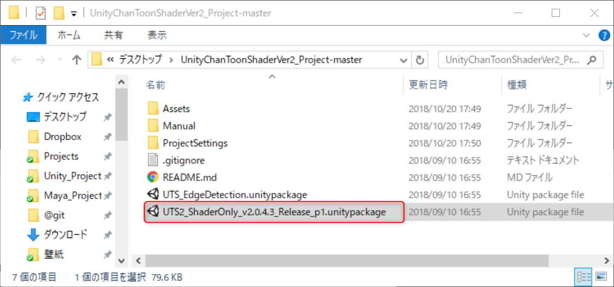

2. ユニティちゃんトゥーンシェーダー 2.0をインストールしたい、Unityプロジェクトを開きます。  

3. UnityのProjectウィンドウより、Assetsフォルダを開きます。  

4. OSのExplorerやFinderから、`UTS2_ShaderOnly_(バージョン名).unitypackage`をUnityのProjectウィンドウ内のAssetsフォルダにドラッグ＆ドロップします。  

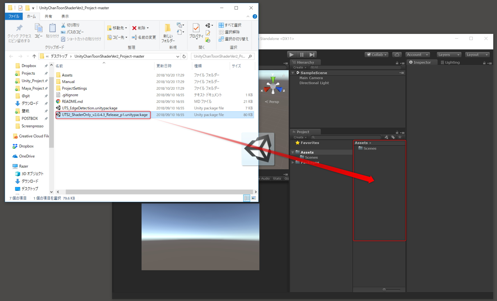

5. Import Unity Packageウィンドウが開きますので、全てのファイルをImportします。  

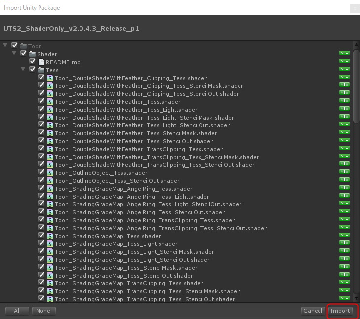

6. するとAssets下にToonというフォルダができます。この中にユニティちゃんトゥーンシェーダー 2.0がインストールされてます。  

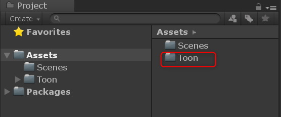

7. 新規にマテリアルを作成し、Shaderドロップダウンから、UnityChanToonShaderという項目が見つかれば、インストールは成功しています。  

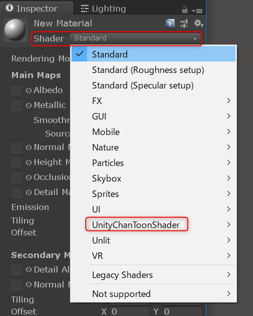

## 【UTS2の基本的な設定の仕方】

例として、以下のムービーを参考に、シェーダーボール上で肌色のマテリアルを設定してみましょう。  

またUTS2初心者の方は、いきなり全ての機能を使ってみようとするのではなく、まず「基本色と１影色の段階（Step）とぼかし（Feather）だけで絵作りをする」という練習をやってみるといいでしょう。  
これらのUTS2での基本の絵作りに十分慣れてから、徐々にリムライトなどを追加し、必要だったら２影色を加えるようにするのが取得のコツです。  
是非、以下のムービーを参考に練習をしてみてください。  

↑ UTS2 v.2.0.6をユニティちゃんにセットアップするチュートリアル  

↑ UTS2：SDユニティちゃんマテリアルセットアップ（UTS2 v.2.0.5）  

# UTS2各シェーダーの使い分け

ユニティちゃんトゥーンシェーダー 2.0（以下、UTS2）がインストールされているシェーダー階層（UnityChanToonShader）を開くと、多くのシェーダーファイルがあります。  
この時点で「そっと閉じ」てしまう人が多いようですが、よく見てみると、アンダーバーで区切られたいくつかの名前ブロックの組み合わせでできていることに気づくと思います。例えば、`Toon`、`DoubleShadeWithFeather`、`Clipping`、`StencilMask`…などです。  
これらの名前ブロックは、UTS2の基本的な機能を示しています。同じ名前ブロックを持つシェーダーは、同じ機能を持っています。  
まずは、これらの名前ブロックと機能について解説します。  

## ●UnityChanToonShaderルートフォルダ内のシェーダー

UTS2には、大きく分けて2つの系統のシェーダーがあります。  
* `DoubleShadeWithFeather` : UTS2の標準シェーダーです。2つの影色（Double Shade Colors）と、各々のカラーの境界にぼかし（Feather）を入れることができます。  
* `ShadingGradeMap` : 高機能版のUTS2シェーダーです。DoubleShadeWithFeatherの機能に加えて、ShadingGradeMapという特別なマップを持つことができます。  

搭載されている基本機能はほぼ同じですので、共に色分け段階（`_Step`）とぼかし程度（`_Feather`）の数値を合わせれば、同じルックを作ることができます。  
どちらを使うかは好みの問題ですが、パキッとした色分けが必要なセルルックには`DoubleShadeWithFeather`系が向いており、ぼかしを多用するイラストルックには`ShadingGradeMap`系が向いているようです。  

またシェーダー名の一番頭に`Toon`とあるものは、**オブジェクト反転方式によるアウトライン機能**を持っています。  
UTS2のアウトラインは、専用テクスチャを使ったアウトラインの入り抜き（強弱）調整の他、ベースカラーに馴染ませたり、カメラベースでオフセット調整ができたりなど、多彩な調整機能を持っています。  

シェーダー名の後ろ側には、`Clipping`などの名前ブロックがあります。これらは以下のような機能があることを示しています。  

* `Clipping` : クリッピングマスクを持てるシェーダー。いわゆる「テクスチャの抜き」（カットアウトやディゾルブ）ができます。  
* `TransClipping` : 同じくクリッピングマスクを持てますが、マスクのα透明度（Transparency）を考慮した「テクスチャの抜き」ができます。より綺麗な抜きができるぶん、負荷は`Clipping`よりも高くなります。  
* `StencilMask` : ステンシルバッファによるパーツの透過を指定します。「眉毛」パーツのアニメ的な表現で、常に「前髪」パーツよりも前面に表示したいような場合などに使用するシェーダーです。必ず`StencilOut`系シェーダーと組み合わせて使います。  
* `StencilOut` : `StencilMask`系シェーダーと一緒に使います。上の例だと、「眉毛」パーツを透過させる側である「前髪」パーツに設定するシェーダーです。  

## ●UnityChanToonShader/NoOutlineフォルダ内のシェーダー

`NoOutline`というフォルダ内に入っているシェーダーには、シェーダー名の一番頭に`ToonColor`という名前がついていますが、これは**アウトライン機能を持たない**ことを表しています。  

アウトライン機能を持たないぶん、描画パスがひとつ少なくなりますので、アウトラインの必要がないデザインだったり、別途 [PSOFT Pencil+ 4 Line for Unity](https://www.psoft.co.jp/jp/product/pencil/unity/) のような高精度のトゥーンラインシェーダーを使用したい場合には、こちらを選ぶとよいでしょう。  

### ・半透明マテリアル向けのTransparentシェーダー

`NoOutline`系シェーダーの中に、最後に`Transparent`という名前ブロックを持つシェーダーがあります。  
これは、**半透明に特化したシェーダー**です。「頬染め」用パーツなどに使える他、ガラスのような表現にも使えます。  

↑頬染め用マテリアルの設定例  

↑ Custom Render Queueの設定の仕方  

UTS2 v.2.0.7を使って、カスタムレンダーキューを各マテリアルに設定する方法を解説します。  
特に半透明（Transparent）系のマテリアルを正確に表示したい場合には、カスタムレンダーキューの調整が欠かせません。本ムービーで使用しているサンプルシーンは、UTS2のサンプルプロジェクトに含まれていますので、実際に手で動かして確認することができます。  

## ●UnityChanToonShader/AngelRingフォルダ内のシェーダー

`AngelRing`フォルダ内には、**「天使の輪」機能**を持つシェーダーが入っています。  
「天使の輪」とは、下図のようなハイライト表現のことです。カメラから見て常に固定の位置に現れます。  

「天使の輪」機能を持つシェーダーは、高機能版UTS2である`ShadingGradeMap`系シェーダーと、そのバリエーションである`ShadingGradeMap_TransClipping`系シェーダーのみとなっています。  
また主に「髪の毛」パーツに使われるシェーダーなので、ステンシルで抜かれる側である`StencilOut`系のシェーダーが付属しています。  

## ●UnityChanToonShader/Mobileフォルダ内のシェーダー

`Mobile`フォルダ内には、モバイルやVRコンテンツ向けに、ほぼルックが替わらない程度に軽量化したシェーダーが入ってます。  
モバイル版では、軽量化のために以下の仕様に制限しています。  

* **リアルタイムディレクショナルライト１灯のみ**の対応に制限しています（**複数のライトや、リアルタイムポイントライトには反応しません**）。  
* ポイントライトへは、ベイク済みポイントライト＋[ライトプローブ](https://docs.unity3d.com/ja/current/Manual/LightProbes-MovingObjects.html)の組み合わせで対応します。その場合、`GI_Intensity` を適度に調整する必要があります。  

通常版`Toon_DoubleShadeWithFeathe`系、`Toon_ShadingGradeMap`系各シェーダーとはプロパティ互換がありますので、上記機能で十分な場合、通常版と同名のMobile版シェーダーに切り替えるとレンダリングパフォーマンスが向上します。  

`Mobile/AngelRing`フォルダ内には、「天使の輪」機能に対応したモバイル版シェーダーが入っています。  
各シェーダーの基本機能は、通常版の同名のものと同じです。  

## ●UnityChanToonShader/Tessellationフォルダ内のシェーダー

`Tessellation`フォルダ内には、DirectX 11の[Phong テッセレーション](https://docs.unity3d.com/ja/current/Manual/SL-SurfaceShaderTessellation.html)に対応したUTS2シェーダーが入っています。  
Phong テッセレーションは、結果となる表面がメッシュの法線にある程度沿うように、再分割（subdivide）された面の位置を修正します。ローポリのメッシュについてスムージングするのにかなり効果的な方法です。  
UTS2では、WindowsでDirectX 11以上が稼働している環境でのみPhong テッセレーションが利用できます。  

`Tessellation/Light`フォルダには、`Mobile`版と同様の仕様制限を行った軽量化バージョンが入っています。  
その他のフォルダに関しても、すでに説明したものと同様の機能を持つUTS2シェーダーのPhong テッセレーション対応版が入ってます。  

Phong テッセレーションを利用することで、アウトラインのクオリティや唇などの細部表現が大いに向上します。  
主にプリレンダー映像向けのシェーダーですが、その他にも、「キャラの近くまで接近する必要のある」ハイエンドVR向けキャラクターコンテンツなどで使用されています。  

## ●UnityChanToonShader/Helperフォルダ内のシェーダー

`Helper`フォルダ内には、アウトラインオブジェクトのみを表示するシェーダーが入っています。  
マルチマテリアルとしてパーツに重ねてやることで、アウトラインオブジェクトを重ね描きすることができます。  

アウトラインを重ね描きしたいメッシュの`Skinned Mesh Renderer` > `Materials`より`Size`をひとつ増やし、追加するアウトラインマテリアルを登録します。  

**注意：アウトラインを重ね描きしますので、当然負荷は高まります。十分注意して使用してください。**  

# サンプルシーン
プロジェクトを開くと、`\Assets\Sample Scenes`フォルダ以下に、次のようなサンプルシーンがあります。  

* BoxProjection.unity		：Box Projection を使った暗い部屋のライティング  
* ToonShader.unity			：イラストルックのシェーダー設定  
* ToonShader_CelLook.unity	：セルルックのシェーダー設定  
* ToonShader_Emissive.unity	：エミッシブを使ったシェーダー設定  
* ToonShader_Firefly.unity	：複数のリアルタイムポイントライト  
* Baked Normal\Cube_HardEdge.unity：Baked Normalの参考  
* Sample\Sample.unity		：UTS2の基本シェーダーの紹介  
* ShaderBall\ShaderBall.unity：シェーダーボールを使ってUTS2を設定する  
* PointLightTest\PointLightTest.unity：ポイントライトを使ったセルルック表現のサンプル  
* SSAO Test\SSAO.unity		：SSAO in PPSのテスト用  
* NormalMap\NormalMap.unity	：UTS2でノーマルマップを使う際のコツ  
* LightAndShadows\LightAndShadows.unity：スタンダードシェーダーとUTS2との比較  
* AngelRing\AngelRing.unity：「天使の輪」および ShadingGradeMap を使ったキャラクターのサンプル  
* MatCapMask\MatCapMask.unity：MatcapMaskのサンプル  
* EmissiveAnimation\EmisssiveAnimation.unity：EmissiveAnimationのサンプル  
* Mirror\MirrorTest.unity：鏡オブジェクトチェック用サンプルシーン  

各シーンは、シェーダーやライティングの設定の参考用です。  
作りたいルックやシーンの参考に役立つと思います。  

# プロジェクトの初期設定

File>Build Settings>Player Settings... より  

* Rendering Path⇒`Forward`  
* Color Space⇒`Linear`  

を推奨します。リニアカラーの時、UTS2は最大限の能力を発揮できます。  

# UTS2 設定メニュー：UTS2カスタムインスペクター

ここからは、UTS2 の各機能を設定するユーザーインタフェース「**UTS2カスタムインスペクター**」の機能解説をします。  

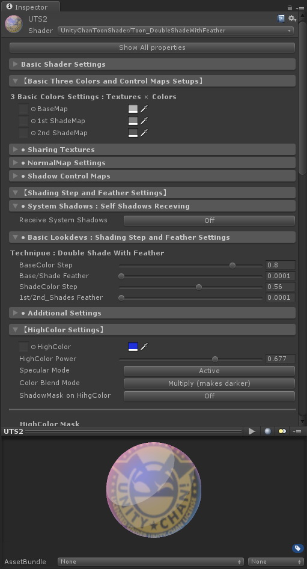

UTS2カスタムインスペクターは、`Show All Properties` ボタンをクリックすることで、旧来のプロパティリスト型のインスペクターに切り替えることができます。  

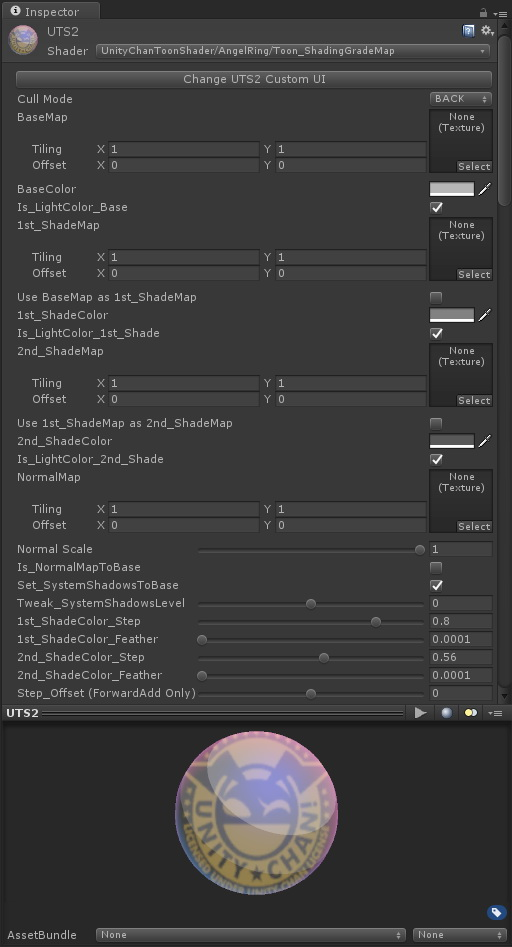

プロパティリスト型の機能解説は[こちら](./UTS2_Props_ja.md)です。
プロパティリスト型のインスペクターは、`Change CustomUI` ボタンで元に戻すことができます。

---
## 1. UTS2の基本設定をおこなう「Basic Shader Settings」メニュー
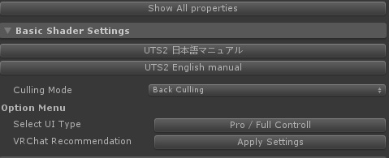

こちらのメニューでは、UTS2の基本設定をおこなう他、ステンシルバッファのリファレンスナンバーを設定したり、カリング方式を設定したり、各クリッピングシェーダーでどのようなマスクを設定するか指定できます。  

**※ヒント：カリング方式の設定は全てのシェーダーにありますが、ステンシルやクリッピング関連の設定は、それらの設定を使用するシェーダーにしかありません。**  

メニュー内のアイテムは、シェーダーの種類（機能）に応じて、最大以下のような形式に自動的に拡張されます。

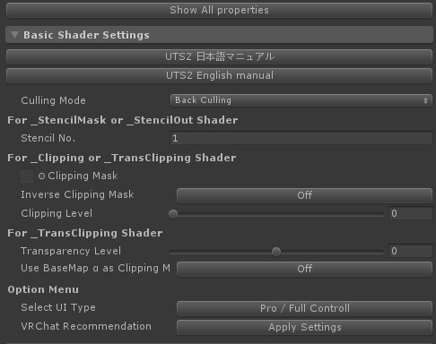

| `アイテム`  | 機能解説 | プロパティ |
|:-------------------|:-------------------|:-------------------|
| `日本語マニュアル` | ブラウザを利用して、UTS2日本語公式マニュアルにジャンプします。 |  |
| `English Manual` | ブラウザを利用して、UTS2英語公式マニュアルにジャンプします。 |  |
| `Culling Mode` | ポリゴンのどちら側を描画しないか（カリング）を指定します。「`Culling Off`（両面描画）/ `Front Culling`（正面カリング）/ `Back Culling`（背面カリング）」が選べます。通常は`Back`で指定します。`Culling Off`はノーマルマップやライティング表示がおかしくなる場合がありますので、注意してください。 | _CullMode |
| `Stencil No` | `StencilMask`　/　`StencilOut`各シェーダーで使用します。0～255の範囲で、ステンシルリファレンスナンバーを指定します（255には特別の意味がある場合がありますので、注意してください）。抜く側のマテリアルと抜かれる側のマテリアルで、数字を合わせます。 | _StencilNo |
| `Clipping Mask` | `Clipping` / `TransClipping`各シェーダーで使用します。グレースケールのクリッピングマスクを指定します。白が「抜き」になります。何も指定しない場合、クリッピング機能は有効になりません。 | _ClippingMask |
| `Inverse Clipping Mask` | クリッピングマスクを反転します。 | _Inverse_Clipping |
| `Clipping Level` | クリッピングマスクの強さを指定します。 | _Clipping_Level |
| `Transparency Level` | `TransClipping`シェーダーで使用します。クリッピングマスクのグレースケールレベルをα値として考慮することで、透過度を調整します。 | _Tweak_transparency |
| `Use BaseMap αas Clipping Mask` | `TransClipping`シェーダーのみのプロパティです。チェックすることで、`BaseMap`に含まれるAチャンネルをクリッピングマスクとして使用します。この場合、`ClippingMask`には指定する必要はありません。 | _IsBaseMapAlphaAsClippingMask |
| Option Menu | 以下、オプション機能のメニューになります。 |  |
| `Currnet UI Type` | ボタン上に現在選択されているユーザーインタフェースが表示されています。ボタンを押すことで、ユーザーインターフェースを`Beginner`モードに切り替えます。`Beginner`モードでは、必要最小限のUTS2コントロールができます。トグルで`Pro / Full Controll`モードに戻ります。 |  |
| `VRChat Recommendation` | VRChatを楽しむのに便利な設定を一括でおこないます。VRChat向けにセットアップをする場合、まずこちらから始めてみることをお薦めします。 |  |
| `Remove Unused Keywords/Properties from Material` | プロジェクトをビルドしたり、VRChatにパブリッシュする直前に実行することで、UTS2マテリアルから不要なシェーダーキーワードや、使われていないプロパティ値を取り除きます。これらの値は、Unity上で作業しているうちに自然と溜まってしまうものです。これらの不要な値を各マテリアルよりあらかじめ削除しておくことで、システムに不要な負荷を与えることが避けられます。本機能を実行した後は、念のために`File`>`Save Project`を実行することで、プロジェクトをセーブするようにしましょう（このタイミングで全てのマテリアルがセーブされるからです）。 |  |

`TransClipping`シェーダーは、`Clipping`シェーダーと主な機能は同じですが、クリッピングマスクのグレースケールレベルをα値として使えます。  
短冊状の毛の房の先端をアルファを考慮しつつマスクで抜く場合や、アホ毛などの表現に使います。  
`Tweak_transparency`スライダーで透過度合いを調整できます。  

---
### VRChatユーザー向けの便利機能について
UTS2は、Unityの様々なプロジェクトで使うことのできる、汎用トゥーンシェーダーです。  VRChat上でUTS2を楽しむ場合、以下の便利機能を使うことで、UTS2の高機能を活かしつつ、VRChatの様々な環境下でも安定して楽しむことができるようになります。  

上の図で、赤い囲み内のボタンがそれに当たります。これらのボタンを使用するタイミングは２つあります。  

#### 『UTS2でマテリアル設定をはじめる時』
UTS2で各マテリアルの設定をはじめる時に、Basic Shader Settings > Option Menu内の`VRChat Recommendation`ボタンを実行してください。  
このコマンドを実行することで、VRChatの様々なライティング環境にUTS2を馴染みやすくします。  
VRChat上にアバターをアップロードして、どうも自分の意図した表示と違うと感じる時には、まず最初にこちらのコマンドを試してみるといいでしょう。  

##### ● 暗いワールドでのキャラの見え方を明るくしたい場合
`VRChat Recommendation`ボタンを実行した後で、主にポイントライトしかない暗いワールドでのキャラの見え方を、もっと明るめに調整したい場合があります。  
その場合、「Environmental Lighting Contributions Setups」メニュー内の`Unlit Intensity`スライダーを調整することで、暗い場所での明るさを底上げすることができます。  

**※ヒント：Unlit Intensityは、周りの明るさを考慮しつつ、暗い場所でのマテリアルの明るさをブーストする機能ですので、元々の環境光が暗めに設定されているワールドで極端に明るくすることはできません。**  

ただし、暗いワールドでは同時にポストエフェクトのブルームも強めに設定されている場合がよくあります。
そのようなワールドで**Unlit Intensityの値をデフォルトの1以上にすると、ブルームの影響も受けやすくなります**ので、十分に注意してください。  

#### 『UTS2で設定したアバターをパブリッシュする時』
UTS2で各マテリアルを設定したアバターをVRChatに公開する前に、Basic Shader Settings > Option Menu内の`Remove Unused Keywords/Properties from Material`ボタンを実行してください。  
このコマンドを実行することで、Unityで作業している途中で各マテリアルファイル内に溜まる未使用のプロパティ設定値やシェーダーキーワードを、整理し削除することができます。  
例えば、Standard Shaderを最初割り当ててあったマテリアルから、シェーダーをUTS2のものに変えただけでも、これらの未使用の値は溜まっていきます。これらの未使用の値は、次にシェーダーを再度Standard Shaderに切り替える時のために、Unityが念のために保持しているものなのですが、マテリアルが完成しそれらを適用したアバターやモデルを公開する時には、不要になります。  
これらの使われない値が各マテリアルに入ったままだと、システムに不要な負荷を与える可能性も考えられますので、アバターを公開するタイミングで整理しておくのが推奨されます。  
このコマンドは、ご自身のプロジェクトをビルドする際にも使うといいでしょう。  

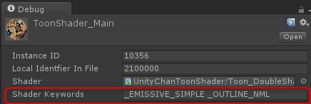

コマンドを実行すると、UTS2マテリアルの場合、残っているシェーダーキーワードは、`_EMISSIVE_SIMPLE` / `_EMISSIVE_ANIMATION`のいずれかと、`_OUTLINE_NML` / `_OUTLINE_POS`のいずれかの２つに最適化されます。これらはシェーダーコンパイル時に必要なので、そのまま残しておいてください。  

---
## 2. 「Basic Three Colors and Control Maps Setups」メニュー
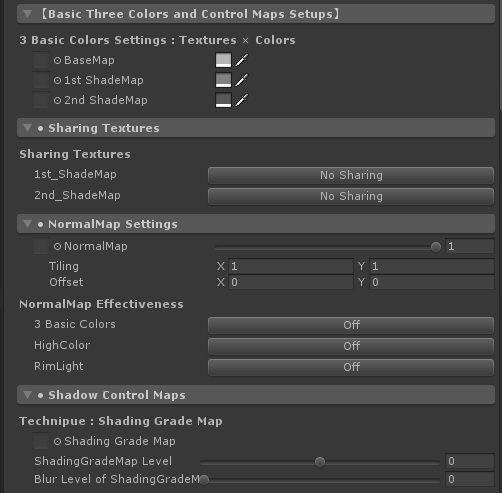

このメニューでは、UTS2の基本となる、基本色/１影色/２影色に用いるカラーを定義します。  
これらのカラーは、**光源方向から順に、基本色⇒１影色⇒２影色**のように配置されます。  
おのおののカラーは、テクスチャの各ピクセルに対して各カラーを乗算し、さらにライトカラーを乗算することで決まります。  
**※ヒント：各影色は、基本色よりも暗い必要はありませんし、２影色が１影色よりも明るくても問題ありません。特に２影色を１影色よりも明るくすると、環境からの照り返しのような表現ができます。**  

**※ヒント：２影色を使うかどうかは、デザインによります。必要のない場合には、指定しなくてかまいません。**  

さらにサブメニューから、基本3色用テクスチャのシェアリング設定や、ノーマルマップ、シャドウコントロールマップの設定が行えます。

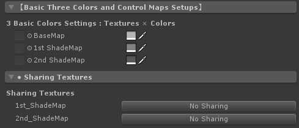

| `アイテム`  | 機能解説 | プロパティ |
|:-------------------|:-------------------|:-------------------|
| `BaseMap` | 基本色（明色）テクスチャと`BaseMap`に乗算されるカラーを指定します。テクスチャを指定せず、カラーのみの指定の場合、こちらを基本色（明色）設定として使います。右側のボタンを押すことで、`BaseMap`に指定されているテクスチャを`1st ShadeMap`にも適用します。 | _MainTex, _BaseColor, _Use_BaseAs1st |
| `1st ShadeMap` | １影色テクスチャと`1st_ShaderMap`に乗算されるカラーを指定します。テクスチャを指定せず、カラーのみの指定の場合、こちらを１影色設定として使います。右側のボタンを押すことで、`1st ShadeMap`に指定されているテクスチャを`2nd ShadeMap`にも適用します。同時に`1st ShadeMap`も`BaseMap`と共有している場合は、`BaseMap`が`2nd_ShadeMap`にも適用されます。 | _1st_ShadeMap, _1st_ShadeColor, _Use_1stAs2nd |
| `2nd ShadeMap` | ２影色テクスチャと`2nd_ShaderMap`に乗算されるカラーです。テクスチャを指定せず、カラーのみの指定の場合、こちらを２影色設定として使います。 | _2nd_ShadeMap, _2nd_ShadeColor |

---
### 「NormalMap Settings」サブメニュー
このメニューでは、ノーマルマップに関する設定を行います。  

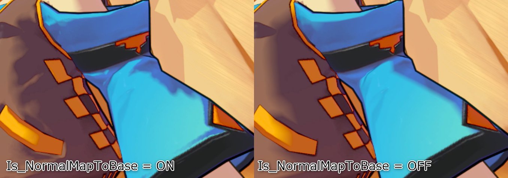

**UTS2では、ノーマルマップは主に影色のぼかし表現に使います。**  
通常のシェーディング表現にノーマルマップを足してやることで、より複雑なぼかし表現をすることが可能となります。上の図で、**左側がノーマルマップをカラーに反映させたもの、右が反映させていないもの**です。  

他にもノーマルマップは、スケールと共に使うことで**肌の質感**を調整したり、MatCap用のノーマルマップを別途用意することで、**髪の毛の質感**を表現するのに使われます。  

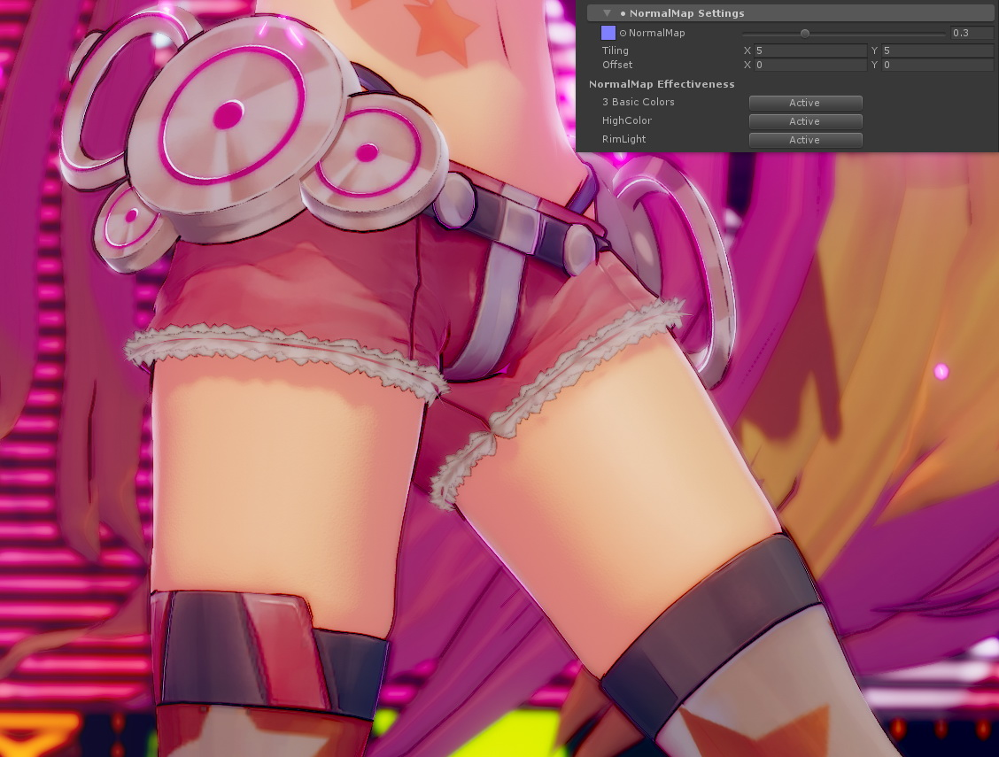

ノーマルマップを使いこなすことで、様々な表現を楽しむことができます。  

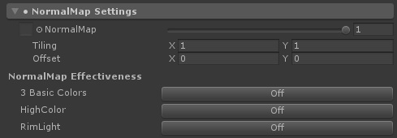

| `アイテム`  | 機能解説 | プロパティ |
|:-------------------|:-------------------|:-------------------|
| `NormalMap` | ノーマルマップを指定します。右のスライダーは、ノーマルマップの強さを変化させるスケールです。 | _NormalMap, _BumpScale |
| NormalMap Effectiveness | ノーマルマップを各カラーに反映させるかを選びます。ボタンが**Off**の場合、そのカラーはノーマルマップを反映せず、オブジェクトのジオメトリそのものの形状で評価されます。 |
| `3 Basic Colors` | ノーマルマップを基本となる3カラーに反映させる時に**Active**にします。 | _Is_NormalMapToBase |
| `HighColor` | ノーマルマップをハイカラーに反映させる時に**Active**にします。 | _Is_NormalMapToHighColor |
| `RimLight` | ノーマルマップをリムライトに反映させる時に**Active**にします。 | _Is_NormalMapToRimLight |

**※ヒント**：もちろんノーマルマップをバンプのように疑似立体表現として利用することもできます。ただしバンプ表現に用いられる場合、ノーマルマップは実際にジオメトリの表面を凸凹させるものではなく、ライティングでその凹凸を表現するものですので、**ライティングの変化が現れやすくするように、基本色/1影色/2影色のステップを設定してやる**必要があります。[上の例](https://twitter.com/nyaa_toraneko/status/1051359237631164417)の場合、基本色側のステップを0.8、影色側のステップを0.5ぐらいにした上で、さらに少し暗めのハイカラーを足してやることで立体感を強調してやっています。  

---
### 「Shadow Control Maps」サブメニュー
影の落ち具合を調整する、ポジションマップやシェーディンググレードマップを指定します。  
使用するシェーダーに応じて、サブメニュー内のアイテムが切り替わります。  

### ●DoubleShadeWithFeather系シェーダーの場合

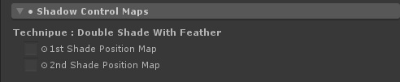

| `アイテム`  | 機能解説 | プロパティ |
|:-------------------|:-------------------|:-------------------|
| `1st Shade Position Map` | ライティングに関係なく、１影色の位置を強制的に指定したい場合、ポジションマップを割り当てます。必ず影を落としたい部分を黒で指定します。 | _Set_1st_ShadePosition |
| `2nd Shade Position Map` | ライティングに関係なく、２影色の位置を強制的に指定したい場合、ポジションマップを割り当てます。必ず影を落としたい部分を黒で指定します。(１影色のポジションマップにも影響を受けます） | _Set_2nd_ShadePosition |

### 【ポジションマップとは？】

ライティングと関係なく影を落としたい部分をポジションマップで指定できます。  
各シーンごとの特殊な影や、演出上追加したい影などがある場合、ライティングに加えて追加できます。  
**※ヒント：Substance Painterなどの3Dペインターを使って、影位置を直接作画してしまうのが簡単です。**  

### 【１影と２影の各ポジションマップの相互作用について】

ライトの状態に関係なく**常に２影色を表示したい場所は、１影色のポジションマップと２影色のポジションマップの同じ位置を塗りつぶし**ます。  
常に２影色が表示されている領域は、ライトが作る影の中でも常に２影色が表示される領域になります。  
一方、**明るいところでは２影色が表示されない領域**（２影色のポジションマップでは指定されているが、１影のポジションマップでは指定されていない領域）は、ライトが作る影の中に入った時のみ２影色が表示されます。  

---
### ●ShadingGradeMap系シェーダーの場合

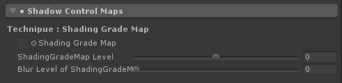

| `アイテム`  | 機能解説 | プロパティ |
|:-------------------|:-------------------|:-------------------|
| `ShadingGradeMap` | Shading Grade Mapをグレースケールで指定します。 Shading Grade Mapに使用するテクスチャは、テクスチャインポートセッティングで、必ず `SRGB (Color Texture)` を `OFF` にするようにしてください。 | _ShadingGradeMap |
| `ShadingGradeMap Level` | Shading Grade Mapのグレースケール値をレベル補正します。デフォルトは0で、±0.5の範囲で調整が可能です。 | _Tweak_ShadingGradeMapLevel |
| `Blur Level of ShadingGradeMap` | Mip Map機能を利用して、Shading Grade Mapをぼかします。Mip Mapを有効にするためには、テクスチャインポートセッティングで、Advanced > `Generate Mip Maps` を `ON` にしてください。デフォルトは0（ぼかさない）です。 | _BlurLevelSGM |

### 【シェーディンググレードマップとは？】
UTS2の標準シェーダーは、`Toon_DoubleShadeWithFeather.shader`という系統になりますが、その標準シェーダーの機能を元にシェーディンググレードマップというグレースケールのマップを使うことで、さらに影の掛かり方をUV座標単位で制御できるように拡張したシェーダーが、`Toon_ShadingGradeMap`系統のシェーダーです。  

通常のトゥーンシェーダーに`Shading Grade Map`（シェーディングの掛かり方傾斜マップ）を足すことで、UV単位で１影色および２影色の掛かりやすさを制御できます。  
このマップを使うことで、部分的に影の出やすさを調整できるので、「**ライトに照らされている時にはでない**服のしわ」みたいな表現が可能となります。  
画像の例では、`Shading Grade Map`上の黒部分が２影色になり、グレー部分がその濃度によって影の掛かり方が変わります。  
グレー濃度が強いほうが影がかかりやすいので、二つのグレーの境界間にも影が発生します。  

**Ambient Occlusionマップなどの遮蔽マップ**をシェーディンググレードマップに適用すると、ライティングに対してより影をかかりやすくすることができます。他にも、前髪の形状に沿った影とか、服のしわの凹部分とかに使うとよいでしょう。  

---
## 3.「Basic Lookdevs : Shading Step and Feather Settings」メニュー

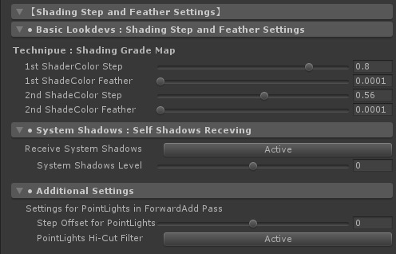

このメニューでは、基本色/１影色/２影色の各カラーの塗り分け範囲の設定（**Step**）と、各カラー境界ぼかしの強さ(**Feather**)を設定します。リアルタイムのディレクショナルライトの設定と共に、UTS2を使う上で最も重要な設定です。**このブロックの設定で、基本的なルックは決まります**。セルルックおよびイラストレーションルックを作るための基本的なアイテムが集まっているのが、本メニューです。  
これらのアイテムの設定は、Unity上でリアルタイムで繰り返しチェックをすることができます。  
プロパティ変更の結果をいちいちレンダリングして確認する必要がありませんので、じっくりと取り組んでみてください。  
光源方向が同じでも、各Stepと各Featherのパラメタを変えることで、まったく違ったルックを作ることができます。  

### 【Step/Feather各スライダーの基本的な使い方】

**塗り分け段階を設定するStepスライダー**、**各色の境界をぼかすFeatherスライダー**の基本的な使い方です。  

---
### ●DoubleShadeWithFeather系シェーダーの場合

UTS2の標準シェーダーである、DoubleShadeWithFeather系シェーダーのアイテムです。  
ライティングとは関係なく、モデルの指定位置に各々１影/２影色を配置できる、**ポジションマップ**を２枚持てるのが特徴です。  

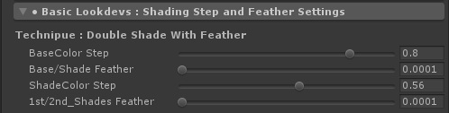

| `アイテム`  | 機能解説 | プロパティ |
|:-------------------|:-------------------|:-------------------|
| `BaseColor Step` | 基本色（明色）と影色領域の塗り分け段階を設定します。 | _BaseColor_Step |
| `Base/Shade Feather` | 基本色（明色）と影色領域の境界をぼかします。 | _BaseShade_Feather |
| `ShadeColor Step` | 影色領域より１影色と２影色の塗り分け段階を設定します。２影色を使用しない場合には、ゼロにしてください。 | _ShadeColor_Step |
| `1st/2nd_Shades Feather` | １影色と２影色の境界をぼかします。 | _1st2nd_Shades_Feather |

---
### ●ShadingGradeMap系シェーダーの場合

高機能版UTS2シェーダーである、ShadingGradeMap系シェーダーのアイテムです。  
**シェーディンググレードマップ**と呼ばれる、ライティングに対する影の出やすさを制御できるマップを持つことができます。  
シェーディンググレードマップを使うことで、ジオメトリや法線の状態とは関係なく、指定の位置に決まった形状の影色を配置ことができます。  
ポイントマップとの違いは、シェーディンググレードマップは影色を決まった位置に表示するだけでなく、ライトの当て方次第でその出方を調整できるところにあります。  

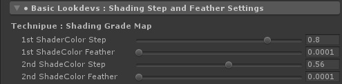

| `アイテム`  | 機能解説 | プロパティ |
|:-------------------|:-------------------|:-------------------|
| `1st ShadeColor Step` | 基本色（明色）と１影色の塗り分け段階を設定します。`BaseColor Step`と同じ機能です。 | _1st_ShadeColor_Step |
| `1st ShadeColor Feather` | 基本色(明色）と１影色の境界をぼかします。`Base/Shade Feather`と同じ機能です。 | _1st_ShadeColor_Feather |
| `2nd ShadeColor Step` | １影色と２影色の塗り分け段階を設定します。`ShadeColor Step`と同じ機能です。 | _2nd_ShadeColor_Step |
| `2nd ShadeColor Feather` | １影色と２影色の境界をぼかします。`1st/2nd_Shades Feather`と同じ機能です。 | _2nd_ShadeColor_Feather |

---
### 「System Shadows : Self Shadows Receiving」アイテム

Unityのシャドウシステムとトゥーンシェーディングを馴染ませるための調整アイテムです。  
トゥーンシェードの場合、システムが提供する影は、キャラのセルフシャドウ（自身への落ち影）を表現するために必要なものです。  
「Basic Lookdevs : Shading Step and Feather Settings」サブメニューアイテムで塗り分けレベルを決定した後で、さらに微調整をしたい時や、セルフシャドウ等のReceiveShadowの出方を微調整したい時に使用します。  

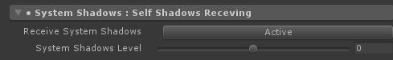

| `アイテム`  | 機能解説 | プロパティ |
|:-------------------|:-------------------|:-------------------|
| `Receive System Shadows` | Unityのシャドウシステムを使う場合、**Active**にします。ReceiveShadowを使いたい場合には、必ず**Active**します。（同時にMesh Renderer側の`ReceiveShadow`もチェックされている必要があります。） | _Set_SystemShadowsToBase |
| `System Shadows Level` | Unityのシステムシャドウのレベル調整をします。デフォルトは0で、±0.5の範囲で調整が可能です。` | _Tweak_SystemShadowsLevel |

**↑ Unityでシステムシャドウを使いつつ、Stepスライダーを調整していると、影色との領域にノイズが現れることがあります。これらのノイズは、セルルックでは困りものですので、それらを`System Shadows Level`スライダーや`Tessellation`を使って改善する方法を紹介しています。**  

ノイズの消し方は他にもありますので、[本マニュアルのおまけ](./UTS2_Manual_ja.md#%EF%BC%91tips%E3%82%B7%E3%82%B9%E3%83%86%E3%83%A0%E3%82%B7%E3%83%A3%E3%83%89%E3%82%A6%E4%BD%BF%E7%94%A8%E6%99%82%E3%81%AB%E5%90%84%E8%89%B2%E3%81%AE%E5%A2%83%E7%95%8C%E3%81%AB%E7%94%9F%E3%81%98%E3%82%8B%E3%82%A2%E3%83%BC%E3%83%86%E3%82%A3%E3%83%95%E3%82%A1%E3%82%AF%E3%83%88%E3%81%AE%E8%BB%BD%E6%B8%9B%E6%B3%95)も参照してみてください。

---
### 「Additional Settings」サブメニュー

主にForwardAddパス内で処理されるリアルタイムポイントライト群に対する調整アイテムです。  
Mobile/Light版には、このサブメニューはありません。  

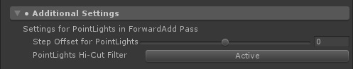

| `アイテム`  | 機能解説 | プロパティ |
|:-------------------|:-------------------|:-------------------|
| `Step Offset for PointLights`| リアルタイムポイントライトなど、主にForwardAddパス内で足されるライトのステップ（塗り分け段階）を微調整します。 | _StepOffset |
| `PointLights Hi-Cut Filter` | リアルタイムポイントライトなど、主にForwardAddパス内で足されるライトの基本色（明色）領域にかかる不要なハイライトをカットします。 特にぼかしのないセルルック時に、セルルック感を高めます。 | _Is_Filter_HiCutPointLightColor |

---
### 【ポイントライトによるカラー塗り分けを微調整する：Step Offset、PointLights Hi-Cut Filter】

UTS2 v.2.0.5では、ぼかしを使わないセルルック時のリアルタイムポイントライトへの反応を改善しました。結果、ポイントライトだけでもセル風のルックが実現できます。  
セルルックは、基本色（明色）/１影色、１影色/２影色の各Stepスライダーを調整して設定しますが、ポイントライトの場合、ディレクショナルライト以上に移動に対する影の変化が顕著になります。  
それらの変化ををある程度抑え込むための微調整用として、`Step Offset`スライダーを使います。  

`Step Offset`を使うことで、ポイントライトなどFowardAddパス側で追加されるリアルタイムライトのステップ（塗り分け段階）を微調整できます。  
塗り分け用に使われる`BaseColor Step`などの調整は、メインライトによる塗り分け段階を決めるのと同時に、ポイントライト側の設定にも使われます。  
そこに`Step Offset`を併用することで、さらに細かくポイントライトの当たり方を調整できます。  
特にメカ表現などで、ワカメハイライトなどを表現するのに便利です。  

またポイントライトは、仕様上距離に対して明るさが減衰しますので、特に基本色（明色）部分のハイライトが必要以上に目立つことがあります。  
そのような時に、`PointLights Hi-Cut Filter`をオンにすると、不要なハイライトが抑えられて、よりセルルックに馴染みやすくなります。  
逆に積極的にハイライトを付けたい場合は、`PointLights Hi-Cut Filter`をオフにして使うといいでしょう。  

---
## 4.「HighColor Settings」メニュー

**「ハイカラー」** は、**ハイライト、スペキュラ**とも呼ばれる表現です。  
メインとなるディレクショナルライトからの「光」を照り返す表現として使われます。光の照り返し表現ですので、**ライトが動くと現れる位置も動きます**。  
UTS2では、ハイカラー表現に対して様々な調整をすることが可能です。  

| `アイテム`  | 機能解説 | プロパティ |
|:-------------------|:-------------------|:-------------------|
| `HighColor` | ハイカラー指定するカラーを指定します。使用しない場合には`黒(0,0,0)`を設定してください。なおハイカラーは光源の方向に従って移動します。 カラー指定と同様にテクスチャも指定できます。テクスチャを利用することで、複雑なカラーを載せることが可能になります。右のパレットのカラーと乗算されますので、テクスチャのカラーをそのまま出したい場合には、パレットを`白(1,1,1)`に設定してください。必要がない場合、テクスチャは設定しなくても大丈夫です。 | _HighColor, _HighColor_Tex |
| `HighColor Power` | ハイカラーの範囲の大きさ（※スペキュラ的には「強さ」になります）を設定します。 | _HighColor_Power |
| `Specular Mode` | `Active`の場合、ハイカラー領域をスペキュラ（グロッシイ光沢）として描画します。`Off`の場合、ハイカラー領域の境界を円形で描画します。 | _Is_SpecularToHighColor |
| `Color Blend Mode` | `Additive`の場合、ハイカラーの合成を加算（結果は明るくなります）にします。スペキュラは加算モードでしか使えません。`Multiply`の場合、ハイカラーの合成を乗算（結果は暗くなります）にします。 | _Is_BlendAddToHiColor |
| `ShadowMask on HighColor` | `Active`の場合、影部分にかかるハイカラー領域をマスクします。 | _Is_UseTweakHighColorOnShadow |
| `HighColor Power on Shadow` | 影部分にかかるハイカラーの強さを調整します。 | _TweakHighColorOnShadow |
| HighColor Mask | 以下、ハイカラーマスクの設定をします。 |  |
| `HighColor Mask` | UV座標に基づきハイカラーをマスクします。白で100%表示、黒でハイカラーを表示しません。必要がない場合、設定しなくても大丈夫です。 | _Set_HighColorMask |
| `HighColor Mask Level` | ハイカラーマスクのレベル補正をします。デフォルト値は0です。 | _Tweak_HighColorMaskLevel |

**※ヒント：リアルタイムポイントライトのハイカラーを有効にしたい場合は、`PointLights Hi-Cut Filter`を`Off`にします。**  

ハイカラーマスクを適用することで、角度によっては肌がテカってしまうような部分を抑えることができます。  
頬や胸に載せる肌のハイカラー表現などで、特に有効です。  

またハイカラーマスクは、鏡面反射を調整するスペキュラマップとしても使うことができますので、金属などの質感を表現するのにも使えます。  
暁ゆ～き（@AkatsukiWorks）さんの作例では、ハイカラーマスクやリムライトマスクを使うことで、イラスト風でありながら同時にそこに使われている各素材（マテリアル）の質感を魅力たっぷりに引き出しています。  

---
## 5.「RimLight Settings」メニュー

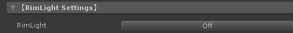

**「リムライト」** は、実写の世界では「ライトが被写体の周縁（リム）を照らすように配置する」テクニックを指しています。  
トゥーンシェーダーを含むノンフォトリアリスティックな表現では、形状を強調するのに同じようにエッジにハイライトを置きますが、これもしばしば「リムライト」と呼ばれています。  
UTS2では、リムライトに関しても様々なアイテムが利用できます。  

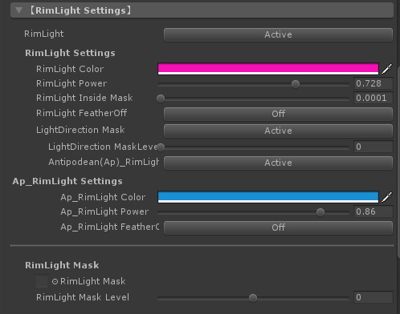

| `アイテム`  | 機能解説 | プロパティ |
|:-------------------|:-------------------|:-------------------|
| `RimLight` | `Active`の場合、リムライトを有効にします。 | _RimLight |
| RimLight Settings | 以下、リムライトの設定をします。 |  |
| `RimLight Color` | リムライトのカラーを指定します。 | _RimLightColor |
| `RimLight Power` | リムライトの強さを指定します。 | _RimLight_Power |
| `RimLight Inside Mask` | リムライトの内側マスクの強度を指定します。 | _RimLight_InsideMask |
| `RimLight FeatherOff` | `Active`の場合、リムライトのぼかしをカットします。 | _RimLight_FeatherOff |
| `LightDirection Mask` | `Active`の場合、光源方向にのみリムライトを発生します。 | _LightDirection_MaskOn |
| `LightDirection MaskLevel` | 光源方向リムマスクのレベル調整をします。 | _Tweak_LightDirection_MaskLevel |
| `Antipodean(Ap)_RimLight` | `Active`の場合、光源方向に対し反対方向の位置にリムライト（**APリムライト/対蹠リムライト**）を発生させます。 | _Add_Antipodean_RimLight |
| Ap_RimLight Settings | 以下、APリムライト（対蹠リムライト）の設定をします。 |  |
| `Ap_RimLight Color` | APリムライトのカラーを指定します。 | _Ap_RimLightColor |
| `Ap_RimLight Power` | APリムライトの強さを指定します。 | _Ap_RimLight_Power |
| `Ap_RimLight FeatherOff` | `Active`の場合、APリムライトのぼかしをカットします。 | _Ap_RimLight_FeatherOff |
| RimLight Mask | 以下、リムライトマスクの設定をします。 |
| `RimLight Mask` | UV座標に基づきリムライトをマスクします。白で100%表示、黒でリムライトを表示しません。必要がない場合、設定しなくても大丈夫です。 | _Set_RimLightMask |
| `RimLight Mask Level` | リムライトマスクのレベル補正をします。デフォルト値は0です。 | _Tweak_RimLightMaskLevel |

**基本的なリムライトは、カメラから見てオブジェクトの周縁に表示**されます。  
上に加えてUTS2では、メインライトが存在する方向を考慮してリムライトの出る位置を調整することができます。（`LightDirection Mask`）  
さらに**光源とは反対方向のリムライト（対蹠リムライト）も設定できます**（`Antipodean(Ap)_RimLight`が`Active`）ので、「照り返し」も表現することが可能です。  
もし光源方向のリムライトもカットして、光源方向の反対のみにリムライトを発生したい場合には、光源方向のリムライトのカラー（`RimLight Color`）を`黒（0,0,0）`に指定してください。  

またリムライトは、ハイカラーと同様にカメラの角度によってはひどくテカってしまうことがあります。  
UTS2では、リムライトマスクを設定することで、それらのテカりを抑えることができます。  
上の画像では、光源方向と照り返し方向のリムライトのカラーを変えた上に、脇の下などにリムライトマスクをかけることで不要なテカリを避けています。  

またリムライトマスクを使うことで、「**金属的な材質表現**」を他の素材と調整することで強調したり、服に差し込む入射光を調整することで 「**ベルベット風衣類のしわ表現**」などをすることが可能です。  

---
## 6.「MatCap : Texture Projection Settings」メニュー

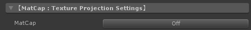

**「マットキャップ（MatCap）」** とは、カメラベースでオブジェクトに貼り付けるスフィアマップのことです。ZBrushの質感表現で使われています。  
Google画像検索で、「Matcap」で検索すると、様々なMatcapの例を見ることができます。物理ベースシェーダーが普及する以前は、金属的なテカリを表現する時によく使われました。  
それらの金属的な質感表現だけでなく、Matcapは工夫次第で様々な質感を表現することが可能です。  
UTS2では、Matcapテクスチャを乗算だけでなく加算でも合成できます。  

**※ヒント：UTS2 v.2.0.5からは、[カメラによる歪みに対して適切な補正が入る](https://twitter.com/kanihira/status/1061448868221480960)ようになりましたので、オブジェクトがカメラの端に来てもMatCapが歪まなくなりました。**  

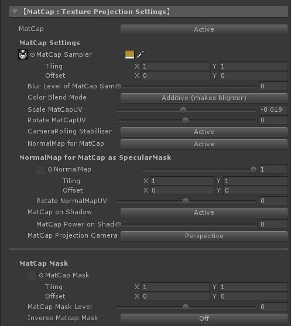

| `アイテム`  | 機能解説 | プロパティ |
|:-------------------|:-------------------|:-------------------|
| `MatCap` | `Active`の場合、MatCapを有効にします。 | _MatCap |
| MatCap Settings | 以下、MatCapの設定をします。 |
| `MatCap Sampler` | MatCapとして使用するテクスチャを設定します。右側のカラーがテクスチャに乗算されます。 | _MatCap_Sampler, _MatCapColor |
| `Blur Level of MatCap Sampler` | Mip Map機能を利用して、MatCap_Samplerをぼかします。Mip Mapを有効にするためには、テクスチャインポートセッティングで、Advanced > `Generate Mip Maps` を `ON` にしてください。デフォルトは0（ぼかさない）です。 | _BlurLevelMatcap |
| `Color Blend Mode` | `Additive`の場合、MatCapのブレンドが**加算モード**になります（結果は明るくなります）。`Multiply`の場合には**乗算モード**で合成されます（結果は暗くなります）。 | _Is_BlendAddToMatCap |
| `Scale MatCapUV` | `MatCap Sampler`のUVを中央から円形にスケールすることで、MatCapの領域調整ができます。 | _Tweak_MatCapUV |
| `Rotate MatCapUV` | `MatCap Sampler`のUVを中央を軸に回転します。 | _Rotate_MatCapUV |
| `CameraRolling Stabillizer` | `Activate`にすることで、カメラのローリング（奥行き方向を軸とした回転のこと）に対してMatCapが回転してしまうのを抑止します。MatCapをカメラのローリングに対して固定したい時に便利な機能です。 | _CameraRolling_Stabilizer |
| `NormalMap for MatCap` | `Active`にすることで、MatCapにMatCap専用ノーマルマップを割り当てます。MatCapをスペキュラ的に使っている場合には、スペキュラマスクとして使用できます。 | _Is_NormalMapForMatCap |
| NormalMap for MatCap as SpecularMask | 以下、MatCap専用ノーマルマップの設定をします。 |  |
| `NormalMap` | MatCap専用ノーマルマップを設定します。右側のスライダーはスケールです。 | _NormalMapForMatCap, _BumpScaleMatcap |
| `Rotate NormalMapUV` | MatCap専用ノーマルマップのUVを中央を軸に回転します。 | _Rotate_NormalMapForMatCapUV |
| `MatCap on Shadow` | `Active`にすることで、影部分にかかるMatCap領域をマスクします。 | _Is_UseTweakMatCapOnShadow |
| `MatCap Power on Shadow` | 影部分にかかるMatCapの強さを調整します。 | _TweakMatCapOnShadow |
| `MatCap Projection Camera` | ゲームビュー内で使用するカメラのプロジェクションを指定します。**パースカメラ（`Perspective`）の時には、カメラ歪み補正が働きます**。 | _Is_Ortho |
| MatCap Mask | 以下、MatCap Maskの設定をします。 |  |
| `Matcap Mask` |MatCapにグレースケールのマスクを設定することで、MatCapの出方を調整します。Matcap Maskは、MatCapが投影されるメッシュのUV座標基準で配置されます。黒でマスク、白で抜きになります。 | _Set_MatcapMask |
| `Matcap Mask Level` | Matcap Maskの強さを調整します。値が1の時、マスクのあるなしに関わらずMatCapを100％表示します。値が-1の時には、MatCapは一切表示されず、MatCapがオフの状態と同じになります。デフォルト値は0です。 | _Tweak_MatcapMaskLevel |
| `Inverse Matcap Mask` | `Active`にすることで、Matcap Maskを反転します。 | _Inverse_MatcapMask |

上の例では、**Matcapを疑似環境マップとして利用**しています。  
他にもMatcapを利用することで、つるつるした表面に光が反射する**ヌルテカ表現**も、適度なイラスト感を保ったまま、まとめることができます。  

上の例では、**サラサラ感のある髪の毛の光沢を表現する**のに、`MatCap`と`NormalMap for MatCap`、`Matcap Mask`を使用しています。  

* MatCap Sampler : 髪の上に乗算合成される、光の輪を表現します。  
* NormalMap for MatCap : MatCap単体だとそのままの形状で合成されてしまいますが、NormalMap for MatCapを細かいリピートで重ねることで、三日月型の光沢をサラサラ感のある光に散らしています。このような使い方を`スペキュラマスク`と呼びます。ここで使われるノーマルマップは、バンプ的な表現には使われません。  
* Matcap Mask : MatCapが表示される範囲を調整します。垂直方向のグラデーションマスクを設定することで、`Matcap Mask Level`スライダーを調整することで、MatCapが表示される範囲を簡単に制御することができます。  

MatcapMaskを使うことで、上のようなライトクッキー的な表現も可能です。  

---
## 7.「AngelRing Projection Settings」メニュー

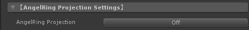

**「AngelRing（天使の輪）」** とは、カメラから見て常に固定の位置に現れるハイライト表現で、髪のハイライト表現として使われます。「天使の輪」機能を持つシェーダーは、`AngelRing`フォルダ以下に収録されています。  

「天使の輪」は、それが投映されるメッシュのUV2を参照しますので、Mayaや3ds Max、BlenderなどのDCCツールで、事前にUV2を設定しておく必要があります。  

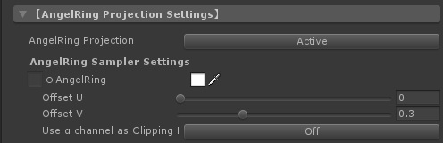

| `アイテム`  | 機能解説 | プロパティ |
|:-------------------|:-------------------|:-------------------|
| `AngelRing Projection` | `Active`の場合、「天使の輪」機能を有効にします。 | _AngelRing |
| AngelRing Sampler Settings | 以下、AngelRing Samplerの設定をします。 |  |
| `AngelRing` | 「天使の輪」テクスチャを指定します。右に指定したカラーがテクスチャに乗算されます。 | _AngelRing_Sampler, _AngelRing_Color |
| `Offset U` | 「天使の輪」表示を水平方向に微調整します。 | _AR_OffsetU |
| `Offset V` | 「天使の輪」表示を垂直方向に微調整します。 | _AR_OffsetV |
| `Use α channel as Clipping Mask` | `Active`の場合、「天使の輪」テクスチャに含まれるαチャンネルをクリッピングマスクとして利用します。`Off`の場合、αチャンネルは利用しません。 | _ARSampler_AlphaOn |

### ●「天使の輪」用素材の作成
まず「天使の輪」機能を適用する髪の毛のメッシュに、２つめのUVを設定しましょう。  

「天使の輪」用のUVは、通常の髪用テクスチャのUVとは別に、「天使の輪」を適用する髪全体をキャラの正面方向から平面投影して作成します。  

**※UV2の作成を含むこれらの作業は、Mayaや3ds Max、BlenderなどのDCCツールで行います。**  

「天使の輪」用UVをガイドに、ハイライト部分のテクスチャを描きます。ハイライト部分のカラーは元のカラーに加算で合成されます。  
作成したテクスチャは、`AngelRing`のテクスチャに登録します。  
ハイライトは白で描いて、後に乗算でカラーを載せてもよいでしょう。  

`Use α channel as Clipping Mask`を`Active`にすると、下の図のように「天使の輪」テクスチャのαチャンネルがクリッピングマスクとして利用できるようになります。  
「天使の輪」のカラーを加算でなく、直接指定できるようになります。  

---
## 8.「Emissive : Self-luminescene Setings」メニュー

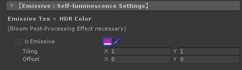

**「エミッシブ」** とは、自己発光のことです。  
カラーに**HDRカラー**（明るさとして1以上の値を持てるカラー仕様のこと）を定義することで、周りのカラーよりも明るい領域を設定することができます。  

**[Post Processing Stack](https://docs.unity3d.com/ja/current/Manual/PostProcessing-Stack.html)の[ブルーム](https://docs.unity3d.com/ja/current/Manual/PostProcessing-Bloom.html)など、カメラにアタッチされるポストエフェクトと共に使われることで、パーツを効果的に光らせることができます。**  

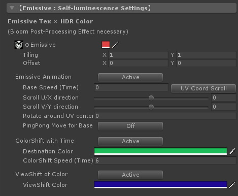

| `アイテム`  | 機能解説 | プロパティ |
|:-------------------|:-------------------|:-------------------|
| `Emissive` | エミッシブ用のテクスチャを設定します。グレースケールでテクスチャを作成し、それに乗算するカラーを載せることで光らせることもできます。 右側のカラーが、テクスチャの各ピクセルカラーに乗算されます。多くの場合、 **[HDRカラー](https://docs.unity3d.com/ja/current/Manual/HDRColorPicker.html)** を設定します。他のパーツと重ねて**光って欲しくない部分は、テクスチャ上で黒（RGB:0,0,0）にしておきます。** | _Emissive_Tex.rgb, _Emissive_Color |
| `Emissivテクスチャのαチャンネル` | v.2.0.7より、αチャンネルがエミッシブテクスチャのマスクとして使えるようになりました。UVベースで、αチャンネルを白（RGB = (1,1,1)）に設定した位置にエミッシブを表示します。黒（RGB=(0,0,0)）でエミッシブが表示されなくなります。 | _Emissive_Tex.a |
| `Emissive Animation` | `Active`にすることで、`Emissive`で指定したテクスチャのRGBチャンネル部分を、様々な方法でアニメーションします。**αチャンネルはマスクですので、アニメーションの対象にはなりません。** | EMISSIVE MODE = ANIMATION |
| `Base Speed (Time)` | アニメーションの基本となる更新スピードを指定します。値1の時、1秒で更新することになります。値2を指定すると、値1の時の2倍のスピードになりますので、 0.5秒で更新することになります。 | _Base_Speed |
| `UV Coord Scroll`、`View Coord Scroll` | スクロールに使用する座標系を指定します。`UV Coord Scroll`の場合、Emissive_TexのUV座標を基準にスクロールをします。`View Coord Scroll`の場合、MatCapと同様のビュー座標を基準にスクロールをします。ビュー座標系でのスクロールは、テクスチャのUV座標を考慮しないで済むのでとても便利ですが、キューブのようなフラットな面を持つオブジェクトでは、うまく表示できない場合がほとんどです。一方、キャラクターなどの曲面が多いオブジェクトでは、ビュー座標系は大変便利に使えます。 | _Is_ViewCoord_Scroll |
| `Scroll U direction` | アニメーションの更新にあたり、EmissiveテクスチャをU方向（X軸方向）にどれだけスクロールさせるかを指定します。-1～1範囲で指定し、デフォルトは0です。スクロールアニメーションは、最終的には、`Base Speed (Time)`×`Scroll U Direction`×`Scroll V Direction`の結果として決まります。 | _Scroll_EmissiveU |
| `Scroll V direction` | アニメーションの更新にあたり、EmissiveテクスチャをV方向（Y軸方向）にどれだけスクロールさせるかを指定します。-1～1範囲で指定し、デフォルトは0です。 | _Scroll_EmissiveV |
| `Rotate around UV center` | アニメーションの更新にあたり、EmissiveテクスチャをUV座標の中央（UV=(0.5,0.5)）を軸にどれだけ回転させるかを指定します。Base Speed=1の時、値1で右まわり方向に1回転します。スクロールと組み合わせた場合、スクロール後に回転することになります。 | _Rotate_EmissiveUV |
| `PingPong Move for Base` | `Active`にすることで、アニメーションの進行方向をPingPong（行ったり来たり）にします。 | _Is_PingPong_Base |
| `ColorShift with Time` | `Active`にすることで、Emissiveテクスチャに掛け合わせるカラーを、`Destination Color`に向かう線形補間（Lerp）で変化させます。**この機能を利用する時には、Emissiveテクスチャでの指定はグレースケールとし、掛け合わせるカラー側でカラー設計をしたほうがよいでしょう。** | _Is_ColorShift |
| `Destination Color` | カラーシフトをする際の、ターゲットとなるカラーです。HDRで指定できます。 | _ColorShift |
| `ColorShift Speed (Time)` | カラーシフトをする際の、基準となるスピードを設定します。値が1の時、1サイクルの変化はおおよそ6秒程度を目安としてください。 | _ColorShift_Speed |
| `ViewShift of Color` | `Active`にすることで、オブジェクトを見るカメラのビュー角に対してカラーをシフトさせます。オブジェクトのサーフェイスに対し真っ正面から見た場合は、通常状態のEmissiveカラーが表示され、ビュー角が徐々に傾いていくにつれてシフト先のカラーに変化します。 | _Is_ViewShift |
| `ViewShift Color` | ビューシフトする際の、変化先となるカラーです。HDRで指定します。 | _ViewShift |

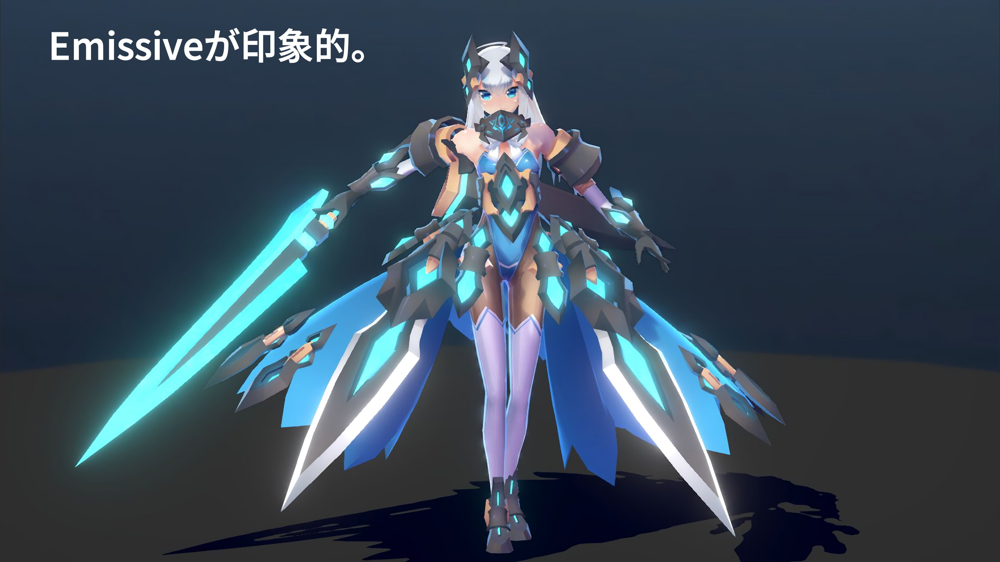

あいんつばい（@einz_zwei）さんの作例。エミッシブパーツが大変効果的に使われています。  
しかもカラーマップとエミッシブマップを組み合わせることで、ライトの明るさの変化に応じて、ディティールが追加されるような仕組みになっています。  

---
### ●αチャンネル付きテクスチャを作成するには

αチャンネル付きテクスチャは、PhotoshopなどのDCCツールで作成します。  
チャンネルタブより、新規チャンネルを追加し、できたチャンネルの上にグレースケールの画像を貼り付ければ、αチャンネルとして利用出来ます。Targa形式などαチャンネルが持てる画像形式の場合は、このままセーブできます。  

Unity上でαチャンネルを有効にするためには、各テクスチャのImport Settingsで、`Alpha Source`を`Input Texture Alpha`にしてください。  

**PNG形式の場合**は画像仕様上、直接αチャンネルを持てないので、Photoshop上でαチャンネルを選択範囲として読み込んだ後で、「レイヤーマスク＞選択範囲外をマスク」で指定し、PNG形式で保存します。  

続いてUnityに読み込み、Import Settingsで、`Alpha Source`を`Input Texture Alpha`に、`Alpha Is Transparency`を`ON`にしてください。

---
### ●Destination Color設定の際のTips

カラーシフト機能を使う際に、`Destination Color`をターゲットに設定しますが、元のカラーとターゲットとなるカラーが同色相の場合、想定していないカラーがフレームに混じることがあります。例えば、下図の矢印左側のカラーから、一見見た目は同じような右側の２つのいずれかのカラーにシフトさせると、矢印右側１つめのカラーは同色相の範囲でカラーシフトしますが、矢印右側２つめのカラーは、青っぽいフレームが混じります。  

これは、青っぽいフレームが混じるほうのカラーには、元のカラーのRGBと比較してみると、値が高くなっているBチャンネルがあるからです。  

このように、**同色相内で輝度が違うカラーをターゲットにシフトさせる場合、各RGBの変化の方向を揃える**ことで、想定外のカラーがフレームに混入するのを避けることができます。  

↑同一色相内でカラーがシフトする例。ターゲットカラーのRGBの値は、いずれも元のカラーよりも小さい。  

↑色相外のフレームが混じる例。ターゲットカラーのBの値が元のカラーよりも高く、かつG値の変化が極端に大きい。  

---
## 9.「Outline Settings」メニュー
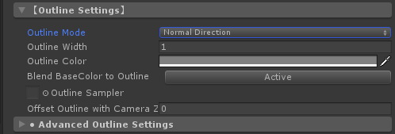

UTS2では、アウトライン機能として、**マテリアルベースのオブジェクト反転方式のアウトライン**を採用しています。  
この方式を簡単に説明すると、シェーダーで元のオブジェクトよりも少し大きめのオブジェクトを面法線だけ反転して生成します。  
新たに生成したアウトライン用オブジェクトには、フロントカリングで描画されますので、元よりも少し大きめに生成したぶんだけ、それが元のオブジェクトによって上書きされると、はみ出した部分がアウトラインのように見えるというものです。  
この方式は比較的軽い上に調整が楽にできるので、ゲーム用のアウトラインとして伝統的に使われてきました。  
**実際にオブジェクトの周りにラインを引いているわけではない**ということに、注意してください。  

**＊参考：実際にオブジェクトの周りにラインを描画する方式もありますが、それらは主にポストプロセス（ポストエフェクト）方式のアウトラインとして知られています。**  
ポストプロセス方式のアウトラインは採用する方式によって、スピードもクオリティも異なります。実際のゲームでは、従来型のオブジェクト反転方式に、軽めのポストプロセス方式を加えて補正する場合が多いです。  

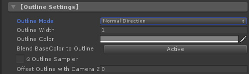

| `アイテム`  | 機能解説 | プロパティ |
|:-------------------|:-------------------|:-------------------|
| `Outline Mode` | アウトライン用反転オブジェクトの生成方式を指定します。`Normal Direction`（法線反転方式） / `Position Scalling`（ポジションスケーリング方式）から選択できます。多くの場合、法線反転方式が使われますが、ハードエッジだけで構成されているキューブのようなメッシュの場合、ポジションスケーリング方式のほうがアウトラインが途切れにくくなります。比較的単純な形状はポジションスケーリング方式で、キャラクターなどの複雑な形状のものは法線反転方式を使うといいでしょう。 | _OUTLINE |
| `Outline Width` | アウトラインの幅を設定します。 **※注意：この値は、Unityへのモデルインポート時のスケールに依存します** ので、取り込みスケールが１でない時には注意してください。 | _Outline_Width |
| `Outline Color` | アウトラインのカラーを指定します。 | _Outline_Color |
| `BlendBaseColor to Outline` | オブジェクトの基本カラーにアウトラインのカラーを馴染ませたい場合に、`Active`にします。 | _Is_BlendBaseColor |
| `Outline Sampler` | アウトラインの幅に入り抜きを入れたい場合や特定のパーツにのみアウトラインを乗せたくない場合などにアウトラインサンプラー（テクスチャ）で指定します。白で最大幅、黒で最小幅になります。必要がない場合、設定しなくても大丈夫です。 | _Outline_Sampler |
| `Offset Outline with Camera Z-axis` | アウトラインをカメラの奥行き方向（Ｚ方向）にオフセットします。スパイク形状の髪型などの場合、プラスの値を入れることでスパイク部分にはアウトラインがかかりにくくなります。通常は０を入れておいてください。 | _Offset_Z |

---
### 「Advanced Outline Settings」サブメニュー

本サブメニューのアイテムで、アウトライン機能をさらに強化することができます。

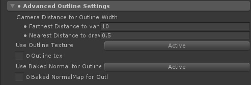

| `アイテム`  | 機能解説 | プロパティ |
|:-------------------|:-------------------|:-------------------|
| `Farthest Distance to vanish` | カメラとオブジェクトの距離でアウトラインの幅が変化する、最も遠い距離を指定します。この距離でアウトラインがゼロになります。 | _Farthest_Distance |
| `Nearest Distance to draw with Outline Width` | カメラとオブジェクトの距離でアウトラインの幅が変化する、最も近い距離を指定します。この距離でアウトラインが`Outline_Width`等で設定した最大の幅になります。 | _Nearest_Distance |
| `Use Outline Texture` | アウトライン用反転オブジェクトにテクスチャを貼りたい場合、`Active`にします。 | _Is_OutlineTex |
| `Outline Texture` | アウトラインに特別なテクスチャを割り当てたい時に使用します。テクスチャを工夫することで、アウトラインに模様を入れたりすることができる他、フロントカリングされる反転オブジェクトに貼られるテクスチャだと考えると、一風変わった表現ができます。 | _OutlineTex |
| `Use Baked Normal for Outline` | `Active`の場合、`BakedNormal for Outline`を有効にします。このアイテムは、アウトラインの描画方式が法線反転方式の時のみ現れます。 | _Is_BakedNormal |
| `Baked NormalMap for Outline` | 事前に他のモデルから頂点法線を焼き付けたノーマルマップを、法線反転方式アウトラインの設定時に追加として読み込みます。詳しい説明は[下](./UTS2_Manual_ja.md#%E3%83%99%E3%82%A4%E3%82%AF%E3%81%97%E3%81%9F%E9%A0%82%E7%82%B9%E6%B3%95%E7%B7%9A%E3%82%92%E8%BB%A2%E5%86%99%E3%81%99%E3%82%8Bbaked-normal-for-outline)を参照してください。 | _BakedNormal |

---
### ●アウトラインの強弱を調整する：**Outline Sampler**

黒でラインなし、白でラインの幅が100%になります。  
適宜 Outline_Sampler を設定することで、アウトラインに入り抜き（強弱）が発生します。  

**※Tips：Outline Sampler を複数キャラに適用する際に、各キャラのパーツのUV配置を共通化する一工夫をすると、モデル汎用に入り抜きの制御が調整できるようになって便利です。**  

<!-- ---
### ●オブジェクト反転方式アウトラインを補う：**UTS_EdgeDetection**
UTS2で採用されているオブジェクト反転方式のアウトラインは、古くから使われている技術ですが、高いリアルタイム性が求められるゲームでは、今でも使われています。  
その一方で、昨今ではマシンパワーもあがりましたので、これらのマテリアルベースアウトラインに加えて、カメラ側にアタッチするポストプロセスエフェクト型のアウトラインも同時に使われるようになりました。  
両者は補完関係にあるので、両者を適宜組み合わせることで、さらに綺麗なアウトラインが得られます。  

UTS2にもオブジェクト反転方式アウトラインと組み合わせて使う、**UTS_EdgeDetection**と呼ばれるポストエフェクトが付属しています。  
UTS_EdgeDetectionをメインカメラにアタッチすることで、UTS2のオブジェクト反転方式アウトラインがさらに綺麗になります。  

UTS_EdgeDetectionは、UTS2プロジェクトのルートに、**UTS_EdgeDetection.unitypackage**で提供されています。  
本パッケージをUnityにD&Dすることで、インストールします。  
`ToonShader_CelLook.unity`などがサンプルシーンになっていますので、シーン内のメインカメラにアタッチされている、UTS_EdgeDetectionコンポーネントを確認してみてください。  

### ●UTS_EdgeDetection.unitypackage  

ポストエフェクトタイプのエッジ抽出フィルタです。  
元々はUnityの[Standard Assetsにあったものを改造したフィルタ3つ](https://docs.unity3d.com/ja/540/Manual/script-EdgeDetectEffectNormals.html)に加えて、新規に作成した**Sobel Color Filter**が追加されています。  
Sobel Color Filterを使うことで、効果的にトゥーンラインエッジを強調し、セル画時代の色トレス風の雰囲気を出すことができます。  
本ポストエフェクトは、ポストエフェクトスタックの前に入れるとよいと思います。  
 -->
---
### ●ベイクした頂点法線を転写する：**Baked Normal for Outline**  
頂点法線を焼き付けたノーマルマップを、法線反転アウトラインの設定時に追加的に読み込むことができるようになりました。本機能を使うことで、ハードエッジのオブジェクトに、ソフトエッジのオブジェクトのアウトラインを、事前にベイクしたノーマルマップを経由して適用することができるようになります。  

Baked Normalマップを使用する時には、UTS2のアウトライン設定メニューで、  
1.  Outline Mode を **"Normal Direction"** に  
2.  Use Baked Normal for Outline を **"Active"** に  
3.  Baked Normal for Outline に使用したいマップを適用します。 

**Baked Normal for Outline として適用できるノーマルマップ**は以下のような仕様となっています。  
1.  適用するオブジェクトの UV は重ならないこと。つまり、**全てのノーマルマップが重ならないように UV 展開がされていること**が必須です。  
2.  ノーマルマップ自体の仕様は、Unity と同じで、**OpenGL 準拠**となります。  
3.  使用するノーマルマップのテクスチャ設定は、以下のようになります。  
・Texuture Type は **"Default"** にする。 **※注意： "Normal map" に設定してはいけません**。  
・sRGB (Color Texture) を必ず **"OFF"** にする。  

詳しくはサンプルプロジェクト内の Baked Normal フォルダ内のアセットを確認してください。  

**※注意：この方式による頂点法線の調整は、バーテックスシェーダー側で行われますので、適用される頂点数にそのまま依存します**。つまり、ピクセルシェーダー側のように頂点法線間で補正するものではありませんので、注意してください。  

---
### ●アウトラインをカメラの奥に移動する：**Offset Outline with Camera Z-axis**

`Offset Outline with Camera Z-axis`に値を入れることで、アウトラインがカメラの奥行き方向（Ｚ方向）にオフセットされます。  
図のようなスパイク形状の髪型の場合に、スパイク部分のアウトラインの出方を調整するのに使用します。  
通常は０を入れておいてください。  

---
## 10.「DX11 Phong Tessellation Settings」メニュー
UTS2のテッセレーション機能は、**Windows/DX11環境でのみ**使用できます。  

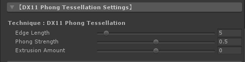

| `アイテム`  | 機能解説 | プロパティ |
|:-------------------|:-------------------|:-------------------|
| `Edge Length` | カメラとの距離に基づいて、よりテッセレーションを分割します。同じ距離では、値が小さいほうが細分化されます。デフォルトは 5 です。 | _TessEdgeLength |
| `Phong Strengh` | テッセレーションによって細分化された分割面の引っ張り強度を変化させます。デフォルトは 0.5 です。 | _TessPhongStrength |
| `Extrusion Amount` | テッセレーションの結果として発生する、膨張分を全体としてスケーリングします。デフォルトは 0 です。 | _TessExtrusionAmount |

対応部分のコードは、Nora氏の https://github.com/Stereoarts/UnityChanToonShaderVer2_Tess を参考にさせていただきました。  
Tessellationは、使えるプラットフォームが限られている上に、かなりパワフルなPC環境を要求しますので、覚悟して使ってください。想定している用途は、パワフルなGPUを搭載しているWindows10/DX11のマシンを使って、映像＆VR向けに使用することです。  
Light版とあるものは、ライトをディレクショナルライト１灯に制限した代わりに軽量化したバリエーションです。  

---
## 11.「LightColor Contribution to Materials」メニュー

各カラーに対する、シーン内のリアルタイムライトのカラーの影響を、個別にON/OFFできるスイッチを集めたものです。
`Active`の場合、各カラーに対するリアルタイムライトのカラーの影響が有効となり、`Off`の場合、インテンシティが１の時の各カラーの設定色がそのまま表示されます。

本メニューから、各カラーへのライトカラーコントリビューション（寄与）のあり/なしを一元的に管理できます。  
実際にシーン内で使用するキャラクターライトを使いながら、各カラーへの影響がライトコントリビューションのあり/なしでどう変わるかをリアルタイムで確認できます。ルックデブの仕上げに使うとよいでしょう。  

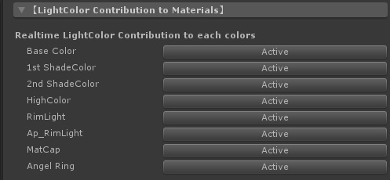

| `アイテム`  | 機能解説 | プロパティ |
|:-------------------|:-------------------|:-------------------|
| `Base Color` | 基本色に対しライトカラーを有効にします。 | _Is_LightColor_Base |
| `1st ShadeColor` | １影色に対しライトカラーを有効にします。 | _Is_LightColor_1st_Shade |
| `2nd ShadeColor` | ２影色に対しライトカラーを有効にします。 | _Is_LightColor_2nd_Shade |
| `HighColor` | ハイカラーに対しライトカラーを有効にします。 | _Is_LightColor_HighColor |
| `RimLight` | リムライトに対しライトカラーを有効にします。 | _Is_LightColor_RimLight |
| `Ap_RimLight` | APリムライト（対蹠リムライト）に対しライトカラーを有効にします。 | _Is_LightColor_Ap_RimLight |
| `MatCap` | MatCapに対しライトカラーを有効にします。 | _Is_LightColor_MatCap |
| `AngelRing` | 「天使の輪」に対しライトカラーを有効にします。 | _Is_LightColor_AR |
| `Outline` | アウトラインに対しライトカラーを有効にします。アウトラインに対するライトカラーの寄与は次のとおりです。「OFF」の時、アウトラインカラーに設定したカラーがそのまま表示されます。「Activeの時でシーン中にリアルタイムディレクショナルライトが１灯ある」時、リアルタイムディレクショナルライトのカラーと明るさにアウトラインカラーが反応します。「Activeの時でシーン中にリアルタイムディレクショナルライトがない」時、Environment LightingのSourceの内、Colorの色と明るさにアウトラインカラーが反応します。**この時、Skyboxを使用していてもColorの値が参照されることに注意してください。またリアルタイムのポイントライトやColor以外の環境光には、反応しませんので合わせてご注意ください。**  | _Is_LightColor_Outline |

※ヒント：各カラーの設定が `Off` の場合、シーン内のライトの強さに関わらず、「オフにされたカラーは、常にライトのIntensityが１、ライトカラーが白の状態で照らされている状態」になります。  

---
## 12.「Environmental Lighting Contributions Setups」メニュー

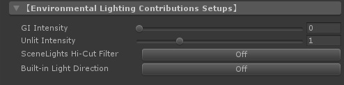

本メニューには、シーン内の環境光設定（Skybox、Gradient、ColorなどのEnvironment Lighting）やライトプローブに対して、UTS2がどの程度反応をするか調整したり、リアルタイムディレクショナルライトがない環境で起動するシェーダービルトインライトの明るさを調整をするアイテムが含まれています。  
また**VRChatユーザーに便利な機能**である、**SceneLights Hi-Cut Filter**のような白飛び防止機能のON/OFFも、このメニューからコントロールすることが可能です。  

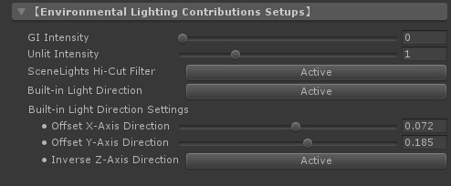

| `アイテム`  | 機能解説 | プロパティ |
|:-------------------|:-------------------|:-------------------|
| `GI Intensity` | `GI Intensity` を０以上に設定することで、UnityのLightingウィンドウ内で管理されているGIシステム、特に[ライトプローブ](https://docs.unity3d.com/ja/current/Manual/LightProbes.html)に対応します。 `GI Intensity` が１の時、シーン内のGIの強度が100％となります。 **v.2.0.6で機能強化をしましたので、ライトプローブを含むGIを利用したい場合には、まず１を設定した後（Standard Shaderとほぼ同様の明るさになります）で、必要に応じて調整してください。** | _GI_Intensity |
| `Unlit Intensity` | シーン内に有効なリアルタイムディレクショナルライトが１灯もない時に、[Environment LightingのSource設定](https://docs.unity3d.com/ja/current/Manual/GlobalIllumination.html)を元にシーンの明るさとカラーを求め、それを`Unlit Intensity`の値でブーストして光源として使用します（本機能を **「アンビエントブレンディング」** と呼んでいます）。デフォルトは１（アンビエントカラーをそのまま受ける）で、０にすると完全に消灯します。本機能は環境カラーにマテリアルカラーを馴染ませたい時に使いますが、 **より暗めに馴染ませたい場合は 0.5～1 程度** に設定し、 **より明るくカラーを出したい場合は 1.5～2 程度** に設定するとよいでしょう。（v.2.0.6より、最大値が4になりました。） | _Unlit_Intensity |
| `SceneLights Hi-Cut Filter` | シーン内に極端に明るさ（Intensity）が高い、複数のリアルタイムディレクショナルライトやリアルタイムポイントライトがある場合に、白飛びを抑えます。`Active`にすることで、各々のライトのカラーと減衰特性を保ちつつ、マテリアルカラーが白飛びするような高いインテンシティだけをカットします。デフォルトは`Off`です。本機能を使用する時には、「LightColor Contribution to Materials」メニュー内の、基本３色の設定がすべて`Active`になっていることを確認してください。 **VRChatユーザーは`Active`にすることをお薦めします。** ※ヒント：この機能を使っても白飛びが発生する場合、ポストエフェクト側のブルームなどの設定をチェックしてみてください。（特にブルームのスレッショルドの値が１以下だと白飛びしやすくなります。） | _Is_Filter_LightColor |
| `Built-in Light Direction` | 上級者向け機能として、ビルトインライトディレクション（シェーダー内に組み込まれているバーチャルライトの方向ベクトル）を有効にします。本機能が有効な時、ライトの明るさとカラーは、シーン内の有効なリアルタイムディレクショナルライトの値を使用します。もしそのようなライトがない場合は、アンビエントブレンディングの値を使用します。 | _Is_BLD |
| Built-in Light Direction Settings | 以下、ビルトインライトディレクションの設定をします。 |  |
| `Offset X-Axis Direction` | ビルトインライトディレクションによって生成される、バーチャルライトを左右に動かします。 | _Offset_X_Axis_BLD |
| `Offset Y-Axis Direction` | ビルトインライトディレクションによって生成される、バーチャルライトを上下に動かします。 | _Offset_Y_Axis_BLD |
| `Inverse Z-Axis Direction` | ビルトインライトディレクションによって生成される、バーチャルライトの向きを前後で切り替えます。 | _Inverse_Z_Axis_BLD |

---
### ●ライトプローブの明るさを決定する：GI Intensity

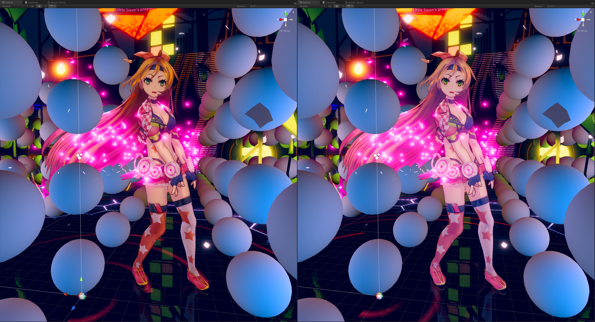

**↑ 左側：GI Intensity = 0、右側：GI Intensity = 1。GI Intensityの数値を上げると、マテリアルカラーにライトプローブのカラーが加算される。**  

**↑ ステージ上に配置された、ベイク用ポイントライトとライトプローブの例。ベイクドライトは、各レンジが重なっても問題ない。ライトプローブは、ユニティちゃんの足元から背の高さまで敷き詰める。**  

`GI Intensity` を０以上に設定することで、ライトプローブなどの加算合成系のGIシステムに対応します。  
ベイクドライトと一緒にシーン内にベイクされたライトプローブは、環境補助色としてマテリアルカラーに加算されます。  
`GI Intensity`が１の時、ライトプローブに焼き付けられたカラーを100％加算します。０の時は、元のマテリアルカラーのままです。  

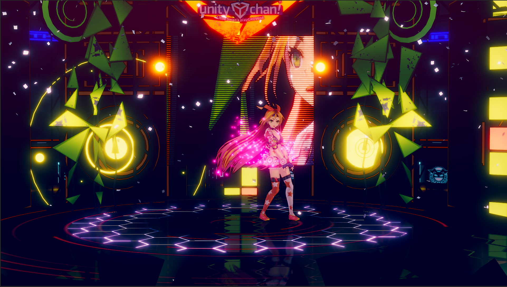

**↑ GI Intensity = 0**  

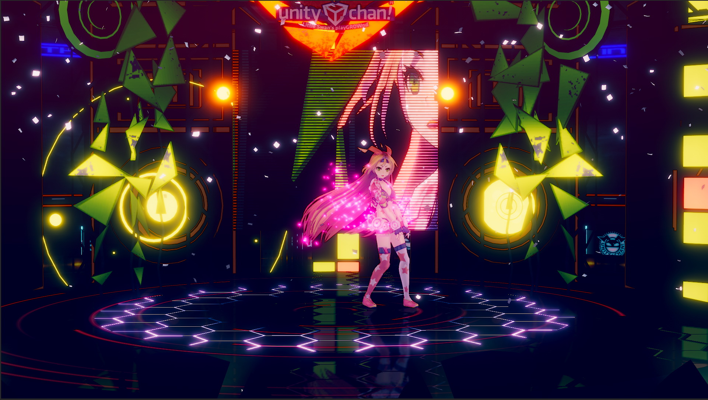

**↑ GI Intensity = 1**  

---
### ●アンビエントブレンディングを調整する：Unlit Intensity  

アンビエントライトの設定をライトカラーが反映するようになりました。  
その結果として、ディレクショナルライトのインテンシティの下限が、シーンのアンビエントライトの設定となります。  
VRChatで、アンビエントライトの設定に基づくワールドごとの明るさの差異を自動で調整できます。  
なおアンビエントライトからの明るさは、Unlit_Intensity スライダーで調整することができます。Unlit_Intensityは、アンビエントライトの明るさをブーストします。  
デフォルトは 1（そのまま）になっています。  

また有効なディレクショナルライトがシーン中にない場合、シェーダーに組み込まれたデフォルトライトが有効になりますが、その向きが常にカメラが見る方向に追従するようになりました。  
結果、カメラから見て常に良い感じにライティングされるようになりました。  
このライトは、アンビエントライトブレンディング動作中に機能します。  

以下に、アンビエントブレンディングとUnlit_Intensityの機能を解説するムービーを用意しました。  

---
### ●極めて明るいライトが複数存在するシーンでの白飛びを抑える：SceneLights Hi-Cut Filter  

**SceneLights Hi-Cut Filter** は、VRChatユーザーには大変便利な機能です。  
下に詳しい機能説明のムービーを用意しました。  
またムービー中では、PPSでトーンマッパーを設定する方法も簡単に説明しています。  

---
### ●アドバンス機能として、Built-in Light Directionを追加  

上級者向け機能として、シェーダー内にビルトインされているライトディレクションベクトルを任意の方向に設定できるようにしました。  
Built-in Light Directionを有効にしたマテリアルは、それが適応されるメッシュのオブジェクト座標に対して、独自のシェーディング用ライトディレクションベクトルを持つことができるので、専用の固定ライトを持つことと同じ効果が得られます。  
そのパーツが落とすドロップシャドウは、シーン中のディレクショナルライトを使いますので、シェーディングの落ち方とドロップシャドウの落ち方を変えることもできます。  
Built-in Light Directionのライトカラーは、シーン中のメインとなるディレクショナルライトの設定を使います。  

Built-in Light Directionの使い方は、下のムービーを見てみてください。  

<!-- 
# 映像（プリレンダー）での使用

プリレンダーで使用する場合には、イメージエフェクト側につけているAnti Aliasingは外して、フレームキャプチャで4K出力をしたものを使用サイズに縮小して使うほうが綺麗な可能性が高いです（事実上のスーパーサンプリング）。  

**フレームキャプチャ**は以下で提供されています。  
https://github.com/unity3d-jp/FrameCapturer  
フレームキャプチャの出力結果は、NUKEやAfterEffectsで利用できます。  

他、**Alembic Importer/Exporter**があるので、映像用にはこちらも使うとよいでしょう。  
https://github.com/unity3d-jp/AlembicImporter  
 -->

# ライセンスについて

「ユニティちゃんトゥーンシェーダーVer.2.0」は、 **UCL2.0（ユニティちゃんライセンス2.0）** で提供されます。  
ユニティちゃんライセンスについては、以下を参照してください。  
https://unity-chan.com/contents/guideline/  

**※ヒント：** しばしば質問されることですが、UCL2.0で配布されるUTS2のシェーダーファイル（.shader）およびそのインクルードファイル（.cginc）は、これらのファイルを自作の3Dモデルなどに同梱し、商用/非商用を問わず再配布するのは自由です。また、どのようなタイプ/デザインの3Dモデルやコンテンツ（アダルト向けも含みます）に適用しても構いません。  
再配布を受けるユーザーの便宜のために、「UTS2 v.2.0.5を使用している」などの後のバージョンアップのために便宜を図る情報を記載することはお願いしたいですが、それ以外には特に掲示すべきものはありません。  
各ファイルのヘッダー部には、UCL2.0のライセンス表記がありますので、そちらは修正しないでそのまま同梱することをお願いします。  

**※コンテンツに採用した場合** ：UTS2を使ったステキなモデルやコンテンツができましたら、是非、[Unity Technologies Japan](https://twitter.com/unity_japan)にまでご連絡ください。皆さんの力作のご報告を、スタッフ一同、楽しみに待ってます！  

# おまけ  
UTS2を使う上で便利なTipsを紹介します。  

## １．Tips:システムシャドウ使用時に、各色の境界に生じるアーティファクトの軽減法  

上図のような、Unityのシステムシャドウとカスタムライティングとの境界に生じるアーティファクトの軽減法を解説します  

### 【１：リニアカラースペースに変更する】

現在のカラースペースが、ガンマカラースペースの場合には、まず**リニアカラースペースに変更**します。  
リニアカラースペースのほうが、アーティファクトの階調変化は柔らかくなる傾向があります。  

### 【２：メッシュの分割度をあげる】

ライティングおよびシェーダーのパラメタが全て同じ条件だったら、**メッシュの分割度を上げます**。  
メッシュの分割度をあげることで、これらのアーティファクトの多くは消失します。  

### 【３：BaseColor Step/System Shadows Level の調整でアーティファクトを消す】

図①の影の境界の位置では、Unityのシステムシャドウとカスタムライティングの閾値より作られる影が、ほぼ一致しています。  
そのことは、この状態で `Receive System Shadows` をオフにしても、影の境界位置が動かないことからわかります。  

図①の状態の時に、`Base/Shade Feather`スライダーを右に動かすと、アーティファクトが発生します（図②）。  
これは、**Unityのシステムシャドウの内側にカスタムライティングの影の閾値が食い込むために発生**します。  

このような時には、図③のように **`BaseColor Step`スライダーも右に動かしてやる**ことにより、**カスタムライティングが作る影の領域を増やしてやります**。  
すると良い感じにアーティファクトも消失し、境界ぼかしが発生します。  

また同様に、**`System Shadows Level` スライダーを使って、システムシャドウ側のレベル補正をする**ことで、アーティファクトを消すこともできます。  
**※まずはこちらからお試しになることをお薦めいたします。**  

### 【４：ディレクショナルライトのバイアスを上げてやる】

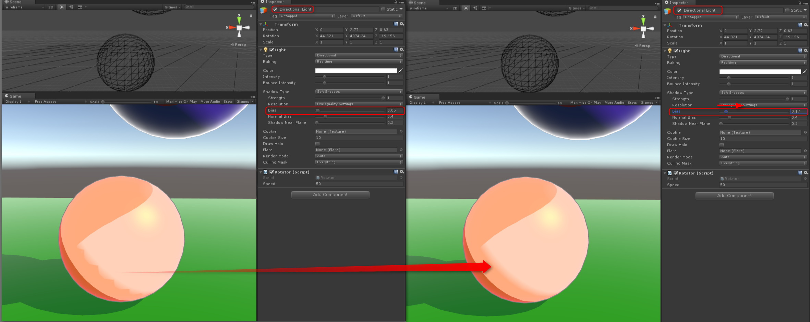

最後に、キーライトとして球を照らしている**ディレクショナルライトのバイアスをあげてやる**という方法があります。  
バイアスを上げることで、システムシャドウの位置が変化するからです。  
ただしバイアスを上げすぎると、今度は落ち影全体の発生位置がオブジェクトから大きくずれることも発生しますので、注意が必要です。  

---
## ２．Tips:リアルタイムポイントライトを複数使う時のライトフリップの軽減法  

シーン内に4つ以上のリアルタイムポイントライトのレンジが重なっている場所がある場合、UTS2を適用したモデルに当たるライトがフリップすることがあります。  
これは、「フォワードレンダリングでは、リアルタイムポイントライトは4つまで」というUnityの制限に基づく現象で、UTS2でも仕様となります。  
本ムービーでは、そのようなフリップ現象をなくす方法を紹介します。こちらはUTS2だけでなく、Stadard Shaderなどでもそのまま使えます。  

---
## ３．ユーザーサポートに寄せられたトラブル事例の解決法  

こちらでは、Twitterなどを通じて寄せられたトラブル事例につきまして、マニュアルを見ているだけでは解決が難しそうなものをピックアップして紹介いたします。  
ご参考にしてください。  

---
### 3-1. 予期していない場所に影が出る  

図中の矢印の位置の黒い影が、それに当たります。  
この例では、予期していない影が出ているほうのパイプは、**UVが展開されていません**。同様に**UVが潰れている**場合も、このように予期しない影が出ることがあります。  
このような場合、再度DCCツールでモデルを開いてUVをきちんと展開すると、右のパイプのように正常な表示になります。  
DCCツールにMayaを使っている場合には、滅多に発生しませんが、Blenderを使っている場合や、CADなどのアプリからデータをインポートした場合にご注意いただくとよいかと思います。  

---
### 3-2. VRChatサーバーにアバターをアップロードして、HMDで見たところ、左右の視差がずれている  

※スクリーンショット提供：@NonameReUnder さん  

ごくたまに、VRChatサーバにアバターをアップロードしてHMDで見たところ、左右の視差がずれてしまっているという報告を受けることがあります。  

こちらは詳しい原因は不明ですが、なんらかの理由でVRChatのサーバにアップロードされたシェーダーが壊れてしまっているためと考えられています。  

この症状が発生した場合、以下の手順のいずれかで改善されますので、お試しください。  

1. アバターが含まれるプロジェクトを新規に作成し直して、再度VRChatにアップロードする。  

2. プロジェクトから、UTS2が入っているAssets内のToonフォルダを削除する。続いて、UTS2をインストールし直してから、再度VRChatにアップロードする。  

1もしくは2の手順を行った後で、VRChatサーバへ再度アップロードを試みると、上手くいくとの報告を受けています。  
おそらくVRChatサーバの混み具合等も関係していると思われますので、もし不具合が発生した場合には、時間を変えて何回かアップロードを試みるとよいとのことです。  

---
### 3-3. VRChat上で、ブルームが酷く光ることがある  

※スクリーンショット提供：@nD_ntny さん  

VRChatで使われている、Post-Processing Stack(PPS)に含まれるBloom効果が酷く光ってしまうことが、まれにあります。  
※なお本不具合は、@nD_ntny さんによれば、**UTS2やStandard Shaderでは発生しない**とのことです。  

こちらはPPS側の不具合と思われますが、現象としては、スケールが0のパーティクルが画面内にあったり、UVが一点に集中しているパーツが画面内にあると発生します。カメラの角度によっては、UVは正常でもカメラに対して面が水平になる瞬間にも発生することがあります。特にパーティクルで発生しやすいので、スケールには気をつけたほうがよいでしょう。  

本エラーはゼロ除算エラーに基づくもののようですが、VRChat内のPPSには対策が施されていないようで、現在でも症状が見られます。  
さらに詳しい情報に関しては、以下をご確認ください。  

* [Bloom White-out](https://github.com/Unity-Technologies/PostProcessing/issues/356)
* [[V2] Temporal AA creates NaNs (or infinities?) when handling alpha blended particle shader](https://github.com/Unity-Technologies/PostProcessing/issues/340)

---
