# ユニティちゃんトゥーンシェーダー 2.0 v.2.0.5 マニュアル
### 2018/11/17 Nobuyuki Kobayashi (Unity Technologies Japan)

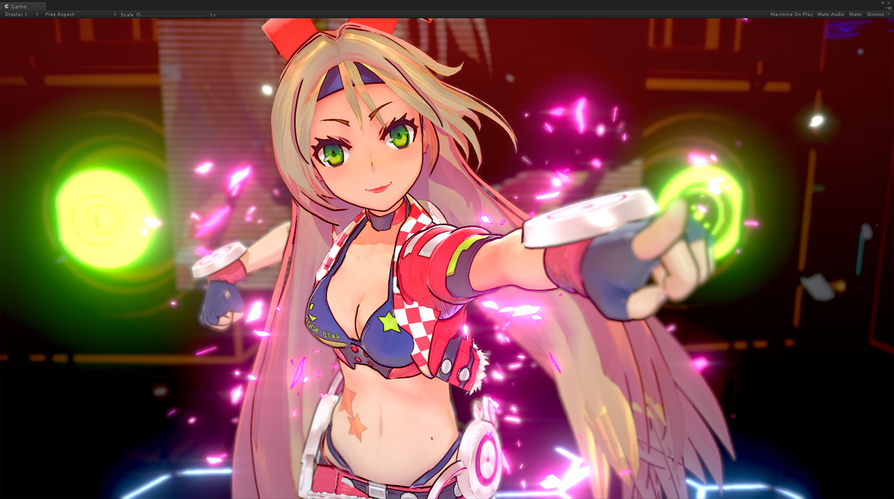
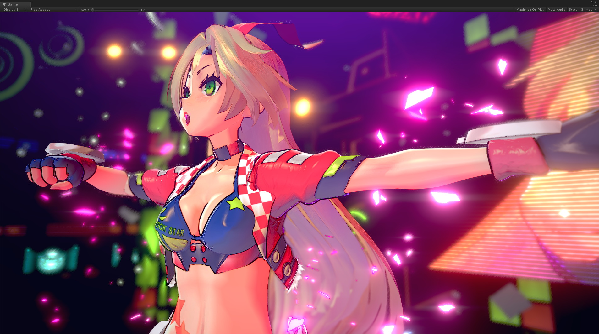

# ユニティちゃんトゥーンシェーダー 2.0 の紹介
ユニティちゃんトゥーンシェーダー（UTS）は、セルルック3DCGアニメーションの制作現場での要望に応えるような形で設計された、映像志向のトゥーンシェーダーです。  

セルルック3DCGアニメーションの制作現場向けの設計になっていますので、いわゆる「影」は色設計担当者が作成しやすいような「影色設定」を使う方式であり、かつ各パーツの形状（フォルム）を強調する「影」や、キャラクターのデザイン上、光源の位置や強さとは関係なく、必ず必要となる「影」が出しやすいように設計されています。  
特にこれら「影」の調整機能は強力で、多数のライトを使わなくてもシェーダー内のスライダーだけで調整することが可能です。  

ユニティちゃんトゥーンシェーダー 2.0（UTS2）では、従来の機能に加えて大幅な機能強化を行いました。  
Ver.1.0でできる絵づくりをカバーしつつ、さらに高度なルックが実現できるようになっています。  

カラーやテクスチャは、「**基本色（ベースカラー）**」、「**１影色**」、「**２影色**」による３色塗り分けに加えて、「**ハイカラー**」や「**リムライト**」、「**MatCap**（スフィアマッピング）」、「**エミッシブ**（自己発光）」などの沢山のオプションを追加することができます。  

また各カラー間のぼかし加減も、Unity上でリアルタイムに調整することが可能となっています。  

デザイン上必要となる固定影の配置も、各影色ごとに発生する位置を設定できる「**ポジションマップ**」に加え、ライティングによって影の出やすさを変えることのできる「**シェーディンググレードマップ**」と、２種類の手法を選べます。  
さらに「**瞳や眉毛の前髪への透過**」など、アニメ風キャラクター表現に便利な機能も搭載しています。  

結果として、ユニティちゃんトゥーンシェーダー 2.0（UTS2）では、セルルックから始まり、ラノベ風のイラスト表現まで幅広いキャラクター表現が可能となっています。  
もちろんUnityのシステムシャドウにも対応しています。  

さらにポストエフェクトを追加することで、物理ベースレンダリング（PBR）に対応するスタンダードシェーダーで表現できる絵的要素を、ユニティちゃんトゥーンシェーダー 2.0（UTS2）では、全てノンフォトリアリスティックレンダリング（NPR）で表現することが可能です。  

また昨今のVRChatでのユーザーの声を反映し、様々なライティング設定の環境下でも、キャラクターが美しく表現されるように様々な工夫が実装されています。  

是非、貴方のご自慢のキャラクターモデルをユニティちゃんトゥーンシェーダー 2.0（UTS2）で彩ってみてください。  
今まで以上に、キャラクターが美しく表現されるものと思います。  

本マニュアルは、ユニティちゃんトゥーンシェーダー 2.0の最新版 **UTS2 v.2.0.5** 向けに書かれています。  

## 【開発環境】
ユニティちゃんトゥーンシェーダー 2.0は、Unity5.6.3p1ベースで開発され、最新のUnity 2018.xでも表示できることを確認しています。  
（ただしレガシーパイプラインのみで、現状はSRPには対応していません。）  

## 【ターゲット環境】
Unity5.6.x もしくはそれ以降が必要です。Unity 2017.4 15f1 LTSでの動作確認済み。Unity 2018.1.0f2以降でも使用できます。  
本パッケージは、Unity5.6.3p1で作成されています。  

Forwardレンダリング環境。リニアカラースペースでの使用を推奨します。  
（ガンマカラースペースでも使用できますが、ガンマカラーの特性上、陰影の階調変化が強めに出る傾向があります。詳しくは、[リニアのワークフローとガンマのワークフロー](https://docs.unity3d.com/ja/current/Manual/LinearRendering-LinearOrGammaWorkflow.html) を参照してください。）  

## 【インストールの仕方】
1. ユニティちゃんトゥーンシェーダー 2.0の配布プロジェクトを解凍し、フォルダ直下にある `UTS_ShaderOnly_v(バージョン名).unitypackage`というファイルを探します。  
図の例では、`2.0.4.3_Release_p1`という部分がバージョン名になっています。  

2. ユニティちゃんトゥーンシェーダー 2.0をインストールしたい、Unityプロジェクトを開きます。  

3. UnityのProjectウィンドウより、Assetsフォルダを開きます。  

4. OSのExplorerやFinderから、`UTS_ShaderOnly_v(バージョン名).unitypackage`をUnityのProjectウィンドウ内のAssetsフォルダにドラッグ＆ドロップします。  

5. Import Unity Packageウィンドウが開きますので、全てのファイルをImportします。  

6. するとAssets下にToonというフォルダができます。この中にユニティちゃんトゥーンシェーダー 2.0がインストールされてます。  

7. 新規にマテリアルを作成し、Shaderドロップダウンから、UnityChanToonShaderという項目が見つかれば、インストールは成功しています。  

## 【UTS2の基本的な設定の仕方】

例として、以下のムービーを参考に、シェーダーボール上で肌色のマテリアルを設定してみましょう。  

またUTS2初心者の方は、いきなり全ての機能を使ってみようとするのではなく、まず「基本色と１影色の段階（Step）とぼかし（Feather）だけで絵作りをする」という練習をやってみるといいでしょう。  
これらのUTS2での基本の絵作りに十分慣れてから、徐々にリムライトなどを追加し、必要だったら２影色を加えるようにするのが取得のコツです。  
是非、以下のムービーを参考に練習をしてみてください。  

# UTS2各シェーダーの使い分け

ユニティちゃんトゥーンシェーダー 2.0（以下、UTS2）がインストールされているシェーダー階層（UnityChanToonShader）を開くと、多くのシェーダーファイルがあります。  
この時点で「そっと閉じ」てしまう人が多いようですが、よく見てみると、アンダーバーで区切られたいくつかの名前ブロックの組み合わせでできていることに気づくと思います。例えば、`Toon`、`DoubleShadeWithFeather`、`Clipping`、`StencilMask`…などです。  
これらの名前ブロックは、UTS2の基本的な機能を示しています。同じ名前ブロックを持つシェーダーは、同じ機能を持っています。  
まずは、これらの名前ブロックと機能について解説します。  

## ●UnityChanToonShaderルートフォルダ内のシェーダー

UTS2には、大きく分けて2つの系統のシェーダーがあります。  
* `DoubleShadeWithFeather` : UTS2の標準シェーダーです。2つの影色（Double Shade Colors）と、各々のカラーの境界にぼかし（Feather）を入れることができます。  
* `ShadingGradeMap` : 高機能版のUTS2シェーダーです。DoubleShadeWithFeatherの機能に加えて、ShadingGradeMapという特別なマップを持つことができます。  

搭載されている基本機能はほぼ同じですので、共に色分け段階（`_Step`）とぼかし程度（`_Feather`）の数値を合わせれば、同じルックを作ることができます。  
どちらを使うかは好みの問題ですが、パキッとした色分けが必要なセルルックには`DoubleShadeWithFeather`系が向いており、ぼかしを多用するイラストルックには`ShadingGradeMap`系が向いているようです。  

またシェーダー名の一番頭に`Toon`とあるものは、**オブジェクト反転方式によるアウトライン機能**を持っています。  
UTS2のアウトラインは、専用テクスチャを使ったアウトラインの入り抜き（強弱）調整の他、ベースカラーに馴染ませたり、カメラベースでオフセット調整ができたりなど、多彩な調整機能を持っています。  

シェーダー名の後ろ側には、`Clipping`などの名前ブロックがあります。これらは以下のような機能があることを示しています。  

* `Clipping` : クリッピングマスクを持てるシェーダー。いわゆる「テクスチャの抜き」（カットアウトやディゾルブ）ができます。  
* `TransClipping` : 同じくクリッピングマスクを持てますが、マスクのα透明度（Transparency）を考慮した「テクスチャの抜き」ができます。より綺麗な抜きができるぶん、負荷は`Clipping`よりも高くなります。  
* `StencilMask` : ステンシルバッファによるパーツの透過を指定します。「眉毛」パーツのアニメ的な表現で、常に「前髪」パーツよりも前面に表示したいような場合などに使用するシェーダーです。必ず`StencilOut`系シェーダーと組み合わせて使います。  
* `StencilOut` : `StencilMask`系シェーダーと一緒に使います。上の例だと、「眉毛」パーツを透過させる側である「前髪」パーツに設定するシェーダーです。  

## ●UnityChanToonShader/NoOutlineフォルダ内のシェーダー

`NoOutline`というフォルダ内に入っているシェーダーには、シェーダー名の一番頭に`ToonColor`という名前がついていますが、これは**アウトライン機能を持たない**ことを表しています。  

アウトライン機能を持たないぶん、描画パスがひとつ少なくなりますので、アウトラインの必要がないデザインだったり、別途 [PSOFT Pencil+ 4 Line for Unity](https://www.psoft.co.jp/jp/product/pencil/unity/) のような高精度のトゥーンラインシェーダーを使用したい場合には、こちらを選ぶとよいでしょう。  

`NoOutline`系シェーダーの中に、最後に`Transparent`という名前ブロックを持つシェーダーがあります。  
これは、**半透明に特化したシェーダー**です。「頬染め」用パーツなどに使える他、ガラスのような表現にも使えます。  

## ●UnityChanToonShader/AngelRingフォルダ内のシェーダー

`AngelRing`フォルダ内には、**「天使の輪」機能**を持つシェーダーが入っています。  
「天使の輪」とは、下図のようなハイライト表現のことです。カメラから見て常に固定の位置に現れます。  

「天使の輪」機能を持つシェーダーは、高機能版UTS2である`ShadingGradeMap`系シェーダーと、そのバリエーションである`ShadingGradeMap_TransClipping`系シェーダーのみとなっています。  
また主に「髪の毛」パーツに使われるシェーダーなので、ステンシルで抜かれる側である`StencilOut`系のシェーダーが付属しています。  

## ●UnityChanToonShader/Mobileフォルダ内のシェーダー

`Mobile`フォルダ内には、モバイルやVRコンテンツ向けに、ほぼルックが替わらない程度に軽量化したシェーダーが入ってます。  
モバイル版では、軽量化のために以下の仕様に制限しています。  

* **リアルタイムディレクショナルライト１灯のみ**の対応に制限しています（**複数のライトや、リアルタイムポイントライトには反応しません**）。  
* ポイントライトへは、ベイク済みポイントライト＋[ライトプローブ](https://docs.unity3d.com/ja/current/Manual/LightProbes-MovingObjects.html)の組み合わせで対応します。その場合、`GI_Intensity` を適度に調整する必要があります。  

通常版`Toon_DoubleShadeWithFeathe`系、`Toon_ShadingGradeMap`系各シェーダーとはプロパティ互換がありますので、上記機能で十分な場合、通常版と同名のMobile版シェーダーに切り替えるとレンダリングパフォーマンスが向上します。  

`Mobile/AngelRing`フォルダ内には、「天使の輪」機能に対応したモバイル版シェーダーが入っています。  
各シェーダーの基本機能は、通常版の同名のものと同じです。  

## ●UnityChanToonShader/Tessellationフォルダ内のシェーダー

`Tessellation`フォルダ内には、DirectX 11の[Phong テッセレーション](https://docs.unity3d.com/ja/current/Manual/SL-SurfaceShaderTessellation.html)に対応したUTS2シェーダーが入っています。  
Phong テッセレーションは、結果となる表面がメッシュの法線にある程度沿うように、再分割（subdivide）された面の位置を修正します。ローポリのメッシュについてスムージングするのにかなり効果的な方法です。  
UTS2では、WindowsでDirectX 11以上が稼働している環境でのみPhong テッセレーションが利用できます。  

`Tessellation/Light`フォルダには、`Mobile`版と同様の仕様制限を行った軽量化バージョンが入っています。  
その他のフォルダに関しても、すでに説明したものと同様の機能を持つUTS2シェーダーのPhong テッセレーション対応版が入ってます。  

Phong テッセレーションを利用することで、アウトラインのクオリティや唇などの細部表現が大いに向上します。  
主にプリレンダー映像向けのシェーダーですが、その他にも、「キャラの近くまで接近する必要のある」ハイエンドVR向けキャラクターコンテンツなどで使用されています。  

## ●UnityChanToonShader/Helperフォルダ内のシェーダー

`Helper`フォルダ内には、アウトラインオブジェクトのみを表示するシェーダーが入っています。  
マルチマテリアルとしてパーツに重ねてやることで、アウトラインオブジェクトを重ね描きすることができます。  

アウトラインを重ね描きしたいメッシュの`Skinned Mesh Renderer` > `Materials`より`Size`をひとつ増やし、追加するアウトラインマテリアルを登録します。  

**注意：アウトラインを重ね描きしますので、当然負荷は高まります。十分注意して使用してください。**  

# サンプルシーン
プロジェクトを開くと、\Assets\Sample Scenesフォルダ以下に、次のようなサンプルシーンがあります。  

* BoxProjection.unity		：Box Projection を使った暗い部屋のライティング  
* ToonShader.unity			：イラストルックのシェーダー設定  
* ToonShader_CelLook.unity	：セルルックのシェーダー設定  
* ToonShader_Emissive.unity	：エミッシブを使ったシェーダー設定  
* ToonShader_Firefly.unity	：複数のリアルタイムポイントライト  
* Baked Normal\Cube_HardEdge.unity：Baked Normalの参考  
* Sample\Sample.unity		：UTS2の基本シェーダーの紹介  
* ShaderBall\ShaderBall.unity：シェーダーボールを使ってUTS2を設定する  
* PointLightTest\PointLightTest.unity：ポイントライトを使ったセルルック表現のサンプル  
* SSAO Test\SSAO.unity		：SSAO in PPSのテスト用  
* NormalMap\NormalMap.unity	：UTS2でノーマルマップを使う際のコツ  
* LightAndShadows\LightAndShadows.unity：スタンダードシェーダーとUTS2との比較  
* AngelRing\AngelRing.unity：「天使の輪」のサンプル  
* MatCapMask\MatCapMask.unity：MatcapMaskのサンプル  

各シーンは、シェーダーやライティングの設定の参考用です。  
作りたいルックやシーンの参考に役立つと思います。  

# プロジェクトの初期設定

File>Build Settings>Player Settings... より  

* Rendering Path⇒`Forward`  
* Color Space⇒`Linear`  

を推奨  

# UTS2各シェーダーのプロパティ解説

ここからは、UTS2各シェーダーに含まれるプロパティについて、上から順に機能ブロックごとに解説します。  
全てのUTS2シェーダーで、プロパティの名前が同じならば機能は同じです。  

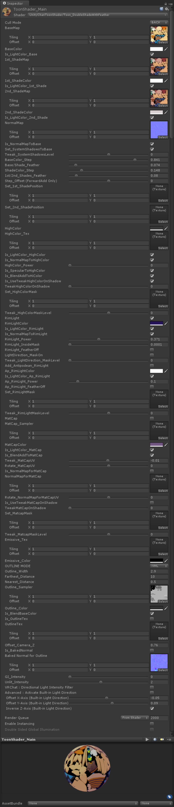

---
## 1.「ステンシル、カリング、クリッピング」に関するプロパティ
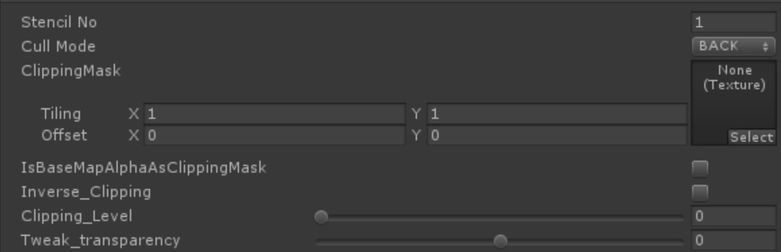

これらは、ステンシルバッファのリファレンスナンバーを設定したり、カリング方式を設定したり、各クリッピングシェーダーでどのようなマスクを設定するか指定するプロパティです。  
**※ヒント：カリング方式の設定は全てのシェーダーにありますが、ステンシルやクリッピング関連の設定は、それらの設定を使用するシェーダーにしかありません。**  

| `プロパティ`  | 機能解説 |
|:-------------------|:-------------------|
| `Stencil No` | `StencilMask`　/　`StencilOut`各シェーダーで使用します。0～255の範囲で、ステンシルリファレンスナンバーを指定します（255には特別の意味がある場合がありますので、注意してください）。抜く側のマテリアルと抜かれる側のマテリアルで、数字を合わせます。 |
| `Cull　Mode` | ポリゴンのどちら側を描画しないか（カリング）を指定します。「`OFF`（両面描画）/ `FRONT`（正面カリング）/ `BACK`（背面カリング）」が選べます。通常は`Back`で指定します。`OFF`はノーマルマップやライティング表示がおかしくなる場合がありますので、注意してください。 |
| `ClippingMask` | `Clipping` / `TransClipping`各シェーダーで使用します。グレースケールのクリッピングマスクを指定します。白が「抜き」になります。何も指定しない場合、クリッピング機能は有効になりません。 |
| `IsBaseMapAlphaAsClippingMask` | `TransClipping`シェーダーのみのプロパティです。チェックすることで、`BaseMap`に含まれるAチャンネルをクリッピングマスクとして使用します。この場合、`ClippingMask`には指定する必要はありません。 |
| `Inverse_Clipping` | クリッピングマスクを反転します。 |
| `Clipping_Level` | クリッピングマスクの強さを指定します。 |
| `Tweak_transparency` | `TransClipping`シェーダーで使用します。クリッピングマスクのグレースケールレベルをα値として考慮することで、透過度を調整します。 |

`TransClipping`シェーダーは、`Clipping`シェーダーと主な機能は同じですが、クリッピングマスクのグレースケールレベルをα値として使えます。  
短冊状の毛の房の先端をアルファを考慮しつつマスクで抜く場合や、アホ毛などの表現に使います。  
`Tweak_transparency`スライダーで透過度合いを調整できます。  

---
## 2.「基本となる３色（基本色/１影色/２影色）の設定」に関するプロパティ
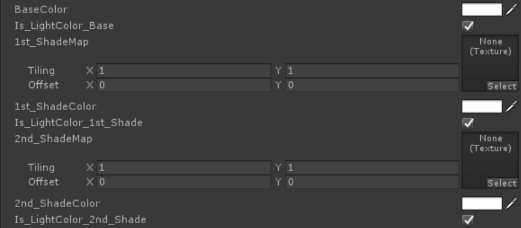

このブロックでは、UTS2の基本となる、基本色/１影色/２影色に用いるカラーを定義します。  
これらのカラーは、**光源方向から順に、基本色⇒１影色⇒２影色**のように配置されます。  
おのおののカラーは、テクスチャの各ピクセルに対して各カラーを乗算し、さらにライトカラーを乗算することで決まります。  
**※ヒント：各影色は、基本色よりも暗い必要はありませんし、２影色が１影色よりも明るくても問題ありません。特に２影色を１影色よりも明るくすると、環境からの照り返しのような表現ができます。**  

**※ヒント：２影色を使うかどうかは、デザインによります。必要のない場合には、指定しなくてかまいません。**  

| `プロパティ`  | 機能解説 |
|:-------------------|:-------------------|
| `BaseMap` | 基本色（明色）テクスチャを指定します。 |
| `BaseColor` | `BaseMap`に乗算されるカラーです。テクスチャを指定せず、カラーのみの指定の場合、こちらを基本色（明色）設定として使います。 |
| `Is_LightColor_Base` | 基本色に対しライトカラーを有効にします。 |
| `1st_ShadeMap` | １影色テクスチャを指定します。 |
| `Use BaseMap as 1stShade_Map` | ONにすると、`BaseMap`に指定されているテクスチャを`1st_ShadeMap`にも適用します。 |
| `1st_ShadeColor` | `1st_ShaderMap`に乗算されるカラーです。テクスチャを指定せず、カラーのみの指定の場合、こちらを１影色設定として使います。 |
| `Is_LightColor_1st_Shade` | １影色に対しライトカラーを有効にします。 |
| `2nd_ShadeMap` | ２影色テクスチャを指定します。 |
| `Use 1stShade_Map as 2ndShade_Map` | ONにすると、`1st_ShadeMap`に指定されているテクスチャを`2nd_ShadeMap`にも適用します。同時に`Use BaseMap as 1stShade_Map`もONの場合は、`BaseMap`が`2nd_ShadeMap`にも適用されます。 |
| `2nd_ShadeColor` | `2nd_ShaderMap`に乗算されるカラーです。テクスチャを指定せず、カラーのみの指定の場合、こちらを２影色設定として使います。 |
| `Is_LightColor_2nd_Shade` | ２影色に対しライトカラーを有効にします。 |

**※ヒント：各カラーに存在する、`Is_LightColor_カラー名`スイッチをオフにすると、ライトの強さに関わらず、「オフにされたカラーは、常にライトのIntensityが１、ライトカラーが白の状態で照らされている状態」になります。このスイッチは、なるべくディレクショナルライトが１灯しかない環境で使うほうがよいでしょう。**  

---
## 3.「ノーマルマップ」に関するプロパティ
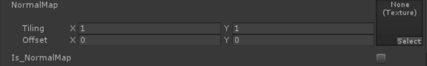

このブロックでは、ノーマルマップに関する設定を行います。  
**UTS2では、ノーマルマップは主に影色のぼかし表現に使います。**  
通常のシェーディング表現にノーマルマップを足してやることで、より複雑なぼかし表現をすることが可能となります。  

| `プロパティ`  | 機能解説 |
|:-------------------|:-------------------|
| `NormalMap` | ノーマルマップを指定します。 |
| `Is_NormalMapToBase` | ノーマルマップをカラーに反映させる時にチェックします。チェックをしないとオブジェクトのジオメトリそのものの形状が反映されます。 |

カラー同様に、各エフェクトにもノーマルマップを影響させるかどうかを選べるチェックがあります。  
これらのチェックを外すと、ジオメトリの頂点法線がそのまま使われます。  

**※ヒント**：もちろんノーマルマップをバンプのように疑似立体表現として利用することもできます。ただしバンプ表現に用いられる場合、ノーマルマップは実際にジオメトリの表面を凸凹させるものではなく、ライティングでその凹凸を表現するものですので、**ライティングの変化が現れやすくするように、基本色/1影色/2影色のステップを設定してやる**必要があります。[上の例](https://twitter.com/nyaa_toraneko/status/1051359237631164417)の場合、基本色側のステップを0.8、影色側のステップを0.5ぐらいにした上で、さらに少し暗めのハイカラーを足してやることで立体感を強調してやっています。  

---
## 4.「セルルックおよびイラストレーションルックを作るための基本設定（各カラーの塗り範囲と境界ぼかしの強度設定）」に関するプロパティ

このブロックでは、基本色/１影色/２影色の各カラーの塗り分け範囲の設定と、各カラー境界ぼかしの強さを設定します。リアルタイムのディレクショナルライトの設定と共に、UTS2を使う上で最も重要な設定です。**このブロックの設定で、基本的なルックは決まります**。  
これらのプロパティの設定は、Unity上でリアルタイムで繰り返しチェックをすることができます。  
プロパティ変更の結果をいちいちレンダリングして確認する必要がありませんので、じっくりと取り組んでみてください。  
光源方向が同じでも、各Stepと各Featherのパラメタを変えることで、まったく違ったルックを作ることができます。  
合わせて、ポジションマップやシェーディンググレードマップのような、影指定のための特殊マップについても解説します。  

## 4-1. DoubleShadeWithFeather系シェーダーの場合

UST2の標準シェーダーである、DoubleShadeWithFeather系シェーダーの共通プロパティです。  
ライティングとは関係なく、モデルの指定位置に各々１影/２影色を配置できる、**ポジションマップ**を２枚持てるのが特徴です。  

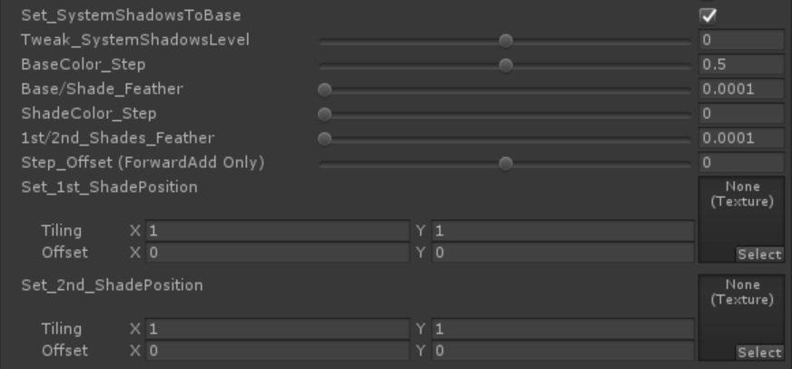

| `プロパティ`  | 機能解説 |
|:-------------------|:-------------------|
| `Set_SystemShadowsToBase` | Unityのシャドウシステムを使う場合に指定します。ReceiveShadowを使いたい場合には、必ずチェックします。（同時にMesh Renderer側の`ReceiveShadow`もチェックされている必要があります。） |
| `Tweak_SystemShadowsLevel` | `Set_SystemShadowsToBase`がONの時に有効になる調整項目です。Unityのシステムシャドウのレベル調整をします。デフォルトは0で、±0.5の範囲で調整が可能です。`BaseColor_Step`/`1st_ShadeColor_Step`で塗り分けレベルを決定した後で、さらに微調整をしたい時や、セルフシャドウ等のReceiveShadowの出方を微調整したい時に使用します。 |
| `BaseColor_Step` | 基本色（明色）と影色領域の塗り分け段階を設定します。 |
| `Base/Shade_Feather` | 基本色（明色）と影色領域の境界をぼかします。 |
| `ShadeColor_Step` | 影色領域より１影色と２影色の塗り分け段階を設定します。２影色を使用しない場合には、ゼロにしてください。 |
| `1st/2nd_Shades_Feather` | １影色と２影色の境界をぼかします。 |
| `Step_Offset (ForwardAdd Only)`| リアルタイムポイントライトなど、主にForwardAddパス内で足されるライトのステップ（塗り分け段階）を微調整します。 Mobile/Light版には、このプロパティはありません。 |
| `PointLights HiCut_Filter (ForwardAdd Only)` | リアルタイムポイントライトなど、主にForwardAddパス内で足されるライトの基本色（明色）領域にかかる不要なハイライトをカットします。 特にぼかしのないセルルック時に、セルルック感を高めます。 Mobile/Light版には、このプロパティはありません。 |
| `Set_1st_ShadePosition` | ライティングに関係なく、１影色の位置を強制的に指定したい場合、ポジションマップを割り当てます。必ず影を落としたい部分を黒で指定します。 |
| `Set_2nd_ShadePosition` | ライティングに関係なく、２影色の位置を強制的に指定したい場合、ポジションマップを割り当てます。必ず影を落としたい部分を黒で指定します。(１影色のポジションマップにも影響を受けます） |

### 【Step/Feather各スライダーの基本的な使い方】

**塗り分け段階を設定するStepスライダー**、**各色の境界をぼかすFeatherスライダー**の基本的な使い方です。  

---
### 【ポジションマップとは？】

ライティングと関係なく影を落としたい部分をポジションマップで指定できます。  
各シーンごとの特殊な影や、演出上追加したい影などがある場合、ライティングに加えて追加できます。  
**※ヒント：Substance Painterなどの3Dペインターを使って、影位置を直接作画してしまうのが簡単です。**  

### 【１影と２影の各ポジションマップの相互作用について】

ライトの状態に関係なく**常に２影色を表示したい場所は、１影色のポジションマップと２影色のポジションマップの同じ位置を塗りつぶし**ます。  
常に２影色が表示されている領域は、ライトが作る影の中でも常に２影色が表示される領域になります。  
一方、**明るいところでは２影色が表示されない領域**（２影色のポジションマップでは指定されているが、１影のポジションマップでは指定されていない領域）は、ライトが作る影の中に入った時のみ２影色が表示されます。  

---
## 4-2. ShadingGradeMap系シェーダーの場合

高機能版UST2シェーダーである、ShadingGradeMap系シェーダーの共通プロパティです。  
**シェーディンググレードマップ**と呼ばれる、ライティングに対する影の出やすさを制御できるマップを持つことができます。  
シェーディンググレードマップを使うことで、ジオメトリや法線の状態とは関係なく、指定の位置に決まった形状の影色を配置ことができます。  
ポイントマップとの違いは、シェーディンググレードマップは影色を決まった位置に表示するだけでなく、ライトの当て方次第でその出方を調整できるところにあります。  

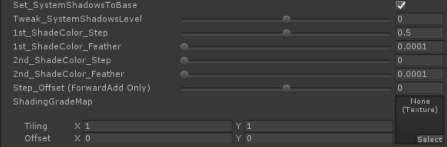

| `プロパティ`  | 機能解説 |
|:-------------------|:-------------------|
| `Set_SystemShadowsToBase` | Unityのシャドウシステムを使う場合に指定します。ReceiveShadowを使いたい場合には、必ずチェックします。（同時にMesh Renderer側の`ReceiveShadow`もチェックされている必要があります。） |
| `Tweak_SystemShadowsLevel` | `Set_SystemShadowsToBase`がONの時に有効になる調整項目です。Unityのシステムシャドウのレベル調整をします。デフォルトは0で、±0.5の範囲で調整が可能です。`BaseColor_Step`/`1st_ShadeColor_Step`で塗り分けレベルを決定した後で、さらに微調整をしたい時や、セルフシャドウ等のReceiveShadowの出方を微調整したい時に使用します。 |
| `1st_ShadeColor_Step` | 基本色（明色）と１影色の塗り分け段階を設定します。`BaseColor_Step`と同じ機能です。 |
| `1st_ShadeColor_Feather` | 基本色(明色）と１影色の境界をぼかします。`Base/Shade_Feather`と同じ機能です。 |
| `2nd_ShadeColor_Step` | １影色と２影色の塗り分け段階を設定します。`ShadeColor_Step`と同じ機能です。 |
| `2nd_ShadeColor_Feather` | １影色と２影色の境界をぼかします。`1st/2nd_Shades_Feather`と同じ機能です。 |
| `Step_Offset (ForwardAdd Only)`| リアルタイムポイントライトなど、主にForwardAddパス内で足されるライトのステップ（塗り分け段階）を微調整します。 Mobile/Light版には、このプロパティはありません。 |
| `PointLights HiCut_Filter (ForwardAdd Only)` | リアルタイムポイントライトなど、主にForwardAddパス内で足されるライトの基本色（明色）領域にかかる不要なハイライトをカットします。 特にぼかしのないセルルック時に、セルルック感を高めます。 Mobile/Light版には、このプロパティはありません。 |
| `ShadingGradeMap` | Shading Grade Mapをグレースケールで指定します。 |

---
### 【シェーディンググレードマップとは？】
UTS2の標準シェーダーは、`Toon_DoubleShadeWithFeather.shader`という系統になりますが、その標準シェーダーの機能を元にシェーディンググレードマップというグレースケールのマップを使うことで、さらに影の掛かり方をUV座標単位で制御できるように拡張したシェーダーが、`Toon_ShadingGradeMap`系統のシェーダーです。  

通常のトゥーンシェーダーに`Shading Grade Map`（シェーディングの掛かり方傾斜マップ）を足すことで、UV単位で１影色および２影色の掛かりやすさを制御できます。  
このマップを使うことで、部分的に影の出やすさを調整できるので、「**ライトに照らされている時にはでない**服のしわ」みたいな表現が可能となります。  
画像の例では、`Shading Grade Map`上の黒部分が２影色になり、グレー部分がその濃度によって影の掛かり方が変わります。  
グレー濃度が強いほうが影がかかりやすいので、二つのグレーの境界間にも影が発生します。  

**Ambient Occlusionマップなどの遮蔽マップ**をシェーディンググレードマップに適用すると、ライティングに対してより影をかかりやすくすることができます。他にも、前髪の形状に沿った影とか、服のしわの凹部分とかに使うとよいでしょう。  

---
### 【ポイントライトによるカラー塗り分けを微調整する：Step_Offset、PointLights HiCut_Filter】

UTS2 v.2.0.5では、ぼかしを使わないセルルック時のリアルタイムポイントライトへの反応を改善しました。結果、ポイントライトだけでもセル風のルックが実現できます。  
セルルックは、基本色（明色）/１影色、１影色/２影色の各Stepスライダーを調整して設定しますが、ポイントライトの場合、ディレクショナルライト以上に移動に対する影の変化が顕著になります。  
それらの変化ををある程度抑え込むための微調整用として、`Step_Offset`スライダーを使います。  

`Step_Offset`を使うことで、ポイントライトなどFowardAddパス側で追加されるリアルタイムライトのステップ（塗り分け段階）を微調整できます。  
塗り分け用に使われる`BaseColor_Step`などの調整は、メインライトによる塗り分け段階を決めるのと同時に、ポイントライト側の設定にも使われます。  
そこに`Step_Offset`を併用することで、さらに細かくポイントライトの当たり方を調整できます。  
特にメカ表現などで、ワカメハイライトなどを表現するのに便利です。  

またポイントライトは、仕様上距離に対して明るさが減衰しますので、特に基本色（明色）部分のハイライトが必要以上に目立つことがあります。  
そのような時に、`PointLights HiCut_Filter`をオンにすると、不要なハイライトが抑えられて、よりセルルックに馴染みやすくなります。  
逆に積極的にハイライトを付けたい場合は、`PointLights HiCut_Filter`をオフにして使うといいでしょう。  

---
## 5.「ハイカラー（ハイライト、スペキュラ）」に関するプロパティ
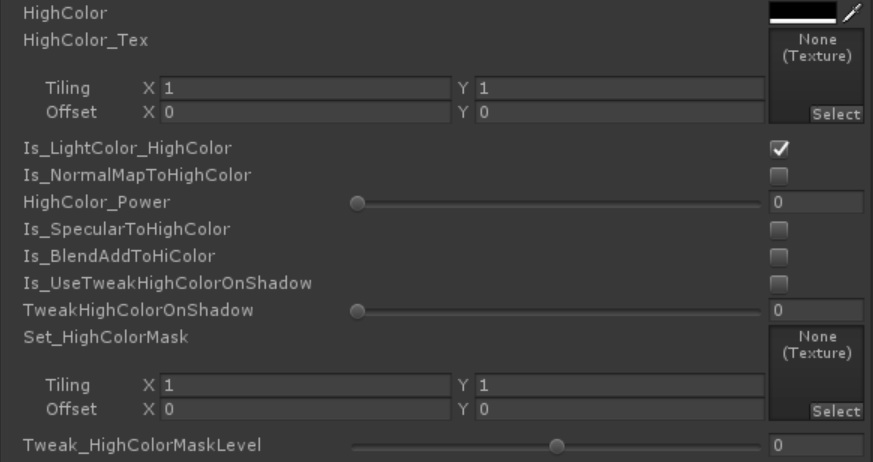

**「ハイカラー」** は、**ハイライト、スペキュラ**とも呼ばれる表現です。  
メインとなるディレクショナルライトからの「光」を照り返す表現として使われます。光の照り返し表現ですので、**ライトが動くと現れる位置も動きます**。  
UTS2では、ハイカラー表現に対して様々な調整をすることが可能です。  

| `プロパティ`  | 機能解説 |
|:-------------------|:-------------------|
| `HighColor` | ハイカラー指定するカラーを指定します。使用しない場合には`黒(0,0,0)`を設定してください。なおハイカラーは光源の方向に従って移動します。 |
| `HighColor_Tex` | ハイカラーとしてカラーテクスチャを指定します。テクスチャを利用することで、複雑なカラーを載せることが可能になります。上の`HighColor`プロパティと乗算されますので、テクスチャのカラーをそのまま出したい場合には、`HighColor`を`白(1,1,1)`に設定してください。必要がない場合、設定しなくても大丈夫です。 |
| `Is_LightColor_HighColor` | ハイカラーに対しライトカラーを有効にします。 |
| `Is_NormalMapToHighColor` | ノーマルマップをハイカラー領域に反映させる時にチェックします。チェックをしないとオブジェクトのジオメトリそのものの形状が反映されます。 |
| `HighColor_Power` | ハイカラーの範囲の大きさ（※スペキュラ的には「強さ」になります）を設定します。 |
| `Is_SpecularToHighColor` | ハイカラー領域をスペキュラ（グロッシイ光沢）として描画します。チェックを外すとハイカラー領域の境界を円形で描画します。 |
| `Is_BlendAddToHiColor` | ハイカラーの合成を加算（より明るくなります）にします。スペキュラは加算モードでしか使えません。 |
| `Is_UseTweakHighColorOnShadow` | `TweakHighColorOnShadow`スライダーを有効にします。 |
| `TweakHighColorOnShadow` | 影部分にかかるハイカラー領域の強さを調整します。 |
| `Set_HighColorMask` | UV座標に基づきハイカラーをマスクします。白で100%表示、黒でハイカラーを表示しません。必要がない場合、設定しなくても大丈夫です。 |
| `Tweak_HighColorMaskLevel` | ハイカラーマスクのレベル補正をします。デフォルト値は0です。 |

ハイカラーマスクを適用することで、角度によっては肌がテカってしまうような部分を抑えることができます。  
頬や胸に載せる肌のハイカラー表現などで、特に有効です。  

またハイカラーマスクは、鏡面反射を調整するスペキュラマップとしても使うことができますので、金属などの質感を表現するのにも使えます。  
暁ゆ～き（@AkatsukiWorks）さんの作例では、ハイカラーマスクやリムライトマスクを使うことで、イラスト風でありながら同時にそこに使われている各素材（マテリアル）の質感を魅力たっぷりに引き出しています。  

---
## 6.「リムライト」に関するプロパティ

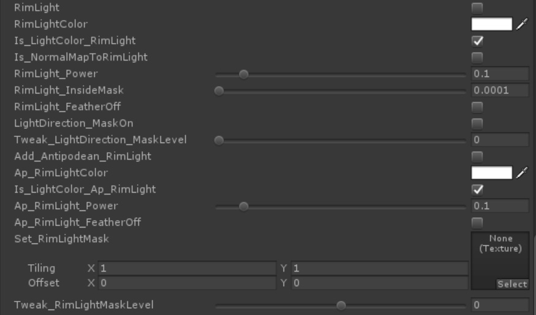

**「リムライト」** は、実写の世界では「ライトが被写体の周縁（リム）を照らすように配置する」テクニックを指しています。  
トゥーンシェーダーを含むノンフォトリアリスティックな表現では、形状を強調するのに同じようにエッジにハイライトを置きますが、これもしばしば「リムライト」と呼ばれています。  
UTS2では、リムライトに関しても様々なオプションが利用できます。  

| `プロパティ`  | 機能解説 |
|:-------------------|:-------------------|
| `RimLight` | リムライトを有効にします。 |
| `RimLightColor` | リムライトのカラーを指定します。 |
| `Is_LightColor_RimColor` | リムカラーに対しライトカラーを有効にします。 |
| `Is_NormalMapToRimLight` | ノーマルマップをリムライトに反映させる時にチェックします。チェックをしないとオブジェクトのジオメトリそのものの形状が反映されます。 |
| `RimLight_Power` | リムライトの強さを指定します。 |
| `RimLight_InsideMask` | リムライトの内側マスクの強度を指定します。 |
| `RimLight_FeatherOff` | リムライトのぼかしをカットします。 |
| `LightDirection_MaskOn` | 光源方向にのみリムライトを発生します。 |
| `Tweak_LightDirection_MaskLevel` | 光源方向リムマスクのレベル調整をします。 |
| `Add_Antipodean_RimLight` | 光源方向に対し反対方向の位置にリムライト（APリムライト）を発生させます。 |
| `Ap_RimLightColor` | APリムライトのカラーを指定します。 |
| `Is_LightColor_Ap_RimLight` | APリムカラーに対しライトカラーを有効にします。 |
| `Ap_RimLight_Power` | APリムライトの強さを指定します。 |
| `Ap_RimLight_FeatherOff` | APリムライトのぼかしをカットします。 |
| `Set_RimLightMask` | UV座標に基づきリムライトをマスクします。白で100%表示、黒でリムライトを表示しません。必要がない場合、設定しなくても大丈夫です。 |
| `Tweak_RimLightMaskLevel` | リムライトマスクのレベル補正をします。デフォルト値は0です。 |

基本的なリムライトは、カメラから見てオブジェクトの周縁に表示されます。  
上に加えてUTS2では、メインライトが存在する方向を考慮してリムライトの出る位置を調整することができます。（`LightDirection_MaskOn`）  
さらに光源とは反対方向のリムライトも設定できます（`Add_Antipodean_RimLight`）ので、「照り返し」も表現することが可能です。  
もし光源方向のリムライトもカットして、光源方向の反対のみにリムライトを発生したい場合には、光源方向のリムライトのカラーを`黒（0,0,0）`に指定してください。  

またリムライトは、ハイカラーと同様にカメラの角度によってはひどくテカってしまうことがあります。  
UTS2では、リムライトマスクを設定することで、それらのテカりを抑えることができます。  
上の画像では、光源方向と照り返し方向のリムライトのカラーを変えた上に、脇の下などにリムライトマスクをかけることで不要なテカリを避けています。  

またリムライトマスクを使うことで、「**金属的な材質表現**」を他の素材と調整することで強調したり、服に差し込む入射光を調整することで 「**ベルベット風衣類のしわ表現**」などをすることが可能です。  

---
## 7.「MatCap」に関するプロパティ

**「マットキャップ（MatCap）」** とは、カメラベースでオブジェクトに貼り付けるスフィアマップのことです。ZBrushの質感表現で使われています。  
Google画像検索で、「Matcap」で検索すると、様々なMatcapの例を見ることができます。物理ベースシェーダーが普及する以前は、金属的なテカリを表現する時によく使われました。  
それらの金属的な質感表現だけでなく、Matcapは工夫次第で様々な質感を表現することが可能です。  
UTS2では、Matcapテクスチャを乗算だけでなく加算でも合成できます。  

**※ヒント：UTS2 v.2.0.5からは、[カメラによる歪みに対して適切な補正が入る](https://twitter.com/kanihira/status/1061448868221480960)ようになりましたので、オブジェクトがカメラの端に来てもMatCapが歪まなくなりました。**  

| `プロパティ`  | 機能解説 |
|:-------------------|:-------------------|
| `MatCap` | MatCapを有効にします。 |
| `MatCap_Sampler` | MatCapとして使用するテクスチャを設定します。 |
| `MatCapColor` | `MatCap_Sampler`に乗算されるカラーです。`MatCap_Sampler`側にグレースケール画像を設定した場合、`MatCapColor`でMatCapにカラーを乗せることができます。 |
| `Is_LightColor_MatCap` | MatCapに対しライトカラーを有効にします。 |
| `Is_BlendAddToMatCap` | チェックするとMatCapのブレンドが**加算モード**になります（結果は明るくなります）。チェックしない場合には**乗算モード**で合成されます（結果は暗くなります）。 |
| `Tweak_MatCapUV` | `MatCap_Sampler`のUVを中央から円形に拡縮することで、MatCapの領域調整ができます。 |
| `Rotate_MatCapUV` | `MatCap_Sampler`のUVを中央を軸に回転します。 |
| `Is_NormalMapForMatCap` | MatCapにMatCap専用ノーマルマップを割り当てます。MatCapをスペキュラ的に使っている場合には、スペキュラマスクとして使用できます。 |
| `NormalMapForMatCap` | MatCap専用ノーマルマップを設定します。 |
| `Rotate_NormalMapForMatCapUV` | MatCap専用ノーマルマップのUVを中央を軸に回転します。 |
| `Is_UseTweakMatCapOnShadow` | `Tweak MatCapOnShadow`スライダーを有効にします。 |
| `Tweak MatCapOnShadow` | 影部分にかかるMatCap領域の強さを調整します。 |
| `Set_MatcapMask` |MatCapにグレースケールのマスクを設定することで、MatCapの出方を調整します。MatcapMaskは、MatCapが投影されるメッシュのUV座標基準で配置されます。黒でマスク、白で抜きになります。 |
| `Tweak_MatcapMaskLevel` | MatcapMaskの強さを調整します。デフォルト値は0です。 |
| `Orthographic Projection for MatCap` | シーン内で使用するカメラのプロジェクションが、**Orthographic（平行投影）の時、ON**にします。**パースカメラの時には、OFFにする**ことでカメラ歪み補正が働きます。 **※Tips：このチェックをONにすると、パースカメラ時の挙動がUTS2 v.2.0.4版と同じになります。つまりカメラ歪み補正がなくなります。** |

上の例では、**Matcapを疑似環境マップとして利用**しています。  
他にもMatcapを利用することで、つるつるした表面に光が反射する**ヌルテカ表現**も、適度なイラスト感を保ったまま、まとめることができます。  

上の例では、**サラサラ感のある髪の毛の光沢を表現する**のに、`MatCap`と`NormalMapForMatCap`、`MatcapMask`を使用しています。  

* MatCap_Sampler : 髪の上に乗算合成される、光の輪を表現します。  
* NormalMapForMatCap : MatCap単体だとそのままの形状で合成されてしまいますが、NormalMapForMatCapを細かいリピートで重ねることで、三日月型の光沢をサラサラ感のある光に散らしています。このような使い方を`スペキュラマスク`と呼びます。ここで使われるノーマルマップは、バンプ的な表現には使われません。  
* MatcapMask : MatCapが表示される範囲を調整します。垂直方向のグラデーションマスクを設定することで、`Tweak_MatcapMaskLevel`スライダーを調整することで、MatCapが表示される範囲を簡単に制御することができます。  

MatcapMaskを使うことで、上のようなライトクッキー的な表現も可能です。  

---
## 8.「AngelRing（天使の輪）」に関するプロパティ
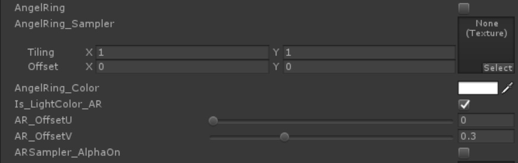

**「AngelRing（天使の輪）」** とは、カメラから見て常に固定の位置に現れるハイライト表現で、髪のハイライト表現として使われます。「天使の輪」機能を持つシェーダーは、`AngelRing`フォルダ以下に収録されています。  

「天使の輪」は、それが投映されるメッシュのUV2を参照しますので、Mayaや3ds Max、BlenderなどのDCCツールで、事前にUV2を設定しておく必要があります。  

| `プロパティ`  | 機能解説 |
|:-------------------|:-------------------|
| `AngelRing` | 「天使の輪」機能を有効にします。 |
| `AngelRing_Sampler` | 「天使の輪」テクスチャを指定します。 |
| `AngelRing_Color` | 「天使の輪」に乗算するカラーを指定します。 |
| `AR_OffsetU` | 「天使の輪」表示を縦方向に微調整します。 |
| `AR_OffsetV` | 「天使の輪」表示を横方向に微調整します。 |
| `Is_LightColor_AR` | 「天使の輪」に対しライトカラーを有効にします。 |
| `ARSampler_AlphaOn` | チェックすることで、「天使の輪」テクスチャに含まれるαチャンネルをクリッピングマスクとして利用できます。 |

---
### ●「天使の輪」用素材の作成
まず「天使の輪」機能を適用する髪の毛のメッシュに、２つめのUVを設定しましょう。  

「天使の輪」用のUVは、通常の髪用テクスチャのUVとは別に、「天使の輪」を適用する髪全体をキャラの正面方向から平面投影して作成します。  

**※UV2の作成を含むこれらの作業は、Mayaや3ds Max、BlenderなどのDCCツールで行います。**  

「天使の輪」用UVをガイドに、ハイライト部分のテクスチャを描きます。ハイライト部分のカラーは元のカラーに加算で合成されます。  
作成したテクスチャは、`AngelRing_Sampler`に登録します。  
ハイライトは白で描いて、後で`AngelRing_Color`で色を載せてもよいでしょう。  

`ARSampler_AlphaOn`をチェックすると、下の図のように「天使の輪」テクスチャのαチャンネルがクリッピングマスクとして利用できるようになります。  
「天使の輪」のカラーを加算でなく、直接指定できるようになります。  

---
## 9.「エミッシブ」に関するプロパティ
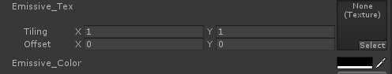

**「エミッシブ」** とは、自己発光のことです。  
`Emissive_Color`にHDRカラー（明るさとして1以上の値を持てるカラー仕様のこと）を定義することで、周りのカラーよりも明るい領域を設定することができます。  
**[Post Processing Stack](https://docs.unity3d.com/ja/current/Manual/PostProcessing-Stack.html)の[ブルーム](https://docs.unity3d.com/ja/current/Manual/PostProcessing-Bloom.html)など、カメラにアタッチされるポストエフェクトと共に使われることで、パーツを効果的に光らせることができます。**  

| `プロパティ`  | 機能解説 |
|:-------------------|:-------------------|
| `Emissive_Tex` | エミッシブ用のテクスチャを設定します。グレースケールでマスクテクスチャを作成し、`Emissive_Color`で光らせることもできます。他のパーツと重ねて光って欲しくない部分などは、黒（RGB:0,0,0）にしておきます。 |
| `Emissive_Color` | `Emissive_Tex`の各ピクセルカラーに乗算されるカラーです。多くの場合、**[HDRカラー](https://docs.unity3d.com/ja/current/Manual/HDRColorPicker.html)**を設定します。  |

あいんつばい（@einz_zwei）さんの作例。エミッシブパーツが大変効果的に使われています。  
しかもカラーマップとエミッシブマップを組み合わせることで、ライトの明るさの変化に応じて、ディティールが追加されるような仕組みになっています。  

---
## 10.「アウトライン」に関するプロパティ
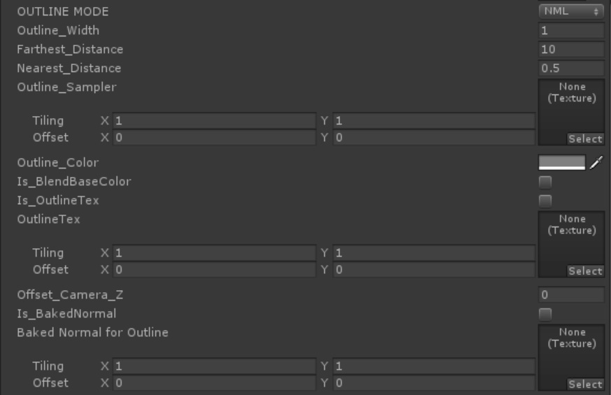

UTS2では、アウトライン機能として、**マテリアルベースのオブジェクト反転方式のアウトライン**を採用しています。  
この方式を簡単に説明すると、シェーダーで元のオブジェクトよりも少し大きめのオブジェクトを面法線だけ反転して生成します。  
新たに生成したアウトライン用オブジェクトには、フロントカリングで描画されますので、元よりも少し大きめに生成したぶんだけ、それが元のオブジェクトによって上書きされると、はみ出した部分がアウトラインのように見えるというものです。  
この方式は比較的軽い上に調整が楽にできるので、ゲーム用のアウトラインとして伝統的に使われてきました。  
**実際にオブジェクトの周りにラインを引いているわけではない**ということに、注意してください。  

**＊参考：実際にオブジェクトの周りにラインを描画する方式もありますが、それらは主にポストプロセス（ポストエフェクト）方式のアウトラインとして知られています。**  
ポストプロセス方式のアウトラインは採用する方式によって、スピードもクオリティも異なります。実際のゲームでは、従来型のオブジェクト反転方式に、軽めのポストプロセス方式を加えて補正する場合が多いです。  

| `プロパティ`  | 機能解説 |
|:-------------------|:-------------------|
| `OUTLINE MODE` | アウトライン用反転オブジェクトの生成方式を指定します。`NML`（法線反転方式） / `POS`（ポジションスケーリング方式）から選択できます。多くの場合、法線反転方式が使われますが、ハードエッジだけで構成されているキューブのようなメッシュの場合、ポジションスケーリング方式のほうがアウトラインが途切れにくくなります。比較的単純な形状はオブジェクトスケーリング方式で、キャラクターなどの複雑な形状のものは法線反転方式を使うといいでしょう。 |
| `Outline_Width` | アウトラインの幅を設定します。 **※注意：**この値は、Unityへのモデルインポート時のスケールに依存しますので、取り込みスケールが１でない時には注意してください。 |
| `Farthest_Distance` | カメラとオブジェクトの距離でアウトラインの幅が変化する、最遠距離を指定します。この距離でアウトラインがゼロになります。 |
| `Nearest_Distance` | カメラとオブジェクトの距離でアウトラインの幅が変化する、最近距離を指定します。この距離でアウトラインが`Outline_Width`等で設定した最大の幅になります。 |
| `Outline_Sampler` | アウトラインの幅に入り抜きを入れたい場合や特定のパーツにのみアウトラインを乗せたくない場合などにアウトラインサンプラー（テクスチャ）で指定します。白で最大幅、黒で最小幅になります。必要がない場合、設定しなくても大丈夫です。 |
| `Outline_Color` | アウトラインのカラーを指定します。 |
| `Is_BlendBaseColor` | オブジェクトの基本カラーにアウトラインのカラーを馴染ませたい場合に、チェックします。 |
| `Is_OutlineTex` | アウトライン用反転オブジェクトにテクスチャを貼りたい場合、ONにします。 |
| `OutlineTex` | アウトラインに特別なテクスチャを割り当てたい時に使用します。テクスチャを工夫することで、アウトラインに模様を入れたりすることができる他、フロントカリングされる反転オブジェクトに貼られるテクスチャだと考えると、一風変わった表現ができるかもしれません。 |
| `Offset_Camera_Z` | アウトラインをカメラの奥行き方向（Ｚ方向）にオフセットします。スパイク形状の髪型などの場合、プラスの値を入れることでスパイク部分にはアウトラインがかかりにくくなります。通常は０を入れておいてください。 |
| `Is_BakedNormal` | ONにすると、`BakedNormal for Outline`を有効にします。 |
| `BakedNormal for Outline` | 事前に他のモデルから頂点法線を焼き付けたノーマルマップを、法線反転方式アウトラインの設定時に追加として読み込みます。詳しい説明は下を参照してください。 |

---
### ●アウトラインの強弱を調整する：**Outline_Sampler**

黒でラインなし、白でラインの幅が100%になります。  
適宜 Outline_Sampler を設定することで、アウトラインに入り抜き（強弱）が発生します。  

**※Tips：Outline_Sampler を複数キャラに適用する際に、各キャラのパーツのUV配置を共通化する一工夫をすると、モデル汎用に入り抜きの制御が調整できるようになって便利です。**  

---
### ●オブジェクト反転方式アウトラインを補う：**UTS_EdgeDetection**
UTS2で採用されているオブジェクト反転方式のアウトラインは、古くから使われている技術ですが、高いリアルタイム性が求められるゲームでは、今でも使われています。  
その一方で、昨今ではマシンパワーもあがりましたので、これらのマテリアルベースアウトラインに加えて、カメラ側にアタッチするポストプロセスエフェクト型のアウトラインも同時に使われるようになりました。  
両者は補完関係にあるので、両者を適宜組み合わせることで、さらに綺麗なアウトラインが得られます。  

UTS2にもオブジェクト反転方式アウトラインと組み合わせて使う、**UTS_EdgeDetection**と呼ばれるポストエフェクトが付属しています。  
UTS_EdgeDetectionをメインカメラにアタッチすることで、UTS2のオブジェクト反転方式アウトラインがさらに綺麗になります。  

UTS_EdgeDetectionは、UTS2プロジェクトのルートに、**UTS_EdgeDetection.unitypackage**で提供されています。  
本パッケージをUnityにD&Dすることで、インストールします。  
`ToonShader_CelLook.unity`などがサンプルシーンになっていますので、シーン内のメインカメラにアタッチされている、UTS_EdgeDetectionコンポーネントを確認してみてください。  

### ●UTS_EdgeDetection.unitypackage  

ポストエフェクトタイプのエッジ抽出フィルタです。  
元々はUnityの[Standard Assetsにあったものを改造したフィルタ3つ](https://docs.unity3d.com/ja/540/Manual/script-EdgeDetectEffectNormals.html)に加えて、新規に作成した**Sobel Color Filter**が追加されています。  
Sobel Color Filterを使うことで、効果的にトゥーンラインエッジを強調し、セル画時代の色トレス風の雰囲気を出すことができます。  
本ポストエフェクトは、ポストエフェクトスタックの前に入れるとよいと思います。  

---
### ●ベイクした頂点法線を転写する：**Baked Normal for Outline**  
頂点法線を焼き付けたノーマルマップを、法線反転アウトラインの設定時に追加的に読み込むことができるようになりました。本機能を使うことで、ハードエッジのオブジェクトに、ソフトエッジのオブジェクトのアウトラインを、事前にベイクしたノーマルマップを経由して適用することができるようになります。  

Baked Normalマップを使用する時には、UTS2のアウトライン設定プロパティで、  
1.  OUTLINE MODE を **"NML"** に  
2.  Is_BakedNormal を **"ON"** に  
3.  Baked Normal for Outline に使用したいマップを適用します。 

**Baked Normal for Outline として適用できるノーマルマップ**は以下のような仕様となっています。  
1.  適用するオブジェクトの UV は重ならないこと。つまり、**全てのノーマルマップが重ならないように UV 展開がされていること**が必須です。  
2.  ノーマルマップ自体の仕様は、Unity と同じで、**OpenGL 準拠**となります。  
3.  使用するノーマルマップのテクスチャ設定は、以下のようになります。  
・Texuture Type は **"Default"** にする。 **※注意： "Normal map" に設定してはいけません**。  
・sRGB (Color Texture) を必ず **"OFF"** にする。  

詳しくはサンプルプロジェクト内の Baked Normal フォルダ内のアセットを確認してください。  

**※注意：この方式による頂点法線の調整は、バーテックスシェーダー側で行われますので、適用される頂点数にそのまま依存します**。つまり、ピクセルシェーダー側のように頂点法線間で補正するものではありませんので、注意してください。  

---
### ●アウトラインをカメラの奥に移動する：**Offset_Camera_Z**

`Offset_Camera_Z`に値を入れることで、アウトラインがカメラの奥行き方向（Ｚ方向）にオフセットされます。  
図のようなスパイク形状の髪型の場合に、スパイク部分のアウトラインの出方を調整するのに使用します。  
通常は０を入れておいてください。  

---
## 11.「ライトプローブ」の利用、およびシェーダービルトインライトやVRChatに便利な機能に関するプロパティ
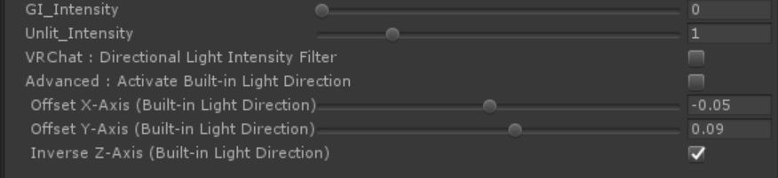

| `プロパティ`  | 機能解説 |
|:-------------------|:-------------------|
| `GI_Intensity` | `GI_Intensity` を０以上に設定することで、UnityのLightingウィンドウ内で管理されているGIシステム、特に[ライトプローブ](https://docs.unity3d.com/ja/current/Manual/LightProbes.html)に対応します。 `GI_Intensity` が１の時、シーン内のGIの強度が100％となりますが、トゥーンシェーダーの場合、100%だと値が高すぎるようです。デフォルトは０で、好みにも寄りますが、**ライトプローブ使用時で0.3程度で使うとよい効果が得られます。** |
| `Unlit_Intensity` | シーン内に有効なリアルタイムディレクショナルライトが１灯もない時に、[Environment LightingのSource設定](https://docs.unity3d.com/ja/current/Manual/GlobalIllumination.html)を元にシーンの明るさとカラーを求め、それを`Unlit_Intensity`の値でブーストして光源として使用します（本機能を**「アンビエントブレンディング」**と呼んでいます）。デフォルトは１（アンビエントカラーをそのまま受ける）で、０にすると完全に消灯します。本機能は環境カラーにマテリアルカラーを馴染ませたい時に使いますが、**より暗めに馴染ませたい場合は 0.5～1 程度**に設定し、**より明るくカラーを出したい場合は 1.5～2 程度**に設定するとよいでしょう。 |
| `VRChat : SceneLights Hi-Cut_Filter` | シーン内に極端に明るさ（Intensity）が高い、複数のリアルタイムディレクショナルライトやリアルタイムポイントライトがある場合に、白飛びを抑えます。ONにすることで、各々のライトのカラーと減衰特性を保ちつつ、マテリアルカラーが白飛びするような高いインテンシティだけをカットします。デフォルトは`OFF`です。**VRChatユーザーは`ON`にすることをお薦めします。** ※ヒント：この機能を使っても白飛びが発生する場合、ポストエフェクト側のブルームなどの設定をチェックしてみてください。（特にブルームのスレッショルドの値が１以下だと白飛びしやすくなります。） |
| `Advanced : Activate Buil-in Light Direction` | 上級者向け機能として、Buil-in Light Directionベクトル（シェーダー内に組み込まれているバーチャルライトの方向ベクトル）を有効にします。本機能が有効な時、ライトの明るさとカラーは、シーン内の有効なリアルタイムディレクショナルライトの値を使用します。もしそのようなライトがない場合は、アンビエントブレンディングの値を使用します。 |
| ` Offset X-Axis (Buil-in Light Direction)` | Buil-in Light Directionベクトルによって生成される、バーチャルライトを左右に動かします。 |
| ` Offset Y-Axis (Buil-in Light Direction)` | Buil-in Light Directionベクトルによって生成される、バーチャルライトを上下に動かします。 |
| ` Inverse Z-Axis (Buil-in Light Direction)` | Buil-in Light Directionベクトルによって生成される、バーチャルライトの向きを前後で切り替えます。 |

---
### ●ライトプローブの明るさを決定する：GI_Intensity

**↑ 左側：GI_Intensity = 0、右側：GI_Intensity = 0.3程度。GI_Intensityの数値を上げると、マテリアルカラーにライトプローブのカラーが加算される。**  

**↑ ステージ上に配置された、ベイク用ポイントライトとライトプローブの例。ベイクドライトは、各レンジが重なっても問題ない。ライトプローブは、ユニティちゃんの足元から背の高さまで敷き詰める。**  

`GI_Intensity` を０以上に設定することで、ライトプローブなどの加算合成系のGIシステムに対応します。  
ベイクドライトと一緒にシーン内にベイクされたライトプローブは、環境補助色としてマテリアルカラーに加算されます。  
`GI_Intensity`が１の時、ライトプローブに焼き付けられたカラーを100％加算します。０の時は、元のマテリアルカラーのままです。  
好みにもよりますが、`GI_Intensity`が高いと白飛び感がしますので、**最大 0.3～0.4 を目処に設定するとよい**でしょう。  

**↑ GI_Intensity = 0**  

**↑ GI_Intensity = 0.3程度**  

---
### ●アンビエントライトブレンディングを調整する：Unlit_Intensity　　

アンビエントライトの設定をライトカラーが反映するようになりました。  
その結果として、ディレクショナルライトのインテンシティの下限が、シーンのアンビエントライトの設定となります。　　
VRChatで、アンビエントライトの設定に基づくワールドごとの明るさの差異を自動で調整できます。  
なおアンビエントライトからの明るさは、Unlit_Intensity スライダーで調整することができます。Unlit_Intensityは、アンビエントライトの明るさをブーストします。  
デフォルトは 1（そのまま）になっています。  

---
### ●カメラ追従型のデフォルトライトを搭載  

有効なディレクショナルライトがシーン中にない場合、シェーダーに組み込まれたデフォルトライトが有効になりますが、その向きが常にカメラが見る方向に追従するようになりました。  
結果、カメラから見て常に良い感じにライティングされるようになりました。  
このライトは、アンビエントライトブレンディング動作中に機能します。  

---
### ●アドバンス機能として、Built-in Light Directionを追加  
上級者向け機能として、シェーダー内にビルトインされているライトディレクションベクトルを任意の方向に設定できるようにしました。  
Built-in Light Directionを有効にしたマテリアルは、それが適応されるメッシュのオブジェクト座標に対して、独自のシェーディング用ライトディレクションベクトルを持つことができるので、専用の固定ライトを持つことと同じ効果が得られます。そのパーツが落とすドロップシャドウは、シーン中のディレクショナルライトを使いますので、シェーディングの落ち方とドロップシャドウの落ち方を変えることもできます。  
Built-in Light Directionのライトカラーは、シーン中のメインとなるディレクショナルライトの設定を使います。  

---
## 12.「テッセレーション」に関するプロパティ
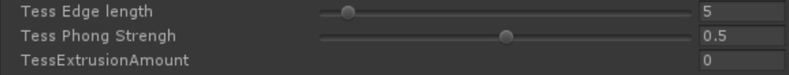

UTS2のテッセレーション機能は、Windows/DX11環境でのみ使用できます。  

| `プロパティ`  | 機能解説 |
|:-------------------|:-------------------|
| `Tess Edge Length` | カメラとの距離に基づいて、よりテッセレーションを分割します。同じ距離では、値が小さいほうが細分化されます。デフォルトは 5 です。 |
| `Tess Phong Strengh` | テッセレーションによって細分化された分割面の引っ張り強度を変化させます。デフォルトは 0.5 です。 |
| `TessExtrusionAmount` | テッセレーションの結果として発生する、膨張分を全体としてスケーリングします。デフォルトは 0 です。 |

対応部分のコードは、Nora氏の https://github.com/Stereoarts/UnityChanToonShaderVer2_Tess を参考にさせていただきました。  
Tessellationは、使えるプラットフォームが限られている上に、かなりパワフルなPC環境を要求しますので、覚悟して使ってください。  
想定している用途は、パワフルなGPUを搭載しているWindows10/DX11のマシンを使って、映像＆VR向けに使用することです。  
Light版とあるものは、ライトをディレクショナルライト１灯に制限した代わりに軽量化したバリエーションです。  

# 映像（プリレンダー）での使用

プリレンダーで使用する場合には、イメージエフェクト側につけているAnti Aliasingは外して、フレームキャプチャで4K出力をしたものを使用サイズに縮小して使うほうが綺麗な可能性が高いです（事実上のスーパーサンプリング）。  

**フレームキャプチャ**は以下で提供されています。  
https://github.com/unity3d-jp/FrameCapturer  
フレームキャプチャの出力結果は、NUKEやAfterEffectsで利用できます。  

他、**Alembic Importer/Exporter**があるので、映像用にはこちらも使うとよいでしょう。  
https://github.com/unity3d-jp/AlembicImporter  

# ライセンスについて

「ユニティちゃんトゥーンシェーダーVer.2.0」は、 **UCL2.0（ユニティちゃんライセンス2.0）** で提供されます。  
ユニティちゃんライセンスについては、以下を参照してください。  
http://unity-chan.com/contents/guideline/  

**※ヒント：** しばしば質問されることですが、UCL2.0で配布されるUTS2のシェーダーファイル（.shader）およびそのインクルードファイル（.cginc）は、これらのファイルを自作の3Dモデルなどに同梱し、商用/非商用を問わず再配布するのは自由です。また、どのようなタイプ/デザインの3Dモデルやコンテンツ（アダルト向けも含みます）に適用しても構いません。  
再配布を受けるユーザーの便宜のために、「UTS2 v.2.0.5を使用している」などの後のバージョンアップのために便宜を図る情報を記載することはお願いしたいですが、それ以外には特に掲示すべきものはありません。  
各ファイルのヘッダー部には、UCL2.0のライセンス表記がありますので、そちらは修正しないでそのまま同梱することをお願いします。  

**※コンテンツに採用した場合** ：UTS2を使ったステキなモデルやコンテンツができましたら、是非、[Unity Technologies Japan](https://twitter.com/unity_japan)にまでご連絡ください。皆さんの力作のご報告を、スタッフ一同、楽しみに待ってます！  

# 補助マニュアル  

## １．Tips:システムシャドウ使用時に、各色の境界に生じるアーティファクトの軽減法  

上図のような、Unityのシステムシャドウとカスタムライティングとの境界に生じるアーティファクトの軽減法を解説します  

### 【１：リニアカラースペースに変更する】

現在のカラースペースが、ガンマカラースペースの場合には、まず**リニアカラースペースに変更**します。  
リニアカラースペースのほうが、アーティファクトの階調変化は柔らかくなる傾向があります。  

### 【２：メッシュの分割度をあげる】

ライティングおよびシェーダーのパラメタが全て同じ条件だったら、**メッシュの分割度を上げます**。  
メッシュの分割度をあげることで、これらのアーティファクトの多くは消失します。  

### 【３：BaseColor_Step/Tweak_SystemShadowsLevel の調整でアーティファクトを消す】

図①の影の境界の位置では、Unityのシステムシャドウとカスタムライティングの閾値より作られる影が、ほぼ一致しています。  
そのことは、この状態で  `Set_SystemShadowsToBase`  のチェックを外しても、影の境界位置が動かないことからわかります。  

図①の状態の時に、`Base/Shade_Feather`スライダーを右に動かすと、アーティファクトが発生します（図②）。  
これは、**Unityのシステムシャドウの内側にカスタムライティングの影の閾値が食い込むために発生**します。  

このような時には、図③のように **`BaseColor_Step`スライダーも右に動かしてやる**ことにより、**カスタムライティングが作る影の領域を増やしてやります**。  
すると良い感じにアーティファクトも消失し、境界ぼかしが発生します。  

また同様に、**`Tweak_SystemShadowsLevel` スライダーを使って、システムシャドウ側のレベル補正をする**ことで、アーティファクトを消すこともできます。  
**※まずはこちらからお試しになることをお薦めいたします。**

### 【４：ディレクショナルライトのバイアスを上げてやる】

最後に、キーライトとして球を照らしている**ディレクショナルライトのバイアスをあげてやる**という方法があります。  
バイアスを上げることで、システムシャドウの位置が変化するからです。  
ただしバイアスを上げすぎると、今度は落ち影全体の発生位置がオブジェクトから大きくずれることも発生しますので、注意が必要です。  

