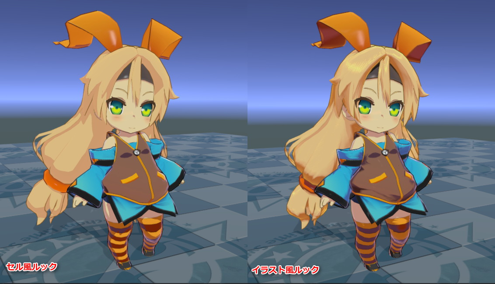
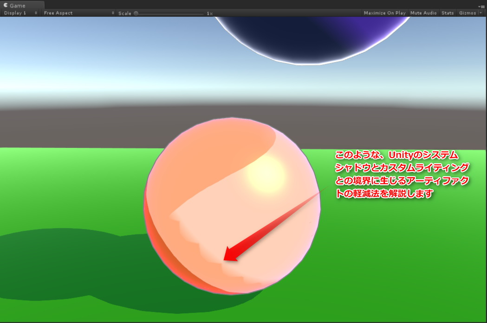

# ユニティちゃんトゥーンシェーダー 2.0 マニュアル

### 2017/06/25 Nobuyuki Kobayashi (Unity Technologies Japan)

# 【ユニティちゃんトゥーンシェーダーとは？】
「ユニティちゃんトゥーンシェーダー」は、セル風3DCGアニメーションの制作現場での要望に応えるような形で設計された、映像志向のトゥーンシェーダーです。  
セル風3DCGアニメーションの制作現場向けの設計になっていますので、いわゆる「影」は色設計担当者が作成しやすいような「影色設定」を使う方式であり、かつ各パーツの形状（フォルム）を強調する「影」や、キャラクターのデザイン上、光源の位置や強さとは関係なく、必ず必要となる「影」が出しやすいように設計されています。  

ユニティちゃんトゥーンシェーダーVer.2.0では、従来の機能に加えて大幅な機能強化を行いました。  
Ver.1.0でできる絵づくりをカバーしつつ、さらに高度なルックが実現できるようになっています。  

---
## 【開発環境】
ユニティちゃんトゥーンシェーダー 2.0は、Unity5.6.3p1ベースで開発され、最新のUnity 2018.xでも表示できることを確認しています。（ただしレガシーパイプラインのみで、現状はSRPには対応していません。）  

---
## 【ターゲット環境】
Unity5.6.x もしくはそれ以降が必要です。Unity 2018.1.0f2以降でも使用できます。  
本パッケージは、Unity5.6.3p1で作成されています。  

Forwardレンダリング環境。リニアカラースペースでの使用を推奨します。  
（ガンマカラースペースでも使用できますが、ガンマカラーの特性上、陰影の階調変化が強めに出る傾向があります。詳しくは、[リニアのワークフローとガンマのワークフロー](https://docs.unity3d.com/ja/current/Manual/LinearRendering-LinearOrGammaWorkflow.html) を参照してください。）  

---
## 【シェーダーの特徴】
### 「ユニティちゃんトゥーンシェーダー」は以下のような特徴をもっています。  

* アウトラインの入り抜き調整は、テクスチャで指定可能
* 必ず影にしたい場所をテクスチャで指定可能
* ノーマル色と影色の混合部のぼけ足を調整可能
* ライトの位置を変えずに影色の支配域を変更可能

### 「ユニティちゃんトゥーンシェーダー 2.0」では、上に加えてさらに以下のような仕様に対応しました。  

* Unityのシステムシャドウに対応しました。レシーブシャドウ、キャストシャドウが利用できます。  
（そのため、ユニティちゃんトゥーンシェーダーで利用していた、Mesh_Shadowsグループは不要になりました）
* Forwardレンダリングの可能範囲内で、複数のライトカラーに対応しました。  
メインとしてルックを設定するために使われるディレクショナルライトの他、リアルタイムのポイントライト等にも対応しています。
* 通常色（明色）/１影色/２影色＋ハイカラー指定、及び通常色（明色）/１影色の間、１影色/２影色の間の境界ぼかしができるようになった。  
そのおのおのに対し、ライティングと関係なく固定配置ができるポジションマップを持つことが可能です。
* カメラからの距離に応じてアウトラインの幅が調整可能です。
* MatCapに専用ノーマルマップを設定することで、スペキュラマスクとして指定できるようになった。
* MatCapの調整機能を追加。
* クリッピングマスクによるマテリアルの分割使用ができるようになった。
* ステンシルマスクによる指定パーツの透過処理ができるようになった。
* 拡張として、Toon_ShadingGradeMap.shaderを追加しました。
* Light ProbeやAmbient Source等のGIシステムに対応しました。
* アウトラインオフセットに対応しました。
* 「天使の輪」機能を搭載しました。
* 各カラーごとにライトカラーを影響させるか制御できるようになりました。
* Tweak_SystemShadowsLevelスライダーを追加。  
本スライダーを使って、Unityのシステムシャドウ側のレベル補正をすることができます。
* RimLight_InsideMask、RimLight_FeatherOffを追加。リムライトの制御がさらに便利になりました。
* Nintendo Switch、Playstation 4に正式対応しました。
* LightDirection_MaskOn、Add_Antipodean_RimLight他、リムライトの機能をさらに強化しました
* 「天使の輪」機能にARSampler_AlphaOnを追加しました。
* モバイル向けに軽量版を添付しました。
* GIの合成方式をブレンド（Screen）に変更しました。
* ハイカラーマスク（Set_HighColorMask）、リムライトマスク（Set_RimLightMask）を搭載しました。

---
## 【サンプルシーン】
プロジェクトを開くと、以下のサンプルシーンがあります。  

* BoxProjection.unity		：Box Projection を使った暗い部屋のライティング  
* ToonShader.unity			：イラストルックのシェーダー設定  
* ToonShader_CelLook.unity	：セルルックのシェーダー設定  
* ToonShader_Emissive.unity	：エミッシブを使ったシェーダー設定  
* ToonShader_Firefly.unity	：ビルトインライトと複数のリアルタイムポイントライト  
* Baked Normal/Cube_HardEdge.unity：Baked Normalの参考  
* Sample/Sample.unity		：UTS2の基本シェーダーの紹介  
* ShaderBall/ShaderBall.unity：シェーダーボールを使ってUTS2を設定する  
* PointLightTest/PointLightTest.unity：ポイントライトを使ったセルルック表現のサンプル  
* SSAO Test/SSAO.unity		：SSAO in PPSのテスト用  

各シーンは、シェーダーやライティングの設定の参考用です。  
作りたいルックやシーンの参考に役立つと思います。  

---
## 【プロジェクトの初期設定】

File>Build Settings>Player Settings... より  
Rendering Path⇒`Forward`  
Color Space⇒`Linear`  
を推奨  

---
## 【トゥーンシェーダーの各プロパティ解説】

---
| `プロパティ`  | 機能解説 |
|:-------------------|:-------------------|
| `Stencil No` | `_StencilMask`/`_StencilOut`シェーダーで使用します。ステンシルリファレンスナンバーを指定します。 |
| `CullMode` | カリングを指定します。`OFF`（両面描画）/`FRONT`（正面カリング）/`BACK`（背面カリング） |
| `ClippingMask` | `_Clipping`シェーダーで使用します。クリッピングマスクを指定します。白が抜きになります。 |
| `IsBaseMapAlphaAsClippingMask` | `_TransClipping`シェーダーのみのプロパティです。チェックすることで、`BaseMap`に含まれるチャンネルをクリッピングマスクとして使用します。この場合、`ClippingMask`には何も指定しなくてかまいません。 |
| `Clipping Level` | クリッピングマスクの強さを指定します。 |
| `Inverse_Clippmg` | クリッピングマスクを反転します。 |
| `Tweak_transparency` | `_TransClipping`シェーダーで使用します。クリッピングマスクのグレースケールをアルファとして考慮しつつ、透過度を調整します。 |
| `BaseMap` | 基本色（明色）テクスチャを指定します。 |
| `BaseColor` | `BaseMap`に乗算されるカラーです。テクスチャを指定せず、カラーのみの指定の場合、こちらを基本色（明色）設定として使います。 |
| `Is_LightColor_Base` | 基本色に対しライトカラーを有効にします。 |
| `1st_ShadeMap` | １影色テクスチャを指定します。 |
| `1st_ShadeColor` | `1st_ShaderMap`に乗算されるカラーです。テクスチャを指定せず、カラーのみの指定の場合、こちらを１影色設定として使います。 |
| `Is_LightColor_1st_Shade` | １影色に対しライトカラーを有効にします。 |
| `2nd_ShadeMap` | ２影色テクスチャを指定します。 |
| `2nd_ShadeColor` | `2nd_ShaderMap`に乗算されるカラーです。テクスチャを指定せず、カラーのみの指定の場合、こちらを２影色設定として使います。 |
| `Is_LightColor_2nd_Shade` | ２影色に対しライトカラーを有効にします。 |
| `NormalMap` | ノーマルマップを指定します。 |
| `Is_NormalMapToBase` | ノーマルマップをカラーに反映させる時にチェックします。チェックをしないとオブジェクトのジオメトリそのものの形状が反映されます。 |
| `Set_SystemShadowsToBase` | Unityのシャドウシステムを使う場合に指定します。ReceiveShadowを使いたい場合には、必ずチェックします。（同時にMesh Renderer側の`ReceiveShadow`もチェックされている必要があります。） |
| `Tweak_SystemShadowsLevel` | `Set_SystemShadowsToBase`がONの時に有効になる調整項目です。Unityのシステムシャドウのレベル調整をします。デフォルトは0で、±0.5の範囲で調整が可能です。`BaseColor_Step`/`1st_ShadeColor_Step`で塗り分けレベルを決定した後で、さらに微調整をしたい時や、セルフシャドウ等のReceiveShadowの出方を微調整したい時に使用します。 |
| `BaseColor_Step` | 基本色（明色）と影色領域の塗り分け段階を設定します。 |
| `Base/Shade_Feather` | 基本色（明色）と影色領域の境界をぼかします。 |
| `Set_1st_ShadePosition` | ライティングに関係なく、１影色の位置を強制的に指定したい場合、ポジションマップを割り当てます。必ず影を落としたい部分を黒で指定します。 |
| `ShadeColor_Step` | 影色領域より１影色と２影色の塗り分け段階を設定します。２影色を使用しない場合には、ゼロにしてください。 |
| `1st/2nd_Shades_Feather` | １影色と２影色の境界をぼかします。 |
| `Set_2nd_ShadePosition` | ライティングに関係なく、２影色の位置を強制的に指定したい場合、ポジションマップを割り当てます。必ず影を落としたい部分を黒で指定します。(１影色のポジションマップにも影響を受けます） |
| `HighColor` | ハイカラー指定するカラーを指定します。使用しない場合には`黒(0,0,0)`を設定してください。なおハイカラーは光源の方向に従って移動します。 |
| `Is_LightColor_HighColor` | ハイカラーに対しライトカラーを有効にします。 |
| `Is_NormalMapToHighColor` | ノーマルマップをハイカラー領域に反映させる時にチェックします。チェックをしないとオブジェクトのジオメトリそのものの形状が反映されます。 |
| `HighColor_Power` | ハイカラーの強さを設定します。 |
| `Is_SpecularToHighColor` | ハイカラー領域をスペキュラ（グロッシイ光沢）として描画します。チェックを外すとハイカラー領域の境界を円形で描画します。 |
| `Is_BlendAddToHiColor` | ハイカラーを加算合成します。 |
| `Is_UseTweakHighColorOnShadow` | `TweakHighColorOnShadow`スライダーを有効にします。 |
| `TweakHighColorOnShadow` | 影部分にかかるハイカラー領域の強さを調整します。 |
| `Set_HighColorMask` | UV座標に基づきハイカラーをマスクします。白で100%表示、黒でハイカラーを表示しません。必要がない場合、設定しなくても大丈夫です。 |
| `Tweak_HighColorMaskLevel` | ハイカラーマスクのレベル補正をします。デフォルト値は0です。 |
| `RimLight` | リムライトを有効にします。 |
| `RimLightColor` | リムライトのカラーを指定します。 |
| `Is_LightColor_RimColor` | リムカラーに対しライトカラーを有効にします。 |
| `Is_NormalMapToRimLight` | ノーマルマップをリムライトに反映させる時にチェックします。チェックをしないとオブジェクトのジオメトリそのものの形状が反映されます。 |
| `RimLight_Power` | リムライトの強さを指定します。 |
| `RimLight_InsideMask` | リムライトの内側マスクの強度を指定します。 |
| `RimLight_FeatherOff` | リムライトのぼかしをカットします。 |
| `LightDirection_MaskOn` | 光源方向にのみリムライトを発生します。 |
| `Tweak_LightDirection_MaskLevel` | 光源方向リムマスクのレベル調整をします。 |
| `Add_Antipodean_RimLight` | 光源方向に対し反対方向の位置にリムライト（APリムライト）を発生させます。 |
| `Ap_RimLightColor` | APリムライトのカラーを指定します。 |
| `Is_LightColor_Ap_RimLight` | APリムカラーに対しライトカラーを有効にします。 |
| `Ap_RimLight_Power` | APリムライトの強さを指定します。 |
| `Ap_RimLight_FeatherOff` | APリムライトのぼかしをカットします。 |
| `Set_RimLightMask` | UV座標に基づきリムライトをマスクします。白で100%表示、黒でリムライトを表示しません。必要がない場合、設定しなくても大丈夫です。 |
| `Tweak_RimLightMaskLevel` | リムライトマスクのレベル補正をします。デフォルト値は0です。 |
| `MatCap` | MatCapを有効にします。 |
| `MatCap_Sampler` | MatCapとして使用するテクスチャを設定します。 |
| `MatCapColor` | `MatCap_Sampler`に乗算されるカラーです。`MatCap_Sampler`側にグレースケール画像を設定した場合、`MatCapColor`でMatCapにカラーを乗せることができます。 |
| `Is_LightColor_MatCap` | MatCapに対しライトカラーを有効にします。 |
| `Is_BlendAddToMatCap` | チェックするとMatCapのブレンドが加算モードになります。チェックしない場合には乗算モードで合成されます。 |
| `Tweak_MatCapUV` | `MatCap_Sampler`のUVを中央から円形に拡縮することで、MatCapの領域調整ができます。 |
| `Rotate_MatCapUV` | `MatCap_Sampler`のUVを中央を軸に回転します。 |
| `Is_NormalMapForMatCap` | MatCapにMatCap専用ノーマルマップを割り当てます。MatCapをスペキュラ的に使っている場合には、スペキュラマスクとして使用できます。 |
| `NormalMapForMatCap` | MatCap専用ノーマルマップを設定します。 |
| `Rotate_NormalMapForMatCapUV` | MatCap専用ノーマルマップのUVを中央を軸に回転します。 |
| `Is_UseTweakMatCapOnShadow` | `Tweak MatCapOnShadow`スライダーを有効にします。 |
| `Tweak MatCapOnShadow` | 影部分にかかるMatCap領域の強さを調整します。 |
| `Outline_Width` | アウトラインの幅を設定します。 |
| `Farthest_Distance` | カメラとオブジェクトの距離でアウトラインの幅が変化する、最遠距離を指定します。この距離でアウトラインがゼロになります。 |
| `Nearest_Distance` | カメラとオブジェクトの距離でアウトラインの幅が変化する、最近距離を指定します。この距離でアウトラインが`Outline_Width`等で設定した最大の幅になります。 |
| `Outline_Sampler` | アウトラインの幅に入り抜きを入れたい場合や特定のパーツにのみアウトラインを乗せたくない場合などにアウトラインサンプラー（テクスチャ）で指定します。白で最大幅、黒で最小幅になります。必要がない場合、設定しなくても大丈夫です。 |
| `Outline_Color` | アウトラインのカラーを指定します。 |
| `Is_BlendBaseColor` | オブジェクトの基本カラーにアウトラインのカラーを馴染ませたい場合に、チェックします。 |
| `Offset_Camera_Z` | アウトラインをカメラの奥行き方向（Ｚ方向）にオフセットします。スパイク形状の髪型などの場合、プラスの値を入れることでスパイク部分にはアウトラインがかかりにくくなります。通常は０を入れておいてください。 |
| `GI_Intensity` | シェーダープロパティ `GI_Intensity` を０以上に設定することで、UnityのLightingウィンドウ内で管理されているGIシステムに対応します。 `GI_Intensity` が１の時、GIの強度が100％となります。 |

---
## 【リムライトの機能強化について】

リムライトに光源方向マスクを追加しました。マスクを利用することで、光源方向とその反対とで、リムライトのカラーを個別指定できるようになりました。  
もし光源方向のリムライトもカットして、光源方向の反対のみにリムライトを発生したい場合には、光源方向のリムライトのカラーを`黒（0,0,0）`に指定してください。  

---
## 【ステンシルによるマテリアルの透過の仕方】

---
## 【クリッピングマスクを使った複数マテリアルの割り当て】

`_Clipping`系シェーダーで複数のマテリアルを同じメッシュに割り当てる時には、Skinned Mesh RendererのMaterialsのサイズを必要な数に設定し、各Elementに設定します。  

---
## 【_TransClipping系シェーダーについて】

`_TransClipping`系シェーダーは、`_Clipping`系シェーダーと主な機能は同じですが、クリッピングマスクのグレースケールを元にアルファを考慮します。  
短冊状の毛の房の先端をアルファを考慮しつつマスクで抜く場合や、アホ毛などの表現に使います。  
`Tweak_transparency`スライダーで透過度合いを調整できます。  

---
## 【MatCap用テクスチャの貼り方のTips】

---
## 【アウトラインサンプラーに使用するテクスチャについて】

黒でラインなし、白でラインの幅が100%になります。  
適宜アウトラインサンプラーを設定することで、アウトラインに入り抜き（強弱）が発生します。  
アウトラインサンプラーは、キャラごとにある程度パーツのUVを共通化することで、汎用的に入り抜きの制御ができるようになります。  

---
## 【必ず影を落としたい部分を指定するポジションマップについて】

ライティングと関係なく影やハイカラーを落としたい部分をポジションマップで指定できます。  
各シーンごとの特殊な影や、演出上追加したい影などがある場合、ライティングに加えて追加できます。  
**※ヒント：Substance Painterなどの3Dペインターを使って、影位置を直接作画してしまうのが簡単です。**  

---
## 【１影と２影の各ポジションマップの相互作用について】

ライトや影の状態に関係なく常に２影色を表示したい場所は、１影色のポジションマップと２影色のポジションマップを重ねて指定する。  
常に２影色が表示されている領域は、ライトが作る影の中でも常に２影色が表示される領域になる。  
一方、明るいところでは２影色が表示されない領域（２影色のポジションマップでは指定されているが、１影のポジションマップでは指定されていない領域）は、ライトが作る影の中に入った時のみ２影色が表示される。  

---
## 【Toon_ShadingGradeMap.shaderについて】

ユニティちゃんトゥーンシェーダーVer.2.0の標準シェーダーは、`Toon_DoubleShadeWithFeather.shader`という系統になりますが、その標準シェーダーの機能を元に`Shading Grade Map`というマップを使うことで、さらに影の掛かり方をUV座標単位で制御できるように拡張したシェーダーが、`Toon_ShadingGradeMap`系統のシェーダーです。  

通常のトゥーンシェーダーに`Shading Grade Map`（シェーディングの掛かり方傾斜マップ）を足すことで、UV単位で１影色および２影色の掛かりやすさを制御できます。  
このマップを使うことで、部分的に影の出やすさを調整できるので、「ライトに照らされている時にはでない服のしわ」みたいな表現が可能となります。  
画像の例では、`Shading Grade Map`上の黒部分が２影色になり、グレー部分がその濃度によって影の掛かり方が変わります。  
グレー濃度が強いほうが影がかかりやすいので、二つのグレーの境界間にも影が発生します。  

Ambient Occlusionマップなどの遮蔽マップから`ShadingGrade`マップを作ると、ライティングに対してより影をかかりやすくすることができる他、前髪の形状に沿った影とか、服のしわの凹部分とかに使うとよいでしょう。  

なお本シェーダーには、１影色および２影色のポジションマップのオプションはありません。  
また以下のプロパティが追加されます。（同名のプロパティの機能は、標準シェーダーと同じです。）  

---
| `プロパティ`  | 機能解説 |
|:-------------------|:-------------------|
| `ShadingGradeMap` | Shading Grade Mapをグレースケールで指定します。 |
| `Is_1st_ShadeColorOnly` | １影色のみを使用する場合にチェックします。 |
| `1st_ShadeColor_Step` | 基本色（明色）と１影色の塗り分け段階を設定します。 |
| `1st_ShadeColor_Feather` | 基本色(明色）と１影色の境界をぼかします。 |
| `2nd_ShadeColor_Step` | １影色と２影色の塗り分け段階を設定します。 |
| `2nd_ShadeColor_Feather` | １影色と２影色の境界をぼかします。 |

---
## 【GIシステム対応について】
シェーダープロパティ `GI_Intensity` を０以上に設定することで、UnityのLightingウィンドウ内で管理されているGIシステムに対応します。  
`GI_Intensity`が１の時、GIの強度が100％となります。  
GI（グローバルイルミネーション） は、環境ライトとしてトゥーンカラーにブレンド（Screen）されます。  
GIの光源としては、ベイクされたLight Probeの他、UnityのLightingウィンドウ内 の「`Ambient Source`」より`Skybox`、`Gradient`、`Color`が使えます。  

もし**GIと関係なく、トゥーンカラーをそのまま表示したい場合**には、**以下のいずれかに設定**します。  

* `GI_Intensity`を`０`に設定する
* UnityのLightingウィンドウ内の`Ambient Intensity`を`０`にする
* UnityのLightingウィンドウ内の`Ambient Source`を`Color`にして、`黒（RGB=0/0/0）`を設定する。

---
## 【Offset_Camera_Zについて】

`Offset_Camera_Z`にプラスの値を入れることで、アウトラインがカメラの奥行き方向（Ｚ方向）にオフセットされます。  
図のようなスパイク形状の髪型の場合に、スパイク部分のアウトラインの出方を調整するのに使用します。  
通常は０を入れておいてください。  

---
## 【「天使の輪」機能について】

`UnityChanToonShader/AngelRing`もしくは`UnityChanToonShader/NoOutline/AngelRing`内には、「天使の輪」機能に対応したシェーダーがいくつか入っています。  

「天使の輪」とは、下図のようなハイライト表現のことです。カメラから見て常に固定の位置に現れます。  

この機能を利用するためには、適用する髪の毛のメッシュに、通常のテクスチャ用のUVの他に、「天使の輪」ハイライト用に２つめのUVが必要です。  

「天使の輪」用のUVは、通常の髪用テクスチャのUVとは別に、「天使の輪」を適用する髪全体をキャラの正面方向から平面投影して作成します。  

**※UV2の作成を含むこれらの作業は、Mayaや3ds Max、BlenderなどのDCCツールで行います。**  

「天使の輪」用UVをガイドに、ハイライト部分のテクスチャを描きます。ハイライト部分のカラーは元のカラーに加算で合成されます。  
作成したテクスチャは、`AngelRing_Sampler`に登録します。  
ハイライトは白で描いて、後で`AngelRing_Color`で色を載せてもよいでしょう。  

---
### 「天使の輪」機能のプロパティは以下の通りです。  

---

| `プロパティ`  | 機能解説 |
|:-------------------|:-------------------|
| `AngelRing` | 「天使の輪」機能を有効にします。 |
| `AngelRing_Sampler` | 「天使の輪」テクスチャを指定します。 |
| `AngelRing_Color` | 「天使の輪」に乗算するカラーを指定します。 |
| `AR_OffsetU` | 「天使の輪」表示を縦方向に微調整します。 |
| `AR_OffsetV` | 「天使の輪」表示を横方向に微調整します。 |
| `Is_LightColor_AR` | 「天使の輪」に対しライトカラーを有効にします。 |
| `ARSampler_AlphaOn` | チェックすることで、「天使の輪」テクスチャに含まれるαチャンネルをクリッピングマスクとして利用できます。 |

`ARSampler_AlphaOn`をチェックすると、下の図のように「天使の輪」テクスチャのαチャンネルがクリッピングマスクとして利用できるようになります。  
「天使の輪」のカラーを加算でなく、直接指定できるようになります。  

---
## 【各カラーへのライトカラーの有効チェックボタンについて】

`Is_LightColor_Base`などの、`Is_LightColor_カラー名`が付いているチェックボタンは、メインとなるディレクショナルライトのライトカラーを、各カラーに対し影響させるかどうか切り替えるボタンになっています。  
各カラーのいずれにライトカラーを影響させるかを変更することで、さらに複雑なライティングが可能となります。  
下の例は、影色のカラーにだけ赤いライトカラーを影響させた例です。  
カメラ側にある扉が開くと、扉の向こうから漏れてきた赤い光にユニティちゃんが照らされます。  

---
## 【ライトリンキングについて】
セル風ルックの場合、さらに細かくパーツごとにディレクショナルライトを使い分けることでパーツ毎のライティングを微調整する（ライトリンキングをする）ことがあります。  

ライトリンキングをUnity上で行う場合には、必要な数のレイヤーを準備することで各パーツ毎に当たるライトを変えることができます。  
以下にライトリンキングの例を示します。  

この例では、Directional Light_MainLightは、レイヤーMainLightに属するメッシュしか照らさなくなります。  
ライトリンキングを使うと、設定によってはレシーブシャドウなどが効かなくなることもありますので、注意して行ってください。  
なおゲーム等の使用の場合には、このライトリンキングはほぼ必要ありません。主に映像向けの設定です。  

---
## 【映像（プリレンダー）での使用】
プリレンダーで使用する場合には、イメージエフェクト側につけているAnti Aliasingは外して、フレームキャプチャで4K出力をしたものを使用サイズに縮小して使うほうが綺麗な可能性が高いです（事実上のスーパーサンプリング）。  

**フレームキャプチャ**は以下で提供されています。  
https://github.com/unity3d-jp/FrameCapturer  
フレームキャプチャの出力結果は、NUKEやAfterEffectsで利用できます。  

他、**Alembic Importer/Exporter**があるので、映像用にはこちらも使うとよいでしょう。  
https://github.com/unity3d-jp/AlembicImporter  

---
## 【モバイルでの使用】

モバイル向けに、ほぼルックが変わらない程度に軽量化したバージョンを追加しました。  
モバイル版では、以下の仕様に制限しています。  

* ディレクショナルライト１灯のみの対応に制限しています（**リアルタイムポイントライトには反応しません**）。  

通常版のシェーダーとはプロパティ互換性がありますので、上記機能で十分な場合、通常版から切り替えるとレンダリングパフォーマンスが向上します。  

---
## 【ライセンスについて】
「ユニティちゃんトゥーンシェーダーVer.2.0」は、**UCL2.0（ユニティちゃんライセンス2.0）**で提供されます。  
ユニティちゃんライセンスについては、以下を参照してください。  
http://unity-chan.com/contents/guideline/  

---
# ユニティちゃんトゥーンシェーダー Ver.2.0 追加マニュアル
## Unityのシステムシャドウとカスタムライティングとの境界に生じるアーティファクトの軽減について

上図のような、Unityのシステムシャドウとカスタムライティングとの境界に生じるアーティファクトの軽減法を解説します  

### 【１：リニアカラースペースに変更する】

現在のカラースペースが、ガンマカラースペースの場合には、まず**リニアカラースペースに変更**します。  
リニアカラースペースのほうが、アーティファクトの階調変化は柔らかくなる傾向があります。  

### 【２：メッシュの分割度をあげる】

ライティングおよびシェーダーのパラメタが全て同じ条件だったら、**メッシュの分割度を上げます**。  
メッシュの分割度をあげることで、これらのアーティファクトの多くは消失します。  

### 【３：BaseColor_Step/Tweak_SystemShadowsLevel の調整でアーティファクトを消す】

図①の影の境界の位置では、Unityのシステムシャドウとカスタムライティングの閾値より作られる影が、ほぼ一致しています。  
そのことは、この状態で  `Set_SystemShadowsToBase`  のチェックを外しても、影の境界位置が動かないことからわかります。  

図①の状態の時に、`Base/Shade_Feather`スライダーを右に動かすと、アーティファクトが発生します（図②）。  
これは、**Unityのシステムシャドウの内側にカスタムライティングの影の閾値が食い込むために発生**します。  

このような時には、図③のように **`BaseColor_Step`スライダーも右に動かしてやる**ことにより、**カスタムライティングが作る影の領域を増やしてやります**。  
すると良い感じにアーティファクトも消失し、境界ぼかしが発生します。  

また同様に、**`Tweak_SystemShadowsLevel` スライダーを使って、システムシャドウ側のレベル補正をする**ことで、アーティファクトを消すこともできます。  
**※まずはこちらからお試しになることをお薦めいたします。**

### 【４：ディレクショナルライトのバイアスを上げてやる】

最後に、キーライトとして球を照らしている**ディレクショナルライトのバイアスをあげてやる**という方法があります。  
バイアスを上げることで、システムシャドウの位置が変化するからです。  
ただしバイアスを上げすぎると、今度は落ち影全体の発生位置がオブジェクトから大きくずれることも発生しますので、注意が必要です。  

