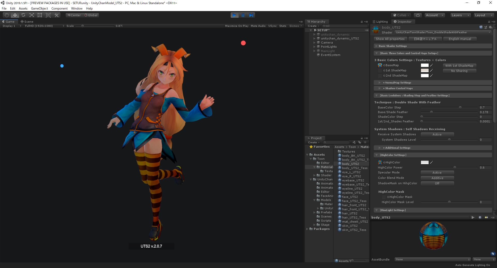
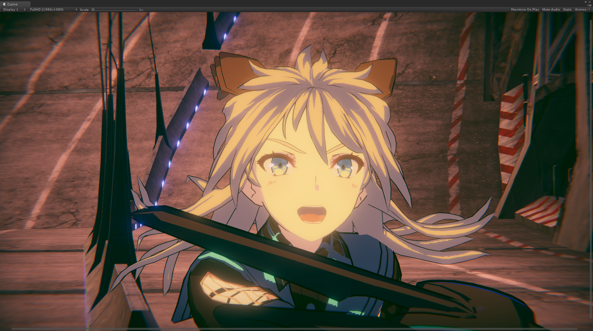
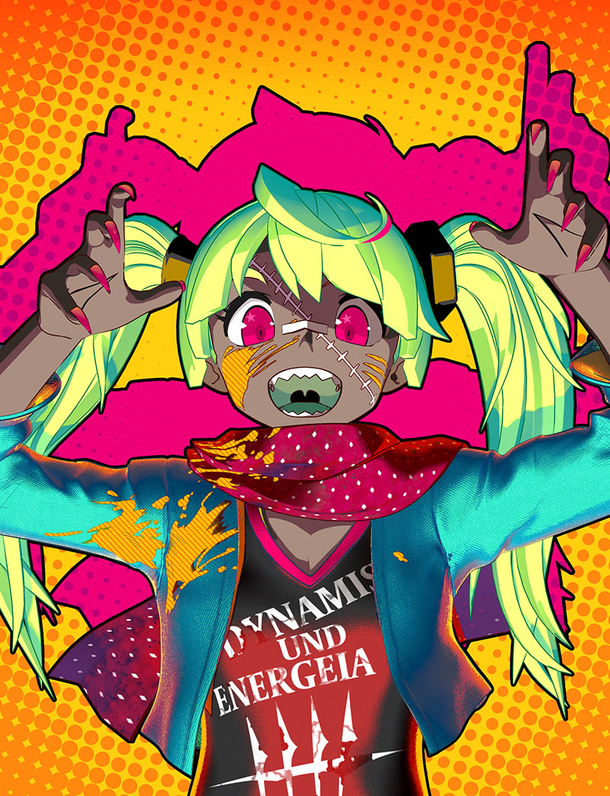
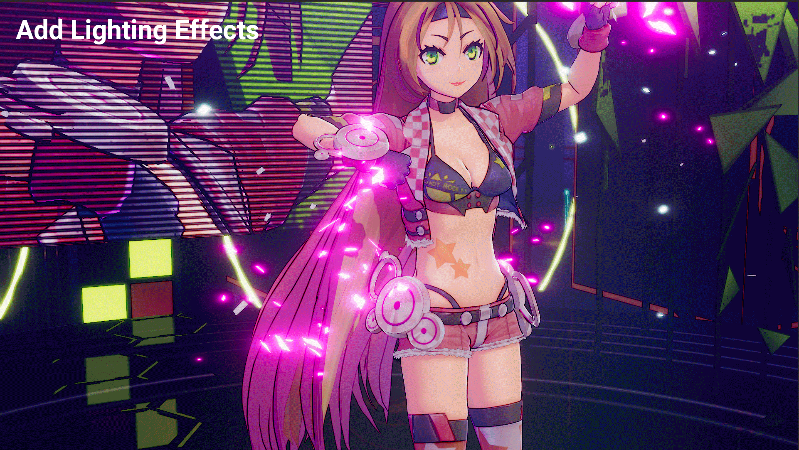
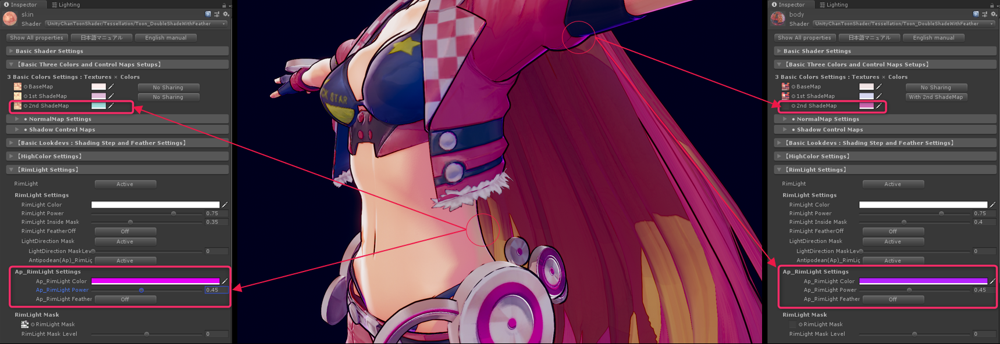
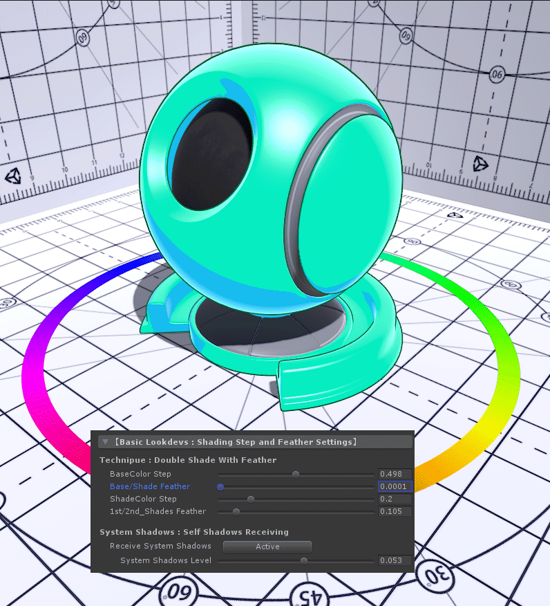
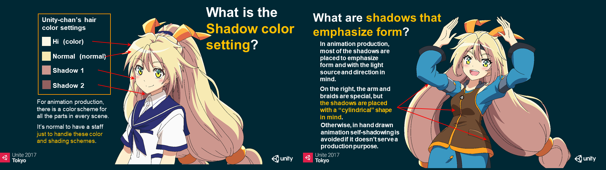
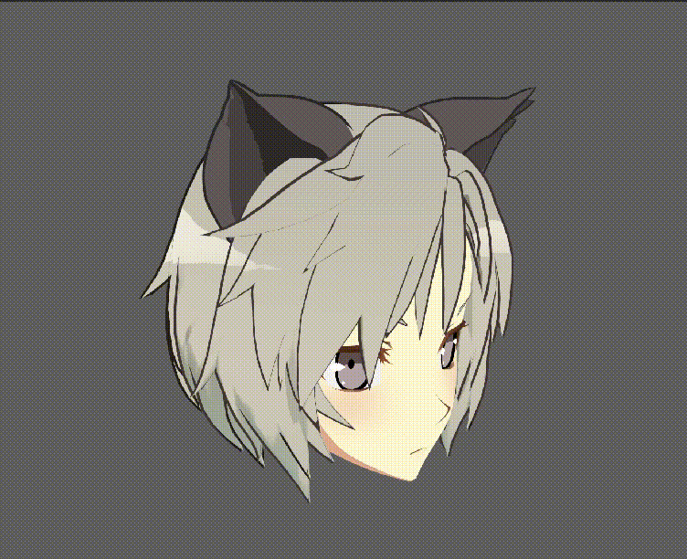
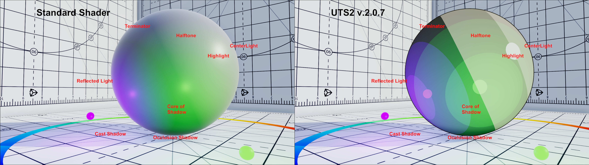

# 【UTS2 / UniversalToon Ver.7.1.8】
---

***Read this document in other languages: [日本語版](https://github.com/unity3d-jp/UnityChanToonShaderVer2_Project/blob/urp/master/README_ja.md)***  

## 【Overview : What is UTS2?】

**UTS2 (Unity-Chan Toon Shader 2.0)** is a toon shader for images and video that is designed to meet the needs of creators working on cel-shaded 3DCG animations. Unlike other pre-render toon shaders, **all features can be adjusted in real time on Unity, which is the greatest feature of UTS2**.  

**UniversalToon** is the UTS2 shader for Universal Render pipeline for Unity.  
**UniversalToon** has all the feature of UTS2 v.2.0.7.5, and been implemented as an uber shader.  

UTS2 has great power and makes a wide variety of character designs possible, **from cel-shaded to light novel illustration styles**.  

UTS2 has the 3 basic layers of **Base Color**, **1st Shade Color**, and **2nd Shade Color**, colors and textures can also accept a wide variety of customization options, such as **High Color**, **Rim Light**, **MatCap** (sphere mapping), and **Emissive** (light emission).  

What colors will you select as **accent colors**? The accent color is the color which is set at the opposite side of light direction.  

In UTS2, you can use **2nd shade color and Ap-RimLight** as accent color. Of course, these accent colors also change dynamically to the light.  

**The level of gradation (feather) between colors can also be adjusted in Unity in real-time**.  

In animation production, color design is made for each part in each scene unit. It is common to have specialists who make these color designs. UTS2 is suitable for such pipelines.  

In Animation movies, shadows are used not only to represent light directions but also to clarify shapes of characters. It’s not just shadow, but a vital part of character design.  

For this purpose, UTS2 also has 2 options for creating fixed shadows necessary to the design: the **Position Map**, which assigns a set casting point to each shadow, and the **Shading Grade Map**, which can adjust shadow intensity based on the lighting. The movie above is a sample of the features of **Shading Grade Map and AngelRing**.  

These two images are comparison between **Standard Shader** and **UTS2** under the same lighting conditions.  

Although there is a difference between Photo-realistic and Non-photo-realistic images, you can understand all surface reflections to real-time lights are seen in the same areas. **It means UTS2 can be used as same as Standard Shader under various lighting conditions.**  

UTS2 is very useful if you want to decorate your game scene with beautiful lightings.
-----
## 【Users' Manual】
**[English manual for v.7.1.8](https://github.com/unity3d-jp/UnityChanToonShaderVer2_Project/blob/urp/master/Manual/UTS2_Manual_en.md) is available now.**  

Users' manual is a document with plentiful knowledge of toon style.  
The iteration cycle between reading the manual and using UTS2 actually is the best way to learn the beautiful toon style.  

-----
## 【Target Environment】
Requires Unity 2019.3.4f1 or higher.  
Requires Universal RP Version 7.1.8 or higher.  
If you use PostProcess Effects, requires Post Procesing Version 2.3.0 or higher.  

This package uses a forward rendering environment. Using a linear color space is recommended.  
(A gamma color space can also be used, but this tends to strengthen shadow gradiation. For more details, see [Linear or Gamma Workflow](https://docs.unity3d.com/ja/current/Manual/LinearRendering-LinearOrGammaWorkflow.html). )  

-----
## 【Target Platforms】
Windows, MacOS, iOS, Android, PlayStation4, Xbox One, Nintendo Switch  

-----
## 【License】
UTS2 / UniversalToon is provided under the Unity-Chan License 2.0 terms.  
Please refer to the following link for information regarding the Unity-Chan License.  
https://unity-chan.com/contents/guideline_en/

-----
## 【Download whole project】
### [UnityChanToonShaderVer2_Project (Zip)](https://github.com/unity3d-jp/UnityChanToonShaderVer2_Project/archive/urp/master.zip)  

The project comes with sample scenes where you can learn various setting examples of UTS2.  

-----
## 【Shader Installation】
### [UTS2URP_ShaderOnly_v7.1.8.unitypackage](https://github.com/unity3d-jp/UnityChanToonShaderVer2_Project/blob/urp/master/UTS2URP_ShaderOnly_v7.1.8unitypackage)  

When installing for the first time, simply drag and drop this package into Unity to begin the installation process.  
**You should install Universal RP from Package Manager before installation.**  

1. Back-up all previous projects.  
2. When opening a project in Unity, create a new scene beforehand.  
3. Drag and drop this pack into Unity.  

Be sure to check the [manual](https://github.com/unity3d-jp/UnityChanToonShaderVer2_Project/blob/urp/master/Manual/UTS2_Manual_en.md) after installation.  
The manual explains how to use UTS2 in detail.  

Please contact us if you have any issues.  

-----
## 【How to report issues】
Please report your issues from [here](https://github.com/unity3d-jp/UnityChanToonShaderVer2_Project/issues).  
When you make a new issue, please add the information below.  
* **The version of UTS2** you are using :e.g. UTS2/UniversalToon v.7.1.8
* **The version of Unity** you are using :e.g. Unity 2019.3.4f1
* **Type of OS** using Unity :e.g. Windows 10
* **The version of Universal RP** you are using :e.g. Version 7.1.8

【**Note**】Before reporting your issues, be sure to overwrite-install [the latest UTS2/UniversalToon package](https://github.com/unity3d-jp/UnityChanToonShaderVer2_Project/blob/urp/master/UTS2URP_ShaderOnly_v8.0.0.unitypackage) to see if your problem still appears. Also, please check that the scenes in [the UTS2/UniversalToon sample project](https://github.com/unity3d-jp/UnityChanToonShaderVer2_Project/archive/urp/master.zip) work properly in your environment.  

-----
## 【Release History】  
The release history of UTS2/UniversalToon is [here.](https://github.com/unity3d-jp/UnityChanToonShaderVer2_Project/blob/urp/master/Manual/HISTORY_en.md)  

-----
## 【Information】  
Latest Version: 7.1.8 for URP  
Update: 2020/05/22  
Category: 3D / Shader  
File format: unitypackage  

-----
**README.md 2020/05/22**  
