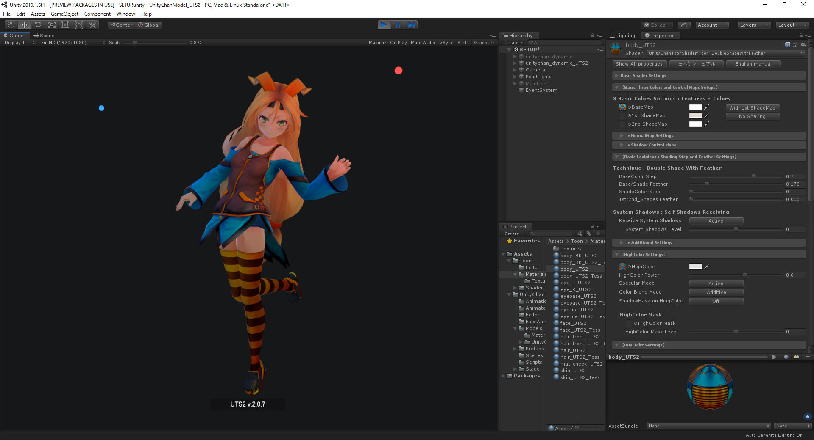

# 【UTS/UniversalToon Ver.Ver.2.2.3】
---

***Read this document in [日本語版](README_ja.md)***  

## 【Overview : What is UTS/UniversalToon?】

**UTS2 (Unity-Chan Toon Shader 2.0)** is a toon shader for images and video that is designed to meet the needs of creators working on cel-shaded 3DCG animations. Unlike other pre-render toon shaders, **all features can be adjusted in real time on Unity, which is the greatest feature of UTS2**.  

**UTS/UniversalToon** is the UTS2 shader for Universal Render pipeline for Unity.  
**UTS/UniversalToon** has all the feature of UTS2 v.2.0.7.5, and been implemented as an uber shader.  

UTS/UniversalToon has great power and makes a wide variety of character designs possible, **from cel-shaded to light novel illustration styles**.  

UTS/UniversalToon has the 3 basic layers of **Base Color**, **1st Shade Color**, and **2nd Shade Color**, colors and textures can also accept a wide variety of customization options, such as **High Color**, **Rim Light**, **MatCap** (sphere mapping), and **Emissive** (light emission).  

What colors will you select as **accent colors**? The accent color is the color which is set at the opposite side of light direction.  

In UTS/UniversalToon, you can use **2nd shade color and Ap-RimLight** as accent color. Of course, these accent colors also change dynamically to the light.  

**The level of gradation (feather) between colors can also be adjusted in Unity in real-time**.  

In animation production, color design is made for each part in each scene unit. It is common to have specialists who make these color designs. UTS/UniversalToon is suitable for such pipelines.  

In Animation movies, shadows are used not only to represent light directions but also to clarify shapes of characters. It’s not just shadow, but a vital part of character design.  

For this purpose, UTS/UniversalToon also has 2 options for creating fixed shadows necessary to the design: the **Position Map**, which assigns a set casting point to each shadow, and the **Shading Grade Map**, which can adjust shadow intensity based on the lighting. The movie above is a sample of the features of **Shading Grade Map and AngelRing**.  

These two images are comparison between **URP/lit Shader** and **UTS/UniversalToon** under the same lighting conditions.  

Although there is a difference between Photo-realistic and Non-photo-realistic images, you can understand all surface reflections to real-time lights are seen in the same areas. **It means UTS/UniversalToon can be used as same as URP/Lit Shader under various lighting conditions.**  

UTS/UniversalToon is very useful if you want to decorate your game scene with beautiful lightings.  

-----
## 【Users' Manual】
**[English manual for v.2.2.0](Documentation~/index.md) is available now.**  

Users' manual is a document with plentiful knowledge of toon style.  
The iteration cycle between reading the manual and using UTS/UniversalToon actually is the best way to learn the beautiful toon style.  

-----
## 【Target Environment】
Requires Unity 2019.3.4f1 or higher.  
Requires Universal RP Version 7.3.1 or higher.  
If you use PostProcess Effects, requires Post Procesing Version 2.3.0 or higher.  

This package uses a forward rendering environment. Using a linear color space is recommended.  
(A gamma color space can also be used, but this tends to strengthen shadow gradiation. For more details, see [Linear or Gamma Workflow](https://docs.unity3d.com/ja/current/Documentation~/LinearRendering-LinearOrGammaWorkflow.html). )  

-----
## 【Target Platforms】
Windows, MacOS, iOS, Android, PlayStation4, Xbox One, Nintendo Switch  

-----
## 【Install】
- You can add UTS/UniversalToon from __Package Manager__. 
1. Download this package from github.
2. Open Unity Package Manager in your Unity from __Window>Package Manager__ menu.
3. Add this package by clicking __+__ button. You can add downloaded package by selecting "add package from disk..."

It is always recommended to backup your project before install.
Also check the [documentation](Documentation~/index.md). 
The manual explains how to use UTS/UniversalToon in detail.  

Please contact us if you have any issues.

-----
## 【How to report issues】
Please report your issues from [here](https://github.com/unity3d-jp/UnityChanToonShaderVer2_Project/issues).  
When you make a new issue, please add the information below.  
* **The version of UTS/UniversalToon** you are using :e.g. UTS/UniversalToon v.2.2.0
* **The version of Unity** you are using :e.g. Unity 2019.3.4f1
* **Type of OS** using Unity :e.g. Windows 10
* **The version of Universal RP** you are using :e.g. Version 7.3.1

【**Note**】Before reporting your issues, make sure you are using the latest version and see if your problem still appears. 
Also, please check that the scenes in [the UTS/UniversalToon sample project](https://github.com/unity3d-jp/UnityChanToonShaderVer2_Project/archive/urp/master.zip) work properly in your environment.  

-----
## 【Changelog】  
The changelog of UTS/UniversalToon is [here.](CHANGELOG.md)  

-----
## 【Information】  
Latest Version: 2.2.0 for URP  
Update: 2020/07/07  
Category: 3D / Shader  
File format: UPM package  

-----
**README.md 2020/07/07**  
