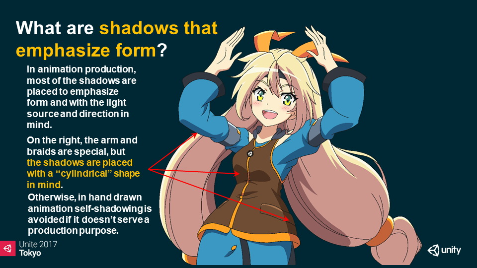
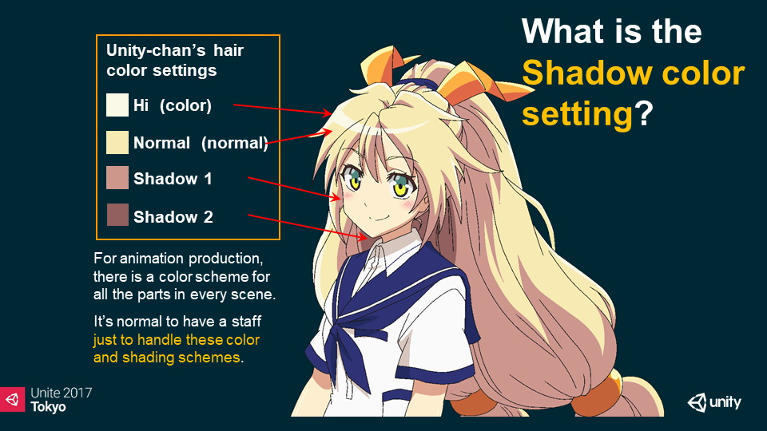

# 【ユニティちゃんトゥーンシェーダー 2.0 (UTS2) Ver.2.0.9】
---

***Read this document in other languages: [English](./README.md)***  

## 2024/01/26: おしらせ
Unity-Chan Toon Shader 2.0 にご関心をお寄せいただき、ありがとうございます。
なお、本パッケージは[Unity Toon Shader](https://docs.unity3d.com/ja/Packages/com.unity.toonshader@0.9/manual/index.html)に継承されており、メンテナンスもリリース計画もなく、そのまま提供されています。
そのため、このパッケージに関するバグレポートの監視、機能リクエストの受付、プルリクエストの確認はできません。

ただし、Unity Toon Shader へのアップグレードではなく、Unity-Chan Toon Shader 2.0 の継続利用や改良を希望される場合もあるかと思います。
その場合、リポジトリをフォークすることをお勧めします。そうすることで、適切と思われる変更や拡張を行うことができます。

## 2022/06/14：2.0.9 Release：新規機能追加    
* リリース環境を、Unity 2019.4.31f1に変更。Unity 2020.3.x LTSでの動作確認。  
* シングルパスインスタンシング レンダリング(ステレオインスタンシングとも呼ばれます)に対応。サポートするプラットフォームは、[Unity マニュアル](https://docs.unity3d.com/ja/2019.4/Manual/SinglePassInstancing.html)を参照してください。  
* 本リリースより、おまけのUTS2イメージエフェクトUnityPackageはサポート外として削除しました。  
* リアルタイムディレクショナルライトがない環境での、拡張アウトラインオブジェクトの環境ライティングへの馴染ませ具合を向上しました。  

## 【UTS2の概要】

**ユニティちゃんトゥーンシェーダー 2.0 (UTS2)** は、セル風3DCGアニメーションの制作現場での要望に応えるような形で設計された、トゥーンシェーダーです。他のプリレンダー向けトゥーンシェーダーとは異なり、**すべての機能がUnity上でリアルタイムで調整可能なことが、UTS2の最大の特長です**。  

UTS2の強力な機能を使うことで、**セルルックから始まり、ラノベ風のイラスト表現**まで幅広いキャラクター表現が可能となっています。  

UTS2は、「**基本色（ベースカラー）**」、「**１影色**」、「**２影色**」からなる基本３色による塗り分けに加えて、「**ハイカラー**」や「**リムライト**」、「**MatCap**（スフィアマッピング）」、「**エミッシブ**（自己発光）」などの沢山のオプションを追加することで、各カラーやテクスチャを様々に彩ることができます。  

「**アクセントカラー**」には、どんな色を選択しますか？ アクセントカラーとは、光源の方向の反対側に設定されるカラーのことです。  

UTS2では、アクセントカラーとして**2影色とAp(対蹠)リムライト**を使用できます。もちろんこれらのアクセントカラーもライトに対して動的に変化します。  

また**各カラー間のぼかし加減も、Unity上でリアルタイムに調整することが可能**です。  

アニメーション制作の現場では、各シーンごとに各々のパーツに対してカラーデザインがなされます。またこれらのカラーデザインを作るスペシャリストがいるのが一般的です。UTS2はそのようなパイプラインに適した設計になっています。  

アニメーション映画では、影は光の差し込む方向を表すためだけでなく、キャラクターの形状を明確にするためにも使用されます。影は、単なる影に留まらず、キャラクターデザインの重要な部分を占めています。  

これらデザイン上必要となる固定影の配置も、各影色ごとに発生する位置を設定できる「**ポジションマップ**」と、ライティングによって影の出やすさを変えることのできる「**シェーディンググレードマップ**」の、２つの手法が選べます。上のムービーは、**シェーディンググレードマップと天使の輪**機能のサンプルです。  

これら2つの画像は、同じ条件のライティング下での **Standard Shader** と **UTS2 v.2.0.7.5** の比較です。  

写実的な（フォトリアリスティックな）イメージとノンフォトリアリスティックなイメージの違いがありますが、リアルタイムライトに対するすべての表面反射に注目すると、両者が同じ領域に発生していることがわかります。**UTS2は、さまざまなライティングの条件下で、Standard Shaderと同様に扱うことができます。**  

ゲームシーンを美しいライティングで飾りたいならば、UTS2は非常に役に立ちます。  

また昨今のVRChatでのユーザーの声を反映し、様々なライティング設定の環境下でも、キャラクターが美しく表現されるように様々な工夫が実装されています。  

-----
## 【ユーザーマニュアル】
**[日本語マニュアル（v.2.0.9版）](Manual/UTS2_Manual_ja.md)が提供されています。合わせてご利用ください。**  

ユーザーマニュアルには、トゥーンスタイルに関する、豊富なナレッジが集まっています。  
マニュアルを読みつつ、実際にUTS2を使ってみるを繰り返すことで、美しいトゥーンスタイルを作り上げるための方法論が自然に身につきます。  

-----
## 【ターゲット環境】
* UTS2シェーダー本体およびUTS2マテリアルは、Unity 5.6.7f1以降対応。（Unity 2019.4.31f1以降の使用を推奨します）  
* サンプルシーンを正常に再生するには、Unity 2019.4.31f1 もしくはそれ以降が必要です。  
* Unity 2019.4.31f1からUnity 2020.3.34f1、Unity 2021.3.3f1、Unity2022.1.1f1までの動作確認が終了しています。  
* 本パッケージは、Unity 2019.4.31f1で作成されています。  

Forwardレンダリング環境。リニアカラースペースでの使用を推奨します。  
（ガンマカラースペースでも使用できますが、ガンマカラーの特性上、陰影の階調変化が強めに出る傾向があります。詳しくは、[リニアのワークフローとガンマのワークフロー](https://docs.unity3d.com/ja/current/Manual/LinearRendering-LinearOrGammaWorkflow.html) を参照してください。）  

-----
## 【ターゲットプラットフォーム】
Windows, MacOS, iOS, Android, PlayStation4, Xbox One, Nintendo Switch  

* テッセレーション版は、DX11が正常に動く環境のみのサポートです。  

-----
## 【提供ライセンス】
「ユニティちゃんトゥーンシェーダー 2.0」は、UCL2.0（ユニティちゃんライセンス2.0）で提供されます。  
ユニティちゃんライセンスについては、以下を参照してください。  
https://unity-chan.com/contents/guideline/

-----
## 【プロジェクト全体のダウンロード】
### [UnityChanToonShaderVer2_Project (Zip)](https://github.com/unity3d-jp/UnityChanToonShaderVer2_Project/archive/refs/heads/release/legacy/2.0.zip)  

プロジェクトには、UTS2の様々な設定例が学べるサンプルシーンが付属します。  

-----
## 【シェーダーのインストール】
### [UTS2_ShaderOnly_v2.0.9_Release.unitypackage](./UTS2_ShaderOnly_v2.0.9_Release.unitypackage)  

新規インストールは、Unityにそのまま本パッケージをD&Dすればインストールされます。  
上書きインストールの場合も、同様の手順で問題ありませんが、細心の注意を払いたい場合は、以下の手順で行うとよいでしょう。  
1. 元のプロジェクトのバックアップをとっておく  
2. Unityでプロジェクトを開き、新規シーンを作成して開いておく。  
3. 元のトゥーンシェーダーが入っているフォルダ（Assets/Toon/Shader）をUnity上から削除する。  
4. 本パッケージをUnityにD&Dする。  

インストール後は、必ず[マニュアル](Manual/UTS2_Manual_ja.md)を確認するようにしてください。  
マニュアルには、UTS2の使い方が詳しく解説されています。  

個人でみられる範囲でバグチェックはしていますが、何か不具合があったらご連絡よろしくお願いします。

-----
## 【リリース履歴】  
UTS2のリリース履歴は、[こちら](Manual/HISTORY_ja.md)。  

-----
## 【インフォメーション】  
最新バージョン：2.0.9 Release  
最終リリース日：2022/06/14  
カテゴリー：3D  
形式：zip/unitypackage  

-----
**README_ja.md 2022/06/14**  
