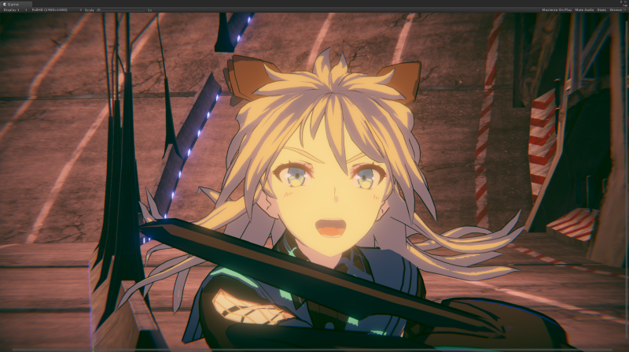
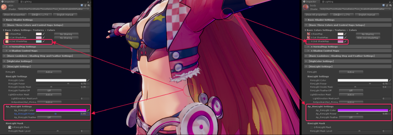
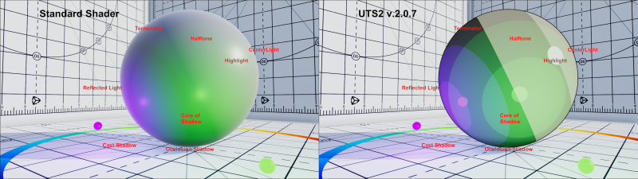

# 【UTS2 / UniversalToon Ver.7.1.8】
---

***Read this document in other languages: [English](https://github.com/unity3d-jp/UnityChanToonShaderVer2_Project/blob/urp/master/README.md)***  

## 【UTS2の概要】

**UTS2 (ユニティちゃんトゥーンシェーダー 2.0)** は、セル風3DCGアニメーションの制作現場での要望に応えるような形で設計された、トゥーンシェーダーです。他のプリレンダー向けトゥーンシェーダーとは異なり、**すべての機能がUnity上でリアルタイムで調整可能なことが、UTS2の最大の特長です**。  

**UniversalToon** は、Unityのユニバーサルレンダーパイプライン向けのUTS2です。  
**UniversalToon** は、UTS2 v.2.0.7.5の全機能を実装した、ウーバーシェーダー（統合型シェーダー）として設計されています。  

UTS2の強力な機能を使うことで、**セルルックから始まり、ラノベ風のイラスト表現**まで幅広いキャラクター表現が可能となっています。  

UTS2は、「**基本色（ベースカラー）**」、「**１影色**」、「**２影色**」からなる基本３色による塗り分けに加えて、「**ハイカラー**」や「**リムライト**」、「**MatCap**（スフィアマッピング）」、「**エミッシブ**（自己発光）」などの沢山のオプションを追加することで、各カラーやテクスチャを様々に彩ることができます。  

「**アクセントカラー**」には、どんな色を選択しますか？ アクセントカラーとは、光源の方向の反対側に設定されるカラーのことです。  

UTS2では、アクセントカラーとして**2影色とAp(対蹠)リムライト**を使用できます。もちろんこれらのアクセントカラーもライトに対して動的に変化します。  

また**各カラー間のぼかし加減も、Unity上でリアルタイムに調整することが可能**です。  

アニメーション制作の現場では、各シーンごとに各々のパーツに対してカラーデザインがなされます。またこれらのカラーデザインを作るスペシャリストがいるのが一般的です。UTS2はそのようなパイプラインに適した設計になっています。  

アニメーション映画では、影は光の差し込む方向を表すためだけでなく、キャラクターの形状を明確にするためにも使用されます。影は、単なる影に留まらず、キャラクターデザインの重要な部分を占めています。  

これらデザイン上必要となる固定影の配置も、各影色ごとに発生する位置を設定できる「**ポジションマップ**」と、ライティングによって影の出やすさを変えることのできる「**シェーディンググレードマップ**」の、２つの手法が選べます。上のムービーは、**シェーディンググレードマップと天使の輪**機能のサンプルです。  

これら2つの画像は、同じ条件のライティング下での **Standard Shader** と **UTS2** の比較です。  

写実的な（フォトリアリスティックな）イメージとノンフォトリアリスティックなイメージの違いがありますが、リアルタイムライトに対するすべての表面反射に注目すると、両者が同じ領域に発生していることがわかります。**UTS2は、さまざまなライティングの条件下で、Standard Shaderと同様に扱うことができます。**  

ゲームシーンを美しいライティングで飾りたいならば、UTS2は非常に役に立ちます。  

-----
## 【ユーザーマニュアル】
**[日本語マニュアル（v.7.1.8版）](https://github.com/unity3d-jp/UnityChanToonShaderVer2_Project/blob/urp/master/Manual/UTS2_Manual_ja.md)が提供されています。合わせてご利用ください。**  

ユーザーマニュアルには、トゥーンスタイルに関する、豊富なナレッジが集まっています。  
マニュアルを読みつつ、実際にUTS2を使ってみるを繰り返すことで、美しいトゥーンスタイルを作り上げるための方法論が自然に身につきます。  

-----
## 【ターゲット環境】
Unity 2019.3.4f1 もしくはそれ以降が必要です。  
Universal RP Version 7.1.8 もしくはそれ以降が必要です。  
ポストプロセスエフェクトを使う場合には, Post Procesing Version 2.3.0 もしくはそれ以降が必要です。  

Forwardレンダリング環境。リニアカラースペースでの使用を推奨します。  
（ガンマカラースペースでも使用できますが、ガンマカラーの特性上、陰影の階調変化が強めに出る傾向があります。詳しくは、[リニアのワークフローとガンマのワークフロー](https://docs.unity3d.com/ja/current/Manual/LinearRendering-LinearOrGammaWorkflow.html) を参照してください。）  

-----
## 【ターゲットプラットフォーム】
Windows, MacOS, iOS, Android, PlayStation4, Xbox One, Nintendo Switch  

-----
## 【提供ライセンス】
「UTS2 / UniversalToon」は、UCL2.0（ユニティちゃんライセンス2.0）で提供されます。  
ユニティちゃんライセンスについては、以下を参照してください。  
https://unity-chan.com/contents/guideline/

-----
## 【プロジェクト全体のダウンロード】
### [UnityChanToonShaderVer2_Project (Zip)](https://github.com/unity3d-jp/UnityChanToonShaderVer2_Project/archive/urp/master.zip)  

プロジェクトには、UTS2の様々な設定例が学べるサンプルシーンが付属します。  

-----
## 【シェーダーのインストール】
### [UTS2URP_ShaderOnly_v7.1.8.unitypackage](https://github.com/unity3d-jp/UnityChanToonShaderVer2_Project/blob/urp/master/UTS2URP_ShaderOnly_v7.1.8.unitypackage)  

新規インストールは、Unityにそのまま本パッケージをD&Dすればインストールされます。  
**事前にPackage ManagerからUniversal RPをインストールしておくことが必要です。**  

1. 元のプロジェクトのバックアップをとっておく  
2. Unityでプロジェクトを開き、新規シーンを作成して開いておく。  
3. 本パッケージをUnityにD&Dする。  

インストール後は、必ず[マニュアル](https://github.com/unity3d-jp/UnityChanToonShaderVer2_Project/blob/urp/master/Manual/UTS2_Manual_ja.md)を確認するようにしてください。  
マニュアルには、UTS2の使い方が詳しく解説されています。  

個人でみられる範囲でバグチェックはしていますが、何か不具合があったらご連絡よろしくお願いします。  

-----
## 【不具合報告】
不具合の報告は、[こちら](https://github.com/unity3d-jp/UnityChanToonShaderVer2_Project/issues)からお願いします。  
新規報告の際、以下の情報をお願いします。 
* 使用している**UTS2のバージョン**　：例　UTS2/UniversalToon v.7.1.8
* 使用している**Unityのバージョン**　：例　Unity 2019.3.4f1
* Unityを使用している**OSの種類**　：例　Windows10
* 使用している**Universal RPのバージョン**　：例　Version 7.1.8

【**お願い**】不具合報告の前に、必ず[最新のUTS2/UniversalToonパッケージ](https://github.com/unity3d-jp/UnityChanToonShaderVer2_Project/blob/urp/master/UTS2URP_ShaderOnly_v8.0.0.unitypackage)を上書きインストールしてみて、それでも不具合が出るか確認してください。また[サンプルプロジェクト](https://github.com/unity3d-jp/UnityChanToonShaderVer2_Project/archive/urp/master.zip)内のシーンがご自身の環境で正常に動作するかも、合わせてご確認をお願いします。

-----
## 【リリース履歴】  
UTS2/UniversalToonのリリース履歴は、[こちら](https://github.com/unity3d-jp/UnityChanToonShaderVer2_Project/blob/urp/master/Manual/HISTORY_ja.md)。  

-----
## 【インフォメーション】  
最新バージョン：7.1.8 URP専用  
最終リリース日：2020/05/22  
カテゴリー：3D / Shader  
形式：unitypackage  

-----
**README_ja.md 2020/05/22**  
