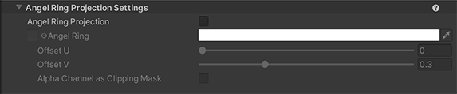
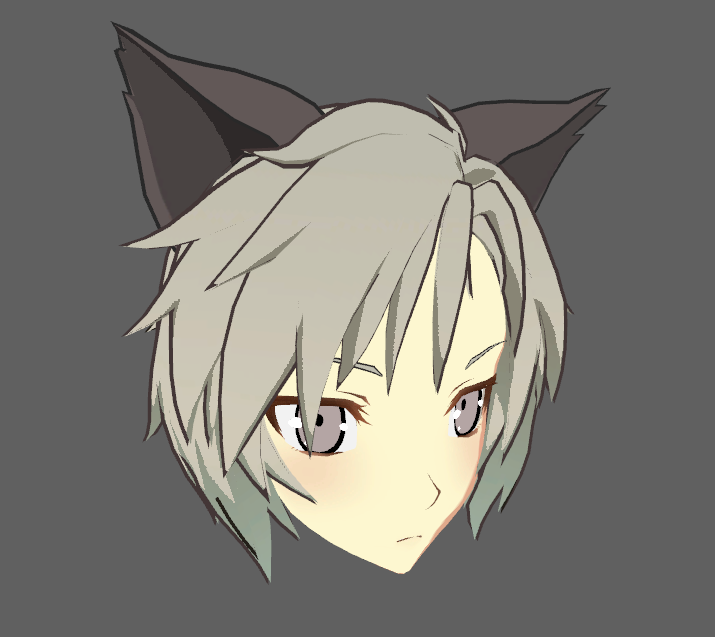
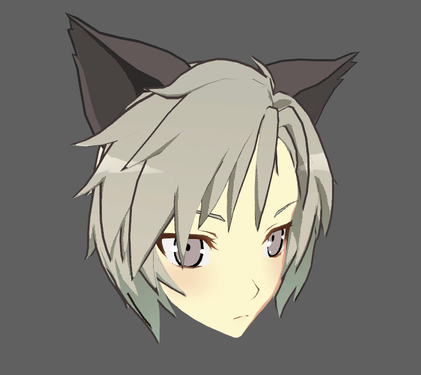
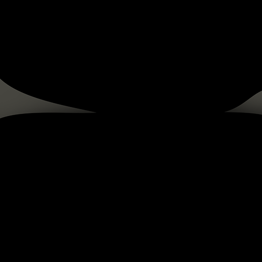
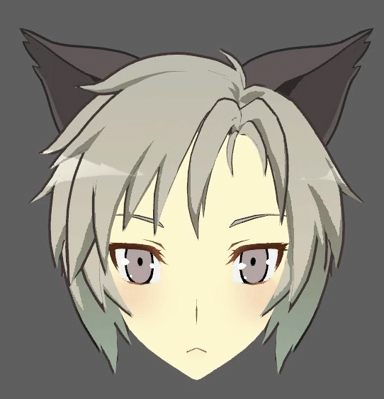
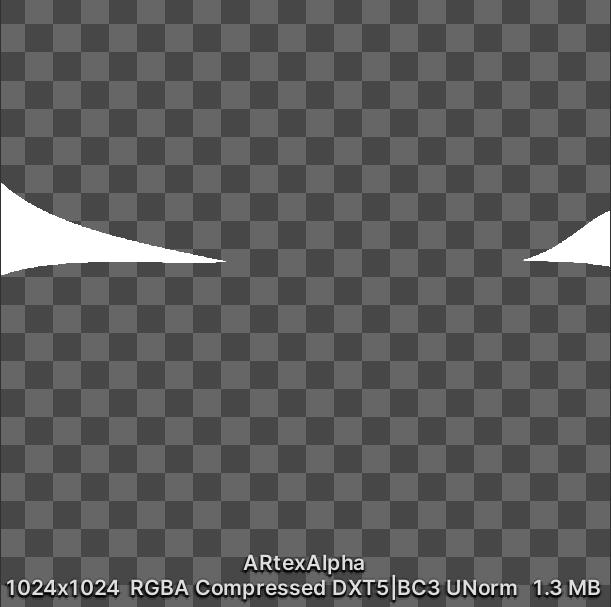
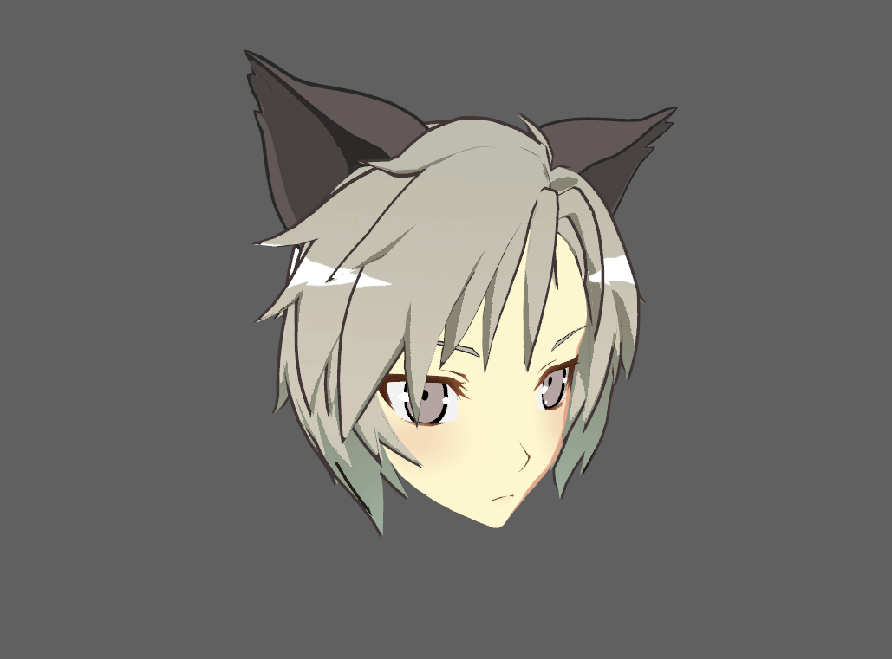

# Angel Ring Projection Settings

The Angel Ring effect for UTS expresses shine or luster in hair. This effect always appears in a fixed position as seen from the Camera. Angel Ring requires the 2nd UV in the meshes.

  

  

- [Angel Ring Projection](#angel-ring-projection) 
  - [Angel Ring](#angel-ring)
  - [Offset U](#offset-u)
  - [Offset V](#offset-v)
  - [Alpha Chennel as Clipping Mask](#alpha-chennel-as-clipping-mask)

## Angel Ring Projection
Enable the Angel Ring effect for UTS, which is used to express shine or luster in hair.

| Angel Ring Projection Off | Angel Ring Projection On |
| - | - |
|  |  |

### Angel Ring 
Angel Ring : Texture(sRGB) × Color(RGB). Default:Black.
By default, the **Unity Toon Shader** adds the color to the lighting results. Texturea alpha channel is not affected.
Please refer to [Alpha Chennel as Clipping Mask](#alpha-chennel-as-clipping-mask) when alpha clipping is desirable.

| Angale Ring Texture Example | 
| ---- |
||

### Offset U
Adjusts the Angel Ring’s shape in the horizontal direction. The range is from 0.0 to 0.5. The defalut is 0.
please refer to the image in [Offset V](#offset-v).

### Offset V
Adjusts the Angel Ring’s shape in the vertical direction. The range is from 0.0 to 1.0. The defalut is 0.3.

### Alpha Chennel as Clipping Mask

Texture alpha channel is a clipping mask. If disabled, the alpha is not affected at all. The color of the **Angel Ring** can be specified directly instead of using the additive method.

| Example Texture | Applied the texture with **Alpha Chennel as Clipping Mask** |
| - | - |
|  |  |
