# Three Color Map and Control Map Settings

**Three Color Map and Control Map Settings** provide basic cell shading settings in the **Unity Toon Shader**. These settings allow you to control the rendering of light and shadow areas independent from the actual light color. UTS allows detailed control whether the directional light color effects on materials. Please refer to [Scene Light Effectiveness Settings](SceneLight.md).

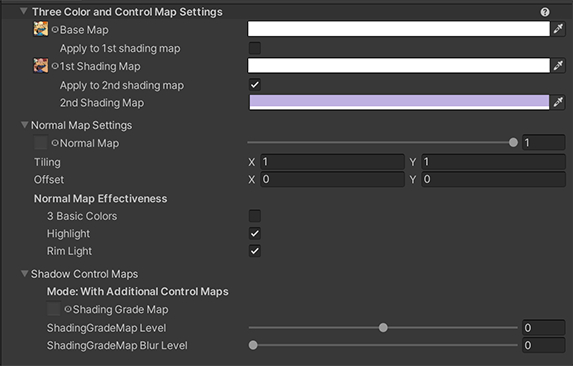
  

* [Three Basic Color Maps](#Three-basic-color-maps)
  * [Base Map](#base-map)
    * [Apply to 1st Shading Map](#apply-to-1st-shading-map)
  * [1st Shading map](#1st-shading-map)
    * [Apply to 2nd Shading Map](#apply-to-2nd-shading-map)
  * [2nd Shading Map](#2nd-shading-map)
  * [Example of Three Color Map Operation](#example-of-Three-color-map-operation) 
  

* [Shadow Control Maps](#shadow-control-maps)
  * [1st Shading Position Map](#1st-shading-map)
  * [2nd Shading Position Map](#2nd-shading-map)
  * [Example of Shadow Control Map Application](#example-of-shadow-control-map-application)
  

## Three Basic Color Maps

## Base Map
Base Color : Texture(sRGB) × Color(RGB). The default color is White. The base color represents the color of the unshaded area of object or character. 

|  Base Color Map (Face) | (Hair) | Result  |
| ---- | ---- |---- |
| 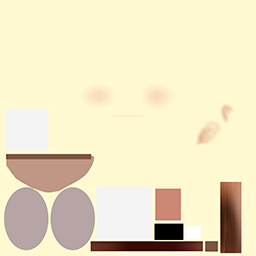  |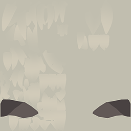 |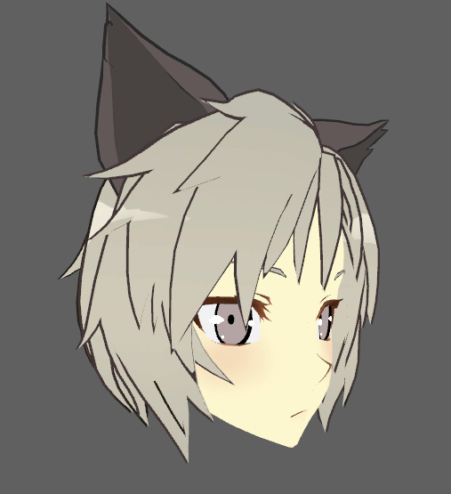  |

### Apply to 1st Shading Map
Apply **Base Map** to the **1st Shading Map**. When you check **Apply to 1st Shading Map**, the texture map in **1st Shading Map** isn't applied for rendering and the Inspector Window disables its texture UI.

## 1st Shading Map
The map used for the brighter portions of the shadow. Texture(sRGB) × Color(RGB). The default color is White.
|   **1st Shading Map** (Face) | (Hair) | Result  |
| ---- | ---- | ---- |
| 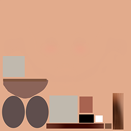   | 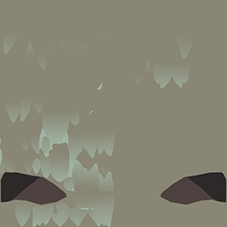 |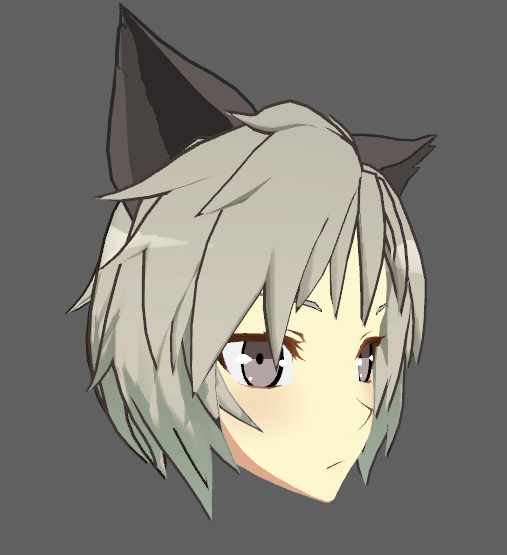  |

### Apply to 2nd Shading Map
Apply **Base Map** or the **1st Shading Map** to the **2nd Shading Map**. When you check the **Apply to 2nd Shading Map**, texture map in **2nd Shading Map** isn't applied for rendering and the Inspector Window disables its texture UI.

### 2nd Shading Map
The map used for the darker portions of the shadow. Texture(sRGB) × Color(RGB). The default color is White.
|  **2nd Shading Map** (Face)  | (Hair) | Result  |
| ---- | ---- | ---- |
| 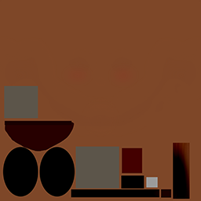   | 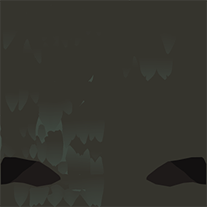 |  |

## Example of Three Color Map Operation
 

  

## Shadow Control Maps
Textures that dictates the fixed shadows of the material. 

### 1st Shading Position Map
Specify the position of fixed shadows that falls in 1st shade color areas in UV coordinates. **1st Position Map** : Texture(linear). 

### 2nd Shading Position Map
Specify the position of fixed shadows that falls in 2nd shade color areas in UV coordinates. **2nd Position Map** : Texture(linear).

  
## Example of Shadow Control Map Application
| Base Map | 1st Shading Map | Shading Position Map |
| ---- | ---- | ---- |
|  | |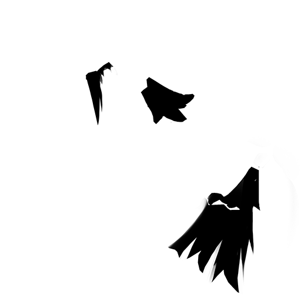 |

| No Shadow Control Maps |
| ---- |
| 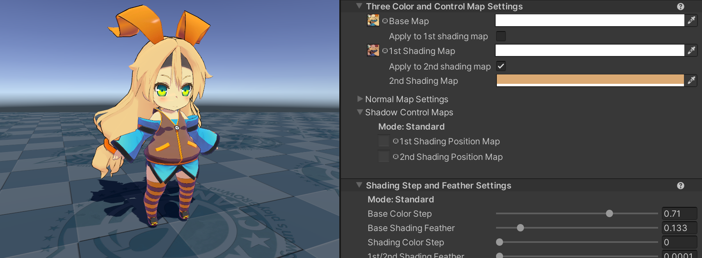 |

| 1st Shading Position Map |
| ---- | 
|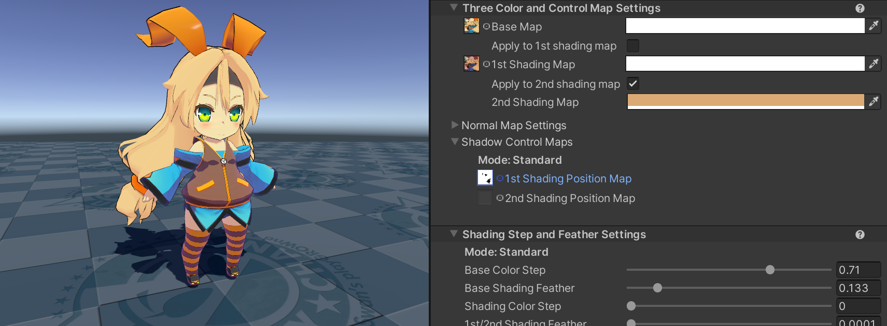 |

| 2nd Shading Position Map | 
| ---- |
| |

| Both |
| ---- |
| 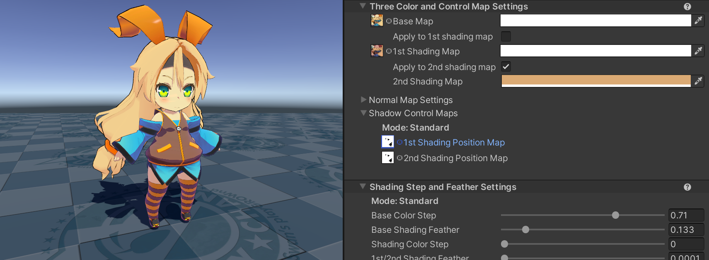|
