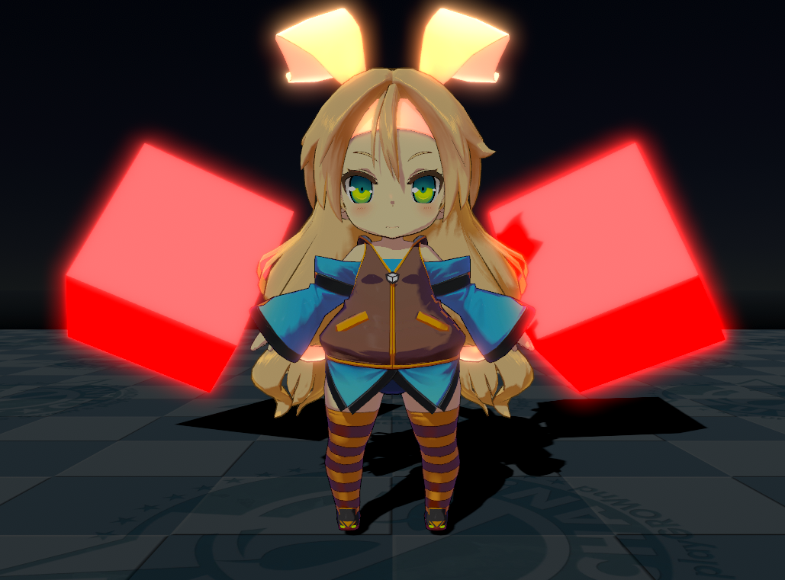
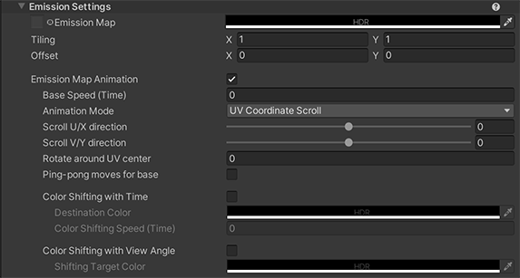
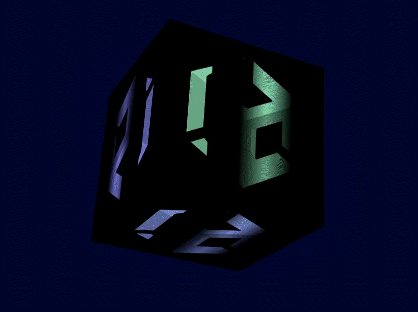
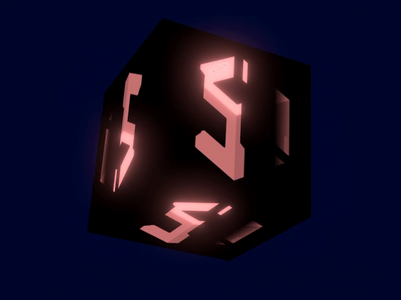
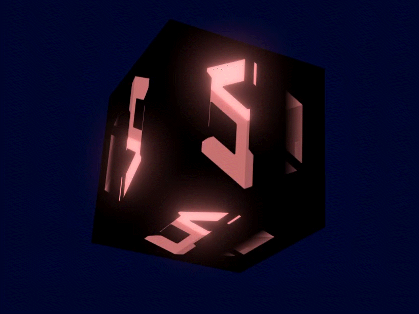
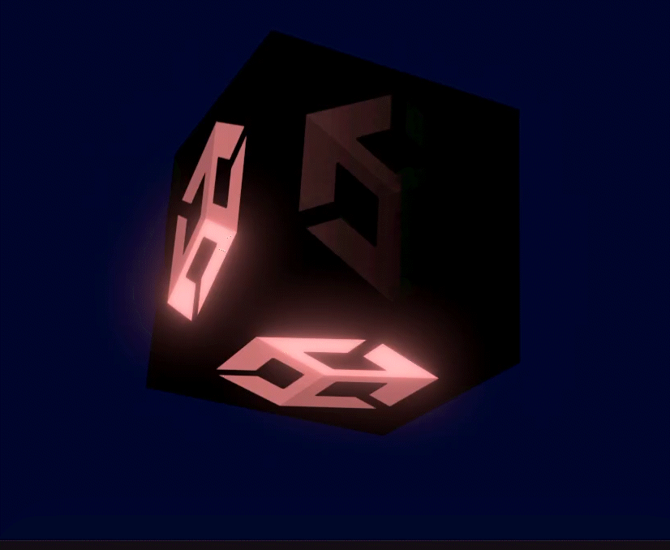
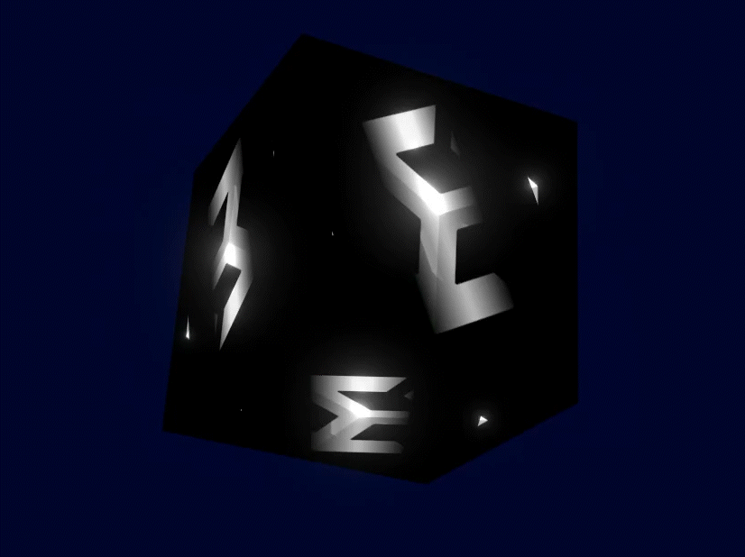
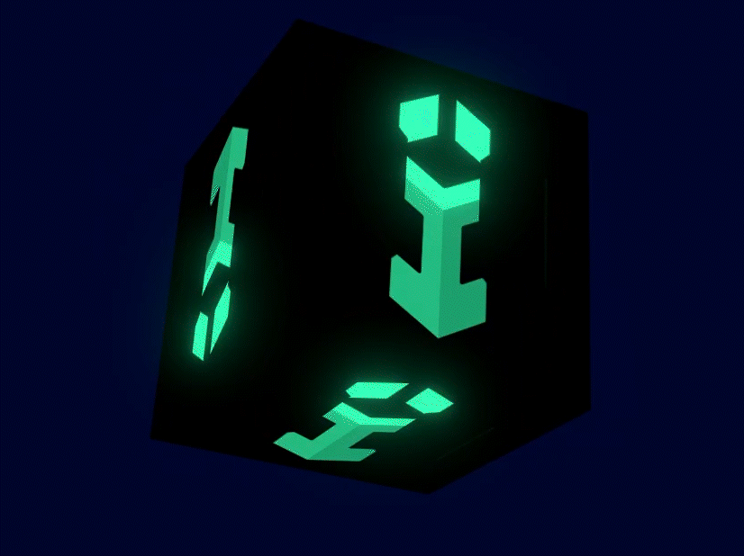
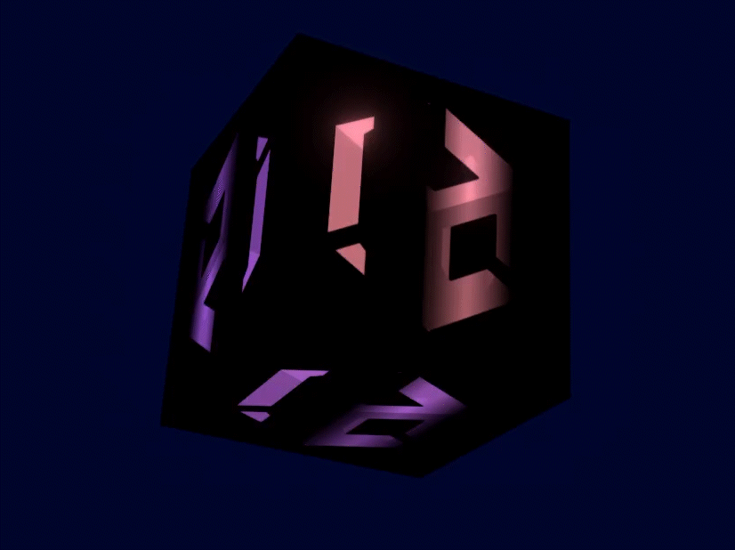

# Emission Settings

Emission controls the color and intensity of light emitted from the surface. When you use an emissive Material in your Scene, it appears as a visible source of light. The meshes appear to be self-illuminated.

  

  

* [Emission Map](#emission-map)
* [Emission Map Animation](#emission-map-animation)
  * [Base Speed (Time)](#base-speed-time)
  * [Animation Mode](#animation-mode)
  * [Scroll U/X direction](#scroll-ux-direction)
  * [Scroll V/Y direction](#scroll-vy-direction)
  * [Rotate around UV center](#rotate-around-uv-center)
  * [Ping-pong moves for base](#ping-pong-moves-for-base)

  * [Color Shifting with Time](#color-shifting-speed-time)
    * [Destination Color](#destination-color)
    * [Color Shifting Speed (Time)](#color-shifting-speed-time)

  * [Color Shifting with View Angle](#color-shifting-with-view-angle)
    * [Shifting Target Color](#shifting-target-color)

## Emission Map
Primarily used with the Bloom Post Effect and represents luminous objects.
| Emission Map Example |
| -- |
|  | 

## Emission Map Animation
When Enabled, the UV and Color of the **Emission Map** animate.

  

### Base Speed (Time)
Specifies the base update speed of scroll animation. If the value is 1, it will scroll in 1 second. Specifying a value of 2 results in twice the speed of a value of 1, so it will scroll in 0.5 seconds.

| Base Speed = 0.5 | Base Speed = 1.5 |
| -- | --|
| |  |

### Animation Mode
Controls the animated scrolling of the emissive texture.

| UV Coordinate Scroll | View Coordinate Scroll |
| -- | --|
| |  |

### Scroll U/X direction
Specifies how much the Emissive texture should scroll in the U-direction (x-axis direction) when updating the animation. Base Speed (Time) x Scroll U Direction x Scroll V Direction determine the animation speed.

### Scroll V/Y direction
Specifies how much the Emissive texture should scroll in the V-direction (y-axis direction) when updating the animation. Base Speed (Time) x Scroll U Direction x Scroll V Direction determine the animation speed.

### Rotate around UV center
When Base Speed=1, the Emissive texture will rotate clockwise by 1. When combined with scrolling, rotation will occur after scrolling.

### Ping-pong moves for base
When enabled, you can set PingPong (back and forth) in the direction of the animation.

### Color Shifting with Time
The color multiplied by the Emissive texture changes by linear interpolation (Lerp) toward the Destination Color.

#### Destination Color
Target color for [Color Shifting with Time](#color-shifting-with-time), must be in HDR.

#### Color Shifting Speed (Time)
Sets the reference speed for color shift. When the value is 1, one cycle should take around 6 seconds.

### Color Shifting with View Angle
Emissive color shifts consistent with view angle. The further out from the front of the camera, the more it changes to [Shifting Target Color](#shifting-target-color).

#### Shifting Target Color
Target color for [Color Shifting with View Angle](#color-shifting-with-view-angle) which must be in HDR. 

