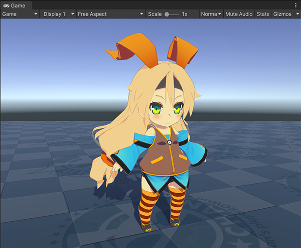
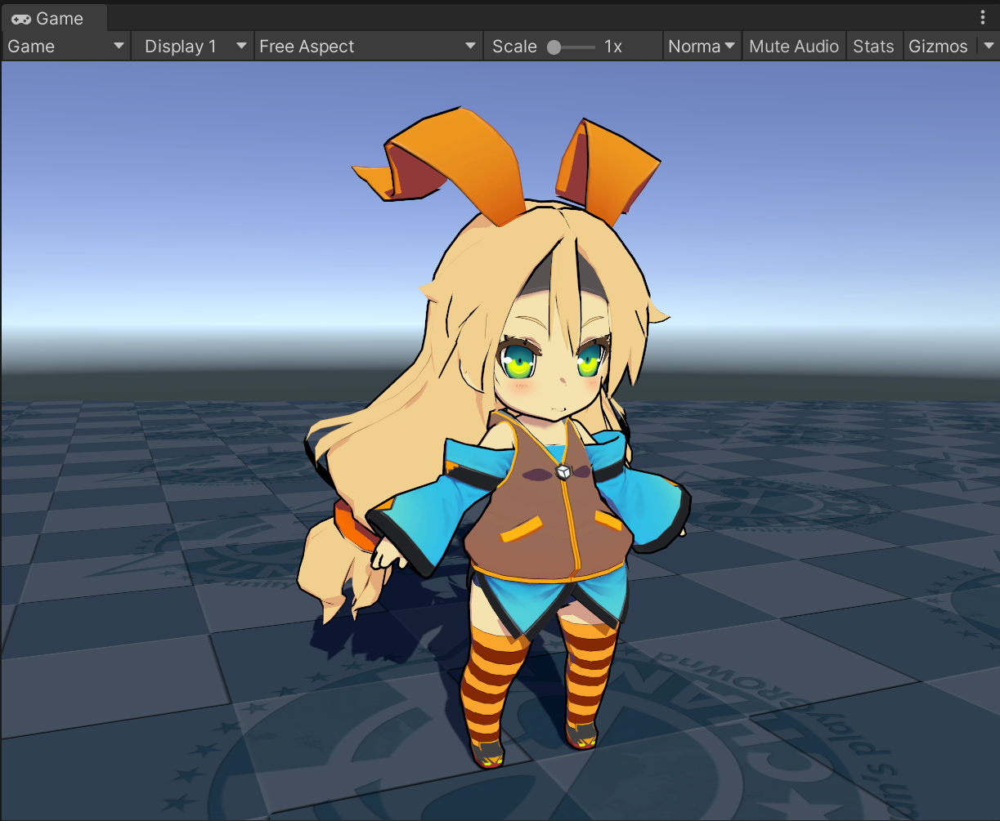
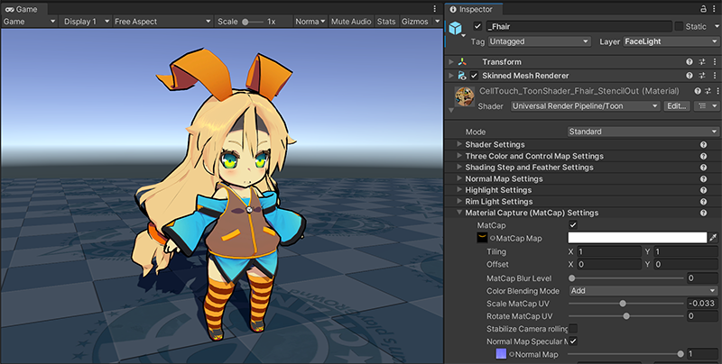
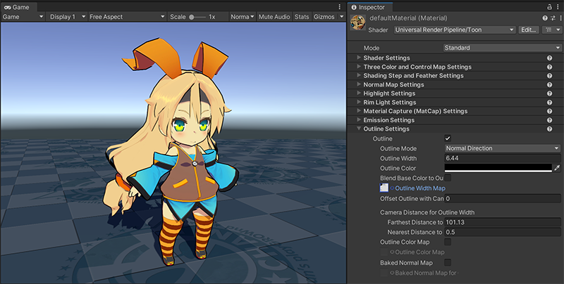

# Getting started with Unity Toon Shader

The **Unity Toon Shader**(UTS) provides tons of properties for professional cel-shading,though. In this chapter, you'll learn what are keys for basic cel-shading step by step. 

What you have to do for simple cel-shading are:
* [Make sure at least one directional light is in the scene.](#put-a-directional-light-in-the-scene)
* [Create materials for cel-shading and set appropriate shader path.](#creating-a-new-material-and-applying-it-unity-toon-shader)
* [Set up three basic colors](#setting-up-three-basic-colors).
* [Determine touch of the character](#adjusting-edge-of-three-basic-color-region).
* [Set Outline.](#set-outline)
* [Advanced techniques](#advanced-techniques)
  * [Add luster to hair](#adding-luster-to-hair)
  * [Erase outlines in the eyes](#erasing-outlines-in-the-eyes)
* [Options for stunning professional cel-shading](#more-options-for-stunning-professional-cel-shading)

## Put a directional light in the scene
To make cel-shading work. You need to place at least one [directional light](https://docs.unity3d.com/2022.2/Documentation/Manual/Lighting.html) in the scene.

## Creating a new material and applying it Unity Toon Shader

Start from [creating a material](https://docs.unity3d.com/2022.2/Documentation/Manual/materials-introduction.html).

| Set a new material to the character | 
| --- | 
|  | 

Selecting appropriate shader for the material. 

Because the **Unity Toon Shader**(UTS) includes shaders for all the render pipelines, the Built-in Render Pipeline, URP, and HDRP, you need to choose appropriate shader for the render pipeline set to your project.

| Render pipeline | Shader path | Tesselation Shader path |
|----|----|----|
|The Built-in Render Pipeline | Toon (Built-in) | ToonTessellation (Built-in) |
|URP | Universal Render Pipeline/Toon | N.A. |
|HDRP | HDRP/Toon | HDRP/ToonTessellation

| Applied Universal Render Pipeline/Toon | 
| --- | 
|  | 

## Setting up three basic colors

The most basic function of the UTS is to render the mesh in three regions. **Base Map** for regions with no shadows, **1st shading map** for regions with shaded lighter , and **2nd shading map** for regions with shaded darker. [Three Color Map and Control Map Settings](Basic.md) provides the properties to control this fundamental settings. For basic cel-shading, two maps, **Base Map** and **1st Shading Map** work fine.

| Applied Base Map and 1st Shading map to the material | 
| --- | 
|  | 

## Adjusting edge of three basic color region

Touch of the image is one of the most important factors that determine the style of the work. [Shading Steps and Feather Settings](ShadingStepAndFeather.md) provides  ways to adjust the position of the border between the regions and whether they're clearly separated or blended.

| Adjusted Base Color Step | 
| --- | 
|  | 

| Adjusted Base Shading Feather | 
| --- | 
|   | 

## Set outline
The Outline is another important factor that determines the animation touch. The color of the border should be close to the background or clearly distinguishable, and its thickness affects the style of the animation. [Outline Settings](Outline.md) provides the properties to control them.

| Thin outlines in a light color | 
| --- | 
|   | 

| Bold outlines in a dark color | 
| --- | 
|   | 

## Advanced techniques
Now, you  learned basic cel-sheding. To simplify the learning process, one material is set to the character, though, in real animation/game production scenes, much more detailed settings to various materials are indispensable. Sometimes special maps provide solution for problems.

The followings explain some simple techniques using more than two different materials.

### Adding luster to hair
[Highlight](Highlight.md) on hair makes the images more impressive. [Angel Ring](AngelRing.md) or [Material Capture(MatCap)](MatCap.md) are more specialized for hair luster. This time, apply MatCap on the hair. Create another material  then set [MatCap map](MatCap.md#matcap-map) in it.

| Applied MatCap Map to Hair | 
| --- | 
|   | 

### Erasing outlines in the eyes
Sometimes, outlines around characters' eyes spoil images. In such cases, [Outline Width Map](Outline.md#outline-width-map) is definitive answer to erase unnecessary outlines in the eyes.

| Applied Outline Width Map | 
| --- | 
|   | 

## More options for stunning professional cel-shading
The following factors are also essential in nowadays animation/game production when using cel-shading. Please try these out after mastering this chapter.

* [Emission](Emission.md)
* [Normal Map](NormalMap.md)
* [Rim Light](Rimlight.md)

