# Highlight Settings

The ability to display specular highlights in a cel-animation-like manner is essential for Toon Shaders. The **Unity Toon Shader** provides a wide variety of expressions with controllability to illuminate the area independently of light color and intensity for impressive cel-shading.

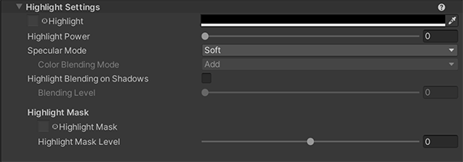
  

* [Highlight](#highlight)
* [Highlight Power](#highlight-power)
* [Specular Mode](#specular-mode)
  * [Color Blending Mode](#color-blending-mode)
* [Highlight Blending on Shadows](#highlight-blending-on-shadows)
  * [Blending Level](#blending-level)
* [Highlight Mask](#highlight-mask)
* [Highlight Mask Level](#highlight-mask-level)

## Highlight
Highlight : Texture(sRGB) × Color(RGB) Default:White. Pattern and color of specularly illuminated area.

  
| Default Color | Applied different light color |
| - | - |
| 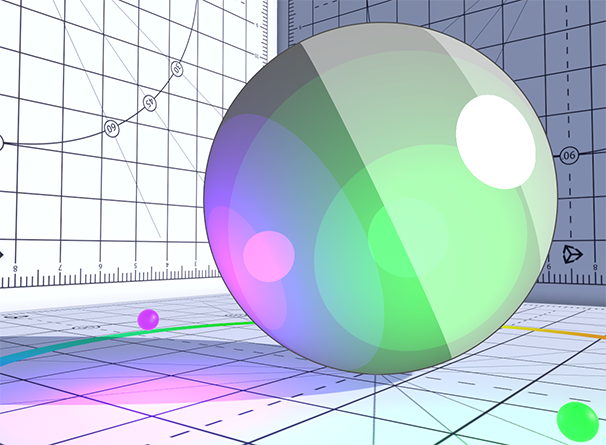 | 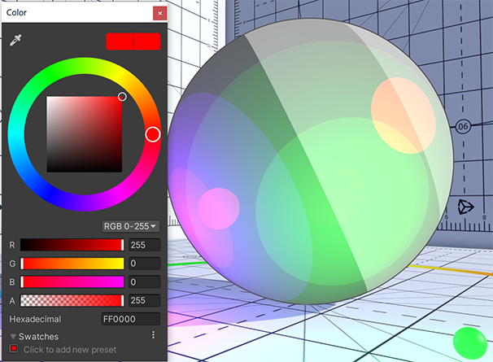 | 

## Highlight Power

The size of the Highlight controlled through the High light power slider. The size increase with the formula: pow(x,5).

  

## Specular Mode

UTS provides two modes for the highlight for different occasions and effect. The hard mode provides a crisp and solid edge to the highlight while the soft mode provides a blended blurred effect.

| Hard | Soft |
| - | - |
| 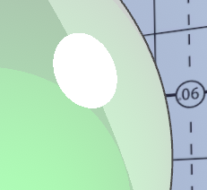 | 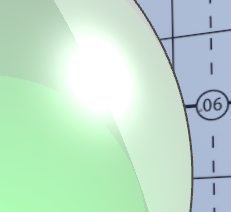 |

  

### Color Blending Mode
Specular color blending mode allows the user to control the hardness of the colour applied to the highlight. Users have two options: Multiply or Add. Note that **Color Blending Mode** is disabled when **Specular** Mode is  **Soft**.

| Multiply | Add |
| - | - |
| 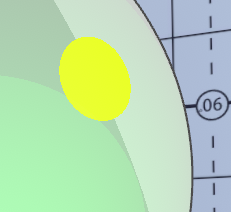 | 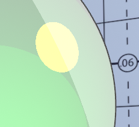 |

## Highlight Blending on Shadows
Control the blending for the highlights in shadows. Please refer to the image at [Blending Level](#blending-level).

### Blending Level
Adjusts the intensity of highlight applied to shadow areas.

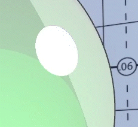
  

## Highlight Mask
A gray scale texture which utilises its brightness to control highlight intensity. Applying the highlight mask allows to fine-tune the reflectivity on the material.

 Gray Scale Texture Example | 
| ---- |
|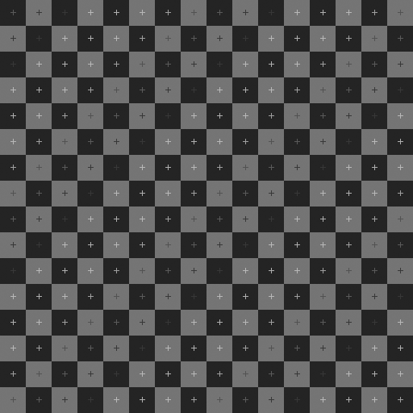|

| High Light Mask Off | HIgh Light Mask On |
| ---- | ---- |
| 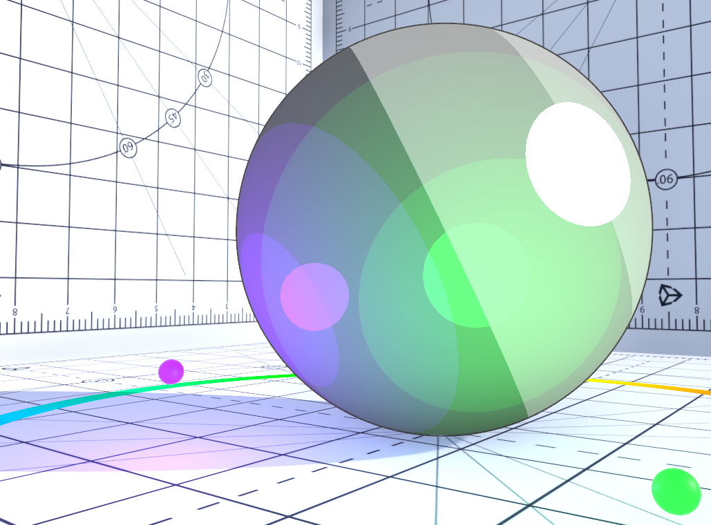 | 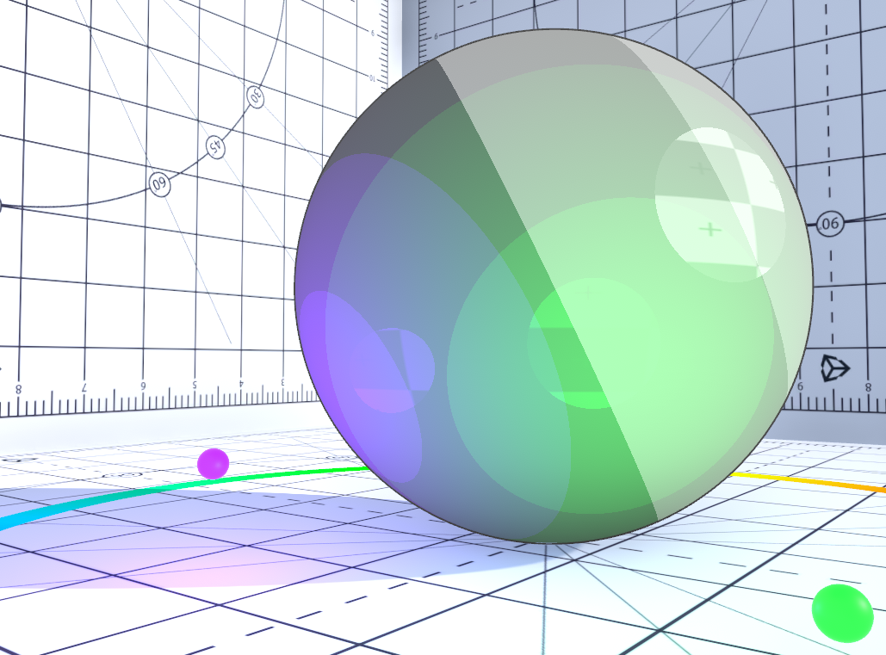 |

## Highlight Mask Level
Highlight mask texture blending level to highlights.

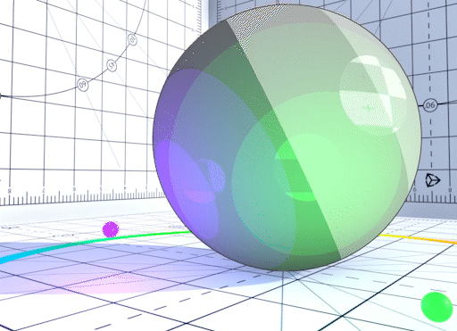
