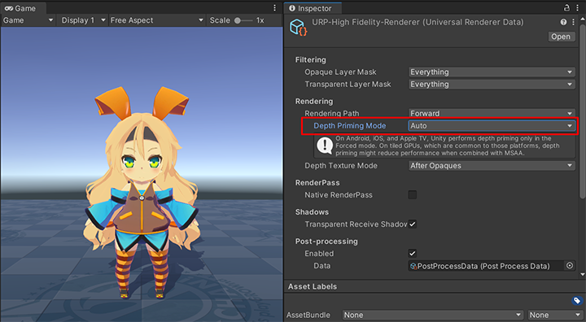
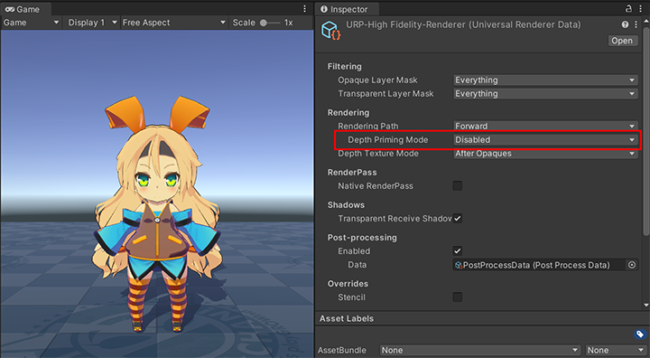

# Known Issues

## When using AOV Image Sequence Recorder

The **Unity Toon Shader** [Outline](Outline.md) isn't automatically disabled when recording with  [AOV Image Sequence Recorder](https://docs.unity3d.com/Packages/com.unity.recorder@4.0/manual/RecorderAOV.html), Please disable [Outline](Outline.md#outline) in Material Inspectors when outputting AOV Images.

## When using Universal Render Pipeline

When using [Universal Render Pipeline](https://docs.unity3d.com/Manual/com.unity.render-pipelines.universal.html), you need to set [Depth Priming Mode](https://docs.unity3d.com/Packages/com.unity.render-pipelines.universal@16.0/manual/urp-universal-renderer.html#rendering) disabled to show [outline](Outline.md).

| Depth Priming Mode Auto | Depth Priming Mode Disabled | 
| ---- | ---- |
|  |  |
 