# Material Capture(MatCap) Settings

MatCap is a method of light expression using pre-rendered images. This technique uses a picture of a sphere that represents the material and light to simulate lighting.

  

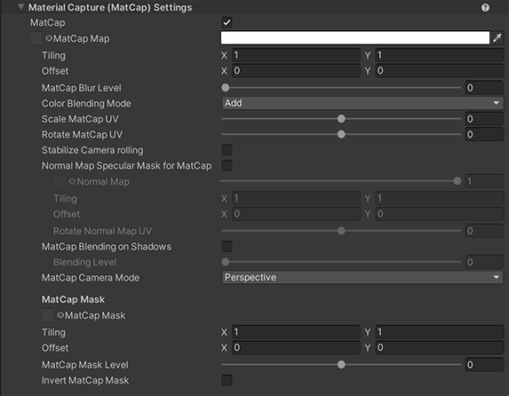
  

* [MatCap Map](#matcap-map)
* [MatCap Blur Level](#matcap-blur-level)
* [Color Blending Mode](#color-blending-mode)
* [Scale MatCap UV](#scale-matcap-uv)
* [Rotate MatCap UV](#rotate-matcap-uv)
* [Stabilize Camera rolling](#stabilize-camera-rolling)
* [Normal Map Specular Mask for MatCap](#normal-map-specular-mask-for-matcap)
  * [Normal Map](#normal-map)
  * [Rotate Normal Map UV](#rotate-normal-map-uv)
* [MatCap Blending on Shadows](#matcap-blending-on-shadows)
  * [Blending Level](#blending-level)
* [MatCap Camera Mode](#matcap-camera-mode)
* [MatCap Mask](#matcap-mask)
  * [MatCap Mask Level](#matcap-mask-level)
  * [Invert MatCap Mask](#invert-matcap-mask)

## MatCap Map
MatCap Color : Texture(sRGB) × Color(RGB) Default:White

| MatCap Map Texture Example | 
| -- |
| 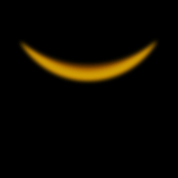|

| MatCap Map Off  | MatCap Map On |
| -- | --|
| |  

## MatCap Blur Level
Blur MatCap Map using the Mip Map feature; to enable Mip Map, activate Advanced > Generate Mip Maps in the [Texture Import Settings](https://docs.unity3d.com/Manual/class-TextureImporter.html). Default is 0 (no blur)

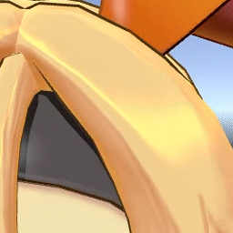

## Color Blending Mode
MatCap color blending mode. Multiply or Add.

## Scale MatCap UV
Scaling UV of MatCap Map.

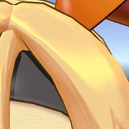

## Rotate MatCap UV
Rotating UV of MatCap Map.

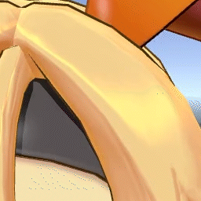

## Stabilize Camera Rolling
Stabilize Camera rolling when capturing materials with camera.

| Stabilize Camera Rolling Off  | Stabilize Camera Rolling On |
| -- | --|
| |  |

## Normal Map Specular Mask for MatCap
If enabled, gives a normal map specifically for MatCap. If you are using MatCap as speculum lighting, you can use this to mask it.

| Normal Map Specular Mask Off  | Normal Map Specular Mask On |
| -- | --|
| | 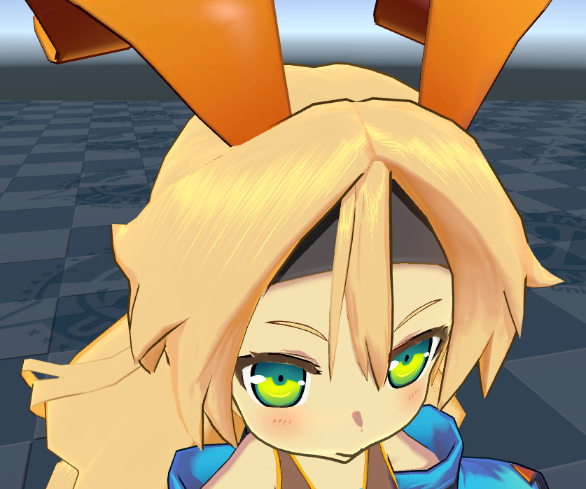 |

### Normal Map
A texture that dictates the bumpiness of the material.

| Normal Map Texture Example | 
| -- |
| 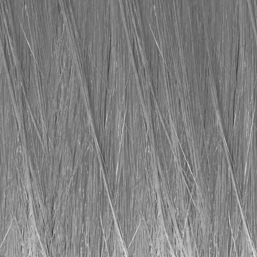|

### Rotate Normal Map UV
Rotates the MatCap normal map UV based on its center.

## MatCap Blending on Shadows
Enables the blending rate of the MatCap range in shadows.
| MatCap Blending on Shadows Off  | MatCap Blending on Shadows On |
| -- | --|
| | 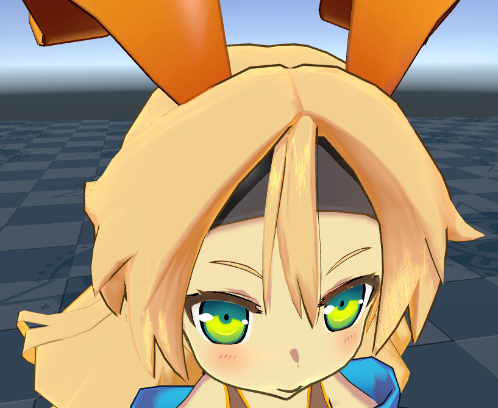 |

## Blending Level
Adjusts the intensity of MatCap applied to shadow areas.

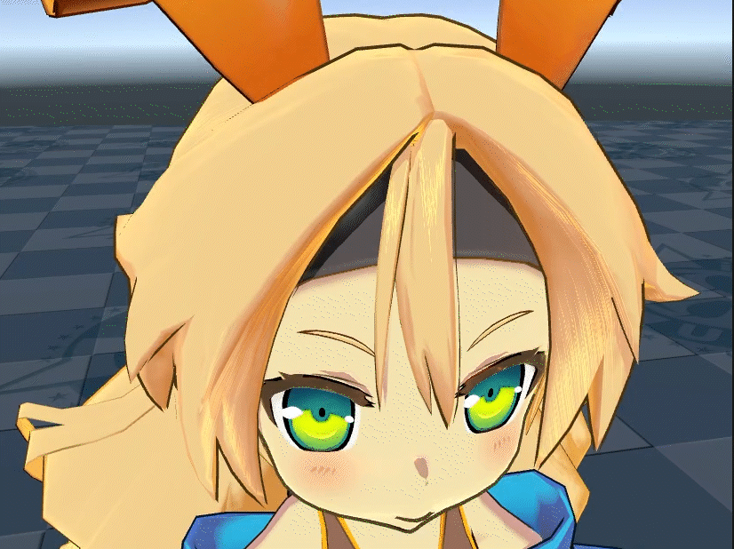

## MatCap Camera Mode
Control how render the MatCap Map based on the camera type.
## MatCap Mask
The MatCap mask is positioned correspond with the UV coordinates of the mesh onto which the MatCap is projected, and the pixels on black areas are hidden.

## MatCap Mask Level
Adjusts the level of the MatCap Mask. When the value is 1, MatCap represents 100% irrespective of mask. When the value is -1, MatCap won't be displayed at all and MatCap will be the same as in the off state.

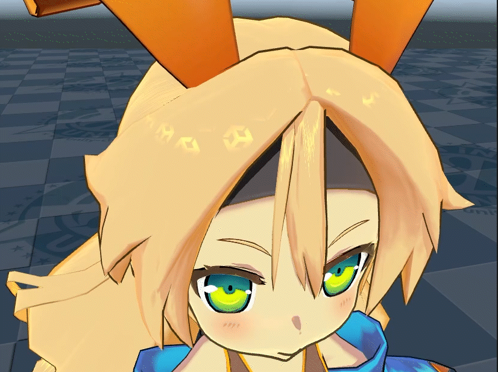

## Invert MatCap Mask
When enabled, inverts **MatCap Mask** Texture colors.

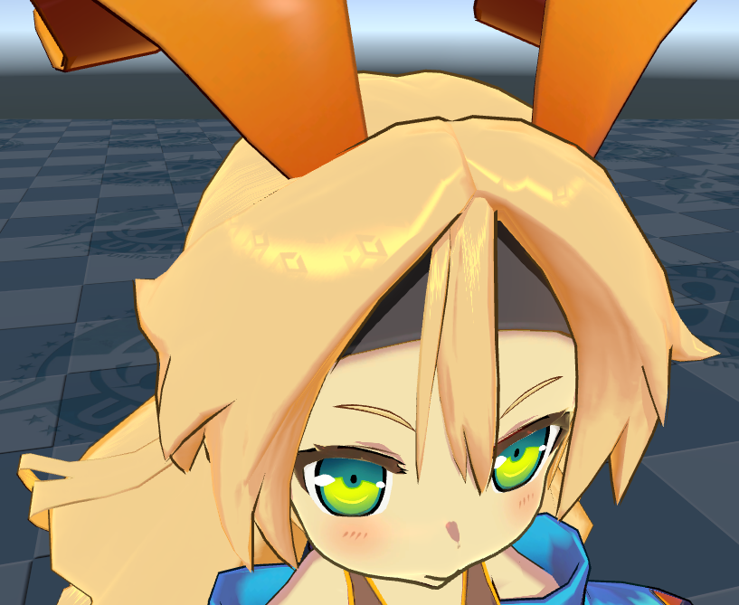

