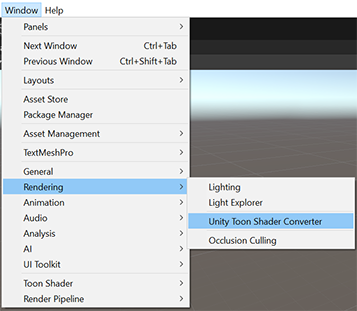
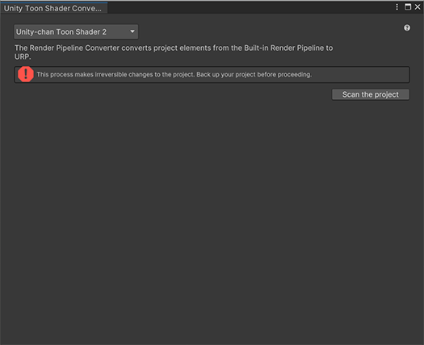
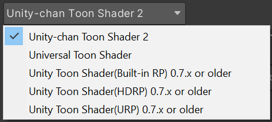
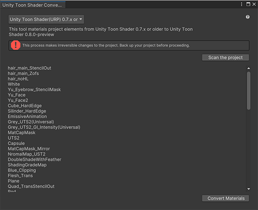
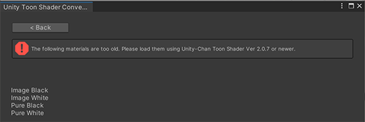

# Material Converter

## Capability

**Unity Toon Shader Material Converter** handles not only the **Unity Toon Shader** materials, but also [Unity-chan Toon Shader materials](https://github.com/unity3d-jp/UnityChanToonShaderVer2_Project) and [Univeral Toon Shader materials](https://github.com/unity3d-jp/UnityChanToonShaderVer2_Project/tree/release/urp/2.5.1). 

Note: Unity-Chan Toon Shader materials saved with older than 2.0.6 have to be re-saved using 2.0.7 or newer.

## How to convert
All you have to do to convert toon shader materials to the **Unity Toon Shader materials** are: 
* [Launch converter](#launching-converter)
* [Select render pipeline and shaders in your project](#selecting-the-converter)
* [Press **Scan** button](#pressing-scan-button).
* [Press **Convert** button](#pressing-convert-button).

Please make sure to back up the project since this converting process is irreversible.

## Launching Converter
Launch the converter from menu. 
Window -> Rendering -> Unity Toon Shader Converter

   

Here is the converter screen.

   

## Selecting the converter
You see five options to convert materials in the project. Choose the shader used in the project.

   

## Pressing Scan Button

   

If you choose **Unity-chan Toon Shader 2** and the materials are saved with older than 2.0.6. The converter shows errors. In such case, you should save the materials using **Unity-chan Toon Shader** 2.0.7 or later.

   

## Pressing Convert Button

If there is no error, just press convert button.

