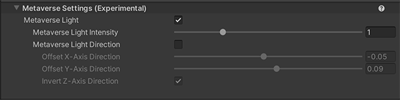

# Metaverse Settings (Experimental)

The **Unity Toon Shader** requires one directional light to work, though, often there are no directional lights in Metaverse scenes. In such cases, Metaverse light works as virtual directional light for cel-shading.

  

* [Metaverse Light](#metaverse-light)
  * [Metaverse Light Intensity](#metaverse-light-intensity)
  * [Metaverse Light Direction](#metaverse-light-direction)
  

## Metaverse Light
A checkbox to enable Metaverse light, which enables the use of UTS to work appropriately without any directional lights in the scene.
  
### Metaverse Light Intensity
Control the intensity of the supplementary lighting for UTS in the scene.
  
### Metaverse Light Direction
A checkbox to enable Metaverse Light direction, which Controls the direction of the supplementary lighting for UTS in the scene.

| Property | Description |
| -- | -- |
| Offset X-Axis Direction | Moves Metaverse light horizontally. |
| Offset Y-Axis Direction | Moves Metaverse light vertically. |
| Invert Z-Axis Direction | Invert Metaverse light Z-Axis Direction.|
