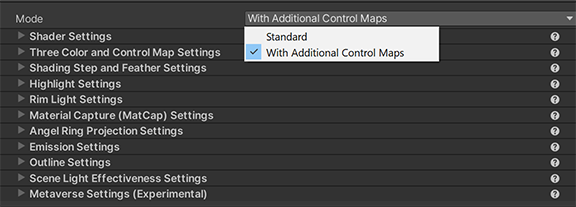

# Mode

The **Unity Toon Shader** mode that controls which work flow to apply in the shader.

  

|  Mode   |  Description  | Image  |
| ---- | ---- | ---- |
|  Standard   |  Standard  provides basic cel-shading technique.  |   |
|  With Advanced Control Map  |  With Advanced Control Map  provides more complicated cel-shading  techniques with several additional control maps. |   |