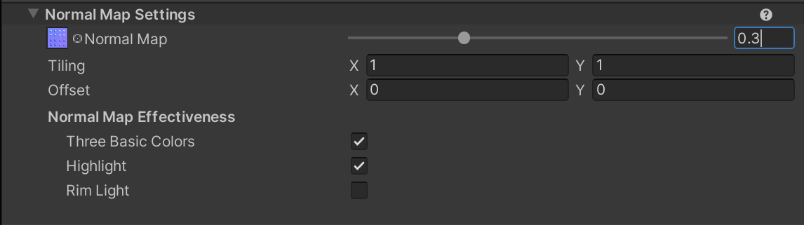
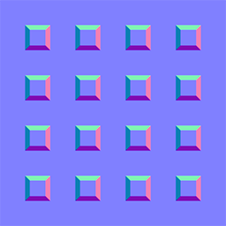
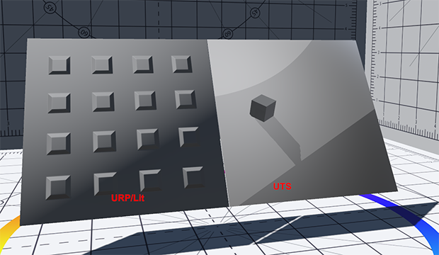
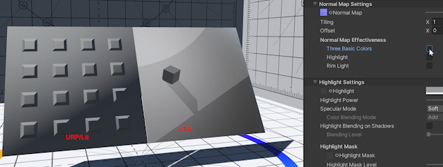

# Normal Map Settings

Normal Map is a texture that dictates the bumpiness of the material. The **Unity Toon Shader** allows control over **Normal Map** strength and which areas it applies to.

* [Normal Map](#normal-map)
* [Normal Map Effectiveness](#normal-map-effectiveness)
* [Example of Normal Map Effectiveness Operation](#example-of-normal-map-effectiveness-operation)
  

   

## Normal Map
A Normal Map texture and its strength.

| Normal Map Example| 
| ---- | 
|  | 

| Strength | Results | 
| ---- | ---- |
| 1.0 |  |
| 0.3 |  |
| 0.0 |  |

## Normal Map Effectiveness

|Properties| Description |
| ---- | ---- |
| Three Basic Colors | The effectiveness of the Normal Map on Three Basic color areas, lit, the 1st shading and the 2nd. |
| Highlight | Normal map effectiveness to high lit areas. |
| Rim Light | Normal map effectiveness to rim lit areas. |

  

## Example of Normal Map Effectiveness Operation

  

