# Rim Light Settings

The Rim Light  highlight the edges of meshes. Rim Light is based on the angle between surface normal and view direction. The Unity Toon Shader provides variety of options for Rim Light.

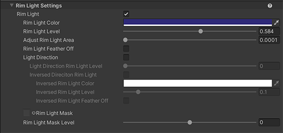
  

* [Rim Light](#rim-light)
  * [Rim Light Color](#rim-light-color)
  * [Rim Light Level](#rim-light-level)
  * [Adjust Rim Light Area](#adjust-rim-light-area)
  * [Rim Light Feather Off](#rim-light-feather-off)
  * [Light Direction](#light-direction)
  * [Light Direction Rim Light Level](#light-direction-rim-light-level)
  * [Inversed Light Direction Rim Light](#inversed-light-direction-rim-light)
    * [Inversed Rim Light Color](#inversed-light-direction-rim-light)
    * [Inversed Rim Light Level](#inversed-rim-light-level)
    * [Inversed Rim Light Feather Off](#inversed-rim-light-level)

  * [Rim Light Mask](#rim-light-mask)
  * [Rim Light Mask Level](#rim-light-mask-level)

## Rim Light
A light that hits the 3D model from behind and emphasizes the contours of the model from the front.
|  Rim Light Off | Rim Light On | 
| ---- | ---- |
|  |  |
 
 

### Rim Light Color
Specifies the color of rim light.

 

### Rim Light Level
Specifies Rim Light Intensity.

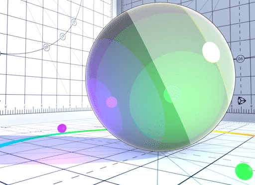
 

### Adjust Rim Light Area
Increasing this value narrows the area of influence of Rim Light.

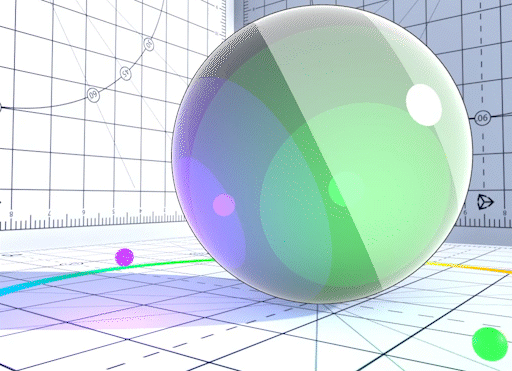
 

### Rim Light Feather Off
Disable Rim light feather.

|  Rim Light with feather | Rim light feather is disabled | 
| ---- | ---- |
|  | 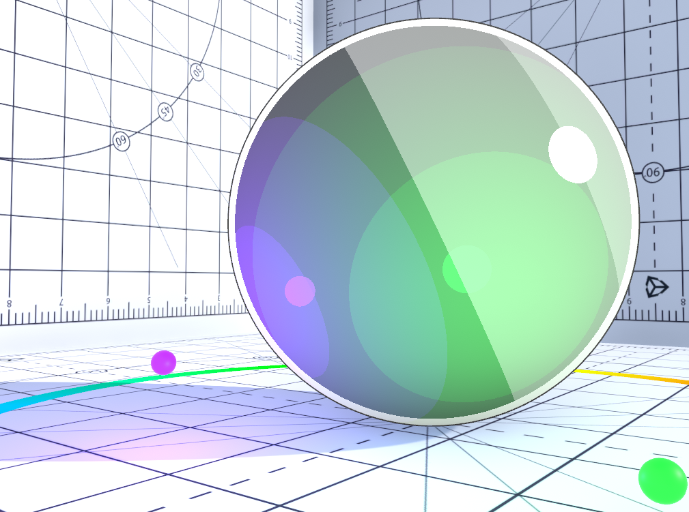 |
 

### Light Direction
When Enabled, rim light is generated only in the direction of the light source.
|  Rim Light Direction Off | Rim Light Direction On | 
| ---- | ---- |
| 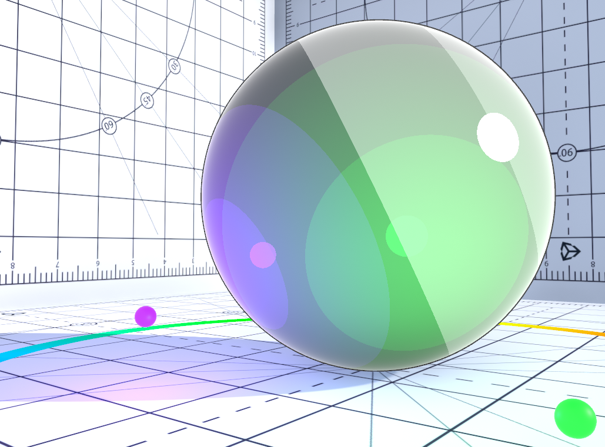 |  |
 

### Light Direction Rim Light Level
Specifies intensity of Rim Light in the light source direction.

 
 

### Inversed Light Direction Rim Light
Light color effectiveness to inverted direction rim lit areas.
|  Inversed Light Direction Rim Light Off | Inversed Light Direction Rim Light On | 
| ---- | ---- |
|  |  |
 

#### Inversed Rim Light Color
Specifies the color of inversed/antipodean rim light.

 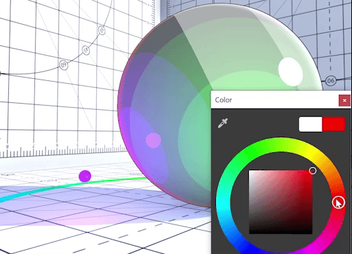
 

#### Inversed Rim Light Level
Specifies Inversed/Antipodean Rim Light Level.

 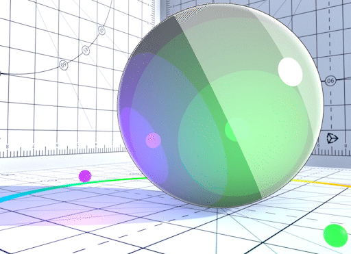
 

#### Inversed Rim Light Feather Off
Disable Inversed Rim light feather.

|  Inversed Rim Light Feather On | Inversed Rim Light Feather Off | 
| ---- | ---- |
| 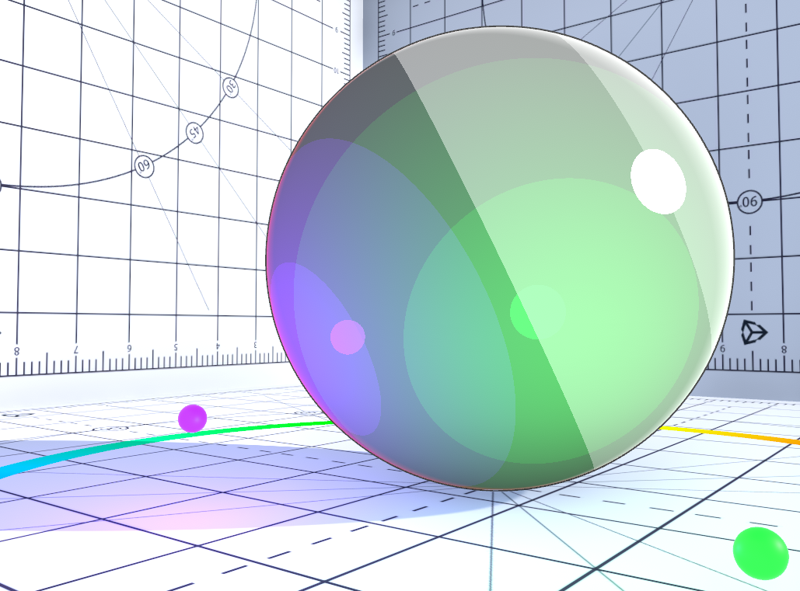 | 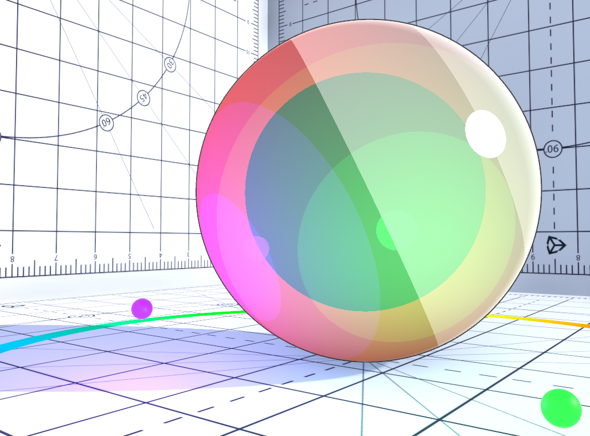 |

### Rim Light Mask
Rim Light Mask : a gray scale texture(linear). The white part of the texture is displayed as Rim Light, and the black part is masked and not displayed.
 Gray Scale Texture Example | 
| ---- |
||

| Rim Light Mask Off | Rim Light Mask On |
| ---- | ---- |
| 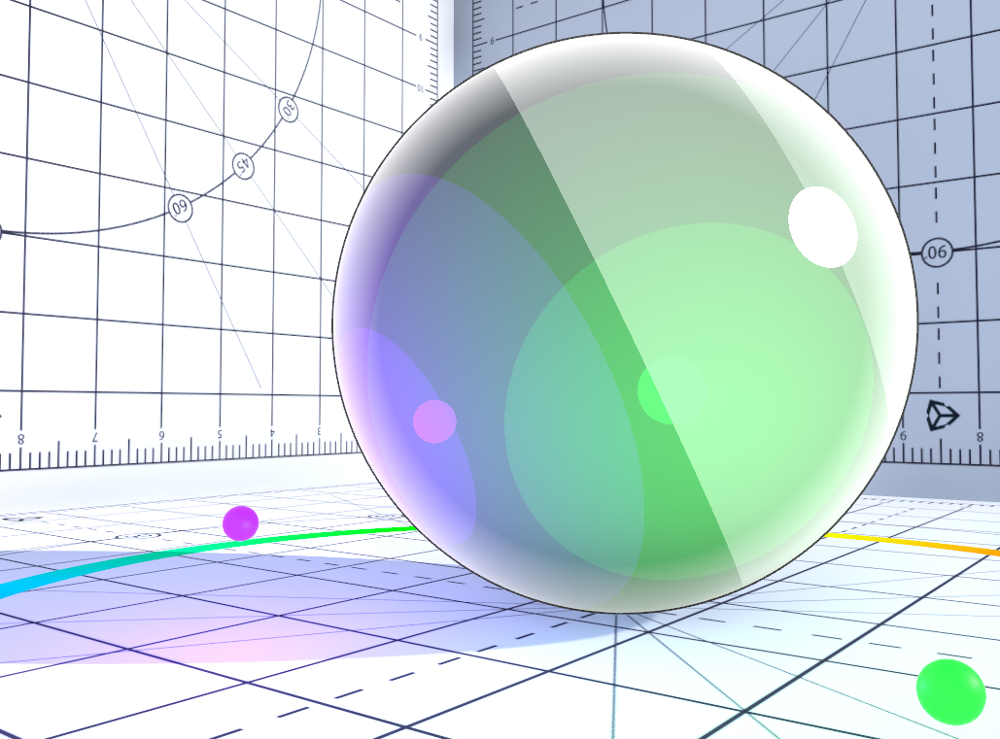 |  |

### Rim Light Mask Level
-1 gives 0% for the Rim Light effect, 0 gives 100% for the Rim Light and Mask effect, 1 gives 100% for the Rim Light and 0% for the Mask effect.

 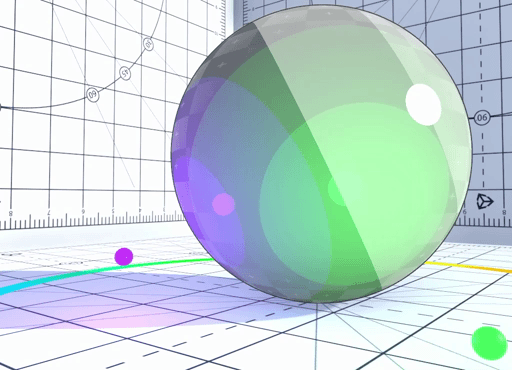
 