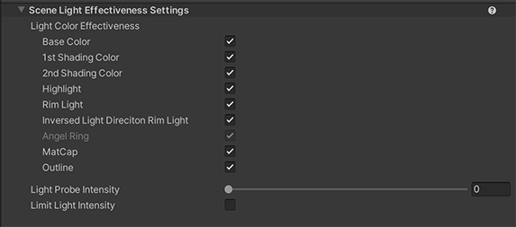
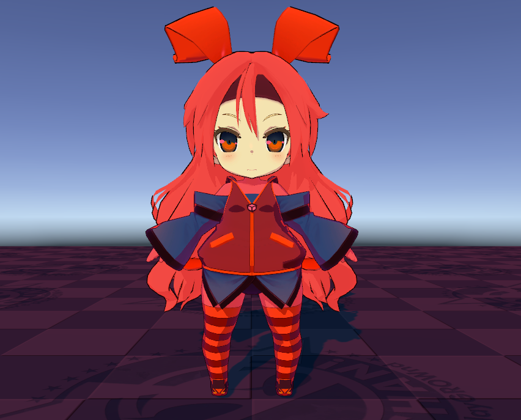
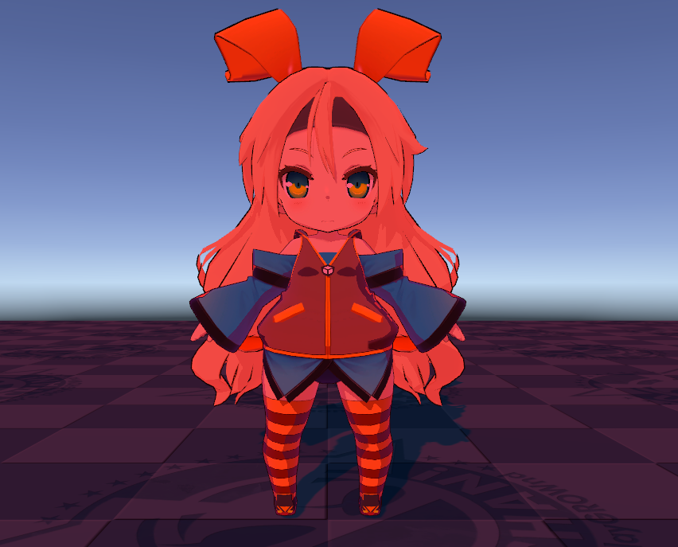
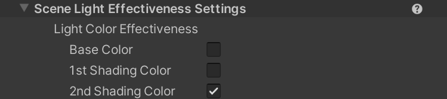
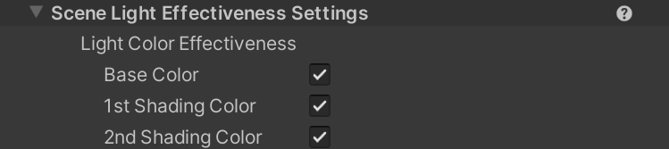
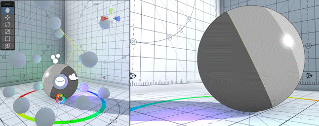
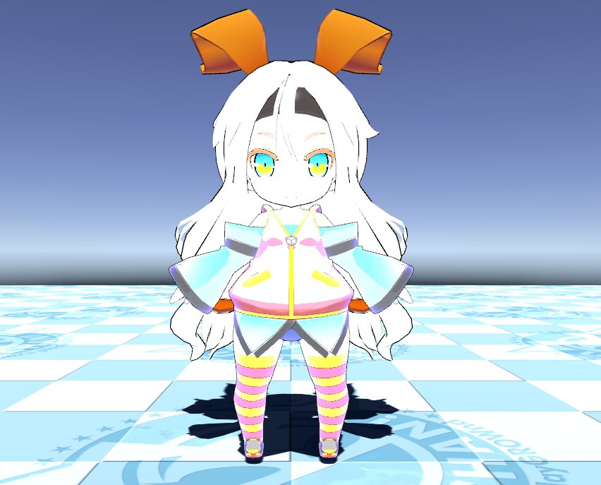
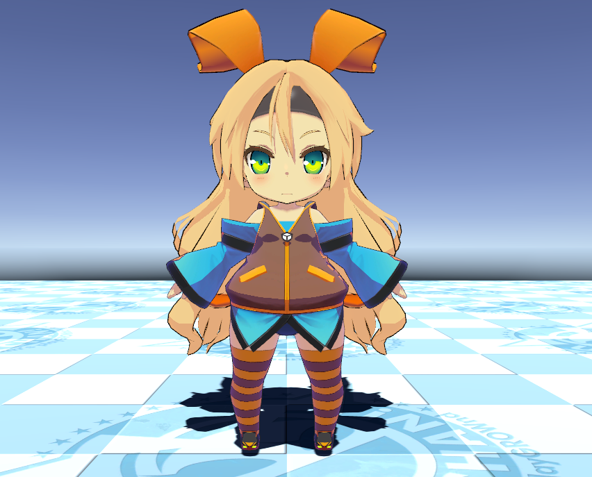

# Scene Light Effectiveness Settings

The **Unity Toon Shader** provides the way to control effectiveness of lights in the scene per material. There are times when you want to eliminate or limit the effect of lighting on a material type.
UTS allows you to control each area color regardless of the actual light color. While this feature is fundamental to professional cell shading, sometimes it's necessary to apply actual light colors. 
UTS provides a way to determine if the actual light color does or doesn't affect it.

  

* [Light Color Effectiveness Settings](#light-color-effectiveness)
* [Light Probe Intensity](#light-probe-intensity)
* [Limit Light Intensity](#limit-light-intensity)

  

## Light Color Effectiveness

If the setting for each color is Off, the color is always illuminated with a light intensity of one and a light color of white regardless of the intensity of the lights in the scene.

| Property | Description |
| --|  --|
| Base Color |  Light color effect in the base color areas. |
| 1st Shading Color |  Light color effect in the 1st shading color areas. |
| 2nd Shading Color |  Light color effect in the 2nd shading color areas. |
| Highlight |  Light color effect in high lit areas. |
| Rim Light |  Light color effect in rim lit areas. |
| Inverted Light Direction Rim Light | Light color effect in inverted direction rim lit areas. |
| Angel Ring |  Light color effect in angel ring area. Angel Ring is exclusive for  **With Additional Control Maps** mode.|
| MatCap |  Light color effect in  MatCap areas. |
| Outline |  Light color effect in outlines. |

Light Color Effectiveness example: A red light on the face. Unchecked areas on the face material aren't affected by the light color.
|Light Color Effectiveness is off | Light Color Effectiveness is on |
| - | - |
|  |  |
|||
  

## Light Probe Intensity

Adds the light probe color to the material color according to the **Light Probe Intensity** value.

  

## Limit Light Intensity

Limit the brightness of the light to 1 to avoid white-out.

Example: When a intensive directional light is on the character.

| Limit Light Intensity Off | Limit Light Intensity On |
| - | - |
|  |  |
