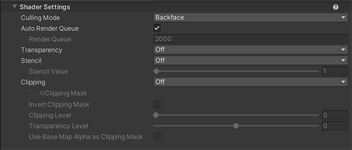

# Shader Settings

The Shader Settings provide basic settings that are not specific to  cel-shading but are needed for general CG.

  

* [Culling Mode](#culling-Mode)
* [Auto Render Queue](#auto-render-queue)
  * [Render Queue](#render-queue)
* [Transparency](#transparency)
* [Stencil](#stencil)
  * [Stencil Value](#stencil-value)
* [Clipping](#clipping)
  * [Clipping Mask](#clipping-mask)
  * [Invert Clipping Mask](#invert-clipping-mask)
  * [Clipping Level](#clipping-level)
  * [Transparency Level](#transparency-level)
  * [Use Base Map Alpha as Clipping Mask](#use-base-map-alpha-as-clipping-mask)

## Culling Mode

|  Value   |  Description  | 
| ---- | ---- | 
|  Back   |  Don't render polygons that are facing away from the viewer (default) i.e. back-facing polygons are culled.  |
|  Front  | Don't render polygons that are facing towards the viewer. Used for turning objects inside-out. |
|  Off  |  Disables culling - all faces are drawn. Used for special effects. |

## Auto Render Queue
When enabled, rendering order is determined by system automatically.

### Render Queue
Rendering order in the scene.

## Transparency
Enables different modes that allow the simulation of a variety of transparent objects.

## Stencil
Control the stencil buffer which manipulates pixel drawing.

|  Value   |  Description  | 
| ---- | ---- | 
|  Replace Stencil Buffer with  | Replaces a pixel value in stencil buffer with [Stencil Value](#stencil-value) when drawing.|
|  Draw If Not Equal to  | Draw a pixel when the vaule in stencil buffer is not equal to [Stencil Value](#stencil-value).|
|  Off  |  Nothing is written to stencil buffer and [Stencil Value](#stencil-value) doesn't affect at all when drawing.|

### Stencil Value
Stencil value that is submitted to the stencil buffer for controlling the per-pixel drawing. Min is 0. Max is 255. The dafualt is 0.

## Clipping
Allow for the use of a texture to control the transparency of the shader.

|  Value   |  Description  | 
| ---- | ---- | 
|  Off | Disable clipping. |
|  On  | Enable clipping. |
|  Clip Transparency  | [Enable clipping with Transparency Level](#transparency-level). |

### Clipping Mask
A grayscale texture which utilises its brightness to control transparency.

### Invert Clipping Mask
Invert clipping mask results.

### Clipping Level
Specifies the strength of the clipping mask.

### Transparency Level
Adjusts the transparency by considering the grayscale level of the clipping mask as an alpha value.

### Use Base Map Alpha as Clipping Mask
Use Base Map Alpha as Clipping Mask instead of Clipping mask texture.
