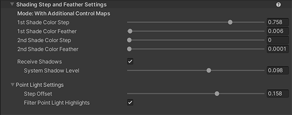
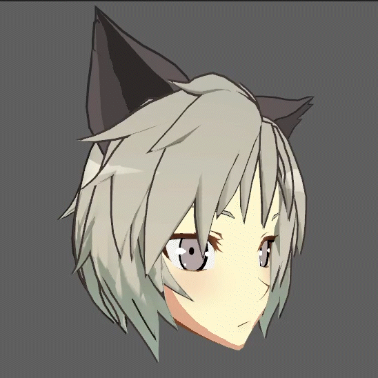
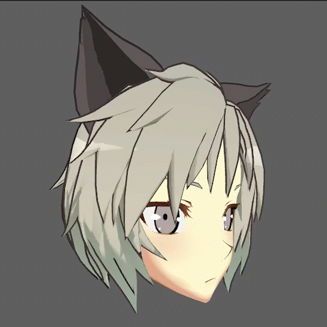
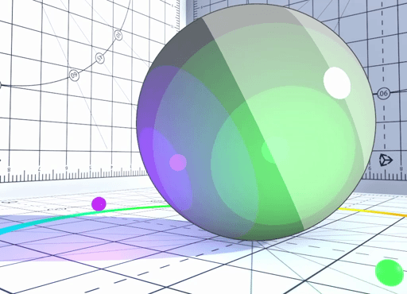
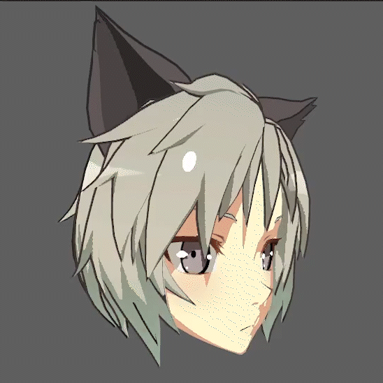
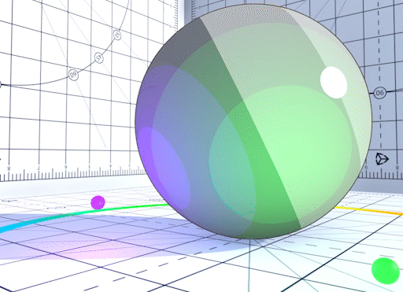

# Shading Steps and Feather Settings

The **Unity Toon Shader** allows you to control the position of the boundaries of the area, to clearly demarcate the boundaries, or to blur or blend them.

  

* [Base Color Step](#base-color-step)
* [Base Shading Feather](#base-shading-feather)
* [Shading Color Step](#shading-color-step)
* [1st/2nd Shading Feather](#1st2nd-shading-feather)
* [Receive Shadows](#receive-shadows)
  * [System Shadow Level](#system-shadow-level)
* [Point Light Settings](#point-light-settings)
  * [Step Offset](#step-offset)
  * [Filter Point Light Highlights](#filter-point-light-highlights)
  

### Base Color Step
Sets the boundary between the Base Color and the Shade Colors.

  

## Base Shading Feather
Feathers the boundary between the Base Color and the Shade Colors.

  

## Shading Color Step
Sets the boundary between the 1st and 2nd Shade Colors. Set this to 0 if  2nd Shade Color is unnecessary.

  

### 1st/2nd Shading Feather
Feathers the boundary between the 1st and 2nd Shade Colors.

  

### Receive Shadows
Determine if the material reflects shadows.

  

#### System Shadow Level
Define the appearance of self-shadows and other received shadows that blend with the Too Shader.

  

## Point Light Settings

### Step Offset
Fine tunes light steps (boundaries) added in the ForwardAdd pass, such as real-time point lights.

  
 
  

### Filter Point Light Highlights
Show or hide highlight of point lights.

