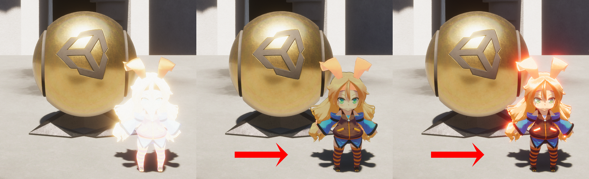
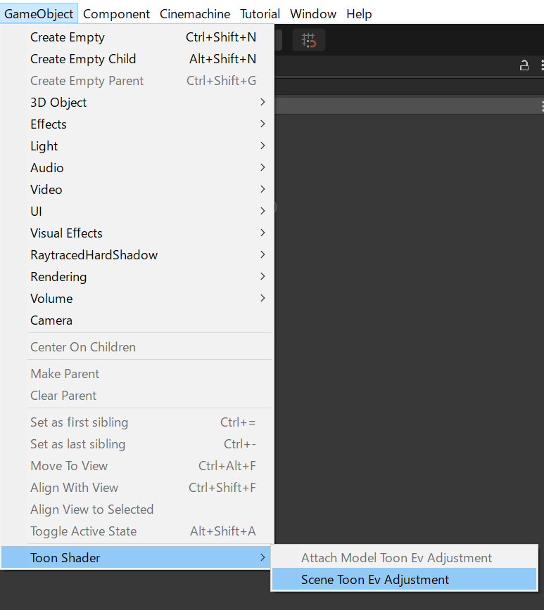
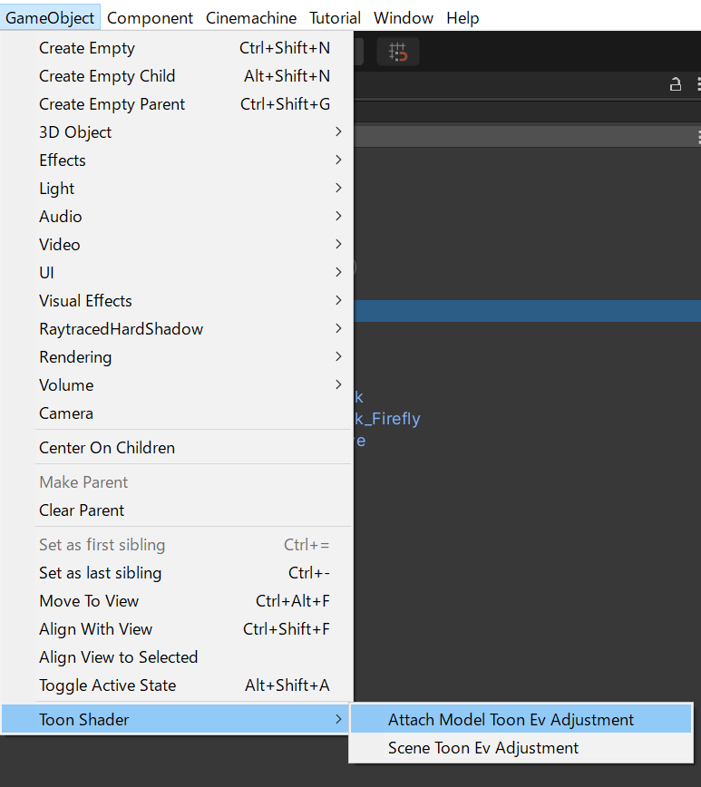
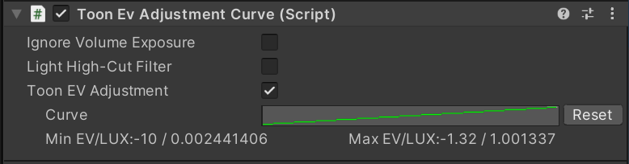

# Toon EV Adjustment

**Toon EV Adjustment** is only available for HDRP. When combined with post-effects, such as the Exposure Volume Profile, is designed to render optically correct images without collapsing even in bright environments as intense as 130,000 lux. But, because the **Unity Toon Shader** uses a totally different logic to render toons, the automatic correction built in HDRP isn't enough to get the picture the artist wants. **Toon EV Adjustment** supports artists' corrections in two ways.

## Scene Toon EV Adjustment

Over the scene, **Scene Toon EV Adjustment** can control exposure level by applying EV curve for **Unity Toon Shader**. 

### The way to enable **Scene Toon EV Adjustment**
1. `GameObject/Toon Shader/Scene Toon EV Adjustment` from the Unity Editor menu to create  **Scene Toon EV Adjustment Component** component.
2. Put models you want to control exposure to its inspector.

Just one **Scene Toon EV Adjustment Component** can be placed in a scene.

## Model Toon EV Adjustment
**Toon EV Adjustment** can works to a certain model by choosing `GameObject/Toon Shader/Attatch Model Toon EV Adjustment` when the model is selected.

## Properties

| Property| Description |
|:-------------------|:-------------------|
| Ignore Volume Exposure | Ignore the automatic corrections built into HDRP. If this checkbox is On, lights brighter than 1 will result in more blown whites and a much more exaggerated Bloom. But, this method is suitable if you are using Light Culling or similar to shine independent lights of 1 lux or less on your character.| 
| Light High Cut  Filter | Clips up to 1 lux of light hitting objects with Toon Shader materials.| 
| Toon EV adjustment curve | The correction applied with an editable curve; since it would be impossible for an artist to draw a curve that controls from 0 lux to 130000 lux, **Toon EV Adjustment** adopted EV to express the brightness unit in this screen. The default curve ranges from –10 EV to –1.32 EV.| 
