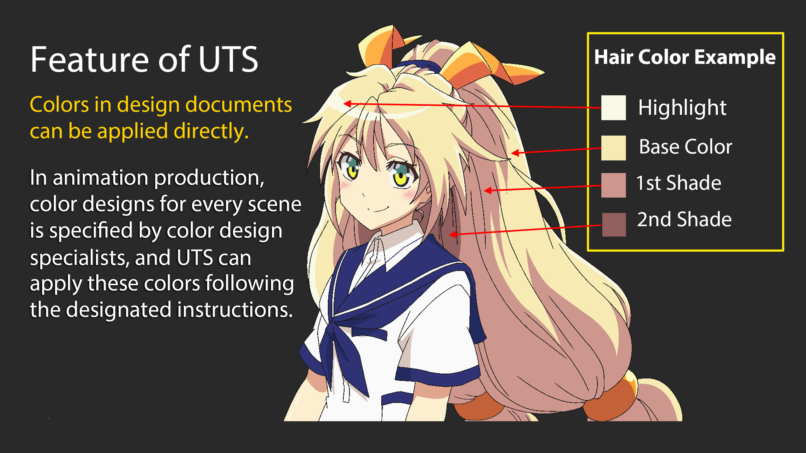

# Unity Toon Shader overview

The **Unity Toon Shader** (UTS3) is a toon shader made by Unity, which is designed to meet the needs of creators working on cel-shaded 3D-CG animations. 

The **Unity Toon Shader** is compatible with all the render pipelines, **Legacy(built-in) render pipeline**, **Universal Render Pipeline (URP)** and **High Definition Render Pipeline (HDRP)**.  However, there are some differences in the features supported by different render pipelines. Please refer to the Feature difference for each render pipeline for details.

**Unity Toon Shader** is  the successor of **Unity-chan Toon Shader ver 2.0 (UTS2)**, which was used for years in games and animations. but,UTS2 was solely for **Legacy(built-in)** Render Pipeline. 

The **Unity Toon Shader** allows  users to specify the colors of light and shadow. These features are essential for cel-shaded character designs. 

Three basic colors, **base color**, **1st shading color**, and **second shading color**, play a key role in character design in Unity Toon Shader.

In addition to the three basic colors, The Unity Toon Shader provides wide variety of features such as **Highlight**, **Rim Light**, **Emission**, **Angel Ring**, **Material Capture(MatCap)** and some special maps.
