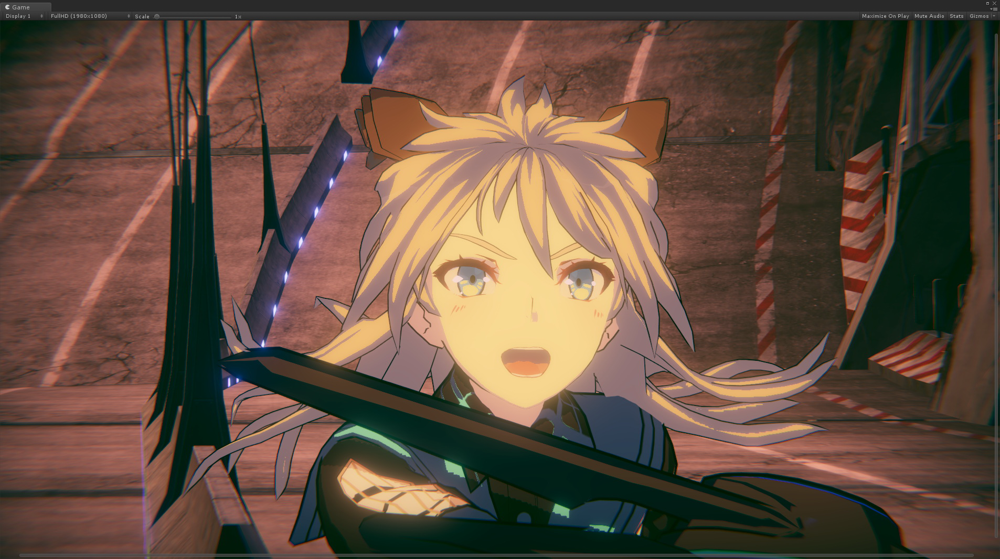
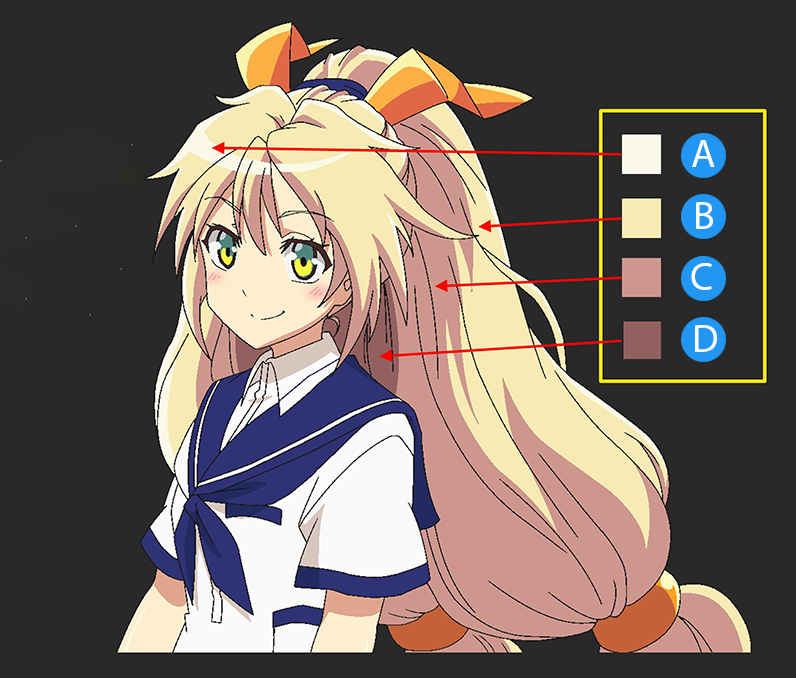

# Unity Toon Shader overview

The **Unity Toon Shader** (UTS3) is a set of toon shaders designed to meet the needs of creators working on cel-shaded 3D-CG animations. 

The **Unity Toon Shader** is compatible with all the render pipelines, the **Built-in Render Pipeline**, the **Universal Render Pipeline (URP)** and the **High Definition Render Pipeline (HDRP)**, though, there are some differences in the features supported by different render pipelines. Please refer to see the difference for each render pipeline for details in [Feature Difference](FeatureModel_en.md).

**Unity Toon Shader** is  the successor of **Unity-chan Toon Shader ver 2.0 (UTS2)**, which was popular for years in games and animations. But, UTS2 was solely for the **Built-in Render Pipeline**, consisted with tons of different shaders, unable to install through the [Package Manager window](https://docs.unity3d.com/Manual/upm-ui.html), and its license was different from other software Unity provides. 

## Feature of Unity Toon Shader

In animation production, color specialists specify detailed color designs for every scene. UTS can apply these color specifications written in the instructions. UTS allows  users to apply the colors of light and shadow regardless of actual light colors in the scene. This feature is essential for cel-shaded character designs. UTS allows detailed control whether the directional light color effects on materials or not.

| Typical color design instruction example |
|--|
| |
| A: Highlight Color|
| B: Base Color |
| C: 1st Shading Color|
| D: 2nd Shading Color |

Three basic colors, **base color**, **1st shading color**, and **2nd shading color**, play  key roles in character design in the **Unity Toon Shader**. Please, refer to [Three Color Map and Control Map Settings](Basic.md).

Besides the three basic colors, the **Unity Toon Shader** provides wide variety of features such as [Highlight](Highlight.md), [Rim Light](Rimlight.md), [Emission](Emission.md), [Angel Ring](AngelRing.md), [Material Capture(MatCap)](MatCap.md) and some special maps.

Start to work on cel-shading from [Getting Started](GettingStarted.md).