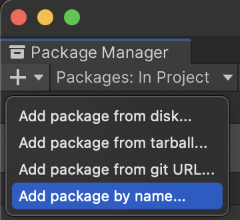

# Installation

The **Unity Toon Shader** is a preview/experimental package and 
Installing the package requires the following steps.

1. Make sure git is installed in the system.
1. Open [Package Manager window](https://docs.unity3d.com/Manual/upm-ui.html) 
1. Click the **+** button, and choose **Add package by name** 
   > In Unity 2020.x, choose **Add package from git URL**
1. Type in `com.unity.toonshader` and click the **Add** button. 
 
We can also specify a particular version, for example: `com.unity.toonshader@0.9.4-preview`
