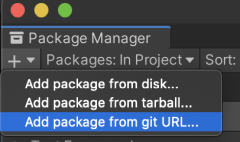

# Installation

Unity Toon Shader is currently a preview/experimental package and 
the following steps are required to install it.

1. Make sure git is installed in the system.
1. Open [Package Manager](https://docs.unity3d.com/Manual/upm-ui.html) 
1. Click the **+** button, and choose **Add package from git URL** 
1. Type in `com.unity.toonshader` and click the **Add** button. 
 
We can also specify a particular version, for example: `com.unity.toonshader@0.7.0-preview`
