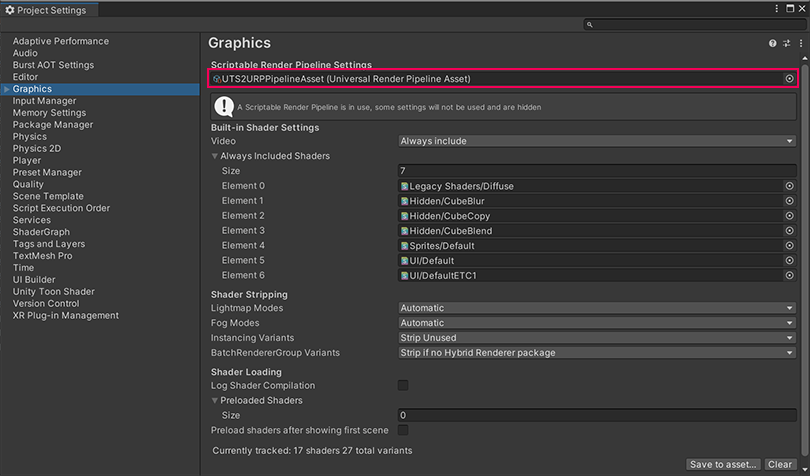

# How to install samples

Unity provides  the **Unity Toon Shader** sample scenes for the three render pipelines. Please install a set of samples fits the render pipeline you use.

1. Make sure that [Render pipeline](https://docs.unity3d.com/2022.2/Documentation/Manual/render-pipelines.html) you want to use installed and set up before installing the UTS samples for each. 
1. Open the [Package Manager window](https://docs.unity3d.com/2022.2/Documentation/Manual/Packages.html).
1. Click **Unity Toon Shader** in the left side of the window.
1. Press **Import** in the right side of the window.
1. Set Graphics Pipeline Asset in the [Project Setting window](#https://docs.unity3d.com/2022.2/Documentation/Manual/comp-ManagerGroup.html).  URP samples require `UTS2URPPipelineAsset`. Whereas HDRP samples require  `HDRenderPipelineAsset_UTS`.
  

| Where you should set `UTS2URPPipelineAsset` or `HDRenderPipelineAsset_UTS` |
| -- |
| |

 `Assets/Samples/Unity Toon Shader/0.9.3-preview/Universal render pipeline` folder contains the following scenes.

* Sample/Sample.unity        ：A scene to introduce the basic.  
* ToonShader.unity            ：A illustration-style shading sample scene.  
* ToonShader_CelLook.unity    ：A cel-style shading sample scene.  
* ToonShader_Emissive.unity    ：A sample scene for [Emission](Emission.md).  
* ToonShader_Firefly.unity    ： A sample scene for multiple point lights.  
* AngelRing/AngelRing.unity：A sample scene for [Angel Ring](AngelRing.md).
* Baked Normal/Cube_HardEdge.unity：Baked Normal reference.  
* BoxProjection/BoxProjection.unity        ：A sample scene lighting a dark room using Box Projection.  
* EmissiveAnimation/EmisssiveAnimation.unity： [Emission](Emission.md) Animation sample.  
* LightAndShadows/LightAndShadows.unity：Comparison between the PBR shader and the **Unity Toon Shader**.  
* MatCapMask/MatCapMask.unity： A [MatCap](MatCap.md) Mask sample scene.  
* Mirror/MirrorTest.unity: A sample scene checking for a mirror object.  
* NormalMap/NormalMap.unity    ：Tricks for using the normal map with the **Unity Toon Shader**.  
* PointLightTest/PointLightTest.unity： A sample for cel-shding contents with point lights.  

 
Sample scenes for other render pipelines are in the following folders.  
* for the **Built-in Render Pipeline**：`Assets/Samples/Unity Toon Shader/0.9.6-preview/Legacy render pipeline` folder. 
* for the **High definition render pipeline**：`Assets/Samples/Unity Toon Shader/0.9.3-preview/High definition render pipeline` folder.