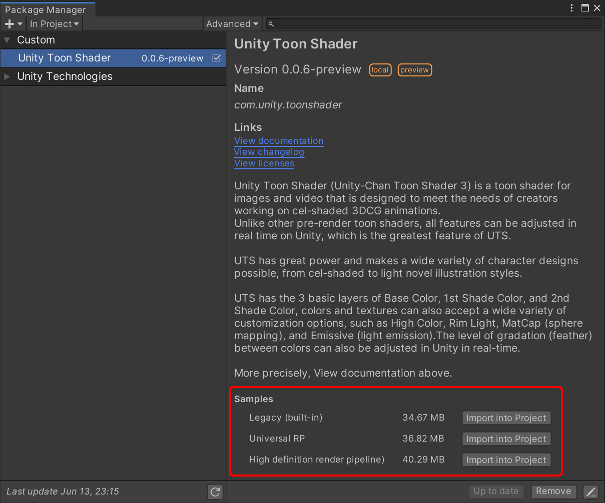
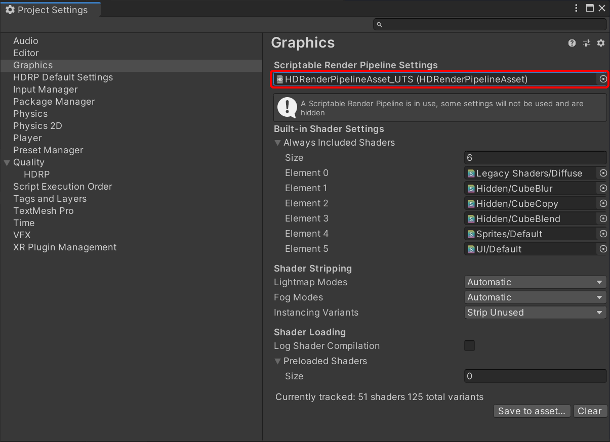
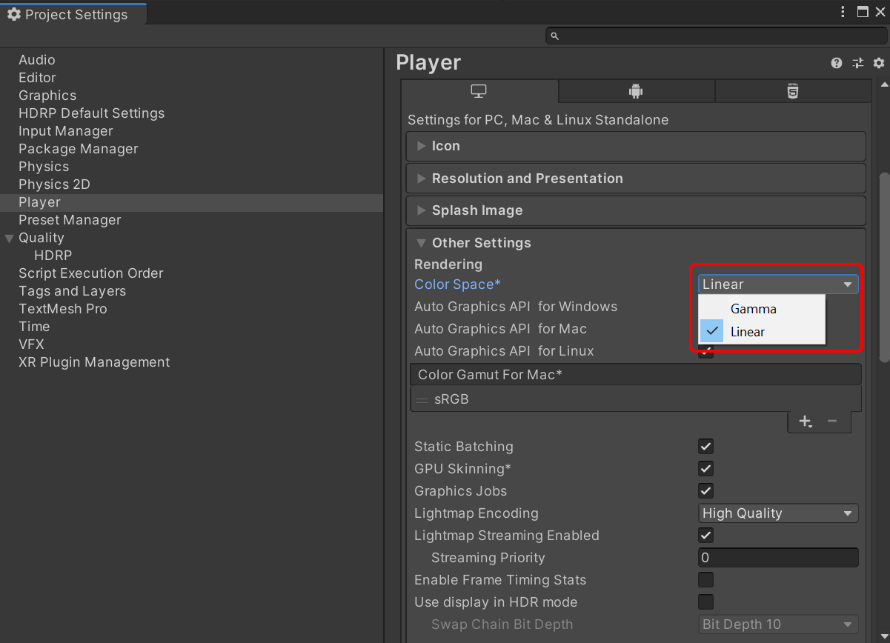

# Samples
Sample scenes are installable from the package manager.
Please, make sure that HDRP or URP is installed and set up before installing the samples for each.

Samples for Universal RP require `UTS2URPPipelineAsset` to be set in `Project Setting` dialog.

Ones for HDRP require `HDRenderPipelineAsset_UTS` asset as well.

The Color Space must be set to `Linear`.

The following sample scenes can be found by opening the sample project and opening the `Assets\Samples\Unity Toon Shader\0.7.0-preview\Universal render pipeline` folder.  

* ToonShader.unity            ：Settings for an illustration-style shader.  
* ToonShader_CelLook.unity    ：Settings for a cel-style shader.  
* ToonShader_Emissive.unity    ：Settings for a shader with an emissive .  
* ToonShader_Firefly.unity    ：Multiple real-time point lights.  
* AngelRing\AngelRing.unity：`AngelRing` and `ShadingGradeMap` sample.  
* Baked Normal\Cube_HardEdge.unity：Baked Normal reference.  
* BoxProjection\BoxProjection.unity        ：Lighting a dark room using Box Projection.  
* EmissiveAnimation\EmisssiveAnimation.unity：EmissiveAnimation sample.  
* LightAndShadows\LightAndShadows.unity：Comparison between the PBR shader and Unity Toon Shader.  
* MatCapMask\MatCapMask.unity：MatcapMask sample.  
* Mirror\MirrorTest.unity: Sample scene checking for a mirror object  
* NormalMap\NormalMap.unity    ：Tricks for using the normal map with Unity Toon Shader.  
* PointLightTest\PointLightTest.unity：Sample of  cel-style content with point lights.  
* Sample\Sample.unity        ：Introduction to the basic Unity Toon Shader shaders.  
* ShaderBall\ShaderBall.unity：Unity Toon Shader settings on an example shader ball.  

Each scene is intended as a reference for the relevant shader and lighting settings.  
They should come in handy as an example when creating your own scenes.  

【**NOTE**】 
Sample scenes for other render pipelines can be found in the following folder.  
* for Legacy (Built-in)：`Assets\Samples\Unity Toon Shader\0.7.0-preview\Legacy render pipeline` folder  
* for HDRP：`Assets\Samples\Unity Toon Shader\0.7.0-preview\High definition render pipeline` folder 