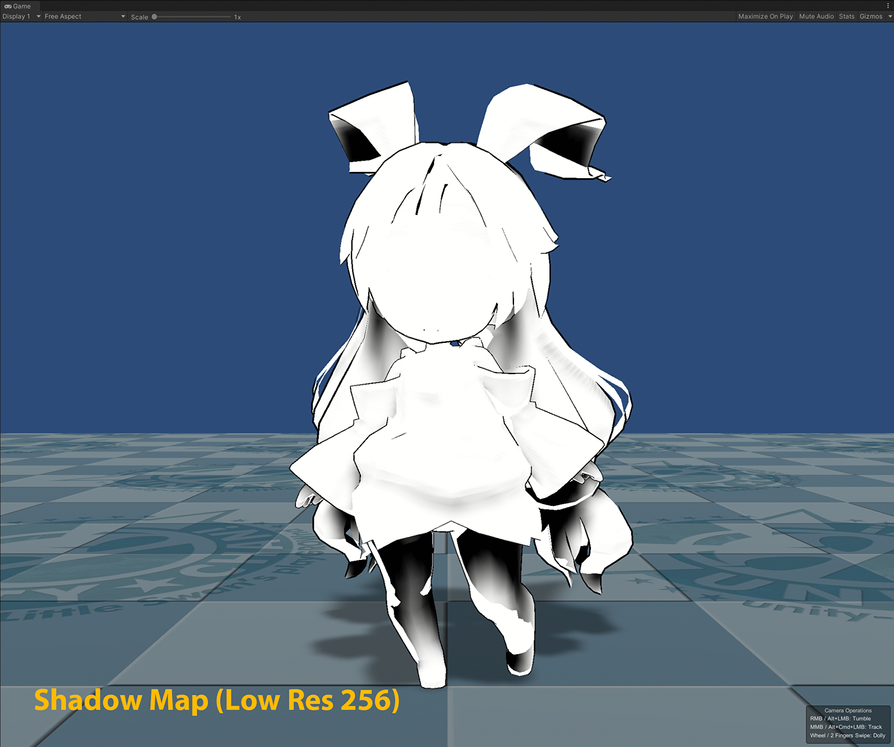

## HDRP Ray-trace Shadow 

**Ray-traced Shadow** is now supported in the **Unity Toon Shader**. This feature is solely available for HDRP with DirectX 12 API.
For more information on how to set up Ray-trace Shadow, please refer to  [Ray-traced shadows](https://docs.unity3d.com/Packages/com.unity.render-pipelines.high-definition@14.0/manual/Ray-Traced-Shadows.html).

## **Toon EV Adjustment**  

Please refer to [Toon EV Adjustment](ToonEVAdjustment.md) page.
