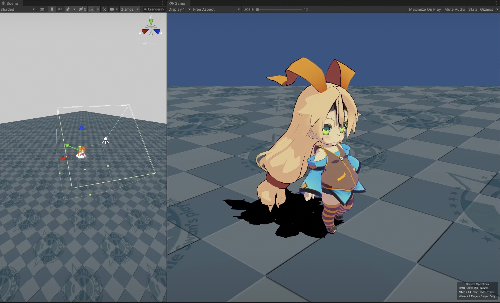

## HDRP Box Light

When you want to use lighting that differs from the scene main light in order to make character face more clearly or to add shadows that look ideal. However, in HDRP, the number of directional lights that can cast shadows is limited to one. The [Box Light](https://docs.unity3d.com/Packages/com.unity.render-pipelines.high-definition@14.0/manual/Light-Component.html#Shape) provides the solution for this. The **Unity Toon Shader** now supports the feature. Currently, HDRP Ray-traced shadows cannot be applied with this feature.

<small>Box Light applied to a character's face. Note that editing the angle of the box changes the shadows falling on the face, but not on the body and the ground.</small>
