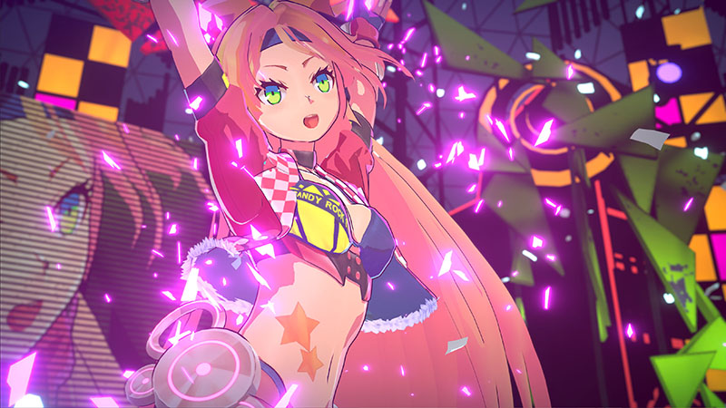

# 【Unity Toon Shader (Unity-Chan Toon Shader 3)】
---

***Read this document in other languages: [日本語版](./Documentation~/ja/README_ja.md)***  

## 【Overview : What is Unity Toon Shader?】

**Unity Toon Shader (UTS3)** is a toon shader for images and video that is designed to meet the needs of creators working on cel-shaded 3DCG animations. Unlike other pre-render toon shaders, **all features can be adjusted in real time on Unity, which is the greatest feature of Unity Toon Shader**.  

Unity Toon Shader has great power and makes a wide variety of character designs possible, **from cel-shaded to light novel illustration styles**.  

Unity Toon Shader has the 3 basic layers of **Base Color**, **1st Shade Color**, and **2nd Shade Color**, colors and textures can also accept a wide variety of customization options, such as **High Color**, **Rim Light**, **MatCap** (sphere mapping), and **Emissive** (light emission).  

What colors will you select as **accent colors**? The accent color is the color which is set at the opposite side of light direction.  

In Unity Toon Shader, you can use **2nd shade color and Ap-RimLight** as accent color. Of course, these accent colors also change dynamically to the light.  

**The level of gradation (feather) between colors can also be adjusted in Unity in real-time**.  

In animation production, color design is made for each part in each scene unit. It is common to have specialists who make these color designs. UTS3 is suitable for such pipelines.  

In Animation movies, shadows are used not only to represent light directions but also to clarify shapes of characters. It’s not just shadow, but a vital part of character design.  

For this purpose, Unity Toon Shader also has 2 options for creating fixed shadows necessary to the design: the **Position Map**, which assigns a set casting point to each shadow, and the **Shading Grade Map**, which can adjust shadow intensity based on the lighting. The movie above is a sample of the features of **Shading Grade Map and AngelRing**.  

These two images are comparison between **Lit Shader(Standard Shader)** and **Unity Toon Shader** under the same lighting conditions.  

Although there is a difference between Photo-realistic and Non-photo-realistic images, you can understand all surface reflections to real-time lights are seen in the same areas. **It means Unity Toon Shader can be used as same as Lit Shader(Standard Shader) under various lighting conditions.**  

Unity Toon Shader is very useful if you want to decorate your game scene with beautiful lightings.

Finally, several techniques have been implemented to beautifully display characters in a variety of lighting environments, thanks to recent feedback from VRChat/Game users.  

## 【Installing Unity Toon Shader】
To install this package, follow the instructions in the [Package Manager documentation](https://docs.unity3d.com/Packages/com.unity.package-manager-ui@latest/index.html). 

If you installed this package, Unity Toon Shader files are installed into **Unity ToonShader** folder under **Packages** folder in your Unity project.  

## 【Using Unity Toon Shader】
To learn how to use Unity Toon Shader, see [Users' Manual](./Documentation~/en/index_en.md).  
Users' manual is a document with plentiful knowledge of toon style.  
The iteration cycle between reading the manual and using Unity Toon Shader actually is the best way to learn the beautiful toon style.  

You can open Users' Manual from the custom inspector **English Manual** button of Unity Toon Shader, 
see [here](./Documentation~/en/UTS3_Manual_en.md#1-basic-shader-settings-menu-for-uts3).  

-----
## 【Target Environment】
* **Requires Unity 2019.4.21f1 or higher**. 
* Unity Toon Shader uses **a forward rendering environment**. Using **a linear color space** is recommended. (A gamma color space can also be used, but this tends to strengthen shadow gradiation. For more details, see [Linear or Gamma Workflow](https://docs.unity3d.com/Manual/LinearRendering-LinearOrGammaWorkflow.html).)
* Target Platforms are **Windows, MacOS, iOS, Android, PlayStation4, Xbox One, Nintendo Switch**. Tessellation version is only supported for environments where DX11/DX12 works properly.  

-----
## 【Target Platforms】
Windows, MacOS, iOS, Android, PlayStation4, Xbox One, Nintendo Switch  

* Tessellation version is only supported for environments where DX11 works properly.  

-----
## 【Package contents】

The following table indicates the directory of Unity Toon Shader:

|Folder Location|Description|
|---|---|
|`Runtime\Shader`|Contains Unity Toon Shader files.|
|`Editor`|Contains Unity Toon Shader Custom Inspector and other utilities.|

-----
## 【License】
Unity Toon Shader is provided under the 
[Unity Companion License](LICENSE.md) for Unity-dependent projects.

Unless expressly provided otherwise, the Software under this license is made available strictly on an “AS IS” BASIS WITHOUT WARRANTY OF ANY KIND, EXPRESS OR IMPLIED. Please review the license for details on these and other terms and conditions.

-----
Be sure to check the [manual](Documentation~/en/index_en.md) after installation.  
The manual explains how to use Unity Toon Shader in detail.  

Please contact us if you have any issues.  

-----
## 【Release History】  
The release history of Unity Toon Shader is [here.](./CHANGELOG.md)。 
The release history of UTS2 is [here.](./Documentation~/en/HISTORY_en.md)  

-----
## 【Information】  
Latest Version: x.x.x Release: 
Update: 2021/02/19  
Category: 3D  
File format: zip/unitypackage  

-----
**README.md 2021/02/19**  

